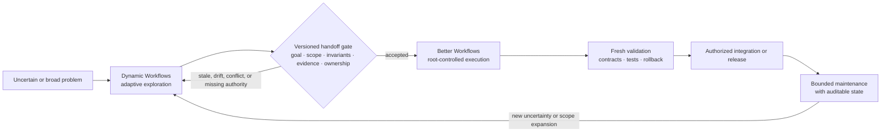
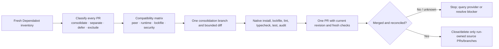

# Better Workflows

[English](README.md) | [繁體中文](docs/README.zh-TW.md) | [简体中文](docs/README.zh-CN.md) | [日本語](docs/README.ja.md) | [한국어](docs/README.ko.md)

Native-first, evidence-driven workflow orchestration for Codex.

Better Workflows keeps one root agent responsible for edits and side effects, uses small bounded waves of native subagents for research and review, and adds deterministic state, freshness, evidence, and action-token gates for higher-risk tasks.

## Design

Better Workflows is deliberately a governed orchestration layer, not an
unbounded agent swarm. Its design principles are:

- **Root-owned mutation:** the root agent is the only authority that edits,
  integrates, performs Git/GitHub mutations, deploys, accepts risk, or declares
  completion.
- **Evidence before side effects:** evidence, freshness, authorization, and
  provider reconciliation are required before an irreversible action; unknown
  outcomes fail closed.
- **Bounded delegation:** native subagents are limited to research, review,
  testing evidence, and refutation. Fan-out is capped at three direct children
  with no recursive delegation, and independent model critics run sequentially.
- **Persistent intent:** `/goal` preserves the requested outcome across turns;
  templates and modes define verification depth without silently changing the
  goal.
- **Deterministic control plane:** the `dw` helper records contracts, private
  state, sentinels, evidence, findings, leases, action tokens, and
  reconciliation; it does not execute model-generated commands.
- **Explicit completion:** a run is complete only when acceptance evidence is
  current, required checks pass, rollback is usable, and no unresolved
  high-risk or unknown state remains.
- **Fast path remains explicit:** `direct` avoids workflow journaling for small,
  reversible work instead of making every task pay the full orchestration cost.

This trades some peak parallel throughput for a smaller, inspectable mutation
surface and predictable stop conditions. The trade-off is intentional: the
workflow should make unsafe progress difficult to hide, even when that means
pausing for evidence or user authority.

## Better Workflows vs. Claude Dynamic Workflows

This comparison treats “Claude Dynamic Workflows” as Anthropic's Claude Code
feature, not a third-party package. It is based on Anthropic's public material
checked on 2026-07-20: [Introducing dynamic workflows in Claude Code](https://claude.com/blog/introducing-dynamic-workflows-in-claude-code),
[A harness for every task](https://claude.com/blog/a-harness-for-every-task-dynamic-workflows-in-claude-code),
and [Claude Code's parallel-agent documentation](https://code.claude.com/docs/en/agents).

> **One-line positioning:** Dynamic Workflows expands the search space when a task needs adaptive breadth; Better Workflows makes the accepted path bounded, evidence-backed, and safe to integrate.

> **Important boundary:** The collaboration model below is a human- or automation-mediated operating model, not a native integration. There is no claim of shared runtime state, automatic handoff, or protocol compatibility between the two products.

### The maximum practical difference

The key difference is orchestration posture and authority:

- **Dynamic Workflows optimizes for adaptive breadth.** It can write a task-specific JavaScript harness, fan out many agents, choose models/worktrees, verify results, and loop until a task-specific stop condition is met.
- **Better Workflows optimizes for governed convergence.** It keeps mutation with Root, bounds delegated research, records deterministic state and evidence, and fails closed when freshness, authority, reconciliation, or completion evidence is missing.

Neither capability is exclusive. Better Workflows includes research and deep-review routes, while Dynamic Workflows can also implement and release changes. The distinction is what each system optimizes first: **runtime exploration scale versus deterministic mutation control**.

### Why these capabilities are not built in

This is a deliberate boundary, not an unfinished feature checklist. Better
Workflows is a governance/control plane around Codex work, not a runtime that
lets a model generate an unbounded agent harness. The `dw` helper records and
validates state, evidence, and action gates; it does not spawn agents or execute
model-generated commands.

| Capability | What this repo provides | Why the boundary is intentional |
| --- | --- | --- |
| Task-specific JavaScript harness | Explicit templates, modes, and deterministic helper logic. | A generated harness can adapt faster, but it also changes the execution plan at runtime; Better Workflows keeps the control plane inspectable before mutation. |
| Large or unbounded fan-out | At most three direct native children; no recursive delegation. | Bounds token cost, shared-file conflicts, and blast radius. |
| Adversarial verification | Refutation, research findings, and up to two sequential model-pinned critics. | Verification is preserved, but the number and order of critics remain auditable instead of expanding per generated subtask. |
| Loop-until-done | Persistent Goals, implementation queues, checkpoints, and explicit completion gates. | Work can continue across validated slices, but it cannot silently widen scope or spawn forever without fresh evidence. |
| Automatic worktree swarm | Branch/protected-branch and cleanup gates; no automatic worktree per generated subtask. | Root retains ownership of integration and cleanup, avoiding ambiguous ownership of parallel mutations. |
| Unattended long-running execution | Durable run state and resumable Goals, with explicit authority and reconciliation. | Resumability is useful; an autonomous daemon would require a separate lease, resource, cancellation, and side-effect protocol. |

**So is it unsuitable?** No. Better Workflows is the better fit when the
contract is known and the cost of an incorrect mutation is asymmetric: releases,
protected branches, API changes, security-sensitive refactors, reviews, and
maintenance. Dynamic Workflows is the better first tool when uncertainty and
scale dominate. Using both is often strongest: explore broadly, normalize a
versioned handoff, then let Better Workflows independently validate and govern
the implementation. This is an operating pattern, not native interoperability.

| Dimension | Better Workflows | Claude Dynamic Workflows |
| --- | --- | --- |
| Orchestration posture | Explicit selectors, templates, modes, and a deterministic local control plane. | A task-specific JavaScript harness is generated and composed at runtime. |
| Breadth and iteration | Small bounded waves: at most three direct children; independent critics run sequentially. | Large fan-out, adversarial verification, dynamic loops, and long-running runs when justified. |
| Mutation boundary | Root owns edits, integration, Git/GitHub, deploy, risk acceptance, and completion. Delegated agents are read-only by contract. | Models can choose subagent shape, model, and worktree isolation inside the generated harness; the task script determines the run's governance. |
| State and completion | Persistent Goal, private state, sentinels, evidence, leases, action tokens, reconciliation, and fail-closed completion. | Progress is saved and resumable; the harness coordinates convergence and returns a single result. |
| Cost and blast radius | Deliberately conservative; easier to bound cost, mutation surface, and stop conditions. | Higher scale potential, with an official warning that workflows can use substantially more tokens. |
| Best starting point | Known contract, release, refactor, review, or any change with asymmetric downside risk. | Unknown-size exploration, broad migration, codebase-wide audit, or work that earns massive parallelism. |

### Explore → Gate → Execute → Maintain

Use this as a collaboration SOP. It is a recommended operating pattern, not an automatic product handoff.



### The versioned handoff package

Before Better Workflows accepts exploratory output, normalize it into a
versioned handoff package. This is the anti-drift boundary:

| Gate | Required artifact | Reject and return to exploration when |
| --- | --- | --- |
| Goal | Problem statement, non-goals, chosen option, rejected alternatives. | The goal or scope is still ambiguous. |
| Contract | Invariants, interfaces, acceptance tests, reproducible commands. | A public behavior or success condition is unowned. |
| Evidence | Source index, provenance, timestamps, baseline checks, unresolved findings. | Evidence is stale, unknown, or cannot be reproduced. |
| Ownership | Repository, branch, commit/worktree identity, component owners, mutation boundary. | Baseline drift, ownership conflict, or shared-file collision exists. |
| Risk and action | Dependency/security risk register, side-effect inventory, rollback plan, required authority/action tokens. | A side effect lacks authorization, reconciliation, or rollback. |

Better Workflows then independently validates the package, converts it into
its Goal/contract/evidence state, and executes only the accepted scope. If the
scope expands, the baseline changes, or a gate becomes stale, stop and send the
work back through exploration instead of silently widening the mutation surface.

### When to use one or both

| Situation | Recommended path | Why |
| --- | --- | --- |
| Small, reversible, well-understood change | Better Workflows `direct` | Dynamic orchestration cost is not earned. |
| Known contract with meaningful verification or release risk | Better Workflows `verified`, `deep`, or `critical` | Fresh evidence and authority gates matter more than fan-out. |
| Unknown architecture, many independent hypotheses, or large migration | Dynamic Workflows first, then the handoff gate | Use breadth to reduce uncertainty; do not let exploratory output bypass integration controls. |
| Production maintenance after the design is settled | Better Workflows | Preserve the contract, evidence, rollback, and auditable ownership over time. |

**Mental model:** explore wide, gate explicitly, execute narrow, maintain audibly.

## Install

Add the GitHub marketplace and install the plugin:

```bash
codex plugin marketplace add stephen-taipei/better-workflows
codex plugin add better-workflows@better-workflows
```

Start a new Codex task after installation so the skill catalog refreshes.

## Use in Codex

Restart Codex or open a new task after installation.

### Codex CLI

In Codex CLI, start with `@` and search `better`, then select a Better Workflows
skill or entry from the CLI picker.


### Codex App

In the Codex App, start with `/` and search `better`, then choose the matching
command or skill entry from the App picker.


On either surface, choose an entry and describe the outcome. The picker inserts
the selected `$better-workflows:<name>` reference. You do not need to type
`/goal`, remember template names, or choose model aliases. The recommended
default is:

```text
$better-workflows:auto <describe the outcome you need>
```

For example:

```text
$better-workflows:cross-platform Check the backend, iOS, and Android contact sync contract, fix issues, and create a PR.
```

Every entry starts or continues a persistent Codex Goal before substantial
work, including `direct`. If an unrelated unfinished Goal already exists, the
workflow stops and asks you to use `/goal edit` or `/goal clear` instead of
silently replacing it.

### Choose quickly

- Unsure which workflow to use: choose `auto`.
- Know the task category: choose one of the nine task entries.
- Care mainly about review depth: choose `direct`, `verified`, `deep`, or `critical`.
- Already use a legacy command: choose its compatibility alias.

### Automatic and task entries

| Entry | Recommended use | Example |
| --- | --- | --- |
| `$better-workflows:auto` | Best default for most work. Codex selects the template, verification mode, and critics from risk and evidence. | `$better-workflows:auto Review the current repository, fix verified defects, and create a PR.` |
| `$better-workflows:review-issues` | Read-only repository audit, finding deduplication, and authorized GitHub issue creation. It does not fix code. | `$better-workflows:review-issues Review the latest dev SHA and create deduplicated P0/P1/P2 issues.` |
| `$better-workflows:fix-issues-pr` | Re-check open issues, implement root-owned fixes, create a PR, then merge and clean up only when authorized. | `$better-workflows:fix-issues-pr Fix open dev issues, create a PR, wait for fresh checks, merge, and clean up.` |
| `$better-workflows:cross-platform` | Backend and mobile/web contract work: schemas, optional fields, enums, sync behavior, version gates, and headers. | `$better-workflows:cross-platform Check the backend, iOS, and Android contact sync contract, fix issues, and create a PR.` |
| `$better-workflows:ios-static` | Swift/iOS static review and serialized `project.pbxproj` verification when local builds are prohibited or undesirable. | `$better-workflows:ios-static Review the iOS changes without building, verify new Swift files are in pbxproj, and fix static issues.` |
| `$better-workflows:localization` | Multi-locale changes, especially 41-locale key counts, ordering, exact scope, and regional variants. | `$better-workflows:localization Add these keys to all 41 locales and verify identical key order.` |
| `$better-workflows:ci-release` | CI failures, runner queues, serialized deploys, releases, remote monitoring, and receipt-based verification. | `$better-workflows:ci-release Diagnose the failing PR checks, fix them, and monitor the serialized dev deployment.` |
| `$better-workflows:browser-qa` | Webwright or simulator QA requiring current UI evidence, screenshots, and a reproducible action log. | `$better-workflows:browser-qa Verify signup and contact sync in the browser and attach screenshot evidence.` |
| `$better-workflows:research` | Evidence-backed research, architecture comparison, independent perspectives, and refutation without majority voting. | `$better-workflows:research Compare three sync architectures, challenge each one, and recommend a decision.` |
| `$better-workflows:monorepo-refactor` | Full workspace inventory followed by direct implementation of every eligible bounded refactor recommendation, with behavior invariants, validation, and rollback evidence. | `$better-workflows:monorepo-refactor Inventory the monorepo and implement all eligible boundary-cleanup recommendations without changing its public contract.` |

### Template-only operational routes

Dependabot consolidation is intentionally a template rather than another picker
Skill: it is a narrowly governed operational procedure that should be selected
from the current task context, while `auto` may route to it when the evidence
matches. Run it directly when you need the exact contract:

```bash
node plugins/better-workflows/scripts/dw.mjs run \
  --template dependabot-consolidation-pr-cleanup \
  --mode critical \
  --goal "Inventory Dependabot PRs, consolidate compatible updates, merge one PR, and clean only run-owned sources." \
  --scope .
```

The SOP is deliberately fail-closed:



Its required evidence is `dependabot-inventory`, `compatibility-matrix`,
`consolidation-diff`, `lockfile-validation`, `merge-result`, and
`cleanup-manifest`. The template does not assume that every Dependabot PR is
safe to combine: each candidate must receive a disposition, and cleanup is
allowed only after the consolidation PR is terminally reconciled.

### Review-strength entries

These entries let Codex choose the task template while you set the minimum
verification depth.

| Entry | Recommended use | Example |
| --- | --- | --- |
| `$better-workflows:direct` | Small, reversible, well-understood work where speed matters. Uses a persistent Goal but no workflow journal or critics. | `$better-workflows:direct Fix this one-line documentation typo and verify the diff.` |
| `$better-workflows:verified` | Normal engineering work that benefits from 1–3 read-only research/review/refutation agents and freshness evidence. | `$better-workflows:verified Review and fix the pagination bug, then create a PR.` |
| `$better-workflows:deep` | Architecture, security, broad refactors, or uncertain changes needing verified work plus independent Codex critics. | `$better-workflows:deep Review the auth redesign, fix verified issues, and produce a migration-safe PR.` |
| `$better-workflows:critical` | Releases, migrations, production operations, destructive cleanup, or irreversible side effects requiring fail-closed gates and mandatory independent evidence. | `$better-workflows:critical Run the production release only after all policy, remote-SHA, and reconciliation gates pass.` |

### Compatibility aliases

Use these when migrating existing habits. They route into the same Goal-first,
root-owned Better Workflows engine; they do not revive retired parallel-writing
workflows.

| Entry | Recommended use | Equivalent route |
| --- | --- | --- |
| `$better-workflows:auto-improve` | Legacy `autoImprove`: review, verify findings, fix, create PR, and converge safely. | Fix issues to PR, `deep` by default |
| `$better-workflows:auto-issues` | Legacy `autoIssues`: read-only review plus deduplicated issue creation. | Review to issues, `verified` by default |
| `$better-workflows:ai-meeting-tw` | Legacy AI meeting: multi-perspective research and model critics without Claude or vote counting. | Research deliberation, `deep` by default |
| `$better-workflows:git-check-issues` | Legacy issue repair: re-fetch issue state, fix active issues, create PR, and clean up precisely. | Fix issues to PR, `deep` by default |
| `$better-workflows` | Natural-language router when you do not select a specific menu entry. | Automatic template and mode routing |

## Modes and templates

Goal mode controls persistence; Better Workflows mode controls verification
depth. They are independent.
For a bounded monorepo refactor, choose `$better-workflows:monorepo-refactor`
from the Skill picker. It uses the native persistent Goal flow and supports
`AUDIT_ONLY`, `APPROVAL_GATED`, and `AUTONOMOUS` execution contracts:

```text
$better-workflows:monorepo-refactor Refactor the shared package boundary without changing public behavior.
```

The skill inspects or continues the active goal, inventories the full workspace,
and then implements every recommendation that is inside scope and passes the
safety gates. It continues through validated slices instead of stopping at a
recommendation list. `AUDIT_ONLY` and `APPROVAL_GATED` remain explicit modes
when you want a read-only result or approval between slices. The goal is marked
complete only after the eligible recommendation queue is empty and validation
and rollback evidence pass.

For example:

```text
$better-workflows:monorepo-refactor Inventory the monorepo, then directly implement all eligible boundary-cleanup recommendations without changing public behavior.
```

Better Workflows chooses one of four modes:

| Mode | Behavior |
| --- | --- |
| `direct` | Root works normally without durable workflow state. |
| `verified` | Root plus one to three native research/review/refutation agents. |
| `deep` | Verified work followed by up to two sequential Codex critics. |
| `critical` | Full evidence and side-effect gates plus a required external reviewer when policy demands it. |

Ten workflow templates are included:

- `review-to-issues`
- `issues-to-root-fix-pr-merge-cleanup`
- `cross-platform-contract`
- `ios-static-pbxproj`
- `localization-41`
- `ci-release-monitor`
- `dependabot-consolidation-pr-cleanup`
- `browser-simulator-qa`
- `research-deliberation`
- `monorepo-refactor`

Current Codex surfaces expose plugin Skills through native pickers: Codex CLI
uses `@` search, while the Codex App uses `/` command search. No custom prompt
installer or separate command layer is required.

## Deterministic helper

The plugin bundles a zero-runtime-dependency Node.js helper. It manages contracts, private run state, evidence, findings, bounded Git sentinels, leases, action tokens, reconciliation, doctor checks, and evaluations. It does not spawn agents, execute model-generated commands, assign severity, or perform side effects.

Run it directly from a checkout:

```bash
node plugins/better-workflows/scripts/dw.mjs doctor
node plugins/better-workflows/scripts/dw.mjs eval
```

## Security model

- State directories use mode `0700`; state files use `0600`.
- Agy review is limited to explicitly authorized, sanitized, non-confidential bundles.
- Agy argv transport is treated as exposed metadata and is not allowed for confidential workflows.
- Unknown provider outcomes require query reconciliation and are never blindly retried.
- The project assumes trusted local repositories and does not claim to sandbox malicious repository code.

## Development

```bash
npm test --prefix plugins/better-workflows
node plugins/better-workflows/scripts/dw.mjs eval
```

The runtime uses only Node.js standard-library modules.

## License

MIT. See [LICENSE](LICENSE). No upstream workflow runtime is vendored; see [THIRD_PARTY_NOTICES.md](THIRD_PARTY_NOTICES.md).
