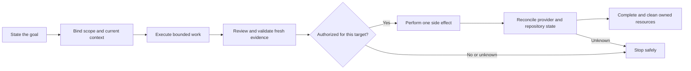

<div align="center">

# Better Workflows

**Goal-first · Evidence-driven · Fail-closed**

Turn Codex work from “prompt and hope” into a bounded path from intent to
verified, provider-reconciled delivery.

[](plugins/better-workflows/package.json)
[](plugins/better-workflows/package.json)
[](plugins/better-workflows/package.json)
[](LICENSE)

**English** · [繁體中文](docs/README.zh-TW.md) · [简体中文](docs/README.zh-CN.md) · [日本語](docs/README.ja.md) · [한국어](docs/README.ko.md)

</div>

[Quick start](docs/guide/getting-started.md) · [Workflows](docs/guide/workflows.md) · [Architecture](docs/guide/architecture.md) · [Security](docs/guide/security.md) · [CLI](docs/guide/cli-reference.md) · [Full details](docs/details/en.md)

<!-- readme-roster -->
**Model roster:** Codex · Claude · Gemini · GPT-OSS · Grok · Cursor · Kimi · Qwen · Kiro. `agy` transports Gemini-, Claude-, and GPT-OSS-branded models; it is transport metadata, not another model brand.

<!-- readme-section:promise-audience -->
## Why Better Workflows

Codex can analyze a repository, edit code, run checks, and operate providers.
The more useful those capabilities become, the more important it is to separate
what a user wants from what the current evidence and authority actually allow.

Better Workflows is for developers and teams who want fast assistance on small
tasks without giving up explicit scope, review, freshness, or protected
delivery when the blast radius grows.

It provides 13 outcome-oriented workflow templates, governed workspace recipes,
and a read-only Graph View. You choose the outcome; the route adds only the
verification needed for the current risk.

<!-- readme-section:problem-outcome -->
## From prompts to governed outcomes

<!-- readme-claim:prompt-not-authority -->
A prompt can describe intent, but it never grants authority.

Without a control plane, a reasonable instruction can still act on stale
state, widen scope, or lose track of a provider outcome. Better Workflows turns
those gaps into explicit gates.

| Without governance | With Better Workflows |
| --- | --- |
| Intent and authority are conflated | Goal, scope, and authority are separate records |
| A passing check may belong to an old revision | Evidence is bound to the current source and target |
| A retry may duplicate an external action | Attempts are bounded and unknown outcomes are reconciled |
| “Done” can mean “the command returned” | Completion requires terminal provider and repository evidence |

<!-- readme-section:proof-boundaries -->
## What you can trust

<!-- readme-claim:root-only-mutation -->
**Root-owned mutation.** Only Root may edit, integrate, deploy, accept risk, or declare completion.

<!-- readme-claim:evidence-before-action -->
**Evidence before action.** Every side effect requires fresh evidence, provenance, and an action bound to the intended target.

<!-- readme-claim:unknown-stop -->
**Fail closed.** Drift, stale evidence, or unknown provider state always stops the workflow.


<!-- readme-visual-fallback:authority-boundary -->
**Text equivalent:** Prompt records the outcome; Context binds current facts;
Harness limits who may act and where; Loop bounds retries and reconciliation;
Graph projects admitted state without becoming a scheduler, policy input, or
authority source. Missing evidence or authority stops progress.

<!-- readme-section:first-success -->
## Get your first result

Install the marketplace and plugin:

```bash
codex plugin marketplace add stephen-taipei/better-workflows
codex plugin add better-workflows@better-workflows
```

Open a new Codex task and choose Better Workflows from the native picker:

```text
Codex CLI: @better
Codex App: /better
```

Then describe the outcome:

```text
$better-workflows:auto <describe the outcome you need>
```

Success means the automatic route selects one concrete template and a minimum
verification mode. It cannot grant missing authority, install tools, or widen
the requested scope.

[Install, verify, and run the first workflow →](docs/guide/getting-started.md)

<!-- readme-section:choose-next-path -->
## Choose your next path

| Your outcome | Start here |
| --- | --- |
| Let Codex select the safest fitting route | `$better-workflows:auto` |
| Review a repository and create deduplicated issues | `$better-workflows:review-issues` |
| Fix issues, open a PR, merge, and clean owned resources | `$better-workflows:fix-issues-pr` |
| Deliver atomic commits to protected `dev` | `$better-workflows:pr-to-dev` |
| Compare architectures with independent roles | `$better-workflows:research` |
| Govern a release or irreversible operation | `$better-workflows:critical` |
| Preserve deterministic SOP mechanics | `$better-workflows:workspace-recipe` |
| Improve Better Workflows from held-out evidence | `$better-workflows:self-improve` |

Browse all selectors, modes, and templates in [Workflows](docs/guide/workflows.md).
Security reviewers can start with [Security](docs/guide/security.md); operators
can jump to the [CLI reference](docs/guide/cli-reference.md).

<!-- readme-section:lifecycle -->
## How delivery reaches completion


```mermaid
flowchart LR
  A["State the goal"] --> B["Bind scope and current context"]
  B --> C["Execute bounded work"]
  C --> D["Review and validate fresh evidence"]
  D --> E{"Authorized for this target?"}
  E -- "Yes" --> F["Perform one side effect"]
  F --> G["Reconcile provider and repository state"]
  G --> H["Complete and clean owned resources"]
  E -- "No or unknown" --> I["Stop safely"]
  G -- "Unknown" --> I
```

<!-- readme-visual-fallback:lifecycle -->
**Text equivalent:** State the goal, bind the exact scope and current context,
execute bounded work, and review fresh evidence. Perform one target-bound side
effect only when authorized. Reconcile the provider and repository before
completion and owned cleanup; any missing, stale, or unknown state stops the
workflow.

<!-- readme-section:trust-limits -->
## Trust boundaries and limits

Better Workflows records and checks a control plane; it is not an unlimited
agent runtime. It does not treat text, a diagram, an old check, or a model vote
as permission.

<!-- readme-claim:private-history -->
Sensitive or private history is never harvested; it is rejected with a redacted `REJECTED_WITH_EVIDENCE` disposition.

- Side effects require explicit user authority and single-use action gates.
- Independent critics are read-only and cannot accept risk or declare success.
- Workspace recipes run deterministic Node.js mechanics; they cannot choose
  models, use the network, run arbitrary shell, or mutate source.
- Model deliberation admits only a current semantic roster probe; unavailable
  providers are never silently substituted.
- Graph View is derived presentation. It never becomes policy input,
  authorization, a scheduler, or an agent runtime.

[Understand the architecture and trade-offs →](docs/guide/architecture.md)

<!-- readme-section:learn-help-contribute -->
## Learn, get help, and contribute

| Need | Destination |
| --- | --- |
| First installation and route | [Getting started](docs/guide/getting-started.md) |
| Select a workflow or mode | [Workflows](docs/guide/workflows.md) |
| Control-plane design and comparisons | [Architecture](docs/guide/architecture.md) |
| Privacy, authority, actions, and attestations | [Security](docs/guide/security.md) |
| Commands and exit behavior | [CLI reference](docs/guide/cli-reference.md) |
| Complete translated specification | [Full details](docs/details/en.md) |
| README narrative and quality rules | [README quality blueprint](docs/guide/readme-quality.md) |

[Contributing](CONTRIBUTING.md) · [Code of conduct](CODE_OF_CONDUCT.md) ·
[Governance](GOVERNANCE.md) · [Support](SUPPORT.md) · [Security policy](SECURITY.md)

<details>
<summary>Develop Better Workflows</summary>

```bash
npm test --prefix plugins/better-workflows
node plugins/better-workflows/scripts/sbw.mjs eval
node scripts/plugin-cache.mjs check
```

Node.js 24+ · zero runtime dependencies · immutable plugin cache versions.

</details>

Maintained by [Stephen Chuang](https://github.com/stephen-taipei) and
contributors. MIT licensed; see [LICENSE](LICENSE) and
[THIRD_PARTY_NOTICES.md](THIRD_PARTY_NOTICES.md).
