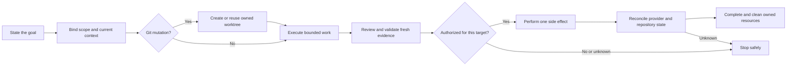

<div align="center">

# Better Workflows

**Evidence-first AI engineering QA + delivery gatekeeper**

Simple changes move fast. Important work must prove each stage. Git changes run
in a task-owned worktree and are integrated only when the target is safe.

**Goal-first · Evidence-driven · Fail-closed · Risk-adaptive**

[](plugins/better-workflows/package.json)
[](plugins/better-workflows/package.json)
[](plugins/better-workflows/package.json)
[](LICENSE)

**English** · [繁體中文](docs/README.zh-TW.md) · [简体中文](docs/README.zh-CN.md) · [日本語](docs/README.ja.md) · [한국어](docs/README.ko.md) · [All 41 locales](docs/LANGUAGES.md)

</div>

[Quick start](docs/guide/getting-started.md) · [Workflows](docs/guide/workflows.md) · [Convergence](docs/guide/convergence-and-authorization.md) · [Architecture](docs/guide/architecture.md) · [Security](docs/guide/security.md) · [CLI](docs/guide/cli-reference.md) · [Full details](docs/details/en.md)

<!-- readme-roster -->
**Model roster:** Codex · Claude · Gemini · GPT-OSS · Grok · Cursor · Kimi · Qwen · Kiro. `agy` transports Gemini-, Claude-, and GPT-OSS-branded models; it is transport metadata, not another model brand.
**Host support:** Tier 1 is Codex, Claude Code, Gemini CLI, and Qwen Code on macOS/Linux. Kimi Code CLI, Kiro, Grok Build, Cursor, GitHub Copilot, and all Windows combinations are Preview. `agy` remains deliberation transport metadata, not another AI host.
<br>[Sponsor Better Workflows on Ko-fi](https://ko-fi.com/betterworkflows) — one-time support only.

<!-- readme-section:promise-audience -->
## Better Workflows in plain language

Think of Better Workflows as a demanding senior QA engineer and delivery
gatekeeper for AI agents. A stage passes only when its evidence belongs to the
current repository, revision, scope, and target and can be checked again. If
evidence is missing, stale, conflicting, or the external result is unknown, the
workflow stops and asks for a decision instead of pretending the task is done.

It is not heavy ceremony for every edit. Auto first reads the goal, scope,
repository instructions, current Git state, and risk. A clear, reversible,
low-risk change may use Direct with a small targeted check. Everything else is
promoted to the evidence workflow and the verification strength required by
the risk.

For mutating Git work, “Direct” does not mean “edit the user's checkout.” The
task still receives a minimal `TaskWorkspaceLeaseV1`, its own branch, and its
own worktree. That lease proves resource ownership and recovery state; it is
not a substitute for the full evidence ledger. If the AI host already created
a clean, exclusive task worktree at the exact base, `workspace register` adopts
it without nesting; the host-owned branch and worktree remain preserved during
Better Workflows cleanup.

### What Auto does before changing code

Auto inspects the repository, goal, scope, instructions, branch, and revision;
records `AutoRiskAssessmentV1`; and uses Direct only when every low-risk rule
passes. Read-only work stays in place, while Git mutation uses an owned
worktree. Integration uses a checked candidate and compare-and-swap update;
cleanup requires terminal proof from the same lease.

Dirty state is never stashed or hidden. Detached or missing targets require
rebind. Protected and remote work uses governed evidence; cleanup additionally
requires exact merge and remote-sync receipts, including the reviewed head for
a squash result.

### AI and operating-system support

**Official recommendation: macOS + Codex.** It is the reference experience and
has the deepest native integration. Tier 1 hosts share the same core safety
semantics, but their picker, subagent, host-trust, and extension UX are not
claimed to be identical.

<!-- host-support-v1:start -->
| Level | AI hosts | Operating systems | Promise |
| --- | --- | --- | --- |
| Recommended reference | **macOS + Codex** | macOS | Deepest native integration and complete reference UX |
| Tier 1 | Codex, Claude Code, Gemini CLI, Qwen Code | macOS, Linux | Shared core safety semantics; host-native UX may differ |
| Preview | Kimi Code CLI, Kiro, Grok Build, Cursor, GitHub Copilot | macOS, Linux | [Manual compatibility pack](plugins/better-workflows/compatibility/preview/INSTRUCTIONS.md) with published limitations |
| OS Preview | All listed hosts | Windows | Not covered by the v4.0.0 Tier 1 guarantee |

Capability status: `native` = host-native integration; `core-bridge` = shared Better Workflows control layer; `unverified` and `unavailable` are not equivalent to support.

| AI hosts | Support | Core control plane | Native and host-specific surfaces |
| --- | --- | --- | --- |
| Codex | tier1 | task-contract: native; typed-evidence: native; replay: native; action-gate: native; task-worktree: core-bridge | native-picker: native; native-subagents: native; self-improve-host-trust: native; plugin-cache-publication: native |
| Claude Code, Gemini CLI, Qwen Code | tier1 | task-contract: core-bridge; typed-evidence: core-bridge; replay: core-bridge; action-gate: core-bridge; task-worktree: core-bridge | native-picker: unavailable; native-subagents: unverified; self-improve-host-trust: unavailable; plugin-cache-publication: unavailable |
| Kimi Code CLI, Kiro, Grok Build, Cursor, GitHub Copilot | preview | task-contract: core-bridge; typed-evidence: core-bridge; replay: core-bridge; action-gate: unverified; task-worktree: core-bridge | native-picker: unavailable; native-subagents: unverified; self-improve-host-trust: unavailable; plugin-cache-publication: unavailable |
<!-- host-support-v1:end -->

Use `sbw host list`, `host doctor`, and `host conformance` to inspect the pinned
CLI, manifest, helper, extension path, and core bridge. Gemini and Qwen also
validate an isolated installation. Local PASS is not release proof without an
authenticated source-bound CI/provider receipt for that host and OS.

`SBW_STATE_ROOT` overrides `XDG_STATE_HOME/better-workflows`, with
`~/.better-workflows` as the portable default. `CODEX_HOME` no longer owns shared state; it is Codex-specific;
v3 users retain old state only by explicitly binding its exact `sbw` path.

<!-- readme-section:problem-outcome -->
## From prompts to governed outcomes

<!-- readme-claim:prompt-not-authority -->
A prompt can describe intent, but it never grants authority.

Without a control plane, a reasonable instruction can still act on stale
state, widen scope, or lose track of a provider outcome. Better Workflows turns
those gaps into explicit gates.

| Without governance | With Better Workflows |
| --- | --- |
| Intent and authority are conflated | Goal, scope, and authority are separate records |
| A passing check may belong to an old revision | Evidence is bound to the current source and target |
| A retry may duplicate an external action | Attempts are bounded and unknown outcomes are reconciled |
| “Done” can mean “the command returned” | Completion requires terminal provider and repository evidence |
| Two tasks edit one checkout | Mutating Git tasks use separately owned branches and worktrees |

<!-- readme-section:proof-boundaries -->
## What you can trust

<!-- readme-claim:root-only-mutation -->
**Root-owned mutation.** Only Root may edit, integrate, deploy, accept risk, or declare completion.

<!-- readme-claim:evidence-before-action -->
**Evidence before action.** Every side effect requires fresh evidence, provenance, and an action bound to the intended target.

<!-- readme-claim:unknown-stop -->
**Fail closed.** Drift, stale evidence, or unknown provider state always stops the workflow.

**Review-kernel pilot.** `self-improve-ops` binds changed-file work units,
independent finders/verifiers, source anchors, coverage, and synthesis. It is
shadow-only. Other templates keep `review-contract-v1`, covering immutable diff,
locations, broad review, provenance, and instruction digest. Neither profile
grants side-effect authority.


<!-- readme-visual-fallback:authority-boundary -->
**Text equivalent:** Prompt records the outcome; Context binds current facts;
Harness limits who may act and where; Loop bounds retries and reconciliation;
Graph projects admitted state without becoming a scheduler, policy input, or
authority source. Missing evidence or authority stops progress.

<!-- readme-section:first-success -->
## Get your first result

The quickest and most complete setup is the recommended macOS + Codex path.

Install the marketplace and plugin:

```bash
codex plugin marketplace add stephen-taipei/better-workflows
codex plugin add better-workflows@better-workflows
```

Open a new Codex task and choose Better Workflows from the native picker:

```text
Codex CLI: @better
Codex App: /better
```

Then describe the outcome:

```text
$better-workflows:auto <describe the outcome you need>
```

Success selects one concrete template and minimum verification mode, or admits
a bounded Direct route. Direct cannot invent authority, install tools, widen
scope, bypass protection, or skip an owned worktree; package-manager, network,
child-process, native, and checkout-external checks promote to evidence mode.
Claude Code uses the plugin; Gemini and Qwen use the repository extension with
the same core package. See [getting started](docs/guide/getting-started.md).

[Install, verify, and run the first workflow →](docs/guide/getting-started.md)

<!-- readme-section:choose-next-path -->
## Choose your next path

| Your outcome | Start here |
| --- | --- |
| Let Codex select the safest fitting route | `$better-workflows:auto` |
| Review a repository and create deduplicated issues | `$better-workflows:review-issues` |
| Fix issues, open a PR, merge, and clean owned resources | `$better-workflows:fix-issues-pr` |
| Deliver atomic commits to protected `dev` | `$better-workflows:pr-to-dev` |
| Compare architectures with independent roles | `$better-workflows:research` |
| Govern a release or irreversible operation | `$better-workflows:critical` |
| Preserve deterministic SOP mechanics | `$better-workflows:workspace-recipe` |
| Improve Better Workflows from held-out evidence | `$better-workflows:self-improve` |

Browse [Workflows](docs/guide/workflows.md), [Security](docs/guide/security.md),
[CLI](docs/guide/cli-reference.md), and the [convergence and authorization
guide](docs/guide/convergence-and-authorization.md).

<!-- readme-section:lifecycle -->
## How delivery reaches completion


```mermaid
flowchart LR
  A["State the goal"] --> B["Bind scope and current context"]
  B --> W{"Git mutation?"}
  W -- "Yes" --> X["Create or reuse owned worktree"]
  W -- "No" --> C["Execute bounded work"]
  X --> C
  C --> D["Review and validate fresh evidence"]
  D --> E{"Authorized for this target?"}
  E -- "Yes" --> F["Perform one side effect"]
  F --> G["Reconcile provider and repository state"]
  G --> H["Complete and clean owned resources"]
  E -- "No or unknown" --> I["Stop safely"]
  G -- "Unknown" --> I
```

<!-- readme-visual-fallback:lifecycle -->
**Text equivalent:** State the goal, bind the exact scope and current context,
execute bounded work, and review fresh evidence. Perform one target-bound side
effect only when authorized. Reconcile the provider and repository before
completion and owned cleanup; any missing, stale, or unknown state stops the
workflow.

Replay repeats the decision over the recorded source and evidence. It does not
repeat `push`, PR merge, deployment, release, or another external side effect.

<!-- readme-section:trust-limits -->
## Trust boundaries and limits

Better Workflows records and checks a control plane; it is not an unlimited
agent runtime. It does not treat text, a diagram, an old check, or a model vote
as permission.

<!-- readme-claim:private-history -->
Sensitive or private history is never harvested; it is rejected with a redacted `REJECTED_WITH_EVIDENCE` disposition.

- Side effects require explicit user authority and single-use action gates.
- `task-worktree-v1` authorizes only task-owned local worktree/branch creation,
  bounded commits, safe local integration, and exact cleanup. It does not
  authorize push, PR merge, deployment, release, or protected-branch bypass.
  Registered host-provided resources are reused but preserved for the host;
  Better Workflows never treats registration as deletion authority.
- Self-improve evaluator replay may use one root-signed standing consent limited
  to sanitized, read-only `gpt-5.6-terra` batches; it never authorizes delivery.
- A task may explicitly select `bounded-autopilot-v1` once. It can run bounded
  local work, push `codex/*`, and create one PR targeting `dev`; protected merge,
  deploy, direct `dev/main` push, and destructive cleanup still require a
  separate authority.
- Independent critics are read-only and cannot accept risk or declare success.
- Workspace recipes run deterministic Node.js mechanics; they cannot choose
  models, use the network, run arbitrary shell, or mutate source.
- Model deliberation admits only a current semantic roster probe; unavailable
  providers are never silently substituted.
- Graph View is derived presentation. It never becomes policy input,
  authorization, a scheduler, or an agent runtime.

### Honest proof boundary

Better Workflows can detect or block observable errors such as the wrong
repository or revision, stale evidence, a false completion claim, an
unauthorized side effect, an unknown provider outcome, or premature cleanup.
It has **not** yet statistically proven that multi-week or multi-turn agent work
has lower overall scope drift, rework, or decision-error rates. It also cannot
prove that the user's original goal was the right product decision.

[Understand the architecture and trade-offs →](docs/guide/architecture.md)

<!-- readme-section:learn-help-contribute -->
## Learn, get help, and contribute

| Need | Destination |
| --- | --- |
| First installation and route | [Getting started](docs/guide/getting-started.md) |
| Select a workflow or mode | [Workflows](docs/guide/workflows.md) |
| Control-plane design and comparisons | [Architecture](docs/guide/architecture.md) |
| Privacy, authority, actions, and attestations | [Security](docs/guide/security.md) |
| Repair-loop termination and authorization deduplication | [Convergence](docs/guide/convergence-and-authorization.md) |
| Commands and exit behavior | [CLI reference](docs/guide/cli-reference.md) |
| Complete translated specification | [Full details](docs/details/en.md) |
| README narrative and quality rules | [README quality blueprint](docs/guide/readme-quality.md) |

[Contributing](CONTRIBUTING.md) · [Code of conduct](CODE_OF_CONDUCT.md) ·
[Governance](GOVERNANCE.md) · [Support](SUPPORT.md) · [Security policy](SECURITY.md)

One-time [Ko-fi support](https://ko-fi.com/betterworkflows) helps maintain the open-source code, documentation, 41 localized editions, and website hosting. It does not provide membership, roadmap priority, or support priority.

<details>
<summary>Develop Better Workflows</summary>

```bash
npm test --prefix plugins/better-workflows
node plugins/better-workflows/scripts/sbw.mjs eval
node scripts/plugin-cache.mjs check
```

Node.js 24+ · zero runtime dependencies · immutable plugin cache versions.

</details>

Maintained by [Stephen Chuang](https://github.com/stephen-taipei) and
contributors. MIT licensed; see [LICENSE](LICENSE) and
[THIRD_PARTY_NOTICES.md](THIRD_PARTY_NOTICES.md).
