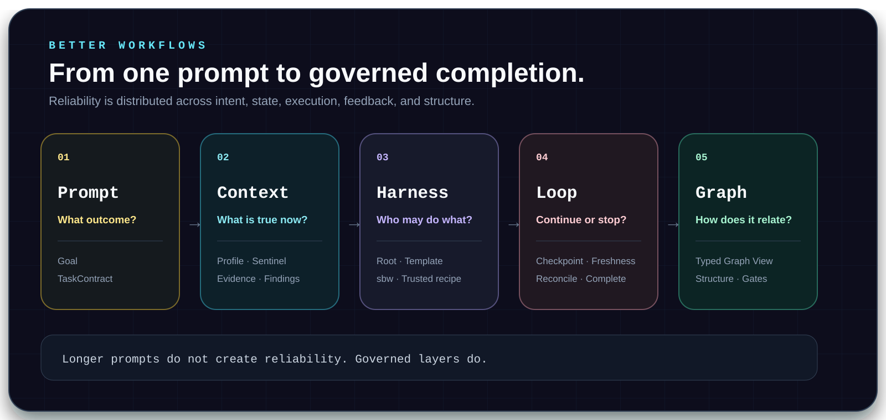
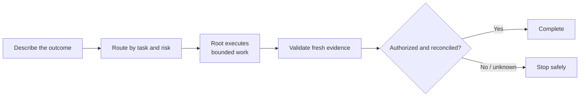

<div align="center">

# Better Workflows

### Goal-first · Evidence-driven · Fail-closed

Governed workflow orchestration for Codex—fast for small changes, rigorous when side effects matter.

| Primitive | Governs | Evidence boundary |
| --- | --- | --- |
| **Prompt** | Outcome | Text never grants authority |
| **Context** | Inputs | Require fresh digests |
| **Harness** | Tools | Trust only allowlisted producers |
| **Loop** | Attempts | Retry remains bounded |
| **Graph** | State | Read-only; no scheduler or authorization |

Sensitive or private history is never harvested; reject it with a redacted
`REJECTED_WITH_EVIDENCE` disposition.

**Model roster:** Codex · Claude · Gemini via Antigravity `agy` · GPT-OSS via
`agy` · Grok · Cursor · Kimi · Qwen · Kiro. `agy` is transport metadata, not
another model brand; availability still requires a current semantic roster probe.

[](plugins/better-workflows/package.json)
[](plugins/better-workflows/package.json)
[](plugins/better-workflows/package.json)
[](LICENSE)

[English](README.md) · [繁體中文](docs/README.zh-TW.md) · [简体中文](docs/README.zh-CN.md) · [日本語](docs/README.ja.md) · [한국어](docs/README.ko.md)

</div>

| **Overview** | [Details](docs/details/en.md) | [Quick start](docs/guide/getting-started.md) | [Workflows](docs/guide/workflows.md) | [Architecture](docs/guide/architecture.md) | [Security](docs/guide/security.md) | [CLI](docs/guide/cli-reference.md) |
| :---: | :---: | :---: | :---: | :---: | :---: | :---: |

## See the important parts first

| **ROOT OWNS MUTATION** | **EVIDENCE BEFORE ACTION** | **UNKNOWN = STOP** |
| --- | --- | --- |
| One authority edits, integrates, deploys, accepts risk, and completes. | Fresh checks, provenance, and explicit gates precede side effects. | Drift, stale evidence, or unknown provider state fails closed. |

| **13 TEMPLATES** | **WORKSPACE RECIPES** | **GRAPH VIEW** |
| --- | --- | --- |
| Route by outcome and risk instead of memorizing procedures. | Re-run trusted Node.js SOP mechanics without re-spending model tokens. | Inspect typed workflow structure without becoming an authority source. |

### Control-plane v2

Every new non-direct template run uses a typed evidence receipt, an append-only
execution ledger, and its declared review policy. Completion is derived from
admitted evidence plus replayed task state; caller text and `acceptanceIds`
cannot mark a task complete. Legacy v1 runs remain readable by the v1 reader
without automatic reinterpretation. The Graph View exposes only a read-only
task/dependency projection.



| Item | **Prompt** | **Context** | **Harness** | **Loop** | **Graph** |
| --- | --- | --- | --- | --- | --- |
| Core question | What outcome and constraints? | What is true right now? | Who may do what, and where? | Continue, retry, or stop? | How do records and gates relate? |
| Better Workflows | Goal + TaskContract | Profile + sentinel + evidence | Root + template + `sbw` + trusted recipe | Checkpoint + freshness + reconciliation | Derived typed Graph View |
| Reliability | Explicit acceptance and non-goals | Current provenance; stale state is rejected | Root owns mutation; side effects need action tokens | Bounded progress with explicit stop conditions | Structural errors fail closed |
| Deliberate boundary | A prompt is not authority | Raw history is not silently mined | No generated unbounded harness | No loop-until-done without gates | Graph never becomes policy input |

## 30-second start

```bash
codex plugin marketplace add stephen-taipei/better-workflows
codex plugin add better-workflows@better-workflows
```

Open a new Codex task, then choose Better Workflows from the native picker:

```text
Codex CLI: @better
Codex App: /better
```

Start with:

```text
$better-workflows:auto <describe the outcome you need>
```

The automatic route selects one concrete template and a minimum verification
mode. It cannot grant authority, install tools, or silently widen scope.

[Install, verify, and run your first workflow →](docs/guide/getting-started.md)

## Choose by outcome

| You need to… | Choose |
| --- | --- |
| Let Codex select the safest fitting route | `$better-workflows:auto` |
| Review a repository and create deduplicated issues | `$better-workflows:review-issues` |
| Fix issues, create a PR, merge, and clean owned resources | `$better-workflows:fix-issues-pr` |
| Create atomic commits and deliver a PR to `dev` | `$better-workflows:pr-to-dev` |
| Compare architectures with independent model roles | `$better-workflows:research` |
| Govern a release or another irreversible operation | `$better-workflows:critical` |
| Turn a repeatable SOP into trusted Node.js mechanics | `$better-workflows:workspace-recipe` |
| Improve Better Workflows from held-out evidence | `$better-workflows:self-improve` |

[Browse all entries, modes, and 13 templates →](docs/guide/workflows.md)

## Governed from goal to completion


```mermaid
flowchart LR
  A["Describe the outcome"] --> B["Route by task and risk"]
  B --> C["Root executes<br/>bounded work"]
  C --> D["Validate fresh evidence"]
  D --> E{"Authorized and reconciled?"}
  E -- "Yes" --> F["Complete"]
  E -- "No / unknown" --> G["Stop safely"]
```

The zero-dependency `sbw` helper records and validates the control plane. It
does **not** execute model-generated shell commands, spawn an unbounded agent
swarm, or treat a visualization as permission.

| Capability | Purpose | Boundary |
| --- | --- | --- |
| **Progressive routing** | Snapshot → preview → single-use receipt | A route never grants missing capability or authority |
| **Workspace recipes** | Preserve stable, deterministic SOP mechanics | Explicit digest trust; no network, shell, or source mutation |
| **Graph View** | Derive typed template/run structure | Read-only validator; never policy input or scheduler |
| **Model deliberation** | Independent roles plus ranked arbitration | No voting; only CLI-proven, authorized participants |
| **Action gates** | Bind evidence to one intended side effect | Unknown outcome requires reconciliation, never blind retry |

[Understand the design and trade-offs →](docs/guide/architecture.md)

## Gemini and `agy`

Google transitioned consumer Gemini CLI users to **Antigravity CLI**, invoked as
`agy`. Better Workflows therefore records `agy` as the **transport**, while
Gemini, Claude, and GPT-OSS remain the **model brands** it can expose. `Agy` is
not counted as a second model brand beside Gemini.

[Read the transport and deliberation model →](docs/guide/architecture.md#model-deliberation-and-antigravity-cli)

## Inspect before you act

```bash
node plugins/better-workflows/scripts/sbw.mjs doctor --capabilities
node plugins/better-workflows/scripts/sbw.mjs route preview \
  --goal "Review this repository" \
  --scope .
node plugins/better-workflows/scripts/sbw.mjs graph validate
```

| Need | Go to |
| --- | --- |
| Installation, picker use, first route | [Quick start](docs/guide/getting-started.md) |
| Selectors, modes, templates, examples | [Workflows](docs/guide/workflows.md) |
| Design, Dynamic Workflows comparison, recipes, graph, models | [Architecture](docs/guide/architecture.md) |
| Trust boundaries, privacy, side effects, host attestations | [Security](docs/guide/security.md) |
| `sbw` command families and exit behavior | [CLI reference](docs/guide/cli-reference.md) |
| Every previous detailed README section in one page | [Details](docs/details/en.md) |

## Community

[Contributing](CONTRIBUTING.md) · [Code of conduct](CODE_OF_CONDUCT.md) ·
[Security](SECURITY.md) · [Governance](GOVERNANCE.md) · [Support](SUPPORT.md)

## Development

```bash
npm test --prefix plugins/better-workflows
node plugins/better-workflows/scripts/sbw.mjs eval
node scripts/plugin-cache.mjs check
sbw action issue <pr-to-dev-run-id> --action plugin.cache.publish --provider local-workspace --resource plugin-cache:<source-head-revision> --remote-revision <target-branch-revision>
SBW_STATE_ROOT=<state-root> node scripts/plugin-cache.mjs sync --handoff-run <pr-to-dev-run-id> --token <plugin-cache-action-token>
```

`--cache-root` is a diagnostic-only override for `check`; governed `sync` is
bound to the canonical cache root recorded by the source-bound run, handoff,
and action token, and rejects `CODEX_HOME` redirection before consuming the
token. If a publication process fails after its success action is persisted,
rerun the same `sync` attempt; the persisted receipt can promote its pending
ready marker without republishing the immutable version. If the action remains
`spent/pending`, the same sync can recover only an exact pending marker and
immutable target bound to that run and attempt; otherwise the attempt stays
unknown and no second publication is permitted. Stale publication locks are
reclaimed only after their recorded owner is proven absent.

Node.js 24+ · zero runtime dependencies · immutable plugin cache versions.

## License

MIT. See [LICENSE](LICENSE) and [THIRD_PARTY_NOTICES.md](THIRD_PARTY_NOTICES.md).
