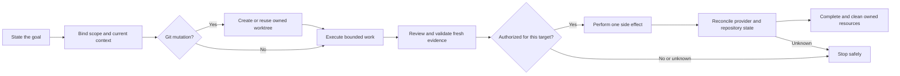

<div align="center">


# Better Workflows

**Evidence-first AI engineering QA + delivery gatekeeper**

Simple changes move fast. Important work must prove each stage. Git changes run in a task-owned worktree and are integrated only when the target is safe.

**Goal-first · Evidence-driven · Fail-closed · Risk-adaptive**

[](plugins/better-workflows/package.json)
[](plugins/better-workflows/package.json)
[](plugins/better-workflows/package.json)
[](LICENSE)

[English](README.md) · [繁體中文（台灣）](docs/README.zh-TW.md)

The V5.0.rc1 public website and documentation cover these two languages. Other locale drafts are scheduled for V5.0.rc2.

</div>

[Quick start](docs/guide/getting-started.md) · [Workflows](docs/guide/workflows.md) · [Convergence](docs/guide/convergence-and-authorization.md) · [Architecture](docs/guide/architecture.md) · [Security](docs/guide/security.md) · [CLI](docs/guide/cli-reference.md) · [Full details](docs/details/en.md)

**V5 status:** [V5.0 RC1](https://github.com/stephen-taipei/better-workflows/releases/tag/V5.0.rc1) (`5.0.0-rc.1`, tag `V5.0.rc1`) is publicly available as a controlled prerelease, published on October 3, 2026 (Asia/Taipei). It covers one public Auto entrypoint, Codex/Gemini CLI/Qwen Code on macOS, and Node 22/24. RC1 is not GA or a V5 completion claim. GA `5.0.0` remains pending and requires at least 30 natural canary days, 20 consecutive eligible starts, and three distinct repositories. Claude Code, Linux, and Windows qualification is deferred to V5.1.

**Licensing:** The free first-party core is **AGPL-3.0-only**; the physically separate wire package is **Apache-2.0** under its `LICENSE` and `NOTICE`. Professional Pack is planned as proprietary; Cloud is a separate later product. The historical V4 support matrix does not expand the V5.0 RC1 release scope.
<!-- readme-roster -->
**Model roster:** Codex · Claude · Gemini · GPT-OSS · Grok · Cursor · Kimi · Qwen · Kiro. `agy` transports Gemini-, Claude-, and GPT-OSS-branded models; it is transport metadata, not another model brand.
**Historical V4 host support:** Tier 1 was Codex, Claude Code, Gemini CLI, and Qwen Code on macOS/Linux. Kimi Code CLI, Kiro, Grok Build, Cursor, GitHub Copilot, and all Windows combinations were Preview. These are not V5 release receipts. `agy` remains deliberation transport metadata, not another AI host.

<br>[Sponsor Better Workflows with USDT (TRC20)](https://betterworkflows.dev/#sponsor) — one-time support only.

<!-- readme-section:promise-audience -->
## Better Workflows in plain language

Think of Better Workflows as a demanding senior QA engineer and delivery gatekeeper for AI agents. A stage passes only when its evidence belongs to the current repository, revision, scope, and target and can be checked again. If evidence is missing, stale, conflicting, or the external result is unknown, the workflow stops and asks for a decision instead of pretending the task is done.

It is not heavy ceremony for every edit. Auto first reads the goal, scope, repository instructions, current Git state, and risk. A clear, reversible, low-risk change may use Auto's fast path with a small targeted check. Normal SOP interaction is auto-approved within its bounded scope; protected delivery still requires explicit authority, evidence, review, and provider reconciliation. Everything else is promoted to the evidence workflow and the verification strength required by the risk.

For mutating Git work, Auto's fast path does not mean “edit the user's checkout.”
The task still receives a minimal `TaskWorkspaceLeaseV1`, its own branch, and its
own worktree. That lease proves resource ownership and recovery state; it is
not a substitute for the full evidence ledger. If the AI host already created
a clean, exclusive task worktree at the exact base, `workspace register` adopts
it without nesting; the host-owned branch and worktree remain preserved during
Better Workflows cleanup.

### What Auto does before changing code

Auto inspects the repository, goal, scope, instructions, branch, and revision;
records `AutoRiskAssessmentV1`; and uses its fast path only when every low-risk
rule passes. Read-only work stays in place, while Git mutation uses an owned
worktree. Integration uses a checked candidate and compare-and-swap update;
cleanup requires terminal proof from the same lease.

Dirty state is never stashed or hidden. Detached or missing targets require rebind. Protected and remote work uses governed evidence; cleanup additionally requires exact merge and remote-sync receipts, including the reviewed head for a squash result.

### AI and operating-system support

**Official recommendation: macOS + Codex.** It is the reference experience and
has the deepest native integration. The table below records the historical V4
host contract; V5.0 qualification is limited to the scope stated above. Host
picker, subagent, host-trust, and extension UX are not claimed to be identical.

<!-- host-support-v1:start -->
| Level | AI hosts | Operating systems | Promise |
| --- | --- | --- | --- |
| Recommended reference | **macOS + Codex** | macOS | Deepest native integration and complete reference UX |
| Tier 1 | Codex, Claude Code, Gemini CLI, Qwen Code | macOS, Linux | Shared core safety semantics; host-native UX may differ |
| Preview | Kimi Code CLI, Kiro, Grok Build, Cursor, GitHub Copilot | macOS, Linux | [Manual compatibility pack](plugins/better-workflows/compatibility/preview/INSTRUCTIONS.md) with published limitations |
| OS Preview | All listed hosts | Windows | Not covered by the v4.0.0 Tier 1 guarantee |

Capability status: `native` = host-native integration; `core-bridge` = shared Better Workflows control layer; `unverified` and `unavailable` are not equivalent to support.

| AI hosts | Support | Core control plane | Native and host-specific surfaces |
| --- | --- | --- | --- |
| Codex | tier1 | task-contract: native; typed-evidence: native; replay: native; action-gate: native; task-worktree: core-bridge | native-picker: native; native-subagents: native |
| Claude Code, Gemini CLI, Qwen Code | tier1 | task-contract: core-bridge; typed-evidence: core-bridge; replay: core-bridge; action-gate: core-bridge; task-worktree: core-bridge | native-picker: unavailable; native-subagents: unverified |
| Kimi Code CLI, Kiro, Grok Build, Cursor, GitHub Copilot | preview | task-contract: core-bridge; typed-evidence: core-bridge; replay: core-bridge; action-gate: unverified; task-worktree: core-bridge | native-picker: unavailable; native-subagents: unverified |
<!-- host-support-v1:end -->

Use `sbw host list`, `host doctor`, and `host conformance` to inspect the pinned
CLI, manifest, helper, extension path, and core bridge. Gemini and Qwen also
validate an isolated installation. Local PASS is not release proof without an
authenticated source-bound CI/provider receipt for that host and OS.

`SBW_STATE_ROOT` overrides `XDG_STATE_HOME/better-workflows`, with
`~/.better-workflows` as the portable default. `CODEX_HOME` no longer owns shared state; it is Codex-specific;
v3 users retain old state only by explicitly binding its exact `sbw` path.

<!-- readme-section:problem-outcome -->
## From prompts to governed outcomes

<!-- readme-claim:prompt-not-authority -->
A prompt can describe intent, but it never grants authority.

Without a control plane, a reasonable instruction can still act on stale
state, widen scope, or lose track of a provider outcome. Better Workflows turns
those gaps into explicit gates.

| Without governance | With Better Workflows |
| --- | --- |
| Intent and authority are conflated | Goal, scope, and authority are separate records |
| A passing check may belong to an old revision | Evidence is bound to the current source and target |
| A retry may duplicate an external action | Attempts are bounded and unknown outcomes are reconciled |
| “Done” can mean “the command returned” | Completion requires terminal provider and repository evidence |
| Two tasks edit one checkout | Mutating Git tasks use separately owned branches and worktrees |

<!-- readme-section:proof-boundaries -->
## What you can trust

<!-- readme-claim:root-only-mutation -->
**Root-owned mutation.** Only Root may edit, integrate, deploy, accept risk, or declare completion.

<!-- readme-claim:evidence-before-action -->
**Evidence before action.** Every side effect requires fresh evidence, provenance, and an action bound to the intended target.

<!-- readme-claim:unknown-stop -->
**Fail closed.** Drift, stale evidence, or unknown provider state always stops the workflow.


<!-- readme-visual-fallback:authority-boundary -->
**Text equivalent:** Prompt records the outcome; Context binds current facts;
Harness limits who may act and where; Loop bounds retries and reconciliation;
Graph projects admitted state without becoming a scheduler, policy input, or
authority source. Missing evidence or authority stops progress.

<!-- readme-section:first-success -->
## Get your first result

V5.0 RC1 (`5.0.0-rc.1`, tag `V5.0.rc1`) is publicly available. Install it
with the marketplace commands below. GA (`5.0.0`) remains pending; its
canary acceptance conditions are listed above.

Install the marketplace and plugin:

```bash
codex plugin marketplace add stephen-taipei/better-workflows
codex plugin add better-workflows@better-workflows
```

Open a new Codex task and use the sole public entry to describe the outcome:

```text
$better-workflows:auto <describe the outcome you need>
```

The V5.0 public scope contains one template and one skill: `auto`. Auto binds a
read-only, code-change, or dev-publish policy to the run and selects the
minimum verification mode, or admits a bounded Auto fast path. That fast path
cannot invent authority, install tools, widen scope, bypass protection, or skip an
owned worktree; package-manager, network,
child-process, native, and checkout-external checks promote to evidence mode.
Gemini and Qwen use the repository extension with the same core package; their
V5.0 RC1 release scope is macOS × Node 22/24. See [getting started](docs/guide/getting-started.md).

[Install, verify, and run the first workflow →](docs/guide/getting-started.md)

<!-- readme-section:choose-next-path -->
## Choose your next path

| Your outcome | Start here |
| --- | --- |
| Ask Auto to review, change code, or deliver to protected `dev` | `$better-workflows:auto` |

Browse [Workflows](docs/guide/workflows.md), [Security](docs/guide/security.md),
[CLI](docs/guide/cli-reference.md), and the [convergence and authorization
guide](docs/guide/convergence-and-authorization.md).

<!-- readme-section:lifecycle -->
## How delivery reaches completion


```mermaid
flowchart LR
  A["State the goal"] --> B["Bind scope and current context"]
  B --> W{"Git mutation?"}
  W -- "Yes" --> X["Create or reuse owned worktree"]
  W -- "No" --> C["Execute bounded work"]
  X --> C
  C --> D["Review and validate fresh evidence"]
  D --> E{"Authorized for this target?"}
  E -- "Yes" --> F["Perform one side effect"]
  F --> G["Reconcile provider and repository state"]
  G --> H["Complete and clean owned resources"]
  E -- "No or unknown" --> I["Stop safely"]
  G -- "Unknown" --> I
```

<!-- readme-visual-fallback:lifecycle -->
**Text equivalent:** State the goal, bind the exact scope and current context,
execute bounded work, and review fresh evidence. Perform one target-bound side
effect only when authorized. Reconcile the provider and repository before
completion and owned cleanup; any missing, stale, or unknown state stops the
workflow.

Replay repeats the decision over the recorded source and evidence. It does not
repeat `push`, PR merge, deployment, release, or another external side effect.

<!-- readme-section:trust-limits -->
## Trust boundaries and limits

Better Workflows records and checks a control plane; it is not an unlimited
agent runtime. It does not treat text, a diagram, an old check, or a model vote
as permission.

<!-- readme-claim:private-history -->
Sensitive or private history is never harvested; it is rejected with a redacted `REJECTED_WITH_EVIDENCE` disposition.

- Side effects require explicit user authority and single-use action gates.
- `task-worktree-v1` authorizes only task-owned local worktree/branch creation,
  bounded commits, safe local integration, and exact cleanup. It does not
  authorize push, PR merge, deployment, release, or protected-branch bypass.
  Registered host-provided resources are reused but preserved for the host;
  Better Workflows never treats registration as deletion authority.
- Independent critics are read-only and cannot accept risk or declare success.
- Model deliberation admits only a current semantic roster probe; unavailable
  providers are never silently substituted.
- Graph View is derived presentation. It never becomes policy input,
  authorization, a scheduler, or an agent runtime.

### Honest proof boundary

Better Workflows can detect or block observable errors such as the wrong
repository or revision, stale evidence, a false completion claim, an
unauthorized side effect, an unknown provider outcome, or premature cleanup.
It has **not** yet statistically proven that multi-week or multi-turn agent work
has lower overall scope drift, rework, or decision-error rates. It also cannot
prove that the user's original goal was the right product decision.

[Understand the architecture and trade-offs →](docs/guide/architecture.md)

<!-- readme-section:learn-help-contribute -->
## Learn, get help, and contribute

| Need | Destination |
| --- | --- |
| First installation and route | [Getting started](docs/guide/getting-started.md) |
| Use Auto for an outcome | [Workflows](docs/guide/workflows.md) |
| Control-plane design and comparisons | [Architecture](docs/guide/architecture.md) |
| Privacy, authority, actions, and attestations | [Security](docs/guide/security.md) |
| Repair-loop termination and authorization deduplication | [Convergence](docs/guide/convergence-and-authorization.md) |
| Commands and exit behavior | [CLI reference](docs/guide/cli-reference.md) |
| Detailed English reference | [Full details](docs/details/en.md) |
| README narrative and quality rules | [README quality blueprint](docs/guide/readme-quality.md) |

[Contributing](CONTRIBUTING.md) · [Code of conduct](CODE_OF_CONDUCT.md) ·
[Governance](GOVERNANCE.md) · [Support](SUPPORT.md) · [Security policy](SECURITY.md)

One-time [USDT (TRC20) support](https://betterworkflows.dev/#sponsor) helps maintain the open-source code, English and Traditional Chinese documentation, and website hosting. It does not provide membership, roadmap priority, or support priority.<br>**USDT · TRON (TRC20)** · `TGuMUi1d8MoBQcuFrGJZnu4JrbaeP3wy9a`<br>

<details>
<summary>Develop Better Workflows</summary>

```bash
npm test --prefix plugins/better-workflows
node plugins/better-workflows/scripts/sbw.mjs eval
```

Node.js 24+ · zero runtime dependencies.

</details>

Maintained by [stephen-taipei](https://github.com/stephen-taipei) and contributors. The first-party core is AGPL-3.0-only; the physically independent minimal wire package is Apache-2.0 under its own `LICENSE` and `NOTICE`. The basic product is free. A future Professional Pack is planned as proprietary, and Cloud is a later independent product. See [LICENSE](LICENSE), [COPYRIGHT](COPYRIGHT), and [THIRD_PARTY_NOTICES.md](THIRD_PARTY_NOTICES.md).
