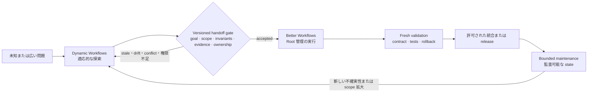
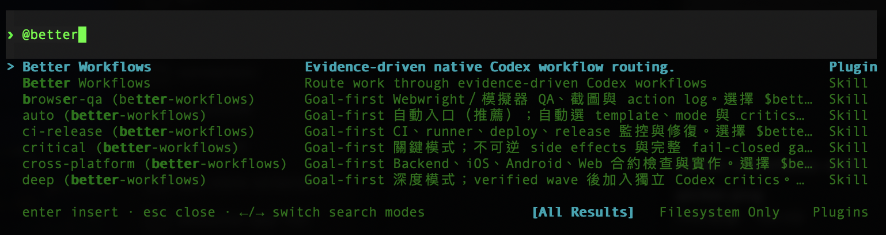
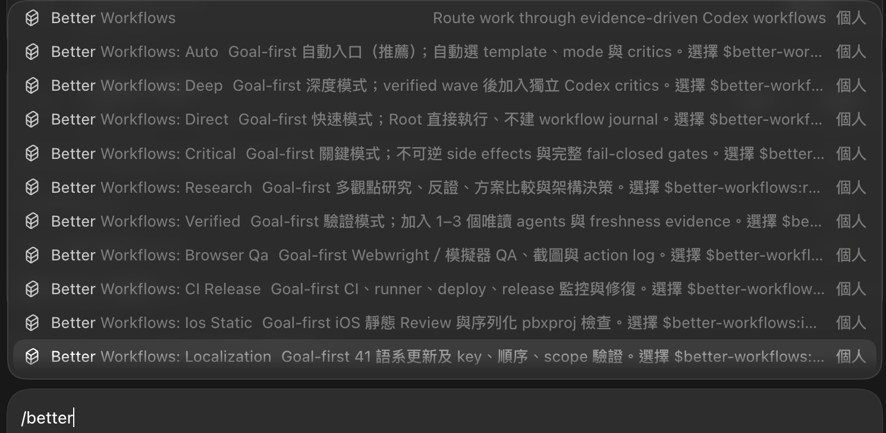

# Better Workflows

[English](../README.md) | [繁體中文](README.zh-TW.md) | [简体中文](README.zh-CN.md) | [日本語](README.ja.md) | [한국어](README.ko.md)

Better Workflows は、Codex 向けのネイティブ優先・証拠駆動ワークフローです。Root だけがコード変更、Git/GitHub 操作、deploy、リスク受容、完了宣言を行い、subagents は調査、Review、テスト証拠、反証を担当します。

## 設計原則

Better Workflows は無制限の agent swarm ではなく、ガバナンスを備えた orchestration layer です。主な原則は次のとおりです。

- **Root-owned mutation：** Root だけが変更、統合、Git/GitHub mutation、deploy、リスク受容、完了宣言を行います。
- **Evidence before side effects：** side effect の前に evidence、freshness、権限、provider reconciliation を要求し、unknown outcome は fail closed にします。
- **Bounded delegation：** native subagents は調査、Review、テスト証拠、反証に限定します。direct children は最大 3 つ、再帰 delegation は禁止し、独立 critics は順番に実行します。
- **Persistent intent：** `/goal` は turn をまたいでユーザーの目標を保持します。template と mode は検証の深さだけを決め、目標を暗黙に変更しません。
- **Deterministic control plane：** `dw` は contract、private state、sentinel、evidence、findings、lease、action token、reconciliation を記録しますが、model が生成した command は実行しません。
- **Explicit completion：** 最新の acceptance evidence、必要なチェック、利用可能な rollback がそろい、高リスクまたは unknown state が残っていない場合だけ完了とします。
- **Fast path remains explicit：** 小さく可逆な作業には `direct` を使い、完全な workflow journal のコストを明示的に省略できます。

この設計は最大の並列スループットの一部を、検査しやすい mutation surface と予測可能な停止条件に交換します。証拠やユーザー権限を待つために停止しても、安全でない進捗が隠れないことを優先します。

## Better Workflows と Claude Dynamic Workflows の比較

ここでいう「Claude Dynamic Workflows」は Anthropic の Claude Code 機能を指し、第三者パッケージを指しません。比較は 2026-07-20 に確認した Anthropic の公開資料、[Introducing dynamic workflows in Claude Code](https://claude.com/blog/introducing-dynamic-workflows-in-claude-code)、[A harness for every task](https://claude.com/blog/a-harness-for-every-task-dynamic-workflows-in-claude-code)、および [Claude Code の並列 agent ドキュメント](https://code.claude.com/docs/en/agents) に基づきます。

> **一文でいうと：** Dynamic Workflows は適応的な広さが必要なときに探索空間を広げ、Better Workflows は受け入れた経路を bounded・検証可能にして安全に統合します。

> **重要な境界：** 以下は人または自動化が運用する operating model であり、2 つの製品の native integration ではありません。共有 runtime state、自動 handoff、protocol compatibility は主張しません。

### 最大の特徴の違い

最大の違いは orchestration posture と authority です。

- **Dynamic Workflows は適応的な広さを優先：** タスクごとの JavaScript harness を生成し、多数の agent を並列化し、model/worktree を選び、検証と停止条件に基づく反復を行います。
- **Better Workflows は governed convergence を優先：** mutation を Root に残し、delegated research を bounded にし、deterministic state/evidence を記録します。freshness、権限、reconciliation、completion evidence が不足すれば fail closed です。

これは能力の排他ではありません。Better Workflows にも research/deep review があり、Dynamic Workflows も実装や release に使えます。違いは最初に最適化する対象、つまり **runtime exploration scale と deterministic mutation control** です。

### なぜこれらの機能を内蔵しないのか

これは未完成の機能一覧ではなく、意図した境界です。Better Workflows は Codex の作業を囲む governance/control plane であり、model が無制限の agent harness を動的生成する runtime ではありません。`dw` は state、evidence、action gates を記録・検証しますが、agent を spawn したり model 生成 command を実行したりしません。

| 能力 | この repo が提供するもの | 境界を設ける理由 |
| --- | --- | --- |
| タスクごとの JavaScript harness | 明示的な template、mode、deterministic helper logic。 | 動的 harness は速く適応できますが、runtime で実行計画が変わります。本 repo は mutation 前の control plane を検査可能に保ちます。 |
| 大規模または無制限 fan-out | direct native children は最大 3、再帰 delegation は禁止。 | token コスト、共有ファイル衝突、blast radius を bounded にします。 |
| Adversarial verification | Refutation、research findings、最大 2 つの順次 model-pinned critics。 | 反証は保ちますが、生成 subtask ごとに無制限に増えず、数と順序を監査できます。 |
| Loop-until-done | Persistent Goal、implementation queue、checkpoint、明示的 completion gates。 | validated slice をまたいで継続できますが、scope や spawn を新鮮な evidence なしに黙って拡大しません。 |
| 自動 worktree swarm | Branch/protected-branch と cleanup gates。生成 subtask ごとの自動 worktree は作りません。 | Root が integration/cleanup ownership を保持し、並列 mutation の責任を明確にします。 |
| 無人の長時間実行 | Durable run state と resume 可能な Goal。ただし明示的な権限と reconciliation が必要。 | resume は有用ですが、autonomous daemon には lease、資源、cancel、side-effect protocol が別途必要です。 |

**不適切なのでしょうか？** いいえ。contract が既知で、誤った mutation の下振れリスクが大きい場合、Better Workflows が適しています：release、protected branch、API 変更、security-sensitive refactor、Review、maintenance です。不確実性と規模が支配するなら Dynamic Workflows を最初に使うのが適切です。両方を使う場合は、広く探索し、versioned handoff に正規化し、Better Workflows が独立に検証して実装を governance します。これは operating pattern であり native interoperability ではありません。

| 観点 | Better Workflows | Claude Dynamic Workflows |
| --- | --- | --- |
| Orchestration posture | 明示的な selector、template、mode、deterministic local control plane。 | task-specific JavaScript harness を runtime に生成・構成。 |
| 広さと反復 | direct children は最大 3、独立 critics は順次実行。 | 大規模 fan-out、adversarial verification、dynamic loop、長時間実行。 |
| Mutation boundary | Root が変更、統合、Git/GitHub、deploy、リスク受容、完了を担当。delegated agents は contract 上 read-only。 | 生成 harness が subagent、model、worktree を選べます。タスク script が run の形を決めます。 |
| State と完了 | Persistent Goal、private state、sentinel、evidence、lease、action token、reconciliation、fail-closed。 | progress を保存して resume でき、harness が収束を調整します。 |
| コストと blast radius | 意図的に保守的で、コスト・mutation surface・停止条件を bounded にしやすい。 | 規模の可能性は高いが、公式に大幅な token 消費があり得ると説明されています。 |
| 使い始める場面 | 既知の contract、release、refactor、Review、下振れリスクが非対称な変更。 | 未知の規模の探索、大規模 migration、repo 全体の audit、大規模並列化が有効な作業。 |

### Explore → Gate → Execute → Maintain

以下は協業 SOP です。自動的な製品 handoff ではなく、推奨する operating pattern です。



### Versioned handoff package

Better Workflows が探索結果を受け入れる前に、versioned handoff package に正規化します。これが scope drift を防ぐ境界です。

| Gate | 必須情報 | 探索へ戻す条件 |
| --- | --- | --- |
| Goal | 問題、non-goals、選択案、却下した案。 | 目標または scope が曖昧。 |
| Contract | Invariants、interfaces、acceptance tests、再現可能な commands。 | public behavior または成功条件の owner が不明。 |
| Evidence | Source index、provenance、timestamp、baseline checks、未解決 findings。 | evidence が stale、unknown、再現不能。 |
| Ownership | Repo、branch、commit/worktree、component owner、mutation boundary。 | baseline drift、ownership conflict、共有ファイル衝突。 |
| Risk/action | dependency/security risk、side-effect inventory、rollback、action tokens。 | side effect に権限、reconciliation、rollback がない。 |

Better Workflows は package を独立に検証し、Goal/contract/evidence state に変換して accepted scope だけを実行します。scope、baseline、gate が変わったら停止し、mutation surface を黙って広げず再探索します。

### 協業のすすめ

| 状況 | 推奨ルート | 理由 |
| --- | --- | --- |
| 小さく可逆で明確な変更 | Better Workflows `direct` | dynamic orchestration のコストを払う必要がありません。 |
| contract は既知だが検証または release リスクがある | Better Workflows `verified`、`deep`、`critical` | fan-out より fresh evidence と authority gates が重要です。 |
| アーキテクチャが未知、仮説が多い、大規模 migration | Dynamic Workflows → handoff gate | 広さで不確実性を下げ、統合 controls は迂回しません。 |
| 設計確定後の production maintenance | Better Workflows | contract、evidence、rollback、監査可能な ownership を保ちます。 |

**Mental model：** 広く探索し、gate を明示し、狭く実行し、監査可能に保守する。

## インストール

```bash
codex plugin marketplace add stephen-taipei/better-workflows
codex plugin add better-workflows@better-workflows
```

インストール後、新しい Codex task を開いて Skill catalog を再読み込みしてください。

## Codex での使い方

### Codex CLI

Codex CLI では `@` から始めて `better` を検索し、CLI picker から Better Workflows の skill または入口を選びます。



### Codex App

Codex App では `/` から始めて `better` を検索し、App picker から対応する command または skill の入口を選びます。



どちらの画面でも入口を選んで目的を記述するだけです。Picker が `$better-workflows:<name>` を挿入します。`/goal`、template 名、mode 名、model alias を覚える必要はありません。推奨デフォルト：

```text
$better-workflows:auto <達成したい結果を記述>
```

すべての入口は、実作業の前に persistent Goal を作成または継続します。`direct` も同様です。無関係な未完了 Goal がある場合は、上書きせず `/goal edit` または `/goal clear` を案内します。

### すばやい選び方

- 迷った場合：`auto`。
- タスク種別が明確：9 つの task entry から選択。
- 検証強度だけ指定：`direct`、`verified`、`deep`、`critical`。
- 旧コマンドを継続：compatibility alias。

### 自動・タスク入口

| 入口 | 推奨シーン | 例 |
| --- | --- | --- |
| `$better-workflows:auto` | ほとんどのタスクに推奨。リスクと証拠から template、mode、critics を自動選択。 | `$better-workflows:auto 現在の repo を Review し、検証済みの問題を修正して PR を作成。` |
| `$better-workflows:review-issues` | 読み取り専用 audit、finding の重複排除、許可済み GitHub issue 作成。コードは変更しない。 | `$better-workflows:review-issues 最新 dev SHA を Review し、重複のない P0/P1/P2 issues を作成。` |
| `$better-workflows:fix-issues-pr` | Open issues を再確認し Root が修正、PR 作成。許可がある場合のみ merge/cleanup。 | `$better-workflows:fix-issues-pr dev の open issues を修正し、fresh checks 後に merge と cleanup。` |
| `$better-workflows:cross-platform` | Backend、iOS、Android、Web の schema、optional、enum、sync、version gate、headers。 | `$better-workflows:cross-platform backend、iOS、Android の contact sync contract を確認し、修正して PR を作成。` |
| `$better-workflows:ios-static` | ローカル build を避ける Swift/iOS 静的 Review と直列化された `project.pbxproj` 検証。 | `$better-workflows:ios-static build せず iOS 変更を Review し、新規 Swift ファイルの pbxproj 登録を確認。` |
| `$better-workflows:localization` | 多言語更新、特に 41 locales の key 数、順序、正確な scope、地域差。 | `$better-workflows:localization 全 41 locales に keys を追加し、順序が一致することを検証。` |
| `$better-workflows:ci-release` | CI failure、runner queue、直列 deploy、release、遠隔監視、receipt 検証。 | `$better-workflows:ci-release 失敗した PR checks を修正し、直列 dev deploy を監視。` |
| `$better-workflows:browser-qa` | 最新 UI 証拠、screenshots、再現可能な action log が必要な Webwright／simulator QA。 | `$better-workflows:browser-qa signup と contact sync を検証し、screenshot evidence を添付。` |
| `$better-workflows:research` | 証拠駆動調査、設計比較、独立視点、反証。多数決では決めない。 | `$better-workflows:research 3 つの sync architecture を比較・反証し、推奨案を提示。` |
| `$better-workflows:monorepo-refactor` | monorepo 全体を調査し、適格な bounded refactor 提案を直接実装。behavior invariants、validation、rollback evidence を保持します。 | `$better-workflows:monorepo-refactor monorepo を調査し、public contract を変えずに適格な boundary cleanup を実装。` |

### Review 強度入口

| 入口 | 推奨シーン | 例 |
| --- | --- | --- |
| `$better-workflows:direct` | 小さく可逆で明確、速度優先。Goal は使うが workflow journal/critics は使わない。 | `$better-workflows:direct 1 行の documentation typo を修正し diff を確認。` |
| `$better-workflows:verified` | 通常の開発で、1–3 read-only agents と freshness evidence が必要。 | `$better-workflows:verified pagination bug を Review・修正し PR を作成。` |
| `$better-workflows:deep` | Architecture、security、広範囲 refactor、不確実な変更。Verified wave と独立 Codex critics を使用。 | `$better-workflows:deep auth redesign を Review し、検証済み問題を修正して migration-safe PR を作成。` |
| `$better-workflows:critical` | Release、migration、production、破壊的 cleanup、不可逆 side effects。完全な fail-closed gates が必要。 | `$better-workflows:critical policy、remote SHA、reconciliation gates 通過後のみ production release を実行。` |

### Compatibility aliases

| 入口 | 推奨シーン | 対応ルート |
| --- | --- | --- |
| `$better-workflows:auto-improve` | 旧 `autoImprove`：Review、finding 検証、修正、PR、収束。 | Fix issues to PR、既定 `deep` |
| `$better-workflows:auto-issues` | 旧 `autoIssues`：読み取り専用 Review と重複なし issue 作成。 | Review to issues、既定 `verified` |
| `$better-workflows:ai-meeting-tw` | 旧 AI meeting：Claude や投票を使わない多視点調査と model critics。 | Research deliberation、既定 `deep` |
| `$better-workflows:git-check-issues` | 旧 issue repair：状態再取得、修正、PR、正確な cleanup。 | Fix issues to PR、既定 `deep` |
| `$better-workflows` | 特定の入口を選ばない自然言語 router。 | Template と mode を自動判定 |

## モード

| Mode | 動作 |
| --- | --- |
| `direct` | Root が直接作業し、durable workflow state は作らない。 |
| `verified` | Root と 1–3 の read-only research/review/refutation agents。 |
| `deep` | `verified` 後、最大 2 つの Codex critics を直列実行。 |
| `critical` | 完全な evidence/side-effect gates と、policy 必須の外部 reviewer。 |

## 開発・検証

```bash
npm test --prefix plugins/better-workflows
node plugins/better-workflows/scripts/dw.mjs eval
```

## License

MIT。[LICENSE](../LICENSE) と [THIRD_PARTY_NOTICES.md](../THIRD_PARTY_NOTICES.md) を参照してください。
