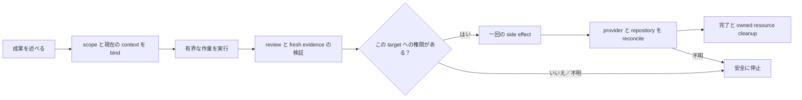

<div align="center">

# Better Workflows

**Goal-first · Evidence-driven · Fail-closed**

Codex の作業を「Prompt を渡して成功を祈る」状態から、意図、検証、provider reconciliation を経た delivery へ進めます。

[](../plugins/better-workflows/package.json)
[](../plugins/better-workflows/package.json)
[](../plugins/better-workflows/package.json)
[](../LICENSE)

[English](../README.md) · [繁體中文](README.zh-TW.md) · [简体中文](README.zh-CN.md) · **日本語** · [한국어](README.ko.md)

</div>

[クイックスタート](guide/getting-started.md) · [Workflows](guide/workflows.md) · [Architecture](guide/architecture.md) · [Security](guide/security.md) · [CLI](guide/cli-reference.md) · [詳細仕様](details/ja.md)

<!-- readme-roster -->
**Model roster:** Codex · Claude · Gemini · GPT-OSS · Grok · Cursor · Kimi · Qwen · Kiro。`agy` は Gemini、Claude、GPT-OSS ブランドの model を transport しますが、それ自体は model ブランドではありません。

<!-- readme-section:promise-audience -->
## Better Workflows が必要な理由

Codex は repository の分析、コード編集、check 実行、provider 操作を行えます。
能力が高まるほど、「利用者の意図」と「現在の証拠と権限が実際に許すこと」を
区別する必要があります。

Better Workflows は、小さな作業の速度を保ちながら、blast radius が広がる場面では
明確な scope、review、freshness、protected delivery を維持したい開発者とチーム向けです。

成果別の 13 workflow templates、統制された workspace recipes、read-only Graph View を
提供します。成果を選ぶと、route は現在の risk に必要な検証だけを追加します。

<!-- readme-section:problem-outcome -->
## Prompt から統制された成果へ

<!-- readme-claim:prompt-not-authority -->
Prompt は意図を記述できますが、権限を付与することはありません。

Control plane がないと、妥当な指示でも古い状態を使い、scope を広げ、provider の
結果を見失うことがあります。Better Workflows はその差を明示的な gate に変えます。

| 統制がない場合 | Better Workflows を使う場合 |
| --- | --- |
| 意図と権限が混在する | Goal、scope、authority を別々に記録する |
| 通過した check が古い revision の可能性がある | Evidence を現在の source と target に bind する |
| Retry が external action を重複させる可能性がある | Attempts を有界にし、不明な結果を先に reconcile する |
| 「完了」が command の終了だけを意味する | Completion に terminal provider と repository evidence を要求する |

<!-- readme-section:proof-boundaries -->
## 信頼できること

<!-- readme-claim:root-only-mutation -->
**Root-owned mutation。** 編集、統合、デプロイ、リスク受容、完了宣言を行えるのは Root だけです。

<!-- readme-claim:evidence-before-action -->
**Action の前に証拠。** すべての side effect には fresh evidence、provenance、対象に bind された action が必要です。

<!-- readme-claim:unknown-stop -->
**Fail closed。** drift、古い証拠、または不明な provider 状態があれば、workflow は必ず停止します。


<!-- readme-visual-fallback:authority-boundary -->
**テキストによる同等説明：** Prompt は成果を記録し、Context は現在の事実を bind します。
Harness は誰がどこで動けるかを制限し、Loop は retry と reconciliation を有界にします。
Graph は承認済み状態を表示するだけで、scheduler、policy input、authority source にはなりません。
証拠または権限が欠ければ停止します。

<!-- readme-section:first-success -->
## 最初の成功を得る

Marketplace と plugin をインストールします。

```bash
codex plugin marketplace add stephen-taipei/better-workflows
codex plugin add better-workflows@better-workflows
```

新しい Codex task を開き、native picker から Better Workflows を選びます。

```text
Codex CLI: @better
Codex App: /better
```

次に、必要な成果を記述します。

```text
$better-workflows:auto <describe the outcome you need>
```

成功すると automatic route が一つの具体的な template と最低限の verification mode を
選びます。欠けた権限の付与、tool の install、scope の拡張は行いません。

[Install、verify、最初の workflow を実行する →](guide/getting-started.md)

<!-- readme-section:choose-next-path -->
## 次の進路を選ぶ

| 必要な成果 | 開始点 |
| --- | --- |
| Codex に最も安全な route を選ばせる | `$better-workflows:auto` |
| Repository を review し、重複しない issues を作る | `$better-workflows:review-issues` |
| 修正、PR、merge、owned resource cleanup を行う | `$better-workflows:fix-issues-pr` |
| Atomic commits を protected `dev` に delivery する | `$better-workflows:pr-to-dev` |
| 独立した役割で architecture を比較する | `$better-workflows:research` |
| Release または不可逆操作を統制する | `$better-workflows:critical` |
| Deterministic SOP mechanics を保存する | `$better-workflows:workspace-recipe` |
| Held-out evidence から Better Workflows を改善する | `$better-workflows:self-improve` |

すべての selectors、modes、templates は [Workflows](guide/workflows.md) を参照してください。
Security reviewer は [Security](guide/security.md)、operator は
[CLI reference](guide/cli-reference.md) から開始できます。

<!-- readme-section:lifecycle -->
## Delivery が完了に至るまで


```mermaid
flowchart LR
  A["成果を述べる"] --> B["scope と現在の context を bind"]
  B --> C["有界な作業を実行"]
  C --> D["review と fresh evidence の検証"]
  D --> E{"この target への権限がある？"}
  E -- "はい" --> F["一回の side effect"]
  F --> G["provider と repository を reconcile"]
  G --> H["完了と owned resource cleanup"]
  E -- "いいえ／不明" --> I["安全に停止"]
  G -- "不明" --> I
```

<!-- readme-visual-fallback:lifecycle -->
**テキストによる同等説明：** 成果を述べ、正確な scope と現在の context を bind し、
有界な作業と fresh evidence の review を行います。Target-bound authority がある場合だけ
一回の side effect を実行します。Completion と owned cleanup の前に provider と
repository を reconcile し、欠落、古い状態、不明な結果があれば workflow を停止します。

<!-- readme-section:trust-limits -->
## 信頼境界と制限

Better Workflows は control plane を記録して検証しますが、無制限の agent runtime では
ありません。文章、図、古い check、model vote を権限として扱いません。

<!-- readme-claim:private-history -->
機密または私的な履歴は収集せず、redacted `REJECTED_WITH_EVIDENCE` disposition で拒否します。

- Side effects には明示的な user authority と single-use action gates が必要です。
- Self-improve evaluator replay は一度導入した root-signed standing consent を使えますが、
  sanitized・read-only の `gpt-5.6-terra` batch に限られ、delivery は許可しません。
- Independent critics は read-only で、risk acceptance や success declaration はできません。
- Workspace recipes は deterministic Node.js mechanics だけを実行し、model 選択、network、
  arbitrary shell、source mutation はできません。
- Model deliberation は最新の semantic roster probe だけを認め、利用できない provider を
  暗黙に代替しません。
- Graph View は derived presentation であり、policy input、authorization、scheduler、
  agent runtime にはなりません。

[Architecture と trade-off を理解する →](guide/architecture.md)

<!-- readme-section:learn-help-contribute -->
## 学ぶ、助けを得る、貢献する

| 必要な情報 | ドキュメント |
| --- | --- |
| 最初の install と route | [Getting started](guide/getting-started.md) |
| Workflow または mode の選択 | [Workflows](guide/workflows.md) |
| Control-plane design と比較 | [Architecture](guide/architecture.md) |
| Privacy、authority、actions、attestations | [Security](guide/security.md) |
| Commands と exit behavior | [CLI reference](guide/cli-reference.md) |
| 完全な日本語仕様 | [詳細仕様](details/ja.md) |
| README の narrative と品質規則 | [README quality blueprint](guide/readme-quality.md) |

[Contributing](../CONTRIBUTING.md) · [Code of conduct](../CODE_OF_CONDUCT.md) ·
[Governance](../GOVERNANCE.md) · [Support](../SUPPORT.md) · [Security policy](../SECURITY.md)

<details>
<summary>Better Workflows を開発する</summary>

```bash
npm test --prefix plugins/better-workflows
node plugins/better-workflows/scripts/sbw.mjs eval
node scripts/plugin-cache.mjs check
```

Node.js 24+ · zero runtime dependencies · immutable plugin cache versions。

</details>

[Stephen Chuang](https://github.com/stephen-taipei) と contributors が保守しています。
MIT license。詳細は [LICENSE](../LICENSE) と
[THIRD_PARTY_NOTICES.md](../THIRD_PARTY_NOTICES.md) を参照してください。
