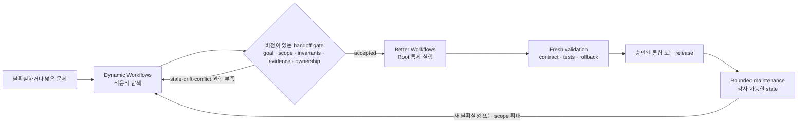
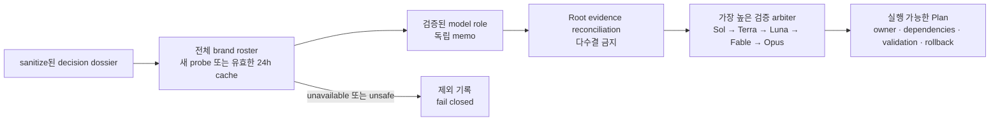
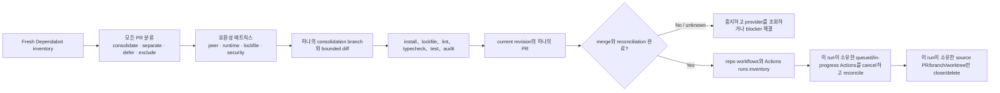

# Better Workflows

[English](../README.md) | [繁體中文](README.zh-TW.md) | [简体中文](README.zh-CN.md) | [日本語](README.ja.md) | [한국어](README.ko.md)

Better Workflows는 Codex를 위한 native-first, evidence-driven workflow입니다. Root만 코드 수정, Git/GitHub 작업, deploy, 위험 수용, 완료 선언을 수행하며 subagents는 조사, Review, 테스트 증거와 반증을 담당합니다.

## 설계 원칙

Better Workflows는 제한 없는 agent swarm이 아니라 거버넌스를 갖춘 orchestration layer입니다. 핵심 원칙은 다음과 같습니다.

- **Root-owned mutation:** Root만 수정, 통합, Git/GitHub mutation, deploy, 위험 수용과 완료 선언을 수행합니다.
- **Evidence before side effects:** side effect 전에 evidence, freshness, 권한, provider reconciliation을 요구하며 unknown outcome은 fail closed로 처리합니다.
- **Bounded delegation:** native subagents는 조사, Review, 테스트 증거와 반증으로 제한합니다. direct children은 최대 3개이고 재귀 delegation은 금지하며 독립 critics는 순차 실행합니다.
- **Persistent intent:** `/goal`은 turn을 넘어 사용자의 목표를 보존합니다. template과 mode는 검증 깊이만 정하고 목표를 조용히 바꾸지 않습니다.
- **Deterministic control plane:** `dw`는 contract, private state, sentinel, evidence, findings, lease, action token, reconciliation을 기록하지만 model이 생성한 command를 실행하지 않습니다.
- **Explicit completion:** 최신 acceptance evidence, 필요한 검사, 사용 가능한 rollback이 모두 있고 해결되지 않은 고위험 또는 unknown state가 없을 때만 완료합니다.
- **Fast path remains explicit:** 작고 되돌릴 수 있는 작업에는 `direct`를 사용해 전체 workflow journal 비용을 명시적으로 생략할 수 있습니다.

이 설계는 최대 병렬 처리량의 일부를 더 작고 검토 가능한 mutation surface와 예측 가능한 중지 조건으로 교환합니다. evidence나 사용자 권한을 기다리느라 멈추더라도 안전하지 않은 진행이 숨겨지지 않는 것을 우선합니다.

## Better Workflows와 Claude Dynamic Workflows 비교

여기서 “Claude Dynamic Workflows”는 Anthropic의 Claude Code 기능을 뜻하며 서드파티 패키지를 뜻하지 않습니다. 비교는 2026-07-20에 확인한 Anthropic 공개 자료인 [Introducing dynamic workflows in Claude Code](https://claude.com/blog/introducing-dynamic-workflows-in-claude-code), [A harness for every task](https://claude.com/blog/a-harness-for-every-task-dynamic-workflows-in-claude-code), [Claude Code 병렬 agent 문서](https://code.claude.com/docs/en/agents)를 기준으로 합니다.

> **한 문장으로:** Dynamic Workflows는 적응적인 폭이 필요한 작업에서 탐색 공간을 넓히고, Better Workflows는 승인된 경로를 bounded·검증 가능하게 만들어 안전하게 통합합니다.

> **중요한 경계:** 아래는 사람 또는 자동화가 운영하는 operating model이며 두 제품의 native integration이 아닙니다. 공유 runtime state, 자동 handoff, protocol compatibility를 주장하지 않습니다.

### 가장 큰 특징의 차이

핵심 차이는 orchestration posture와 authority입니다.

- **Dynamic Workflows는 적응적 폭을 우선합니다.** 작업별 JavaScript harness를 만들고 여러 agent를 병렬화하며 model/worktree를 선택하고 검증과 stop condition에 따라 반복합니다.
- **Better Workflows는 governed convergence를 우선합니다.** mutation은 Root에 남기고 delegated research를 bounded하게 하며 deterministic state/evidence를 기록합니다. freshness, 권한, reconciliation, completion evidence가 부족하면 fail closed입니다.

이는 상호 배타적인 능력 구분이 아닙니다. Better Workflows에도 research/deep review가 있고 Dynamic Workflows도 구현과 release에 사용할 수 있습니다. 차이는 먼저 최적화하는 대상, 즉 **runtime exploration scale과 deterministic mutation control**입니다.

### 왜 이런 기능을 내장하지 않는가

이는 미완성 기능 목록이 아니라 의도한 경계입니다. Better Workflows는 Codex 작업을 둘러싼 governance/control plane이지, model이 무제한 agent harness를 동적으로 생성하는 runtime이 아닙니다. `dw`는 state, evidence, action gates를 기록하고 검증하지만 agent를 spawn하거나 model이 생성한 command를 실행하지 않습니다.

| 능력 | 이 repo가 제공하는 것 | 경계를 둔 이유 |
| --- | --- | --- |
| 작업별 JavaScript harness | 명시적 template, mode, deterministic helper logic. | 동적 harness는 빠르게 적응하지만 runtime에서 실행 계획을 바꿉니다. 이 repo는 mutation 전 control plane을 검사 가능하게 유지합니다. |
| 대규모 또는 무제한 fan-out | direct native children 최대 3개, 재귀 delegation 금지. | token 비용, 공유 파일 충돌, blast radius를 bounded하게 만듭니다. |
| Adversarial verification | Refutation, research findings, 최대 2개의 순차 model-pinned critics. | 반증은 유지하되 생성된 subtask마다 무한히 늘어나지 않고 수와 순서를 감사할 수 있습니다. |
| Loop-until-done | Persistent Goal, implementation queue, checkpoint, 명시적 completion gates. | validated slice를 넘어 계속할 수 있지만 fresh evidence 없이 scope나 spawn을 조용히 확대하지 않습니다. |
| 자동 worktree swarm | Branch/protected-branch와 cleanup gates. 생성 subtask별 자동 worktree는 만들지 않습니다. | Root가 integration/cleanup ownership을 유지해 병렬 mutation 책임을 명확히 합니다. |
| 무인 장시간 실행 | Durable run state와 resume 가능한 Goal. 단 명시적 권한과 reconciliation이 필요합니다. | resume는 유용하지만 autonomous daemon에는 별도의 lease, resource, cancel, side-effect protocol이 필요합니다. |

**그렇다면 부적합한가요?** 아닙니다. contract가 알려져 있고 잘못된 mutation의 하방 위험이 비대칭이면 Better Workflows가 적합합니다: release, protected branch, API 변경, security-sensitive refactor, Review, maintenance입니다. 불확실성과 규모가 지배적이면 Dynamic Workflows를 먼저 사용하는 편이 적합합니다. 둘을 함께 쓸 때는 넓게 탐색하고 versioned handoff로 정규화한 뒤 Better Workflows가 독립적으로 검증하고 구현을 governance합니다. 이는 operating pattern이지 native interoperability가 아닙니다.

| 관점 | Better Workflows | Claude Dynamic Workflows |
| --- | --- | --- |
| Orchestration posture | 명시적 selector, template, mode와 deterministic local control plane. | task-specific JavaScript harness를 runtime에 생성하고 구성합니다. |
| 폭과 반복 | direct children 최대 3개, 독립 critics는 순차 실행. | 대규모 fan-out, adversarial verification, dynamic loop와 장시간 실행. |
| Mutation boundary | Root가 수정, 통합, Git/GitHub, deploy, 위험 수용, 완료 선언을 담당하며 delegated agents는 contract상 read-only입니다. | 생성된 harness가 subagent, model, worktree를 선택할 수 있고 task script가 run의 거버넌스를 정합니다. |
| State와 완료 | Persistent Goal, private state, sentinel, evidence, lease, action token, reconciliation, fail-closed. | progress를 저장하고 resume할 수 있으며 harness가 수렴을 조정합니다. |
| 비용과 blast radius | 의도적으로 보수적이며 비용, mutation surface, stop condition을 bounded하게 만들기 쉽습니다. | 규모 잠재력은 높지만 공식적으로 훨씬 많은 token을 사용할 수 있다고 안내합니다. |
| 시작하기 좋은 상황 | 알려진 contract, release, refactor, Review 또는 하방 위험이 비대칭인 변경. | 규모를 알 수 없는 탐색, 대형 migration, 전체 repo audit, 대규모 병렬화가 이득인 작업. |

### Explore → Gate → Execute → Maintain

다음은 협업 SOP입니다. 자동 제품 handoff가 아니라 권장 operating pattern입니다.



### 버전이 있는 handoff package

Better Workflows가 탐색 결과를 받기 전에 versioned handoff package로 정규화합니다. 이것이 scope drift를 막는 경계입니다.

| Gate | 필요한 자료 | 탐색으로 되돌리는 조건 |
| --- | --- | --- |
| Goal | 문제, non-goals, 선택안과 거부한 대안. | 목표 또는 scope가 모호함. |
| Contract | Invariants, interfaces, acceptance tests, 재현 가능한 commands. | public behavior 또는 성공 조건의 owner가 없음. |
| Evidence | Source index, provenance, timestamp, baseline checks, 미해결 findings. | evidence가 stale, unknown, 재현 불가. |
| Ownership | Repo, branch, commit/worktree, component owner, mutation boundary. | baseline drift, ownership conflict, 공유 파일 충돌. |
| Risk/action | dependency/security risk, side-effect inventory, rollback, action tokens. | side effect에 권한, reconciliation, rollback이 없음. |

그 다음 Better Workflows는 package를 독립적으로 검증하고 Goal/contract/evidence state로 변환한 뒤 accepted scope만 실행합니다. scope, baseline, gate가 바뀌면 중단하고 다시 탐색하며 mutation surface를 조용히 넓히지 않습니다.

### 협업 권장안

| 상황 | 권장 경로 | 이유 |
| --- | --- | --- |
| 작고 되돌릴 수 있으며 명확한 변경 | Better Workflows `direct` | dynamic orchestration 비용을 지불할 이유가 없습니다. |
| contract는 알려져 있지만 검증 또는 release 위험이 있음 | Better Workflows `verified`, `deep`, `critical` | fan-out보다 fresh evidence와 authority gates가 중요합니다. |
| 아키텍처가 불명확하거나 가설이 많거나 대형 migration | Dynamic Workflows → handoff gate | 폭으로 불확실성을 줄이되 통합 controls는 우회하지 않습니다. |
| 설계가 정해진 뒤의 production maintenance | Better Workflows | contract, evidence, rollback, 감사 가능한 ownership을 보존합니다. |

**Mental model:** 넓게 탐색하고, gate를 명시하고, 좁게 실행하고, 감사 가능하게 유지합니다.

## 설치

```bash
codex plugin marketplace add stephen-taipei/better-workflows
codex plugin add better-workflows@better-workflows
```

설치 후 새 Codex task를 열어 Skill catalog를 다시 불러오세요.

## Codex에서 사용하기

### Codex CLI

Codex CLI에서는 `@`로 시작해 `better`를 검색한 뒤 CLI picker에서 Better Workflows skill 또는 항목을 선택합니다.


### Codex App

Codex App에서는 `/`로 시작해 `better`를 검색한 뒤 App picker에서 해당 command 또는 skill 항목을 선택합니다.


어느 화면에서든 항목을 선택한 뒤 원하는 결과를 설명하면 됩니다. Picker가 `$better-workflows:<name>`을 삽입합니다. `/goal`, template, mode, model alias를 외울 필요가 없습니다. 권장 기본값:

```text
$better-workflows:auto <완료하려는 결과를 설명>
```

모든 항목은 본 작업 전에 persistent Goal을 생성하거나 이어갑니다. `direct`도 동일합니다. 관련 없는 미완료 Goal이 있으면 조용히 덮어쓰지 않고 `/goal edit` 또는 `/goal clear`를 안내합니다.

### 빠른 선택

- 무엇을 선택할지 모르겠다면 `auto`.
- 작업 유형을 알고 있다면 9개 task entry 중 선택.
- 검증 강도만 정하려면 `direct`, `verified`, `deep`, `critical`.
- 기존 명령 습관을 유지하려면 compatibility alias.

### 자동 및 작업 항목

| 항목 | 권장 상황 | 예시 |
| --- | --- | --- |
| `$better-workflows:auto` | 대부분의 작업에 권장. 위험과 증거에 따라 template, mode, critics를 자동 선택. | `$better-workflows:auto 현재 repo를 Review하고 검증된 문제를 수정한 뒤 PR 생성.` |
| `$better-workflows:review-issues` | 읽기 전용 audit, finding 중복 제거, 승인된 GitHub issue 생성. 코드는 수정하지 않음. | `$better-workflows:review-issues 최신 dev SHA를 Review하고 중복 없는 P0/P1/P2 issues 생성.` |
| `$better-workflows:fix-issues-pr` | Open issues를 다시 확인하고 Root가 수정 및 PR 생성. 승인된 경우에만 merge/cleanup. | `$better-workflows:fix-issues-pr dev open issues를 수정하고 fresh checks 후 merge 및 cleanup.` |
| `$better-workflows:cross-platform` | Backend, iOS, Android, Web의 schema, optional, enum, sync, version gate, headers. | `$better-workflows:cross-platform backend, iOS, Android contact sync contract를 확인하고 수정 후 PR 생성.` |
| `$better-workflows:ios-static` | 로컬 build를 피하는 Swift/iOS 정적 Review와 직렬 `project.pbxproj` 검증. | `$better-workflows:ios-static build 없이 iOS 변경을 Review하고 새 Swift 파일의 pbxproj 등록 확인.` |
| `$better-workflows:localization` | 다국어 변경, 특히 41 locales의 key 수, 순서, 정확한 scope, 지역 변형. | `$better-workflows:localization 41개 locales에 keys를 추가하고 동일한 순서인지 검증.` |
| `$better-workflows:ci-release` | CI failure, runner queue, 직렬 deploy, release, 원격 모니터링, receipt 검증. | `$better-workflows:ci-release 실패한 PR checks를 수정하고 직렬 dev deploy를 모니터링.` |
| `$better-workflows:browser-qa` | 최신 UI 증거, screenshots, 재현 가능한 action log가 필요한 Webwright／simulator QA. | `$better-workflows:browser-qa signup과 contact sync를 검증하고 screenshot evidence 첨부.` |
| `$better-workflows:research` | CLI로 검증한 multi-model 역할, 증거 기반 architecture 비교, 반증 및 실행 가능한 Plan. 다수결로 결정하지 않음. | `$better-workflows:research 세 가지 sync architecture를 비교·반증하고 구현 가능한 Plan 생성.` |
| `$better-workflows:monorepo-refactor` | monorepo 전체를 조사한 뒤 적격한 bounded refactor 제안을 직접 구현하고 behavior invariants, validation, rollback evidence를 유지합니다. | `$better-workflows:monorepo-refactor monorepo를 조사하고 public contract를 바꾸지 않으면서 적격한 boundary cleanup을 구현.` |

### CLI로 검증한 multi-model deliberation

`research-deliberation`은 Codex, Claude, Gemini(Agy 경유), Agy, Grok, Cursor, Kimi, Qwen, Kiro의 전체 설정 브랜드 목록을 유지합니다. 하지만 안전한 semantic CLI probe에 성공한 CLI/model 조합만 이번 의사결정 그룹에 참여합니다. binary 부재, 만료된 로그인, 대화형 로그인 필요 상태는 unavailable로 기록하며 조용히 대체하지 않습니다.

전체 roster의 reasoning-effort profile별 probe는 최대 24시간 cache됩니다. 만료, `--refresh`, roster 설정 변경, CLI path/binary digest 변경 시 재검증합니다. 단일 provider probe는 전체 cache를 덮어쓰지 않습니다. 외부 CLI는 명시적 사용자 권한과 sanitize된 비기밀 input이 필요합니다. 이 runtime에서 Gemini는 standalone `gemini` 대신 `agy` transport로 호출됩니다.

모든 participant에 같은 contextual reasoning-effort를 적용합니다. bounded `direct`／`verified`는 기본 `medium`, `auto`／`deep`／`critical`는 기본 `high`이며 evidence에 따라 명시적으로 override할 수 있습니다. Codex에는 native setting을 전달하고, Agy는 실제 `gemini-3.6-flash-medium` 또는 `gemini-3.6-flash-high`를 선택하며 해당 model이 지원할 때만 native `--effort`를 전달합니다. flag를 거부하는 model은 high／medium-only variant로 정직하게 기록합니다. 다른 CLI는 prompt-guidance로 기록하며 provider attestation을 가장하지 않습니다.



```bash
node plugins/better-workflows/scripts/dw.mjs deliberation deliberate \
  --prompt-file sanitized-case.md \
  --allow-external-providers --sanitized
```

### Template-only: Dependabot consolidation SOP

Dependabot consolidation은 전용 template이며 picker Skill을 추가하지 않습니다.
고정된 contract가 필요할 때는 다음처럼 직접 실행합니다.

```bash
node plugins/better-workflows/scripts/dw.mjs run \
  --template dependabot-consolidation-pr-cleanup \
  --mode critical \
  --goal "Dependabot PR을 inventory하고 호환 업데이트를 통합해 하나의 PR을 merge하며 이 run이 소유한 source만 cleanup한다." \
  --scope .
```

SOP 순서는 다음과 같습니다.



필수 evidence는 `dependabot-inventory`, `compatibility-matrix`,
`consolidation-diff`, `lockfile-validation`, `repository-actions-inventory`,
`actions-cancelled`, `merge-result`, `cleanup-manifest`입니다. repo workflow와
관련 Actions runs의 존재를 확인하고 missing, disabled, queued, running,
terminal 상태를 명시합니다. provider를 조회할 수 없으면 중지합니다. 모든
Dependabot PR에 disposition을 부여하고 run 소유 Actions를 cancel한 뒤
consolidation PR의 terminal reconciliation이 완료되기 전에는 source를 cleanup하지 않습니다.

### Template-only: PR을 `dev`에 merge

`pr-to-dev`는 atomic commit batch 분할, target이 `dev`인 하나의 PR 생성,
fresh required checks, protected merge, remote `dev` reconciliation, 그리고
run 소유 resource만 cleanup하는 전용 template입니다. picker Skill은 추가하지
않습니다.

```bash
node plugins/better-workflows/scripts/dw.mjs run \
  --template pr-to-dev \
  --mode critical \
  --goal "범위 내 변경을 atomic commits로 나누고 dev 대상 PR을 생성한 뒤 fresh checks 후 merge, remote dev 동기화, 소유 worktree cleanup을 수행한다." \
  --scope .
```

필수 gate는 `commit-plan`, `commit-manifest`, `target-branch-dev`,
`required-checks`, `merge-result`, `remote-sync`, `cleanup-manifest`입니다.
admin bypass, stale checks, 미검토 commit, remote reconciliation 전 cleanup은
거부됩니다.

### Review 강도 항목

| 항목 | 권장 상황 | 예시 |
| --- | --- | --- |
| `$better-workflows:direct` | 작고 되돌릴 수 있으며 명확한 작업. Goal은 사용하지만 workflow journal/critics는 사용하지 않음. | `$better-workflows:direct 한 줄 documentation typo를 수정하고 diff 확인.` |
| `$better-workflows:verified` | 일반 개발 작업에 1–3 read-only agents와 freshness evidence가 필요할 때. | `$better-workflows:verified pagination bug를 Review하고 수정한 뒤 PR 생성.` |
| `$better-workflows:deep` | Architecture, security, 광범위 refactor, 불확실한 변경. Verified wave와 독립 Codex critics 사용. | `$better-workflows:deep auth redesign을 Review하고 검증된 문제를 수정해 migration-safe PR 생성.` |
| `$better-workflows:critical` | Release, migration, production, 파괴적 cleanup, 비가역 side effects. 완전한 fail-closed gates 필요. | `$better-workflows:critical policy, remote SHA, reconciliation gates 통과 후에만 production release 실행.` |

### Compatibility aliases

| 항목 | 권장 상황 | 대응 경로 |
| --- | --- | --- |
| `$better-workflows:auto-improve` | 기존 `autoImprove`: Review, finding 검증, 수정, PR, 안전한 수렴. | Fix issues to PR, 기본 `deep` |
| `$better-workflows:auto-issues` | 기존 `autoIssues`: 읽기 전용 Review와 중복 없는 issue 생성. | Review to issues, 기본 `verified` |
| `$better-workflows:git-check-issues` | 기존 issue repair: 상태 재조회, 수정, PR, 정확한 cleanup. | Fix issues to PR, 기본 `deep` |
| `$better-workflows` | 특정 항목을 선택하지 않은 자연어 router. | Template과 mode 자동 선택 |

## 모드

| Mode | 동작 |
| --- | --- |
| `direct` | Root가 직접 작업하며 durable workflow state를 만들지 않음. |
| `verified` | Root와 1–3 read-only research/review/refutation agents. |
| `deep` | `verified` 후 최대 2개의 Codex critics를 직렬 실행. |
| `critical` | 전체 evidence/side-effect gates와 policy 필수 외부 reviewer. |

## 개발 및 검증

```bash
npm test --prefix plugins/better-workflows
node plugins/better-workflows/scripts/dw.mjs eval
```

## License

MIT. [LICENSE](../LICENSE) 및 [THIRD_PARTY_NOTICES.md](../THIRD_PARTY_NOTICES.md)를 참고하세요.
