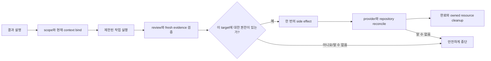

<div align="center">

# Better Workflows

**Goal-first · Evidence-driven · Fail-closed**

Codex 작업을 “Prompt를 주고 성공을 기대하는” 상태에서 의도, 검증, provider reconciliation을 거친 delivery로 전환합니다.

[](../plugins/better-workflows/package.json)
[](../plugins/better-workflows/package.json)
[](../plugins/better-workflows/package.json)
[](../LICENSE)

[English](../README.md) · [繁體中文](README.zh-TW.md) · [简体中文](README.zh-CN.md) · [日本語](README.ja.md) · **한국어**

</div>

[빠른 시작](guide/getting-started.md) · [Workflows](guide/workflows.md) · [Architecture](guide/architecture.md) · [Security](guide/security.md) · [CLI](guide/cli-reference.md) · [상세 사양](details/ko.md)

<!-- readme-roster -->
**Model roster:** Codex · Claude · Gemini · GPT-OSS · Grok · Cursor · Kimi · Qwen · Kiro. `agy`는 Gemini, Claude, GPT-OSS 브랜드 model을 transport하지만 그 자체가 model 브랜드는 아닙니다.

<!-- readme-section:promise-audience -->
## Better Workflows가 필요한 이유

Codex는 repository를 분석하고 코드를 수정하며 check를 실행하고 provider를 조작할 수
있습니다. 능력이 강해질수록 “사용자가 원하는 것”과 “현재 증거와 권한이 실제로 허용하는
것”을 분리해야 합니다.

Better Workflows는 작은 작업의 속도를 유지하면서도 blast radius가 커질 때 명확한
scope, review, freshness, protected delivery를 포기하지 않으려는 개발자와 팀을 위한 도구입니다.

결과 중심의 13 workflow templates, 통제된 workspace recipes, read-only Graph View를
제공합니다. 결과를 선택하면 route는 현재 risk에 필요한 검증만 추가합니다.

<!-- readme-section:problem-outcome -->
## Prompt에서 통제된 결과로

<!-- readme-claim:prompt-not-authority -->
Prompt는 의도를 설명할 수 있지만 권한을 부여하지는 않습니다.

Control plane이 없으면 합리적인 지시도 오래된 상태를 사용하고 scope를 넓히거나 provider
결과를 놓칠 수 있습니다. Better Workflows는 이 간극을 명시적인 gate로 바꿉니다.

| 통제가 없는 경우 | Better Workflows를 사용하는 경우 |
| --- | --- |
| 의도와 권한이 섞임 | Goal, scope, authority를 별도 기록으로 유지 |
| 통과한 check가 오래된 revision에 속할 수 있음 | Evidence를 현재 source와 target에 bind |
| Retry가 external action을 중복할 수 있음 | Attempts를 제한하고 알 수 없는 결과를 먼저 reconcile |
| “완료”가 command 종료만 의미함 | Completion에 terminal provider와 repository evidence 요구 |

<!-- readme-section:proof-boundaries -->
## 신뢰할 수 있는 것

<!-- readme-claim:root-only-mutation -->
**Root-owned mutation.** Root만 수정, 통합, 배포, 위험 수용, 완료 선언을 할 수 있습니다.

<!-- readme-claim:evidence-before-action -->
**Action 전에 증거.** 모든 side effect에는 fresh evidence, provenance, 대상에 bind된 action이 필요합니다.

<!-- readme-claim:unknown-stop -->
**Fail closed.** drift, 오래된 증거 또는 알 수 없는 provider 상태가 있으면 workflow는 반드시 중단됩니다.


<!-- readme-visual-fallback:authority-boundary -->
**텍스트 동등 설명:** Prompt는 결과를 기록하고 Context는 현재 사실을 bind합니다. Harness는
누가 어디에서 행동할 수 있는지 제한하고 Loop는 retry와 reconciliation을 제한합니다.
Graph는 승인된 상태를 보여줄 뿐 scheduler, policy input, authority source가 되지 않습니다.
증거나 권한이 없으면 진행을 중단합니다.

<!-- readme-section:first-success -->
## 첫 번째 성공 만들기

Marketplace와 plugin을 설치합니다.

```bash
codex plugin marketplace add stephen-taipei/better-workflows
codex plugin add better-workflows@better-workflows
```

새 Codex task를 열고 native picker에서 Better Workflows를 선택합니다.

```text
Codex CLI: @better
Codex App: /better
```

그다음 원하는 결과를 설명합니다.

```text
$better-workflows:auto <describe the outcome you need>
```

성공하면 automatic route가 하나의 구체적인 template과 최소 verification mode를 선택합니다.
누락된 권한을 부여하거나 tool을 설치하거나 요청한 scope를 넓히지 않습니다.

[설치, 검증, 첫 workflow 실행 →](guide/getting-started.md)

<!-- readme-section:choose-next-path -->
## 다음 경로 선택

| 원하는 결과 | 시작점 |
| --- | --- |
| Codex가 가장 안전한 route를 선택 | `$better-workflows:auto` |
| Repository를 review하고 중복 없는 issues 생성 | `$better-workflows:review-issues` |
| 수정, PR, merge, owned resource cleanup | `$better-workflows:fix-issues-pr` |
| Atomic commits를 protected `dev`에 delivery | `$better-workflows:pr-to-dev` |
| 독립 역할로 architecture 비교 | `$better-workflows:research` |
| Release 또는 비가역 작업 통제 | `$better-workflows:critical` |
| Deterministic SOP mechanics 보존 | `$better-workflows:workspace-recipe` |
| Held-out evidence로 Better Workflows 개선 | `$better-workflows:self-improve` |

모든 selectors, modes, templates는 [Workflows](guide/workflows.md)를 확인하세요.
Security reviewer는 [Security](guide/security.md), operator는
[CLI reference](guide/cli-reference.md)에서 시작할 수 있습니다.

<!-- readme-section:lifecycle -->
## Delivery가 완료에 도달하는 과정


```mermaid
flowchart LR
  A["결과 설명"] --> B["scope와 현재 context bind"]
  B --> C["제한된 작업 실행"]
  C --> D["review와 fresh evidence 검증"]
  D --> E{"이 target에 대한 권한이 있는가?"}
  E -- "예" --> F["한 번의 side effect"]
  F --> G["provider와 repository reconcile"]
  G --> H["완료와 owned resource cleanup"]
  E -- "아니요/알 수 없음" --> I["안전하게 중단"]
  G -- "알 수 없음" --> I
```

<!-- readme-visual-fallback:lifecycle -->
**텍스트 동등 설명:** 결과를 설명하고 정확한 scope와 현재 context를 bind한 뒤 제한된 작업과
fresh evidence review를 수행합니다. Target-bound authority가 있을 때만 한 번의 side effect를
실행합니다. Completion과 owned cleanup 전에 provider와 repository를 reconcile하며, 누락,
오래된 상태 또는 알 수 없는 결과가 있으면 workflow를 중단합니다.

<!-- readme-section:trust-limits -->
## 신뢰 경계와 한계

Better Workflows는 control plane을 기록하고 검사하지만 무제한 agent runtime은 아닙니다.
텍스트, 다이어그램, 오래된 check, model vote를 권한으로 취급하지 않습니다.

<!-- readme-claim:private-history -->
민감하거나 사적인 기록은 수집하지 않으며, redacted `REJECTED_WITH_EVIDENCE` disposition으로 거부합니다.

- Side effects에는 명시적인 user authority와 single-use action gates가 필요합니다.
- Independent critics는 read-only이며 risk acceptance나 success declaration을 할 수 없습니다.
- Workspace recipes는 deterministic Node.js mechanics만 실행하며 model 선택, network,
  arbitrary shell, source mutation을 할 수 없습니다.
- Model deliberation은 최신 semantic roster probe만 허용하며 사용할 수 없는 provider를
  암묵적으로 대체하지 않습니다.
- Graph View는 derived presentation이며 policy input, authorization, scheduler,
  agent runtime이 되지 않습니다.

[Architecture와 trade-off 이해하기 →](guide/architecture.md)

<!-- readme-section:learn-help-contribute -->
## 더 알아보고 도움받고 기여하기

| 필요한 정보 | 문서 |
| --- | --- |
| 첫 install과 route | [Getting started](guide/getting-started.md) |
| Workflow 또는 mode 선택 | [Workflows](guide/workflows.md) |
| Control-plane design과 비교 | [Architecture](guide/architecture.md) |
| Privacy, authority, actions, attestations | [Security](guide/security.md) |
| Commands와 exit behavior | [CLI reference](guide/cli-reference.md) |
| 완전한 한국어 사양 | [상세 사양](details/ko.md) |
| README narrative와 품질 규칙 | [README quality blueprint](guide/readme-quality.md) |

[Contributing](../CONTRIBUTING.md) · [Code of conduct](../CODE_OF_CONDUCT.md) ·
[Governance](../GOVERNANCE.md) · [Support](../SUPPORT.md) · [Security policy](../SECURITY.md)

<details>
<summary>Better Workflows 개발</summary>

```bash
npm test --prefix plugins/better-workflows
node plugins/better-workflows/scripts/sbw.mjs eval
node scripts/plugin-cache.mjs check
```

Node.js 24+ · zero runtime dependencies · immutable plugin cache versions.

</details>

[Stephen Chuang](https://github.com/stephen-taipei)과 contributors가 유지 관리합니다.
MIT license이며 [LICENSE](../LICENSE)와
[THIRD_PARTY_NOTICES.md](../THIRD_PARTY_NOTICES.md)를 확인하세요.
