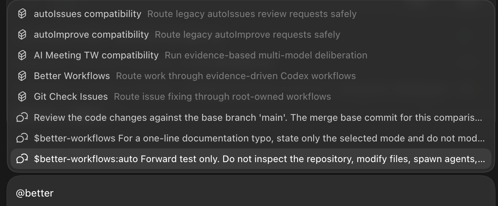

# Better Workflows

[English](../README.md) | [繁體中文](README.zh-TW.md) | [简体中文](README.zh-CN.md) | [日本語](README.ja.md) | [한국어](README.ko.md)

Better Workflows 是为 Codex 设计的原生优先、证据驱动工作流。Root 是唯一可以修改代码、执行 Git/GitHub、deploy、接受风险与宣布完成的 authority；subagents 专注于研究、Review、测试证据与反证。

## 设计原理

Better Workflows 是一个治理型 orchestration layer，而不是无限制的 agent swarm。核心原则是：

- **Root-owned mutation：** Root 是唯一可以修改、集成、执行 Git/GitHub mutation、deploy、接受风险与宣布完成的 authority。
- **Evidence before side effects：** side effect 之前必须具备证据、freshness、授权与 provider reconciliation；unknown outcome 一律 fail closed。
- **Bounded delegation：** native subagents 只负责研究、Review、测试证据与反证；最多三个 direct children，禁止递归 delegation，独立 critics 按顺序执行。
- **Persistent intent：** `/goal` 跨 turn 保存用户目标；template 与 mode 只决定验证深度，不会静默改变目标。
- **Deterministic control plane：** `dw` 记录 contract、private state、sentinel、evidence、findings、lease、action token 与 reconciliation，但不执行 model 生成的 command。
- **Explicit completion：** 只有 acceptance evidence 仍然新鲜、必要检查通过、rollback 可用，并且没有未解决的高风险或 unknown state，才能完成。
- **Fast path remains explicit：** 小型且可逆的工作可以使用 `direct`，无需承担完整 workflow journal 成本。

这种设计用一部分最高并行吞吐，换取更小、可检查的 mutation surface 与可预测的停止条件。目标是让不安全的进度难以被隐藏，即使因此需要暂停等待证据或用户授权。

## Better Workflows 与 Claude Dynamic Workflows 对比

这里的“Claude Dynamic Workflows”指 Anthropic 的 Claude Code 功能，而不是第三方软件。比较依据是 2026-07-20 查阅的 Anthropic 公开资料：[Introducing dynamic workflows in Claude Code](https://claude.com/blog/introducing-dynamic-workflows-in-claude-code)、[A harness for every task](https://claude.com/blog/a-harness-for-every-task-dynamic-workflows-in-claude-code)，以及 [Claude Code 并行 agent 文档](https://code.claude.com/docs/en/agents)。

| 维度 | Better Workflows | Claude Dynamic Workflows |
| --- | --- | --- |
| Orchestration | Selector、template、明确 mode 与 deterministic local control plane。 | Claude 根据任务动态编写 JavaScript harness，再协调整个 run。 |
| 并行处理 | 小型 bounded native wave：最多三个 direct children，critics 按顺序执行。 | 以大规模 fan-out 与长时间工作为目标；Anthropic 描述可并行启动数十到数百个 subagents。 |
| State 与完成条件 | Persistent `/goal`、private run state、sentinel、evidence、action token、reconciliation 与 fail-closed completion。 | 保存 workflow progress，中断后可以继续；实际 run 形状主要由动态生成的 harness 决定。 |
| Mutation governance | Root-only mutation/integration；delegated agents 按 contract 只读。 | 支持 subagents、worktree、model 选择与 permission control，但 workflow 本身是为任务动态生成的。 |
| 适应性 | Runtime freedom 较低，但 side effect 前更容易 Review，也更容易从 template 重现。 | Runtime adaptability 较高，适合未知数量、高并行、对抗验证或多日任务。 |
| 吞吐与成本 | 刻意保守；较少并行 worker 可能降低最高吞吐，但成本与 blast radius 更容易界定。 | 吞吐潜力更高，但官方提醒 dynamic workflows 可能消耗明显更多 token。 |
| 可移植性 | Codex-native plugin 与 Node.js helper；可应用到能运行 plugin 的 repositories。 | Claude Code CLI、Desktop、VS Code extension、API 与支持的 cloud providers。 |
| 最适场景 | Contract-sensitive refactor、Review、release、Git/GitHub 操作，重视证据与 rollback。 | 大型 migration、全 codebase exploration、大规模 verification，以及需要动态 orchestration 的任务。 |

### 实际取舍

当主要风险是 uncontrolled mutation、授权不清、证据过期或不可逆 side effect 时，Better Workflows 更合适。明确的 queue、checkpoint 与 fail-closed gates 让人容易解释流程为何停止，以及继续前需要补哪些 reconciliation。

当瓶颈是 orchestration scale，例如大量独立子任务、长时间执行、动态 loop 或大型 migration 时，Claude Dynamic Workflows 更有优势。不过 Anthropic 也提醒它并不适合每个任务，且可能显著增加 token 使用量；规模换来的是成本与 latency trade-off，而不是所有任务的普遍提升。

两者优化的目标不同：Better Workflows 优先追求 Codex 内可治理、可 Review 的进度；Claude Dynamic Workflows 优先追求 Claude Code 内动态生成且高度并行的 harness。

## 安装

```bash
codex plugin marketplace add stephen-taipei/better-workflows
codex plugin add better-workflows@better-workflows
```

安装后请打开新的 Codex task，让 Skill catalog 重新加载。

## 在 Codex 中使用

按 `@` 后搜索 `better`，或输入 `/skills` → `List skills`，即可打开 Skill 下拉菜单。



选择入口后直接描述目标即可。菜单会自动插入 `$better-workflows:<name>`；无需手动输入 `/goal`，也不用记住 template、mode 或 model alias。推荐默认入口：

```text
$better-workflows:auto <描述需要完成的目标>
```

所有入口都会在正式工作前自动创建或继续 persistent Goal，包括 `direct`。如果已经存在不相关且未完成的 Goal，流程会要求使用 `/goal edit` 或 `/goal clear`，不会静默覆盖。

### 快速选择

- 不确定选哪个：使用 `auto`。
- 已知道任务类别：选择九个任务入口之一。
- 只想指定审查强度：使用 `direct`、`verified`、`deep` 或 `critical`。
- 仍在使用旧命令：选择 compatibility alias。

### 自动与任务入口

| 入口 | 推荐场景 | 示例 |
| --- | --- | --- |
| `$better-workflows:auto` | 大多数任务的推荐默认值。根据风险与证据自动选择 template、mode 与 critics。 | `$better-workflows:auto Review 当前 repo、修复已验证问题并创建 PR。` |
| `$better-workflows:review-issues` | 只读 audit、finding 去重与经授权的 GitHub issue 创建；不修改代码。 | `$better-workflows:review-issues Review 最新 dev SHA，创建去重后的 P0/P1/P2 issues。` |
| `$better-workflows:fix-issues-pr` | 重新验证 open issues、由 Root 修复并创建 PR；仅在获授权时 merge 与 cleanup。 | `$better-workflows:fix-issues-pr 修复 dev 的 open issues，创建 PR，等待 fresh checks 后 merge 并 cleanup。` |
| `$better-workflows:cross-platform` | Backend、iOS、Android、Web 的 schema、optional 字段、enum、sync、version gate 与 headers。 | `$better-workflows:cross-platform 检查 backend、iOS 和 Android 的 contact sync contract，修复问题并创建 PR。` |
| `$better-workflows:ios-static` | 不适合本地 build 时的 Swift/iOS 静态 Review，以及串行 `project.pbxproj` 验证。 | `$better-workflows:ios-static 不做 build，Review iOS 变更、检查新 Swift 文件已加入 pbxproj 并修复静态问题。` |
| `$better-workflows:localization` | 多语言更新，尤其是 41 语言 key 数量、顺序、精确 scope 与区域变体。 | `$better-workflows:localization 将这些 keys 添加到全部 41 个语言，并验证 key 顺序一致。` |
| `$better-workflows:ci-release` | CI failure、runner queue、串行 deploy、release、远端监控与 receipt 验证。 | `$better-workflows:ci-release 诊断失败的 PR checks、修复并监控串行 dev deploy。` |
| `$better-workflows:browser-qa` | 需要最新 UI 证据、截图与可复现 action log 的 Webwright／模拟器 QA。 | `$better-workflows:browser-qa 验证 signup 与 contact sync，并附上 screenshot evidence。` |
| `$better-workflows:research` | 证据驱动研究、架构比较、独立观点与反证；不以多数票决策。 | `$better-workflows:research 比较三种 sync 架构、反证每个方案并提出建议。` |
| `$better-workflows:monorepo-refactor` | 完整盘点 monorepo，直接实现所有合格的 bounded refactor 建议，并保留 behavior invariants、validation 与 rollback evidence。 | `$better-workflows:monorepo-refactor 盘点 monorepo，直接实现所有合格的 boundary cleanup 建议，不改变 public contract。` |

### 审查强度入口

| 入口 | 推荐场景 | 示例 |
| --- | --- | --- |
| `$better-workflows:direct` | 小型、可逆、明确且重视速度的任务。保留 Goal，但不创建 workflow journal 或 critics。 | `$better-workflows:direct 修正这个一行文档 typo 并检查 diff。` |
| `$better-workflows:verified` | 一般工程任务，需要 1–3 个只读 research／Review／refutation agents 与 freshness evidence。 | `$better-workflows:verified Review 并修复 pagination bug，然后创建 PR。` |
| `$better-workflows:deep` | 架构、安全、广泛 refactor 或高不确定性变更，需要 verified wave 加独立 Codex critics。 | `$better-workflows:deep Review auth redesign、修复已验证问题并创建 migration-safe PR。` |
| `$better-workflows:critical` | Release、migration、production、破坏性 cleanup 或不可逆 side effects，必须 fail closed。 | `$better-workflows:critical 只有 policy、remote SHA 与 reconciliation gates 全部通过才执行 production release。` |

### Compatibility aliases

| 入口 | 推荐场景 | 对应路由 |
| --- | --- | --- |
| `$better-workflows:auto-improve` | 旧 `autoImprove`：Review、验证 findings、修复、创建 PR 并安全收敛。 | Fix issues to PR，默认 `deep` |
| `$better-workflows:auto-issues` | 旧 `autoIssues`：只读 Review 与去重 issue 创建。 | Review to issues，默认 `verified` |
| `$better-workflows:ai-meeting-tw` | 旧 AI meeting：多观点研究与 model critics，不使用 Claude 或票数决策。 | Research deliberation，默认 `deep` |
| `$better-workflows:git-check-issues` | 旧 issue repair：重新获取 issue 状态、修复、创建 PR 与精确 cleanup。 | Fix issues to PR，默认 `deep` |
| `$better-workflows` | 未指定菜单入口时的自然语言 router。 | 自动判断 template 与 mode |

## 核心模式

| Mode | 行为 |
| --- | --- |
| `direct` | Root 直接工作，不创建 durable workflow state。 |
| `verified` | Root 加 1–3 个只读研究／Review／反证 agents。 |
| `deep` | `verified` 后串行加入最多两个 Codex critics。 |
| `critical` | 完整 evidence、side-effect gates 与 policy 要求的外部 reviewer。 |

## 开发验证

```bash
npm test --prefix plugins/better-workflows
node plugins/better-workflows/scripts/dw.mjs eval
```

## License

MIT。请参阅 [LICENSE](../LICENSE) 与 [THIRD_PARTY_NOTICES.md](../THIRD_PARTY_NOTICES.md)。
