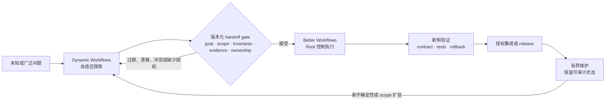
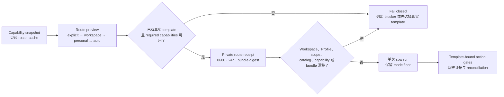
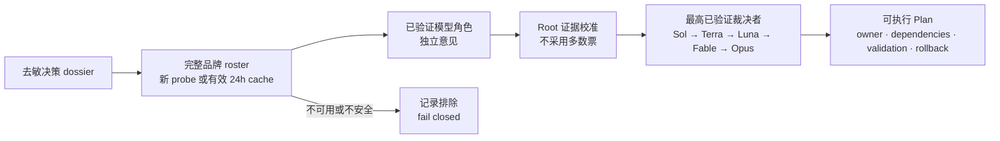
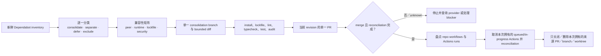

# Better Workflows

[English](../README.md) | [繁體中文](README.zh-TW.md) | [简体中文](README.zh-CN.md) | [日本語](README.ja.md) | [한국어](README.ko.md)

Better Workflows 是为 Codex 设计的原生优先、证据驱动工作流。Root 是唯一可以修改代码、执行 Git/GitHub、deploy、接受风险与宣布完成的 authority；subagents 专注于研究、Review、测试证据与反证。

## 设计原理

Better Workflows 是一个治理型 orchestration layer，而不是无限制的 agent swarm。核心原则是：

- **Root-owned mutation：** Root 是唯一可以修改、集成、执行 Git/GitHub mutation、deploy、接受风险与宣布完成的 authority。
- **Evidence before side effects：** side effect 之前必须具备证据、freshness、授权与 provider reconciliation；unknown outcome 一律 fail closed。
- **Bounded delegation：** native subagents 只负责研究、Review、测试证据与反证；最多三个 direct children，禁止递归 delegation，独立 critics 按顺序执行。
- **Persistent intent：** `/goal` 跨 turn 保存用户目标；template 与 mode 只决定验证深度，不会静默改变目标。
- **Deterministic control plane：** `sbw` 记录 contract、private state、sentinel、evidence、findings、lease、action token 与 reconciliation，但不执行 model 生成的 command。
- **Explicit completion：** 只有 acceptance evidence 仍然新鲜、必要检查通过、rollback 可用，并且没有未解决的高风险或 unknown state，才能完成。
- **Fast path remains explicit：** 小型且可逆的工作可以使用 `direct`，无需承担完整 workflow journal 成本。

这种设计用一部分最高并行吞吐，换取更小、可检查的 mutation surface 与可预测的停止条件。目标是让不安全的进度难以被隐藏，即使因此需要暂停等待证据或用户授权。

## Better Workflows 与 Claude Dynamic Workflows 对比

这里的“Claude Dynamic Workflows”指 Anthropic 的 Claude Code 功能，而不是第三方软件。比较依据是 2026-07-20 查阅的 Anthropic 公开资料：[Introducing dynamic workflows in Claude Code](https://claude.com/blog/introducing-dynamic-workflows-in-claude-code)、[A harness for every task](https://claude.com/blog/a-harness-for-every-task-dynamic-workflows-in-claude-code)，以及 [Claude Code 并行 agent 文档](https://code.claude.com/docs/en/agents)。

> **一句话定位：** Dynamic Workflows 在需要自适应广度时扩大探索空间；Better Workflows 让已接受的路径有界、可验证，并能安全集成。

> **重要边界：** 以下是由人或自动化流程主导的 operating model，不是两个产品之间的原生集成；不宣称共享 runtime state、自动 handoff 或 protocol compatibility。

### 最大特色差异

核心差异是 orchestration posture 与 authority：

- **Dynamic Workflows 优先自适应广度：** 按任务生成 JavaScript harness，平行展开多个 agents，选择 model/worktree，验证结果并按停止条件迭代。
- **Better Workflows 优先治理式收敛：** Root 保留 mutation，限制 delegated research，记录 deterministic state/evidence；freshness、授权、reconciliation 或 completion evidence 不足时 fail closed。

这不是能力互斥：Better Workflows 也能 research/deep review，Dynamic Workflows 也能实现与 release。真正的差异是优先优化的对象：**runtime exploration scale 对 deterministic mutation control**。

### 为什么没有内置这些能力？

这是刻意设置的边界，不是未完成的功能清单。Better Workflows 是围绕 Codex 工作的治理／控制平面，不是让 model 动态生成无界 agent harness 的 runtime。`sbw` 负责记录和验证 state、evidence 与 action gates；不会 spawn agents，也不会执行 model 生成的 commands。

| 能力 | 本 repo 提供什么 | 为什么刻意设界 |
| --- | --- | --- |
| 按任务生成 JavaScript harness | 明确的 template、mode 与 deterministic helper logic。 | 动态 harness 适应更快，但会在 runtime 改变执行计划；本 repo 保持 mutation 前的 control plane 可检查。 |
| 大型或无界 fan-out | 最多三个 direct native children，禁止递归 delegation。 | 限制 token 成本、共享文件冲突与 blast radius。 |
| Adversarial verification | Refutation、research findings，以及最多两个循序 model-pinned critics。 | 保留反证，但数量和顺序可审计，不会随生成的子任务无限扩张。 |
| Loop-until-done | Persistent Goal、implementation queue、checkpoint 与明确 completion gates。 | 可以跨 validated slices 继续，但不能静默扩大 scope 或在没有新证据时无限 spawn。 |
| 自动 worktree swarm | Branch/protected-branch 与 cleanup gates；不为每个生成子任务自动建立 worktree。 | Root 保留 integration/cleanup ownership，避免并行 mutation 的责任不清。 |
| 无人值守长时间运行 | Durable run state 与可 resume 的 Goal，但仍需要明确授权与 reconciliation。 | 可恢复很有用；autonomous daemon 还需要独立的 lease、资源、取消与 side-effect protocol。 |

**所以它不适合吗？** 不是。当 contract 已知且错误 mutation 的下行风险不对称时，Better Workflows 更合适：release、protected branch、API 变更、安全敏感 refactor、Review 与 maintenance。当不确定性与规模主导时，Dynamic Workflows 更适合作为第一棒。两者并用通常更强：先广泛探索，再规范化版本化 handoff，最后由 Better Workflows 独立验证并治理实现。这是 operating pattern，不是 native interoperability。

| 维度 | Better Workflows | Claude Dynamic Workflows |
| --- | --- | --- |
| Orchestration posture | 明确 selector、template、mode 与 deterministic local control plane。 | Runtime 动态生成并组合 task-specific JavaScript harness。 |
| 广度与迭代 | 最多三个 direct children，独立 critics 按顺序执行。 | 大规模 fan-out、adversarial verification、dynamic loop 与长时间运行。 |
| Mutation boundary | Root 掌握修改、集成、Git/GitHub、deploy、风险接受与完成声明；delegated agents 按 contract 只读。 | 生成的 harness 可选择 subagent、model 与 worktree；该任务 script 决定治理形状。 |
| State 与完成 | Persistent Goal、private state、sentinel、evidence、lease、action token、reconciliation、fail-closed。 | 保存 progress 并可 resume，由 harness 协调收敛后返回结果。 |
| 成本与 blast radius | 刻意保守，更容易界定成本、mutation surface 与停止条件。 | 规模潜力高，但官方提醒可能使用明显更多 token。 |
| 适合的起点 | 已知 contract、release、refactor、Review 或下行风险不对称的变更。 | 未知规模探索、大型 migration、全 repo audit 或值得大量并行化的工作。 |

### Explore → Gate → Execute → Maintain

以下是协作 SOP；它是建议的 operating pattern，不是自动产品 handoff。



### 版本化 handoff package

Better Workflows 接受探索结果前，先将其规范化为版本化 handoff package，作为防止 scope drift 的边界：

| Gate | 必要资料 | 何时拒绝并回到探索 |
| --- | --- | --- |
| Goal | 问题、non-goals、选定方案与被否决方案。 | 目标或 scope 仍不明确。 |
| Contract | Invariants、interfaces、acceptance tests、可复现 commands。 | public behavior 或成功条件无人负责。 |
| Evidence | Source index、provenance、时间戳、baseline checks、未解决 findings。 | 证据过期、unknown 或不可复现。 |
| Ownership | Repo、branch、commit/worktree、component owner、mutation boundary。 | baseline drift、ownership conflict 或共享文件冲突。 |
| Risk/action | dependency/security risk、side-effect inventory、rollback、action tokens。 | side effect 缺少授权、reconciliation 或 rollback。 |

之后 Better Workflows 仍会独立验证 package，将其转换为 Goal/contract/evidence state，只执行已接受的 scope。如果 scope 扩大、baseline 改变或 gate 过期，就停止并重新探索，不要静默扩大 mutation surface。

### 协作建议

| 情况 | 建议路径 | 原因 |
| --- | --- | --- |
| 小型、可逆、明确的变更 | Better Workflows `direct` | 不值得支付 dynamic orchestration 成本。 |
| 已知 contract，但有验证或 release 风险 | Better Workflows `verified`、`deep` 或 `critical` | 新鲜证据与 authority gates 比 fan-out 更重要。 |
| 架构未知、假设很多或大型 migration | 先 Dynamic Workflows，再进 handoff gate | 用广度降低不确定性，但不能绕过集成控制。 |
| 设计稳定后的 production 维护 | Better Workflows | 长期保留 contract、证据、rollback 与可审计 ownership。 |

**心智模型：** 广泛探索、明确 gate、收窄执行、可审计维护。

## 安装

```bash
codex plugin marketplace add stephen-taipei/better-workflows
codex plugin add better-workflows@better-workflows
```

安装后请打开新的 Codex task，让 Skill catalog 重新加载。

## 渐进式路由：Snapshot → Preview → Execute

> **核心价值：** 在工作开始前说明“为什么这条路由现在可用”。仅看到已安装
> 的名称，并不能证明 command、support skill、provider 或 host capability
> 当前确实可调用。

```bash
# 只读；不会启动 provider 登录或 semantic model probe。
sbw doctor --capabilities

sbw route preview \
  --goal "整合 Dependabot 更新并清理本次拥有的资源" \
  --scope . \
  --domain maintenance \
  --tag dependabot
```

每项 capability 都会显示 `available`、`unavailable`、`unverified`、
`unsupported` 或 `requires-authority`，并附原因与 fallback。Model 可用性
只会复用未变化且仍在 24 小时内的 semantic roster cache；cache miss 或过期
不会自动 probe。Node-only v1 无法证明 Codex host 的 MCP exposure，因此明确
显示 `unsupported`，由 host 回报。

### 一条 primary route、一份 Profile

Routing Profile 只能选择一个 primary entry 或 template；可设置最低 mode、
required capabilities，以及最多三个**仅提供建议**的 support skills。它不能
安装工具、授予权限、新增 side effects、降低 mode，或覆盖用户明确选择的入口。

| 优先级 | 来源 | 规则 |
| ---: | --- | --- |
| 1 | Host hard constraints | 本地配置不能降低；host 未提供输入时显示 `unverified`。 |
| 2 | 明确 entry/template/mode | 用户的 picker 或 CLI 选择优先。 |
| 3 | Workspace Profile | `<repo>/.codex/better-workflows.json`；匹配时取代 personal route。 |
| 4 | Personal Profile | `$SBW_STATE_ROOT/routing/profile.json`。 |
| 5 | 内置 `auto` | 在证据选出真实 template 前返回 `template: null`。 |

同一 Profile 先比较 priority，同分保持文件顺序。不同 match category 使用
AND；同一 category 内的值使用 OR。Workspace 与 personal rule 不做 deep
merge。参见严格 schema 的
[Profile 示例](../plugins/better-workflows/config/routing-profile.example.json)。

```bash
sbw route profile validate --file my-routing-profile.json
sbw route profile install --file my-routing-profile.json
sbw route profile show
```

### 可审查、单次使用的 route receipt

```bash
sbw route preview \
  --goal "不改变 public contract，重构 monorepo" \
  --scope . \
  --entry monorepo-refactor \
  --record

sbw run --route-receipt <route-receipt-id>
```



Receipt 会绑定 goal/scope、选定路由、catalog、workspace/personal Profiles、
capability fingerprint 与完整 plugin bundle digest；24 小时过期且只能使用
一次。重放、篡改或任何 binding 漂移都会 fail closed。

## 在 Codex 中使用

### Codex CLI

在 Codex CLI 中，以 `@` 开头搜索 `better`，然后从 CLI 菜单选择 Better Workflows skill 或入口。


### Codex App

在 Codex App 中，以 `/` 开头搜索 `better`，然后从 App 菜单选择对应的 command 或 skill 入口。


在任一界面选择入口后直接描述目标即可。菜单会自动插入 `$better-workflows:<name>`；无需手动输入 `/goal`，也不用记住 template、mode 或 model alias。推荐默认入口：

```text
$better-workflows:auto <描述需要完成的目标>
```

所有入口都会在正式工作前自动创建或继续 persistent Goal，包括 `direct`。如果已经存在不相关且未完成的 Goal，流程会要求使用 `/goal edit` 或 `/goal clear`，不会静默覆盖。

### 快速选择

- 不确定选哪个：使用 `auto`。
- 已知道任务类别：选择十一个任务入口之一。
- 只想指定审查强度：使用 `direct`、`verified`、`deep` 或 `critical`。
- 仍在使用旧命令：选择 compatibility alias。

### 自动与任务入口

| 入口 | 推荐场景 | 示例 |
| --- | --- | --- |
| `$better-workflows:auto` | 大多数任务的推荐默认值。根据风险与证据自动选择 template、mode 与 critics。 | `$better-workflows:auto Review 当前 repo、修复已验证问题并创建 PR。` |
| `$better-workflows:review-issues` | 只读 audit、finding 去重与经授权的 GitHub issue 创建；不修改代码。 | `$better-workflows:review-issues Review 最新 dev SHA，创建去重后的 P0/P1/P2 issues。` |
| `$better-workflows:fix-issues-pr` | 重新验证 open issues、由 Root 修复并创建 PR；仅在获授权时 merge 与 cleanup。 | `$better-workflows:fix-issues-pr 修复 dev 的 open issues，创建 PR，等待 fresh checks 后 merge 并 cleanup。` |
| `$better-workflows:pr-to-dev` | 将范围内修改拆成 atomic commits，创建唯一 target 为 `dev` 的 PR，fresh checks 后 merge、同步 remote 并精确清理。 | `$better-workflows:pr-to-dev 分批 commit 当前修改，发 PR 到 dev，checks 通过后 merge、同步 remote dev 并清理本次 worktree。` |
| `$better-workflows:cross-platform` | Backend、iOS、Android、Web 的 schema、optional 字段、enum、sync、version gate 与 headers。 | `$better-workflows:cross-platform 检查 backend、iOS 和 Android 的 contact sync contract，修复问题并创建 PR。` |
| `$better-workflows:ios-static` | 不适合本地 build 时的 Swift/iOS 静态 Review，以及串行 `project.pbxproj` 验证。 | `$better-workflows:ios-static 不做 build，Review iOS 变更、检查新 Swift 文件已加入 pbxproj 并修复静态问题。` |
| `$better-workflows:localization` | 多语言更新，尤其是 41 语言 key 数量、顺序、精确 scope 与区域变体。 | `$better-workflows:localization 将这些 keys 添加到全部 41 个语言，并验证 key 顺序一致。` |
| `$better-workflows:ci-release` | CI failure、runner queue、串行 deploy、release、远端监控与 receipt 验证。 | `$better-workflows:ci-release 诊断失败的 PR checks、修复并监控串行 dev deploy。` |
| `$better-workflows:browser-qa` | 需要最新 UI 证据、截图与可复现 action log 的 Webwright／模拟器 QA。 | `$better-workflows:browser-qa 验证 signup 与 contact sync，并附上 screenshot evidence。` |
| `$better-workflows:research` | CLI 实测的多模型角色、证据驱动架构比较、反证与可执行 Plan；不以多数票决策。 | `$better-workflows:research 比较三种 sync 架构、反证每个方案并产出可实现的 Plan。` |
| `$better-workflows:self-improve` | 根据近期且有界的证据改进 Better Workflows 本身，同步 selector、template、tests、docs、version、immutable cache 与经授权的 remote delivery。 | `$better-workflows:self-improve Review 近期 workflow 结果，只实现重复且已验证的改进，完整验证后发布新 cache version 并 push atomic commit。` |
| `$better-workflows:monorepo-refactor` | 完整盘点 monorepo，直接实现所有合格的 bounded refactor 建议，并保留 behavior invariants、validation 与 rollback evidence。 | `$better-workflows:monorepo-refactor 盘点 monorepo，直接实现所有合格的 boundary cleanup 建议，不改变 public contract。` |

`self-improve-ops` 是薄型 orchestration template：复用现有 research、refactor、routing、publication 与 delivery controls，允许有证据的 no-change，并分别 gate commit、cache publication 与 push。缺失的版本化 cache link 只能解析到已验证的 current bundle，不得重建或修改 stale path。

### CLI 实测的多模型协商

`research-deliberation` 保留完整配置的品牌名单：Codex、Claude、Gemini（经 Agy）、Agy、Grok、Cursor、Kimi、Qwen、Kiro；只有通过安全 semantic CLI probe 的模型／指令组合才能加入本次决策组。缺少 binary、登录失效或必须交互登录时会明确标为 unavailable，绝不静默替代。

完整名单的每个 reasoning-effort profile 最多各自缓存 24 小时；到期、`--refresh`、roster 配置变化，或 CLI 路径／binary digest 变化时重新检查。指定单一 provider 的 probe 不会覆写完整缓存。外部 CLI 必须获得用户授权且输入必须去敏、非机密；本 runtime 的 Gemini 通过 `agy` transport 调用，不使用独立 `gemini` 命令。

每个 participant 都应用相同的 contextual reasoning-effort：有界的 `direct`／`verified` 默认 `medium`，`auto`／`deep`／`critical` 默认 `high`，可依证据明确覆写。Codex 会收到原生设置；Agy 实际选择 `gemini-3.6-flash-medium` 或 `gemini-3.6-flash-high`，且仅在该 model 支持时传入原生 `--effort`；拒绝此标记的 model 会如实标为 high／medium-only variant。其他 CLI 以 prompt-guidance 请求并如实记录，不假称 provider 已验证。



```bash
node plugins/better-workflows/scripts/sbw.mjs deliberation deliberate \
  --prompt-file sanitized-case.md \
  --allow-external-providers --sanitized
```

### Template-only：Dependabot consolidation SOP

Dependabot consolidation 是专用 template，不新增 picker Skill。需要固定
contract 时，可以直接运行：

```bash
node plugins/better-workflows/scripts/sbw.mjs run \
  --template dependabot-consolidation-pr-cleanup \
  --mode critical \
  --goal "盘点 Dependabot PR，合并兼容更新，创建并 merge 一个 consolidation PR，只清理本次产生的来源。" \
  --scope .
```

SOP 按以下顺序执行：



必要证据包括 `dependabot-inventory`、`compatibility-matrix`、
`consolidation-diff`、`lockfile-validation`、
`repository-actions-inventory`、`actions-cancelled`、`merge-result` 与
`cleanup-manifest`。流程会检查 repo workflow 与相关 Actions runs 是否仍
存在，并明确记录 missing、disabled、queued、running、terminal 状态；查询
失败就停止。每个 Dependabot PR 都必须有 disposition；在本次来源 Actions
取消且 consolidation PR 完成 terminal reconciliation 前，不允许清理来源。

### Picker 流程：PR 合并至 `dev`

`pr-to-dev` 专门处理分批 atomic commit、创建唯一 target 为 `dev` 的 PR、
fresh required checks、受保护 merge、同步 remote `dev`，以及最后只清理本次
run 拥有的资源。可从原生 picker 选择 `$better-workflows:pr-to-dev`，或直接
启动相同 template：

```bash
node plugins/better-workflows/scripts/sbw.mjs run \
  --template pr-to-dev \
  --mode critical \
  --goal "将范围内修改拆成 atomic commits，创建 PR 合并至 dev，fresh checks 通过后 merge、同步 remote dev，再清理本次 worktree。" \
  --scope .
```

必要 gate 包括 `commit-plan`、`commit-manifest`、`target-branch-dev`、
`required-checks`、`merge-result`、`remote-sync` 与 `cleanup-manifest`。
禁止 admin bypass、stale checks、未 review commit，以及 remote reconciliation
前的 cleanup。

### 审查强度入口

| 入口 | 推荐场景 | 示例 |
| --- | --- | --- |
| `$better-workflows:direct` | 小型、可逆、明确且重视速度的任务。保留 Goal，但不创建 workflow journal 或 critics。 | `$better-workflows:direct 修正这个一行文档 typo 并检查 diff。` |
| `$better-workflows:verified` | 一般工程任务，需要 1–3 个只读 research／Review／refutation agents 与 freshness evidence。 | `$better-workflows:verified Review 并修复 pagination bug，然后创建 PR。` |
| `$better-workflows:deep` | 架构、安全、广泛 refactor 或高不确定性变更，需要 verified wave 加独立 Codex critics。 | `$better-workflows:deep Review auth redesign、修复已验证问题并创建 migration-safe PR。` |
| `$better-workflows:critical` | Release、migration、production、破坏性 cleanup 或不可逆 side effects，必须 fail closed。 | `$better-workflows:critical 只有 policy、remote SHA 与 reconciliation gates 全部通过才执行 production release。` |

### Compatibility aliases

| 入口 | 推荐场景 | 对应路由 |
| --- | --- | --- |
| `$better-workflows:auto-improve` | 旧 `autoImprove`：Review、验证 findings、修复、创建 PR 并安全收敛。 | Fix issues to PR，默认 `deep` |
| `$better-workflows:auto-issues` | 旧 `autoIssues`：只读 Review 与去重 issue 创建。 | Review to issues，默认 `verified` |
| `$better-workflows:git-check-issues` | 旧 issue repair：重新获取 issue 状态、修复、创建 PR 与精确 cleanup。 | Fix issues to PR，默认 `deep` |
| `$better-workflows` | 未指定菜单入口时的自然语言 router。 | 自动判断 template 与 mode |

## 核心模式

| Mode | 行为 |
| --- | --- |
| `direct` | Root 直接工作，不创建 durable workflow state。 |
| `verified` | Root 加 1–3 个只读研究／Review／反证 agents。 |
| `deep` | `verified` 后串行加入最多两个 Codex critics。 |
| `critical` | 完整 evidence、side-effect gates 与 policy 要求的外部 reviewer。 |

## 开发验证

```bash
npm test --prefix plugins/better-workflows
node plugins/better-workflows/scripts/sbw.mjs eval
node scripts/plugin-cache.mjs check
```

Plugin cache version 是 immutable。任何内容变更都必须使用新的 build
version；`node scripts/plugin-cache.mjs sync` 只会 stage 尚不存在的版本，
验证完整 file manifest 与 digest 后原子发布。同版本内容不同时会拒绝原地
覆盖。通过正常 Codex plugin refresh 启用前，还应从最终 cache path 执行
`sbw eval`。

## License

MIT。请参阅 [LICENSE](../LICENSE) 与 [THIRD_PARTY_NOTICES.md](../THIRD_PARTY_NOTICES.md)。
