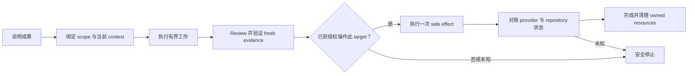

<div align="center">

# Better Workflows

**Goal-first · Evidence-driven · Fail-closed**

让 Codex 工作不再停留在“下 Prompt 然后期待成功”，而是沿着有界路径，从意图走到已验证、已对账的交付。

[](../plugins/better-workflows/package.json)
[](../plugins/better-workflows/package.json)
[](../plugins/better-workflows/package.json)
[](../LICENSE)

[English](../README.md) · [繁體中文](README.zh-TW.md) · **简体中文** · [日本語](README.ja.md) · [한국어](README.ko.md)

</div>

[快速开始](guide/getting-started.md) · [工作流](guide/workflows.md) · [架构](guide/architecture.md) · [安全](guide/security.md) · [CLI](guide/cli-reference.md) · [完整细节](details/zh-CN.md)

<!-- readme-roster -->
**Model roster：** Codex · Claude · Gemini · GPT-OSS · Grok · Cursor · Kimi · Qwen · Kiro。`agy` 传输 Gemini、Claude 与 GPT-OSS 品牌模型；它是 transport metadata，不是另一个模型品牌。

<!-- readme-section:promise-audience -->
## 为什么需要 Better Workflows

Codex 可以分析 repository、修改代码、运行检查并操作 provider。能力越强，越需要
清楚区分“用户想要什么”与“当前证据和权限实际允许什么”。

Better Workflows 适合希望小任务仍然快速，但在 blast radius 增加时，不放弃明确
scope、review、freshness 与受保护交付的开发者和团队。

它提供 13 个按成果设计的 workflow templates、受治理的 workspace recipes，以及
只读 Graph View。你选择成果，route 只加入当前风险所需的验证。

<!-- readme-section:problem-outcome -->
## 从 Prompt 走向受治理成果

<!-- readme-claim:prompt-not-authority -->
Prompt 可以描述意图，但永远不会授予权限。

缺少 control plane 时，合理指令仍可能使用过期状态、扩大 scope，或丢失 provider
结果。Better Workflows 把这些差距转成明确 gates。

| 缺少治理 | 使用 Better Workflows |
| --- | --- |
| 意图与权限混在一起 | Goal、scope 与 authority 分开记录 |
| 通过的 check 可能属于旧 revision | Evidence 绑定当前 source 与 target |
| Retry 可能重复 external action | Attempts 有界，未知结果必须先对账 |
| “完成”只代表 command 已返回 | Completion 需要 terminal provider 与 repository evidence |

<!-- readme-section:proof-boundaries -->
## 你可以信任什么

<!-- readme-claim:root-only-mutation -->
**Root 掌握修改权。** 只有 Root 可以修改、集成、部署、接受风险或宣告完成。

<!-- readme-claim:evidence-before-action -->
**Action 前先有证据。** 每个 side effect 都必须具备 fresh evidence、provenance，以及绑定预定目标的 action。

<!-- readme-claim:unknown-stop -->
**Fail closed。** 只要出现 drift、过期证据或未知 provider 状态，工作流就会停止。

**Review-kernel pilot。** `self-improve-ops` 会盘点 exact changed-file work units、分离独立 attested finder 与 verifier、绑定 exact source anchors，并生成 deterministic coverage/synthesis evidence。该 pilot 为 shadow-only，不能授权 side effects。


<!-- readme-visual-fallback:authority-boundary -->
**文字等价说明：** Prompt 记录成果；Context 绑定当前事实；Harness 限制谁能在何处行动；
Loop 限制 retry 与 reconciliation；Graph 只呈现已批准状态，不是 scheduler、policy input
或 authority source。缺少证据或权限时就停止。

<!-- readme-section:first-success -->
## 完成第一次成功运行

安装 marketplace 与 plugin：

```bash
codex plugin marketplace add stephen-taipei/better-workflows
codex plugin add better-workflows@better-workflows
```

打开新的 Codex task，从原生 picker 选择 Better Workflows：

```text
Codex CLI: @better
Codex App: /better
```

然后描述你要的成果：

```text
$better-workflows:auto <describe the outcome you need>
```

成功表示 automatic route 选出一个具体 template 与最低验证 mode；它不能补授权、
安装工具或扩大原有 scope。

[安装、验证并运行第一个工作流 →](guide/getting-started.md)

<!-- readme-section:choose-next-path -->
## 选择下一条路径

| 你要的成果 | 从这里开始 |
| --- | --- |
| 让 Codex 选择安全且合适的 route | `$better-workflows:auto` |
| Review repository 并创建去重 issues | `$better-workflows:review-issues` |
| 修复、开 PR、merge 并清理 owned resources | `$better-workflows:fix-issues-pr` |
| 将 atomic commits 交付到受保护 `dev` | `$better-workflows:pr-to-dev` |
| 用独立角色比较架构 | `$better-workflows:research` |
| 管理 release 或不可逆操作 | `$better-workflows:critical` |
| 保存 deterministic SOP mechanics | `$better-workflows:workspace-recipe` |
| 依据 held-out evidence 改善 Better Workflows | `$better-workflows:self-improve` |

完整 selectors、modes 与 templates 请见[工作流](guide/workflows.md)。安全 reviewer 可先看
[安全](guide/security.md)，operator 可直接查询 [CLI reference](guide/cli-reference.md)。

<!-- readme-section:lifecycle -->
## 交付如何走到完成


```mermaid
flowchart LR
  A["说明成果"] --> B["绑定 scope 与当前 context"]
  B --> C["执行有界工作"]
  C --> D["Review 并验证 fresh evidence"]
  D --> E{"已获授权操作此 target？"}
  E -- "是" --> F["执行一次 side effect"]
  F --> G["对账 provider 与 repository 状态"]
  G --> H["完成并清理 owned resources"]
  E -- "否或未知" --> I["安全停止"]
  G -- "未知" --> I
```

<!-- readme-visual-fallback:lifecycle -->
**文字等价说明：** 先说明成果，再绑定精确 scope 与当前 context，执行有界工作并
review fresh evidence。只有获得 target-bound 授权后才能执行一次 side effect；
completion 与 owned cleanup 前必须对账 provider 和 repository。任何缺失、过期或
未知状态都会停止工作流。

<!-- readme-section:trust-limits -->
## 信任边界与限制

Better Workflows 记录并检查 control plane；它不是无限制 agent runtime，也不会把
文字、图表、旧 check 或模型投票当成权限。

<!-- readme-claim:private-history -->
敏感或私人历史绝不会被采集；只能以经过遮蔽的 `REJECTED_WITH_EVIDENCE` disposition 拒绝。

- Side effects 需要明确用户授权与 single-use action gates。
- Self-improve evaluator replay 可使用一次安装的 root-signed standing consent，但仅限
  sanitized、read-only 的 `gpt-5.6-terra` batch，且永不授权 delivery。
- 任务可明确选择一次 `bounded-autopilot-v1`：它可自动完成受限本地工作、推送
  `codex/*` 并创建一个指向 `dev` 的 PR；protected merge、deploy、直接更新
  `dev/main` 与破坏性 cleanup 仍需独立授权。
- Independent critics 保持只读，不能接受风险或宣告成功。
- Workspace recipes 只运行 deterministic Node.js mechanics，不能选模型、使用网络、
  运行 arbitrary shell 或修改 source。
- Model deliberation 只接受最新 semantic roster probe；不可用 provider 绝不会被静默替代。
- Graph View 是衍生 presentation，永远不是 policy input、authorization、scheduler
  或 agent runtime。

[了解架构与取舍 →](guide/architecture.md)

<!-- readme-section:learn-help-contribute -->
## 深入了解、获取帮助与参与贡献

| 需求 | 文档 |
| --- | --- |
| 首次安装与 route | [快速开始](guide/getting-started.md) |
| 选择 workflow 或 mode | [工作流](guide/workflows.md) |
| Control-plane 设计与比较 | [架构](guide/architecture.md) |
| Privacy、authority、actions 与 attestations | [安全](guide/security.md) |
| Commands 与 exit behavior | [CLI reference](guide/cli-reference.md) |
| 完整简体中文规范 | [完整细节](details/zh-CN.md) |
| README 叙事与质量规则 | [README quality blueprint](guide/readme-quality.md) |

[Contributing](../CONTRIBUTING.md) · [Code of conduct](../CODE_OF_CONDUCT.md) ·
[Governance](../GOVERNANCE.md) · [Support](../SUPPORT.md) · [Security policy](../SECURITY.md)

<details>
<summary>开发 Better Workflows</summary>

```bash
npm test --prefix plugins/better-workflows
node plugins/better-workflows/scripts/sbw.mjs eval
node scripts/plugin-cache.mjs check
```

Node.js 24+ · zero runtime dependencies · immutable plugin cache versions。

</details>

由 [Stephen Chuang](https://github.com/stephen-taipei) 与 contributors 维护。
采用 MIT license；请参阅 [LICENSE](../LICENSE) 与
[THIRD_PARTY_NOTICES.md](../THIRD_PARTY_NOTICES.md)。
