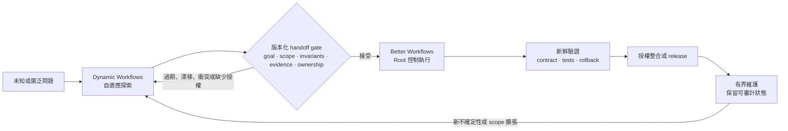
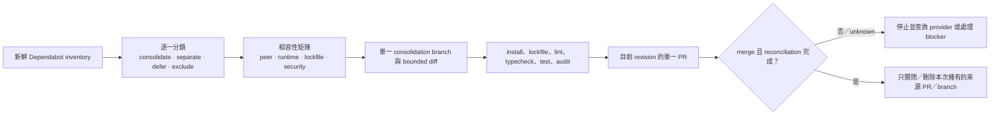

# Better Workflows

[English](../README.md) | [繁體中文](README.zh-TW.md) | [简体中文](README.zh-CN.md) | [日本語](README.ja.md) | [한국어](README.ko.md)

Better Workflows 是為 Codex 設計的原生優先、證據驅動工作流。Root 是唯一能修改程式碼、執行 Git/GitHub、deploy、接受風險與宣告完成的 authority；subagents 專注於研究、Review、測試證據與反證。

## 設計原理

Better Workflows 是治理型的 orchestration layer，不是無限制的 agent swarm。核心原則是：

- **Root-owned mutation：** Root 是唯一能修改、整合、執行 Git/GitHub mutation、deploy、接受風險與宣告完成的 authority。
- **Evidence before side effects：** side effect 前必須有證據、freshness、授權與 provider reconciliation；unknown outcome 一律 fail closed。
- **Bounded delegation：** native subagents 只負責研究、Review、測試證據與反證；最多三個 direct children，禁止遞迴 delegation，獨立 critics 依序執行。
- **Persistent intent：** `/goal` 跨 turn 保存使用者目標；template 與 mode 只決定驗證深度，不會偷偷改變目標。
- **Deterministic control plane：** `dw` 記錄 contract、private state、sentinel、evidence、findings、lease、action token 與 reconciliation，但不執行 model 生成的 command。
- **Explicit completion：** 只有 acceptance evidence 仍然新鮮、必要檢查通過、rollback 可用，且沒有未解決的高風險或 unknown state，才能完成。
- **Fast path remains explicit：** 小型且可逆的工作可使用 `direct`，不必承擔完整 workflow journal 成本。

這個取捨是用部分最高平行吞吐量，換取較小、可檢查的 mutation surface 與可預期的停止條件。目的是讓不安全的進度難以被隱藏，即使因此需要暫停等待證據或使用者授權。

## Better Workflows 與 Claude Dynamic Workflows 比較

這裡的「Claude Dynamic Workflows」指 Anthropic 的 Claude Code 功能，不是第三方套件。比較依據是 2026-07-20 查閱的 Anthropic 公開資料：[Introducing dynamic workflows in Claude Code](https://claude.com/blog/introducing-dynamic-workflows-in-claude-code)、[A harness for every task](https://claude.com/blog/a-harness-for-every-task-dynamic-workflows-in-claude-code)，以及 [Claude Code 平行 agent 文件](https://code.claude.com/docs/en/agents)。

> **一句話定位：** Dynamic Workflows 在需要自適應廣度時擴大探索空間；Better Workflows 讓已接受的路徑有界、可驗證，並能安全整合。

> **重要邊界：** 以下是人或自動化流程主導的 operating model，不是兩個產品之間的原生整合；不宣稱共享 runtime state、自動 handoff 或 protocol compatibility。

### 最大特色差異

核心差異是 orchestration posture 與 authority：

- **Dynamic Workflows 優先自適應廣度：** 依任務生成 JavaScript harness，平行展開多個 agents，選擇 model/worktree，驗證結果並依停止條件迭代。
- **Better Workflows 優先治理式收斂：** Root 保留 mutation，限制 delegated research，記錄 deterministic state/evidence；freshness、授權、reconciliation 或 completion evidence 不足時 fail closed。

這不是能力互斥：Better Workflows 也能 research/deep review，Dynamic Workflows 也能實作與 release。真正的差異是優先最佳化的對象：**runtime exploration scale 對 deterministic mutation control**。

### 為什麼沒有內建這些功能？

這是刻意設定的邊界，不是未完成的功能清單。Better Workflows 是圍繞 Codex 工作的治理／控制平面，不是讓 model 動態生成無界 agent harness 的 runtime。`dw` 負責記錄與驗證 state、evidence 與 action gates；不會 spawn agents，也不會執行 model 生成的 commands。

| 能力 | 本 repo 提供什麼 | 為什麼刻意設界 |
| --- | --- | --- |
| 依任務生成 JavaScript harness | 明確 template、mode 與 deterministic helper logic。 | 動態 harness 適應更快，但會在 runtime 改變執行計畫；本 repo 保持 mutation 前的 control plane 可檢查。 |
| 大型或無界 fan-out | 最多三個 direct native children，禁止遞迴 delegation。 | 限制 token 成本、共用檔案衝突與 blast radius。 |
| Adversarial verification | Refutation、research findings，以及最多兩個循序 model-pinned critics。 | 保留反證，但數量與順序可審計，不會隨生成的子任務無限擴張。 |
| Loop-until-done | Persistent Goal、implementation queue、checkpoint 與明確 completion gates。 | 可跨 validated slices 繼續，但不能靜默擴張 scope 或在沒有新證據時無限 spawn。 |
| 自動 worktree swarm | Branch/protected-branch 與 cleanup gates；不為每個生成子任務自動建立 worktree。 | Root 保留 integration/cleanup ownership，避免平行 mutation 的責任不清。 |
| 無人值守長時間執行 | Durable run state 與可 resume 的 Goal，但仍需明確授權與 reconciliation。 | 可恢復很有用；autonomous daemon 還需要獨立的 lease、資源、取消與 side-effect protocol。 |

**所以它不適合嗎？** 不是。當 contract 已知，且錯誤 mutation 的下行風險不對稱時，Better Workflows 更合適：release、protected branch、API 變更、安全敏感 refactor、Review 與 maintenance。當不確定性與規模主導時，Dynamic Workflows 更適合作為第一棒。兩者並用通常更強：先廣泛探索，再正規化版本化 handoff，最後由 Better Workflows 獨立驗證並治理實作。這是 operating pattern，不是 native interoperability。

| 面向 | Better Workflows | Claude Dynamic Workflows |
| --- | --- | --- |
| Orchestration posture | 明確 selector、template、mode 與 deterministic local control plane。 | Runtime 動態生成並組合 task-specific JavaScript harness。 |
| 廣度與迭代 | 最多三個 direct children，獨立 critics 依序執行。 | 大量 fan-out、adversarial verification、dynamic loop 與長時間執行。 |
| Mutation boundary | Root 掌握修改、整合、Git/GitHub、deploy、風險接受與完成宣告；delegated agents 依 contract 唯讀。 | 生成的 harness 可選擇 subagent、model 與 worktree；該任務 script 決定治理形狀。 |
| State 與完成 | Persistent Goal、private state、sentinel、evidence、lease、action token、reconciliation、fail-closed。 | 保存 progress 並可 resume，由 harness 協調收斂後回傳結果。 |
| 成本與 blast radius | 刻意保守，較容易界定成本、mutation surface 與停止條件。 | 規模潛力高，但官方提醒可能使用明顯更多 token。 |
| 適合的起點 | 已知 contract、release、refactor、Review 或下行風險不對稱的變更。 | 未知規模探索、大型 migration、全 repo audit 或值得大量平行化的工作。 |

### Explore → Gate → Execute → Maintain

以下是協作 SOP；它是建議的 operating pattern，不是自動產品 handoff。



### 版本化 handoff package

Better Workflows 接受探索結果前，先正規化成版本化 handoff package，作為防止 scope drift 的邊界：

| Gate | 必要資料 | 何時拒絕並回到探索 |
| --- | --- | --- |
| Goal | 問題、non-goals、選定方案與被否決方案。 | 目標或 scope 仍不明確。 |
| Contract | Invariants、interfaces、acceptance tests、可重現 commands。 | public behavior 或成功條件無人負責。 |
| Evidence | Source index、provenance、時間戳、baseline checks、未解 findings。 | 證據過期、unknown 或不可重現。 |
| Ownership | Repo、branch、commit/worktree、component owner、mutation boundary。 | baseline drift、ownership conflict 或共用檔案衝突。 |
| Risk/action | dependency/security risk、side-effect inventory、rollback、action tokens。 | side effect 缺少授權、reconciliation 或 rollback。 |

之後 Better Workflows 仍會獨立驗證 package，將它轉換為 Goal/contract/evidence state，只執行已接受的 scope。若 scope 擴大、baseline 改變或 gate 過期，就停止並重新探索，不要靜默擴張 mutation surface。

### 協作建議

| 情境 | 建議路徑 | 原因 |
| --- | --- | --- |
| 小型、可逆、明確的變更 | Better Workflows `direct` | 不值得支付 dynamic orchestration 成本。 |
| 已知 contract，但有驗證或 release 風險 | Better Workflows `verified`、`deep` 或 `critical` | 新鮮證據與 authority gates 比 fan-out 更重要。 |
| 架構未知、假設很多或大型 migration | 先 Dynamic Workflows，再進 handoff gate | 用廣度降低不確定性，但不能繞過整合控制。 |
| 設計已穩定後的 production 維護 | Better Workflows | 長期保留 contract、證據、rollback 與可審計 ownership。 |

**心智模型：** 廣泛探索、明確 gate、窄化執行、可審計維護。

## 安裝

```bash
codex plugin marketplace add stephen-taipei/better-workflows
codex plugin add better-workflows@better-workflows
```

安裝後請開新的 Codex task，讓 Skill catalog 重新載入。

## 在 Codex 使用

### Codex CLI

在 Codex CLI 中，請以 `@` 開頭搜尋 `better`，再從 CLI 選單選擇 Better Workflows skill 或入口。


### Codex App

在 Codex App 中，請以 `/` 開頭搜尋 `better`，再從 App 選單選擇對應的 command 或 skill 入口。


在任一介面選擇入口後直接描述成果即可。選單會自動插入 `$better-workflows:<name>`；不需要手動輸入 `/goal`，也不用記住 template、mode 或 model alias。最推薦的預設入口是：

```text
$better-workflows:auto <描述你要完成的成果>
```

例如：

```text
$better-workflows:cross-platform 檢查 backend、iOS 和 Android 的 contact sync contract，修復問題並建立 PR。
```

所有入口都會在正式工作前自動建立或延續 persistent Goal，包含 `direct`。如果已有不相關且尚未完成的 Goal，流程會要求你使用 `/goal edit` 或 `/goal clear`，不會偷偷覆蓋。

### 快速選擇

- 不確定選哪個：使用 `auto`。
- 已知道任務類型：從九個任務入口選擇。
- 只想指定審查強度：使用 `direct`、`verified`、`deep` 或 `critical`。
- 習慣舊指令：使用 compatibility alias。

### 自動與任務入口

| 入口 | 建議情境 | 範例 |
| --- | --- | --- |
| `$better-workflows:auto` | 大多數任務的推薦預設。依風險與證據自動選 template、mode 與 critics。 | `$better-workflows:auto Review 目前 repo、修復已驗證問題並建立 PR。` |
| `$better-workflows:review-issues` | 唯讀 audit、finding 去重，以及經授權的 GitHub issue 建立；不修改 code。 | `$better-workflows:review-issues Review 最新 dev SHA，建立去重後的 P0/P1/P2 issues。` |
| `$better-workflows:fix-issues-pr` | 重驗 open issues、由 Root 修復、建立 PR；只有獲授權時才 merge 與 cleanup。 | `$better-workflows:fix-issues-pr 修復 dev 的 open issues，建立 PR，等待 fresh checks 後 merge 並 cleanup。` |
| `$better-workflows:cross-platform` | Backend、iOS、Android、Web 的 schema、optional 欄位、enum、sync、version gate 與 headers。 | `$better-workflows:cross-platform 檢查 backend、iOS 和 Android 的 contact sync contract，修復問題並建立 PR。` |
| `$better-workflows:ios-static` | 不適合本機 build 時的 Swift/iOS 靜態 Review，以及序列化 `project.pbxproj` 驗證。 | `$better-workflows:ios-static 不做 build，Review iOS 變更、檢查新 Swift 檔已加入 pbxproj 並修復靜態問題。` |
| `$better-workflows:localization` | 多語系更新，特別是 41 語系 key 數量、順序、精準 scope 與區域變體。 | `$better-workflows:localization 將這些 keys 加到全部 41 語系，並驗證 key 順序一致。` |
| `$better-workflows:ci-release` | CI failure、runner queue、序列化 deploy、release、遠端監控與 receipt 驗證。 | `$better-workflows:ci-release 診斷失敗的 PR checks、修復並監控序列化 dev deploy。` |
| `$better-workflows:browser-qa` | 需要最新 UI 證據、截圖與可重現 action log 的 Webwright／模擬器 QA。 | `$better-workflows:browser-qa 驗證 signup 與 contact sync，並附上 screenshot evidence。` |
| `$better-workflows:research` | 證據驅動研究、架構比較、獨立觀點與反證；不以多數決決策。 | `$better-workflows:research 比較三種 sync 架構、反證每個方案並提出建議。` |
| `$better-workflows:monorepo-refactor` | 完整盤點 monorepo，直接實作所有合格的 bounded refactor 建議，並保留 behavior invariants、validation 與 rollback evidence。 | `$better-workflows:monorepo-refactor 盤點 monorepo，直接實作所有合格的 boundary cleanup 建議，不改變 public contract。` |

### Template-only：Dependabot consolidation SOP

Dependabot consolidation 是專用 template，不新增 picker Skill。需要固定
contract 時，可直接執行：

```bash
node plugins/better-workflows/scripts/dw.mjs run \
  --template dependabot-consolidation-pr-cleanup \
  --mode critical \
  --goal "盤點 Dependabot PR，合併相容更新，建立並 merge 一個 consolidation PR，只清理本次產生的來源。" \
  --scope .
```

SOP 會依序完成：



必要證據包含 `dependabot-inventory`、`compatibility-matrix`、
`consolidation-diff`、`lockfile-validation`、`merge-result` 與
`cleanup-manifest`。每個 Dependabot PR 都必須有 disposition；在
consolidation PR 沒有 terminal reconciliation 前，不允許清理來源。

### 審查強度入口

這四個入口會讓 Codex 自動判斷任務 template，但固定最低驗證強度。

| 入口 | 建議情境 | 範例 |
| --- | --- | --- |
| `$better-workflows:direct` | 小型、可逆、明確且重視速度的任務。保留 Goal，但不建立 workflow journal 或 critics。 | `$better-workflows:direct 修正這個一行文件 typo 並檢查 diff。` |
| `$better-workflows:verified` | 一般工程任務，需要 1–3 個唯讀 research／Review／refutation agents 與 freshness evidence。 | `$better-workflows:verified Review 並修復 pagination bug，然後建立 PR。` |
| `$better-workflows:deep` | 架構、安全、廣泛 refactor 或高不確定性變更，需要 verified wave 加獨立 Codex critics。 | `$better-workflows:deep Review auth redesign、修復已驗證問題並建立 migration-safe PR。` |
| `$better-workflows:critical` | Release、migration、production、破壞性 cleanup 或不可逆 side effects，必須 fail closed。 | `$better-workflows:critical 只有 policy、remote SHA 與 reconciliation gates 全部通過才執行 production release。` |

### Compatibility aliases

這些入口保留舊使用習慣，但底層都改走同一套 Goal-first、Root-owned 工作流，不會復活已淘汰的平行寫入流程。

| 入口 | 建議情境 | 對應路由 |
| --- | --- | --- |
| `$better-workflows:auto-improve` | 舊 `autoImprove`：Review、驗證 findings、修復、建立 PR 並安全收斂。 | Fix issues to PR，預設 `deep` |
| `$better-workflows:auto-issues` | 舊 `autoIssues`：唯讀 Review 與去重 issue 建立。 | Review to issues，預設 `verified` |
| `$better-workflows:ai-meeting-tw` | 舊 AI meeting：多觀點研究與 model critics，不使用 Claude 或票數決策。 | Research deliberation，預設 `deep` |
| `$better-workflows:git-check-issues` | 舊 issue repair：重新取得 issue 狀態、修復、建立 PR 與精準 cleanup。 | Fix issues to PR，預設 `deep` |
| `$better-workflows` | 沒有指定選單入口時的自然語言 router。 | 自動判斷 template 與 mode |

## 核心模式

| Mode | 行為 |
| --- | --- |
| `direct` | Root 直接工作，不建立 durable workflow state。 |
| `verified` | Root 加 1–3 個唯讀研究／Review／反證 agents。 |
| `deep` | `verified` 後序列加入最多兩個 Codex critics。 |
| `critical` | 完整 evidence、side-effect gates，以及 policy 要求的外部 reviewer。 |

## 安全模型

- Root 是唯一修改、Git/GitHub、deploy、接受風險與宣告完成的 authority。
- Side effects 在 freshness、授權或 reconciliation 不完整時 fail closed。
- Agy 只允許經授權、去敏且非機密的資料。
- Unknown provider outcome 必須先 query reconciliation，不會盲目重試。

## 開發驗證

```bash
npm test --prefix plugins/better-workflows
node plugins/better-workflows/scripts/dw.mjs eval
```

Runtime 只使用 Node.js standard library。

## License

MIT。請參閱 [LICENSE](../LICENSE) 與 [THIRD_PARTY_NOTICES.md](../THIRD_PARTY_NOTICES.md)。
