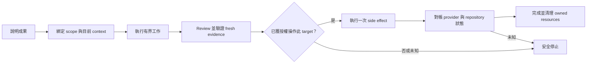

<div align="center">

# Better Workflows

**Goal-first · Evidence-driven · Fail-closed**

讓 Codex 工作不再停在「下 Prompt 然後期待成功」，而是沿著有界路徑，從意圖走到已驗證、已對帳的交付。

[](../plugins/better-workflows/package.json)
[](../plugins/better-workflows/package.json)
[](../plugins/better-workflows/package.json)
[](../LICENSE)

[English](../README.md) · **繁體中文** · [简体中文](README.zh-CN.md) · [日本語](README.ja.md) · [한국어](README.ko.md)

</div>

[快速開始](guide/getting-started.md) · [工作流](guide/workflows.md) · [架構](guide/architecture.md) · [安全](guide/security.md) · [CLI](guide/cli-reference.md) · [完整細節](details/zh-TW.md)

<!-- readme-roster -->
**Model roster：** Codex · Claude · Gemini · GPT-OSS · Grok · Cursor · Kimi · Qwen · Kiro。`agy` 傳輸 Gemini、Claude 與 GPT-OSS 品牌模型；它是 transport metadata，不是另一個模型品牌。

<!-- readme-section:promise-audience -->
## 為什麼需要 Better Workflows

Codex 可以分析 repository、修改程式、執行檢查並操作 provider。能力越強，
越需要清楚區分「使用者想要什麼」與「目前證據和權限實際允許什麼」。

Better Workflows 適合希望小任務仍然快速，但在 blast radius 增加時，
不放棄明確 scope、review、freshness 與受保護交付的開發者和團隊。

它提供 13 個依成果設計的 workflow templates、受治理的 workspace recipes，
以及唯讀 Graph View。你選擇成果，route 只加入當前風險所需的驗證。

<!-- readme-section:problem-outcome -->
## 從 Prompt 走向受治理成果

<!-- readme-claim:prompt-not-authority -->
Prompt 可以描述意圖，但永遠不會授予權限。

缺少 control plane 時，合理指令仍可能使用過期狀態、擴大 scope，或遺失
provider 結果。Better Workflows 把這些落差轉成明確 gates。

| 缺少治理 | 使用 Better Workflows |
| --- | --- |
| 意圖與權限混在一起 | Goal、scope 與 authority 分開記錄 |
| 通過的 check 可能屬於舊 revision | Evidence 綁定目前 source 與 target |
| Retry 可能重複 external action | Attempts 有界，未知結果必須先對帳 |
| 「完成」只代表 command 已返回 | Completion 需要 terminal provider 與 repository evidence |

<!-- readme-section:proof-boundaries -->
## 你可以信任什麼

<!-- readme-claim:root-only-mutation -->
**Root 掌握修改權。** 只有 Root 可以修改、整合、部署、接受風險或宣告完成。

<!-- readme-claim:evidence-before-action -->
**Action 前先有證據。** 每個 side effect 都必須具備 fresh evidence、provenance，以及綁定預定目標的 action。

<!-- readme-claim:unknown-stop -->
**Fail closed。** 只要出現 drift、過期證據或未知 provider 狀態，工作流就會停止。

**Review-kernel pilot。** `self-improve-ops` 會盤點 exact changed-file work units、分離獨立 attested finder 與 verifier、綁定 exact source anchors，並產生 deterministic coverage/synthesis evidence。此 pilot 為 shadow-only，不能授權 side effects。


<!-- readme-visual-fallback:authority-boundary -->
**文字等價說明：** Prompt 記錄成果；Context 綁定目前事實；Harness 限制誰能在何處行動；
Loop 限制 retry 與 reconciliation；Graph 只呈現已核准狀態，不是 scheduler、
policy input 或 authority source。缺少證據或權限時就停止。

<!-- readme-section:first-success -->
## 完成第一次成功執行

安裝 marketplace 與 plugin：

```bash
codex plugin marketplace add stephen-taipei/better-workflows
codex plugin add better-workflows@better-workflows
```

開啟新的 Codex task，從原生 picker 選擇 Better Workflows：

```text
Codex CLI: @better
Codex App: /better
```

接著描述你要的成果：

```text
$better-workflows:auto <describe the outcome you need>
```

成功代表 automatic route 選出一個具體 template 與最低驗證 mode；它不能補授權、
安裝工具或擴大原本 scope。

[安裝、驗證並執行第一個工作流 →](guide/getting-started.md)

<!-- readme-section:choose-next-path -->
## 選擇下一條路徑

| 你要的成果 | 從這裡開始 |
| --- | --- |
| 讓 Codex 選出安全且合適的 route | `$better-workflows:auto` |
| Review repository 並建立去重 issues | `$better-workflows:review-issues` |
| 修正、開 PR、merge 並清理 owned resources | `$better-workflows:fix-issues-pr` |
| 將 atomic commits 交付至受保護 `dev` | `$better-workflows:pr-to-dev` |
| 以獨立角色比較架構 | `$better-workflows:research` |
| 管理 release 或不可逆操作 | `$better-workflows:critical` |
| 保存 deterministic SOP mechanics | `$better-workflows:workspace-recipe` |
| 依 held-out evidence 改善 Better Workflows | `$better-workflows:self-improve` |

完整 selectors、modes 與 templates 請見[工作流](guide/workflows.md)。安全 reviewer
可先看[安全](guide/security.md)，operator 可直接查 [CLI reference](guide/cli-reference.md)。

<!-- readme-section:lifecycle -->
## 交付如何走到完成


```mermaid
flowchart LR
  A["說明成果"] --> B["綁定 scope 與目前 context"]
  B --> C["執行有界工作"]
  C --> D["Review 並驗證 fresh evidence"]
  D --> E{"已獲授權操作此 target？"}
  E -- "是" --> F["執行一次 side effect"]
  F --> G["對帳 provider 與 repository 狀態"]
  G --> H["完成並清理 owned resources"]
  E -- "否或未知" --> I["安全停止"]
  G -- "未知" --> I
```

<!-- readme-visual-fallback:lifecycle -->
**文字等價說明：** 先說明成果，再綁定精確 scope 與目前 context，執行有界工作並
review fresh evidence。只有獲得 target-bound 授權後才能執行一次 side effect；
completion 與 owned cleanup 前必須對帳 provider 和 repository。任何缺失、過期或
未知狀態都會停止工作流。

<!-- readme-section:trust-limits -->
## 信任邊界與限制

Better Workflows 記錄並檢查 control plane；它不是無限制 agent runtime，也不會把
文字、圖表、舊 check 或模型投票當成權限。

<!-- readme-claim:private-history -->
敏感或私人歷史絕不會被擷取；只能以經遮蔽的 `REJECTED_WITH_EVIDENCE` disposition 拒絕。

- Side effects 需要明確使用者授權與 single-use action gates。
- Self-improve evaluator replay 可使用一次安裝的 root-signed standing consent，但僅限
  sanitized、read-only 的 `gpt-5.6-terra` batch，且永不授權 delivery。
- 任務可明確選用一次 `bounded-autopilot-v1`：它可自動完成受限本地工作、推送
  `codex/*` 並建立一個指向 `dev` 的 PR；protected merge、deploy、直接更新
  `dev/main` 與破壞性 cleanup 仍需獨立授權。
- Independent critics 保持唯讀，不能接受風險或宣告成功。
- Workspace recipes 只執行 deterministic Node.js mechanics，不能選模型、使用網路、
  執行 arbitrary shell 或修改 source。
- Model deliberation 只接受最新 semantic roster probe；不可用 provider 絕不會被默默替代。
- Graph View 是衍生 presentation，永遠不是 policy input、authorization、scheduler
  或 agent runtime。

[了解架構與取捨 →](guide/architecture.md)

<!-- readme-section:learn-help-contribute -->
## 深入了解、取得協助與參與貢獻

| 需求 | 文件 |
| --- | --- |
| 首次安裝與 route | [快速開始](guide/getting-started.md) |
| 選擇 workflow 或 mode | [工作流](guide/workflows.md) |
| Control-plane 設計與比較 | [架構](guide/architecture.md) |
| Privacy、authority、actions 與 attestations | [安全](guide/security.md) |
| Commands 與 exit behavior | [CLI reference](guide/cli-reference.md) |
| 完整繁體中文規格 | [完整細節](details/zh-TW.md) |
| README 敘事與品質規則 | [README quality blueprint](guide/readme-quality.md) |

[Contributing](../CONTRIBUTING.md) · [Code of conduct](../CODE_OF_CONDUCT.md) ·
[Governance](../GOVERNANCE.md) · [Support](../SUPPORT.md) · [Security policy](../SECURITY.md)

<details>
<summary>開發 Better Workflows</summary>

```bash
npm test --prefix plugins/better-workflows
node plugins/better-workflows/scripts/sbw.mjs eval
node scripts/plugin-cache.mjs check
```

Node.js 24+ · zero runtime dependencies · immutable plugin cache versions。

</details>

由 [Stephen Chuang](https://github.com/stephen-taipei) 與 contributors 維護。
採用 MIT license；請見 [LICENSE](../LICENSE) 與
[THIRD_PARTY_NOTICES.md](../THIRD_PARTY_NOTICES.md)。
