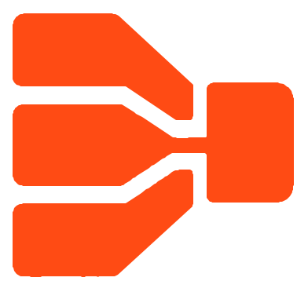
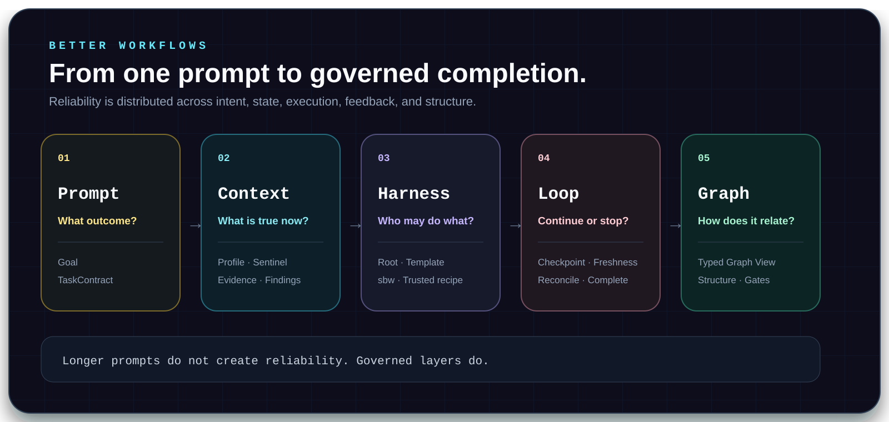
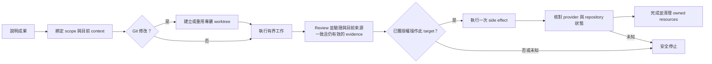

<div align="center">



# Better Workflows

**Goal-first · Evidence-driven · Fail-closed · Risk-adaptive**

讓多品牌 AI agent 依風險選擇驗證強度，在明確授權與工作範圍內執行，並以可重新檢查的證據回報結果。

[](../plugins/better-workflows/package.json)
[](../plugins/better-workflows/package.json)
[](../plugins/better-workflows/package.json)
[](../LICENSE)

[English](../README.md) · **繁體中文（台灣）**

</div>

[快速開始](guide/getting-started.md) · [工作流程](guide/workflows.md) · [收斂與授權（English）](guide/convergence-and-authorization.md) · [架構](guide/architecture.md) · [安全](guide/security.md) · [CLI](guide/cli-reference.md) · [完整細節](details/zh-TW.md) · [透過 USDT (TRC20) 單次贊助](https://betterworkflows.dev/#sponsor)

**V5 狀態與授權：** V5.0 GA（`5.0.0`）尚未發布。[V5.0 RC1](https://github.com/stephen-taipei/better-workflows/releases/tag/V5.0.rc1)（`5.0.0-rc.1`，tag `V5.0.rc1`）已於台灣時間 2026 年 10 月 3 日公開上架，屬受控預發行版本。GA 仍需至少 30 個自然 canary 日、20 次連續符合資格的啟動，以及三個不同儲存庫。第一方核心採 **AGPL-3.0-only**；實體獨立的 minimal wire package 依自己的 `LICENSE` 與 `NOTICE` 採 **Apache-2.0**。基本產品免費；Professional Pack 規劃為專有產品，Cloud 是後續獨立產品。V4 支援矩陣仍屬歷史文件範圍，不擴大 V5.0 RC1 的公開發布範圍。

V5.0 RC1 公開範圍：入口、模板與 skill 僅有 Auto；涵蓋 macOS 上的 Codex、Gemini CLI、Qwen Code，以及 Node 22/24。Claude Code、Linux 與 Windows 的驗收延至 V5.1。

<!-- readme-roster -->
**Model roster：** Codex · Claude · Gemini · GPT-OSS · Grok · Cursor · Kimi · Qwen · Kiro。`agy` 傳輸 Gemini、Claude 與 GPT-OSS 品牌模型；它是 transport metadata，不是另一個模型品牌。

**V4 歷史 Tier 1：** Codex、Claude Code、Gemini CLI、Qwen Code × macOS／Linux。**官方推薦：macOS + Codex**；Windows 與其他 host 為 Preview。

<!-- readme-section:promise-audience -->
## 為什麼需要 Better Workflows

白話來說，它是「證據至上的 AI 工程 QA＋交付守門人」：單純修改快速完成；重要工作逐階段驗證；Git 修改預設使用本任務專屬 worktree。
若 AI host 已建立乾淨且專屬的 worktree，可明確註冊後直接使用而不再巢狀建立；host 資源會保留。Protected／squash 整合只有在同一 governed run 的 exact merge 與 remote-sync receipts 對帳成功後才允許 cleanup。

### 預設互動承諾

一般 SOP 路徑由 root agent 在有界 scope 內自動核准互動，因此長任務不會因為重複的「是否核准同一步驟」或複製貼上要求而中斷。這只降低互動摩擦，不會移除 exact source/evidence binding、review、required checks、provider reconciliation 或 protected side-effect authority 等技術 gates。只有明確要求時才使用逐次詢問的 strict 模式；新的 repository、私有 disclosure、recipient/model、candidate scope 或 side-effect kind 仍需明確授權，macOS 管理員對話框也仍由已安裝 signer 處理，不在聊天中收集密碼。

Codex 可以分析 repository、修改程式、執行檢查並操作 provider。能力越強，
越需要清楚區分「使用者想要什麼」與「目前證據和權限實際允許什麼」。

Better Workflows 適合希望小任務仍然快速，但在 blast radius 增加時，
不放棄明確 scope、review、證據時效性與受保護交付的開發者和團隊。

V5.0 RC1 提供單一 Auto template 與唯讀 Graph View。
你選擇成果，Auto 只加入當前風險所需的驗證。

### Auto 在修改前做什麼

Auto 先核對 repository、goal、scope、instructions、branch 與 revision，記錄
`AutoRiskAssessmentV1`。只有全部低風險條件通過才使用 Auto 快速路徑；唯讀工作留在原處，
Git 修改則使用本任務的 branch、worktree 與最小 `TaskWorkspaceLeaseV1`。
Lease 證明資源歸屬與復原狀態，不能取代完整 evidence ledger。

`workspace register` 只接納 exact base 上乾淨、專屬的 host worktree，不巢狀建立或取得其刪除權。
本地整合先檢查 candidate，再以 compare-and-swap 更新；cleanup 需要同一 lease 的終態證據。
不會 stash 或隱藏 dirty state；detached 或缺失的 target 必須先重新綁定。

### V4 歷史 AI host 支援與證據界線

| 層級 | AI hosts | 作業系統 | 範圍 |
| --- | --- | --- | --- |
| 推薦參考 | macOS + Codex | macOS | 最完整的原生整合體驗 |
| Tier 1 | Codex、Claude Code、Gemini CLI、Qwen Code | macOS、Linux | C1 distribution 與共用 core bridge；不宣稱相同原生 UX |
| Preview | Kimi Code CLI、Kiro、Grok Build、Cursor、GitHub Copilot | macOS、Linux | 手動相容層及明列限制 |
| OS Preview | 全部列出的 hosts | Windows | 不在 V4 Tier 1 保證範圍 |

`native` 表示原生整合，`core-bridge` 表示 BW 共用控制層；`unverified` 與 `unavailable`
不等於支援。Claude Code、Gemini CLI、Qwen Code 的 core bridge 不包含原生 picker；
subagent 能力仍未驗證。Codex 也透過 core bridge 管理 worktree。

以 `sbw host list`、`host doctor`、`host conformance` 檢查固定的 CLI、manifest、helper 與 extension。
C1 安裝驗證不代表已登入的模型 session、sandbox 或原生工具政策；各 host 的 C2–C5 仍需獨立證據。
本地 PASS 不等於正式發布證據。

共用狀態依序使用 `SBW_STATE_ROOT`、`XDG_STATE_HOME/better-workflows`、`~/.better-workflows`。
`CODEX_HOME` 只屬於 Codex，不再擁有共用狀態；v3 舊狀態必須明確指定其 exact `sbw` 路徑才能沿用。

<!-- readme-section:problem-outcome -->
## 從 Prompt 走向受治理成果

<!-- readme-claim:prompt-not-authority -->
Prompt 可以描述意圖，但永遠不會授予權限。

缺少 control plane 時，合理指令仍可能使用過期狀態、擴大 scope，或遺失
provider 結果。Better Workflows 把這些落差轉成明確 gates。

| 缺少治理 | 使用 Better Workflows |
| --- | --- |
| 意圖與權限混在一起 | Goal、scope 與 authority 分開記錄 |
| 通過的 check 可能屬於舊 revision | Evidence 綁定目前 source 與 target |
| Retry 可能重複 external action | Attempts 有界，未知結果必須先對帳 |
| 「完成」只代表 command 已返回 | Completion 需要 terminal provider 與 repository evidence |
| 兩個任務修改同一 checkout | Git 修改使用各自擁有的 branch 與 worktree |

<!-- readme-section:proof-boundaries -->
## 你可以信任什麼

<!-- readme-claim:root-only-mutation -->
**Root 掌握修改權。** 只有 Root 可以修改、整合、部署、接受風險或宣告完成。

<!-- readme-claim:evidence-before-action -->
**Action 前先有證據。** 每個 side effect 都必須具備與目前來源一致且仍有效的 evidence、provenance，以及綁定預定目標的 action。

<!-- readme-claim:unknown-stop -->
**Fail closed。** 只要出現 drift、過期證據或未知 provider 狀態，工作流程就會停止。



<!-- readme-visual-fallback:authority-boundary -->
**文字等價說明：** Prompt 記錄成果；Context 綁定目前事實；Harness 限制誰能在何處行動；
Loop 限制 retry 與 reconciliation；Graph 只呈現已接納的狀態，不是 scheduler、
policy input 或 authority source。缺少證據或權限時就停止。

<!-- readme-section:first-success -->
## 完成第一次成功執行

V5.0 RC1（`5.0.0-rc.1`，tag `V5.0.rc1`）已公開上架，可使用以下 marketplace 指令安裝。V5.0 GA（`5.0.0`）仍待完成上述 canary 條件。

```bash
codex plugin marketplace add stephen-taipei/better-workflows
codex plugin add better-workflows@better-workflows
```

開啟新的 Codex task，使用唯一的公開入口描述你要的成果：

```text
$better-workflows:auto <describe the outcome you need>
```

成功代表 route 在 `auto` 內選出適用政策與最低驗證 mode，或核准有界的 Auto 快速路徑。
Auto 快速路徑不能補授權、安裝工具、擴大 scope、繞過保護或省略專屬 worktree；
package-manager、network、child-process、native 或 checkout-external 檢查會提升至 evidence mode。
**V4 歷史整合說明：** Claude Code 在 V4 使用 plugin；該 plugin 不包含在 V5.0 公開安裝產物中，Claude Code 驗收延至 V5.1。Gemini CLI 與 Qwen Code 使用 repository extension。

[安裝、驗證並執行第一個工作流程 →](guide/getting-started.md)

<!-- readme-section:choose-next-path -->
## 選擇下一條路徑

| 你要的成果 | 從這裡開始 |
| --- | --- |
| 讓 Better Workflows 依目標與風險選擇政策 | `$better-workflows:auto` |

V5.0 公開範圍僅包含 `auto`。它使用 `read-only-v1`、`code-change-v1` 與
`dev-publish-v1` 三種政策。
請見[工作流程](guide/workflows.md)與 [CLI reference](guide/cli-reference.md)。

<!-- readme-section:lifecycle -->
## 交付如何走到完成


```mermaid
flowchart LR
  A["說明成果"] --> B["綁定 scope 與目前 context"]
  B --> W{"Git 修改？"}
  W -- "是" --> X["建立或重用專屬 worktree"]
  W -- "否" --> C["執行有界工作"]
  X --> C
  C --> D["Review 並驗證與目前來源一致且仍有效的 evidence"]
  D --> E{"已獲授權操作此 target？"}
  E -- "是" --> F["執行一次 side effect"]
  F --> G["核對 provider 與 repository 狀態"]
  G --> H["完成並清理 owned resources"]
  E -- "否或未知" --> I["安全停止"]
  G -- "未知" --> I
```

<!-- readme-visual-fallback:lifecycle -->
**文字等價說明：** 先說明成果，綁定精確 scope 與目前 context；Git 修改先取得專屬 worktree，再執行有界工作並
review 與目前來源一致且仍有效的 evidence。只有獲得 target-bound 授權後才能執行一次 side effect；
completion 與 owned cleanup 前必須核對 provider 和 repository。任何缺失、過期或
未知狀態都會停止工作流程。

Replay 會依記錄的 source 與 evidence 重新判定，不會重複執行 `push`、PR merge、deploy、release 或其他外部副作用。

<!-- readme-section:trust-limits -->
## 信任邊界與限制

Better Workflows 記錄並檢查 control plane；它不是無限制 agent runtime，也不會把
文字、圖表、舊 check 或模型投票當成權限。

<!-- readme-claim:private-history -->
敏感或私人歷史絕不會被擷取；只能以經遮蔽的 `REJECTED_WITH_EVIDENCE` disposition 拒絕。

- Side effects 需要明確使用者授權與 single-use action gates。
- `task-worktree-v1` 只涵蓋本任務的本地工作樹、branch、受限 commit、安全整合及精確 cleanup；不會授權 push、PR merge、deploy、release 或繞過 protected branch。註冊的 host 資源仍保留給 host。
- Independent critics 保持唯讀，不能接受風險或宣告成功。
- Model deliberation 只接受最新 semantic roster probe；不可用 provider 絕不會被默默替代。
- Graph View 是衍生 presentation，永遠不是 policy input、authorization、scheduler
  或 agent runtime。

### 可證明與尚未證明的事

BW 可以檢查錯誤 repo／revision、過期證據、假完成、未授權副作用、未知 provider 結果與過早 cleanup。
但尚未以統計方式證明，多週或多輪任務的整體 scope drift、重工或決策錯誤率已降低；
也不能證明使用者最初的 goal 就是正確的產品決策。

[了解架構與取捨 →](guide/architecture.md)

<!-- readme-section:learn-help-contribute -->
## 深入了解、取得協助與參與貢獻

| 需求 | 文件 |
| --- | --- |
| 首次安裝與 route | [快速開始（English）](guide/getting-started.md) |
| 使用 Auto 處理目標 | [工作流程（English）](guide/workflows.md) |
| Control-plane 設計與比較 | [架構（English）](guide/architecture.md) |
| Privacy、authority、actions 與 attestations | [安全（English）](guide/security.md) |
| 修復迴圈終態與授權去重 | [收斂與授權（English）](guide/convergence-and-authorization.md) |
| Commands 與 exit behavior | [CLI reference（English）](guide/cli-reference.md) |
| 繁體中文詳細說明 | [詳細說明](details/zh-TW.md) |
| README 敘事與品質規則 | [README quality blueprint](guide/readme-quality.md) |

[Contributing](../CONTRIBUTING.md) · [Code of conduct](../CODE_OF_CONDUCT.md) ·
[Governance](../GOVERNANCE.md) · [Support](../SUPPORT.md) · [Security policy](../SECURITY.md)

單次 [USDT (TRC20) 贊助](https://betterworkflows.dev/#sponsor)將用於開源維護、英文與繁體中文文件及網站託管；不包含會員資格，也不提供 roadmap 或技術支援優先權。

**USDT · TRON (TRC20)** · `TGuMUi1d8MoBQcuFrGJZnu4JrbaeP3wy9a`


<details>
<summary>開發 Better Workflows</summary>

```bash
npm test --prefix plugins/better-workflows
node plugins/better-workflows/scripts/sbw.mjs eval
```

Node.js 24+ · zero runtime dependencies。

</details>

由 [stephen-taipei](https://github.com/stephen-taipei) 與 contributors 維護。第一方核心採 AGPL-3.0-only；實體獨立的 minimal wire package 依自己的 `LICENSE` 與 `NOTICE` 採 Apache-2.0。基本產品免費；未來 Professional Pack 規劃為專有產品，Cloud 是後續獨立產品。請見 [LICENSE](../LICENSE)、[COPYRIGHT](../COPYRIGHT) 與 [THIRD_PARTY_NOTICES.md](../THIRD_PARTY_NOTICES.md)。
