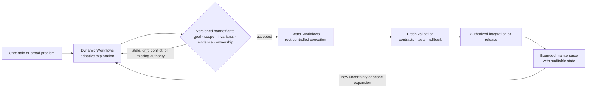
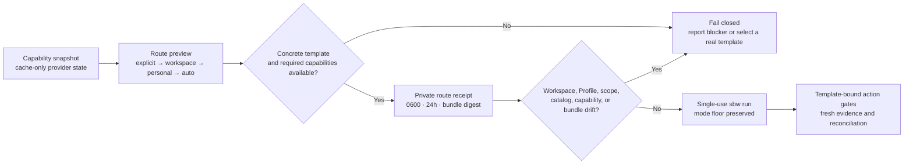
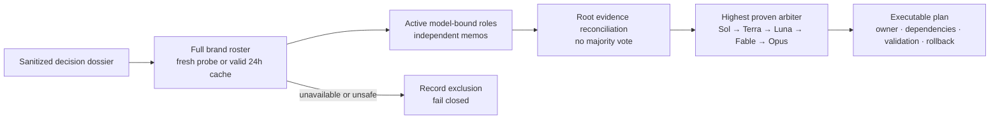
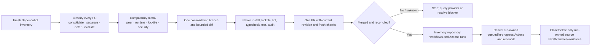
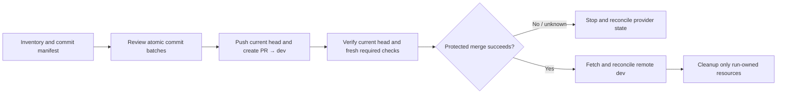

# Better Workflows — Details

| [Overview](../../README.md) | [Quick start](../guide/getting-started.md) | [Workflows](../guide/workflows.md) | [Architecture](../guide/architecture.md) | [Security](../guide/security.md) | [CLI](../guide/cli-reference.md) | **Details** |
| :---: | :---: | :---: | :---: | :---: | :---: | :---: |

[English](../../README.md) | [繁體中文](../README.zh-TW.md) | [简体中文](../README.zh-CN.md) | [日本語](../README.ja.md) | [한국어](../README.ko.md)

Native-first, evidence-driven workflow orchestration for Codex.

Better Workflows keeps one root agent responsible for edits and side effects, uses small bounded waves of native subagents for research and review, and adds deterministic state, freshness, evidence, and action-token gates for higher-risk tasks.

## Design

Better Workflows is deliberately a governed orchestration layer, not an
unbounded agent swarm. Its design principles are:

- **Root-owned mutation:** the root agent is the only authority that edits,
  integrates, performs Git/GitHub mutations, deploys, accepts risk, or declares
  completion.
- **Evidence before side effects:** evidence, freshness, authorization, and
  provider reconciliation are required before an irreversible action; unknown
  outcomes fail closed.
- **Bounded delegation:** native subagents are limited to research, review,
  testing evidence, and refutation. Fan-out is capped at three direct children
  with no recursive delegation, and independent model critics run sequentially.
- **Persistent intent:** `/goal` preserves the requested outcome across turns;
  templates and modes define verification depth without silently changing the
  goal.
- **Deterministic control plane:** the `sbw` helper records contracts, private
  state, sentinels, evidence, findings, leases, action tokens, and
  reconciliation; it does not execute model-generated commands.
- **Explicit completion:** a run is complete only when acceptance evidence is
  current, required checks pass, rollback is usable, and no unresolved
  high-risk or unknown state remains.
- **Fast path remains explicit:** `direct` avoids workflow journaling for small,
  reversible work instead of making every task pay the full orchestration cost.

This trades some peak parallel throughput for a smaller, inspectable mutation
surface and predictable stop conditions. The trade-off is intentional: the
workflow should make unsafe progress difficult to hide, even when that means
pausing for evidence or user authority.

## Better Workflows vs. Claude Dynamic Workflows

This comparison treats “Claude Dynamic Workflows” as Anthropic's Claude Code
feature, not a third-party package. It is based on Anthropic's public material
checked on 2026-07-20: [Introducing dynamic workflows in Claude Code](https://claude.com/blog/introducing-dynamic-workflows-in-claude-code),
[A harness for every task](https://claude.com/blog/a-harness-for-every-task-dynamic-workflows-in-claude-code),
and [Claude Code's parallel-agent documentation](https://code.claude.com/docs/en/agents).

> **One-line positioning:** Dynamic Workflows expands the search space when a task needs adaptive breadth; Better Workflows makes the accepted path bounded, evidence-backed, and safe to integrate.

> **Important boundary:** The collaboration model below is a human- or automation-mediated operating model, not a native integration. There is no claim of shared runtime state, automatic handoff, or protocol compatibility between the two products.

### The maximum practical difference

The key difference is orchestration posture and authority:

- **Dynamic Workflows optimizes for adaptive breadth.** It can write a task-specific JavaScript harness, fan out many agents, choose models/worktrees, verify results, and loop until a task-specific stop condition is met.
- **Better Workflows optimizes for governed convergence.** It keeps mutation with Root, bounds delegated research, records deterministic state and evidence, and fails closed when freshness, authority, reconciliation, or completion evidence is missing.

Neither capability is exclusive. Better Workflows includes research and deep-review routes, while Dynamic Workflows can also implement and release changes. The distinction is what each system optimizes first: **runtime exploration scale versus deterministic mutation control**.

### Why these capabilities are not built in

This is a deliberate boundary, not an unfinished feature checklist. Better
Workflows is a governance/control plane around Codex work, not a runtime that
lets a model generate an unbounded agent harness. The `sbw` helper records and
validates state, evidence, and action gates; it does not spawn agents or execute
model-generated commands.

| Capability | What this repo provides | Why the boundary is intentional |
| --- | --- | --- |
| Task-specific JavaScript harness | Explicit templates, modes, and deterministic helper logic. | A generated harness can adapt faster, but it also changes the execution plan at runtime; Better Workflows keeps the control plane inspectable before mutation. |
| Large or unbounded fan-out | At most three direct native children; no recursive delegation. | Bounds token cost, shared-file conflicts, and blast radius. |
| Adversarial verification | Refutation, research findings, and up to two sequential model-pinned critics. | Verification is preserved, but the number and order of critics remain auditable instead of expanding per generated subtask. |
| Loop-until-done | Persistent Goals, implementation queues, checkpoints, and explicit completion gates. | Work can continue across validated slices, but it cannot silently widen scope or spawn forever without fresh evidence. |
| Automatic worktree swarm | Branch/protected-branch and cleanup gates; no automatic worktree per generated subtask. | Root retains ownership of integration and cleanup, avoiding ambiguous ownership of parallel mutations. |
| Unattended long-running execution | Durable run state and resumable Goals, with explicit authority and reconciliation. | Resumability is useful; an autonomous daemon would require a separate lease, resource, cancellation, and side-effect protocol. |

**So is it unsuitable?** No. Better Workflows is the better fit when the
contract is known and the cost of an incorrect mutation is asymmetric: releases,
protected branches, API changes, security-sensitive refactors, reviews, and
maintenance. Dynamic Workflows is the better first tool when uncertainty and
scale dominate. Using both is often strongest: explore broadly, normalize a
versioned handoff, then let Better Workflows independently validate and govern
the implementation. This is an operating pattern, not native interoperability.

| Dimension | Better Workflows | Claude Dynamic Workflows |
| --- | --- | --- |
| Orchestration posture | Explicit selectors, templates, modes, and a deterministic local control plane. | A task-specific JavaScript harness is generated and composed at runtime. |
| Breadth and iteration | Small bounded waves: at most three direct children; independent critics run sequentially. | Large fan-out, adversarial verification, dynamic loops, and long-running runs when justified. |
| Mutation boundary | Root owns edits, integration, Git/GitHub, deploy, risk acceptance, and completion. Delegated agents are read-only by contract. | Models can choose subagent shape, model, and worktree isolation inside the generated harness; the task script determines the run's governance. |
| State and completion | Persistent Goal, private state, sentinels, evidence, leases, action tokens, reconciliation, and fail-closed completion. | Progress is saved and resumable; the harness coordinates convergence and returns a single result. |
| Cost and blast radius | Deliberately conservative; easier to bound cost, mutation surface, and stop conditions. | Higher scale potential, with an official warning that workflows can use substantially more tokens. |
| Best starting point | Known contract, release, refactor, review, or any change with asymmetric downside risk. | Unknown-size exploration, broad migration, codebase-wide audit, or work that earns massive parallelism. |

### Explore → Gate → Execute → Maintain

Use this as a collaboration SOP. It is a recommended operating pattern, not an automatic product handoff.



### The versioned handoff package

Before Better Workflows accepts exploratory output, normalize it into a
versioned handoff package. This is the anti-drift boundary:

| Gate | Required artifact | Reject and return to exploration when |
| --- | --- | --- |
| Goal | Problem statement, non-goals, chosen option, rejected alternatives. | The goal or scope is still ambiguous. |
| Contract | Invariants, interfaces, acceptance tests, reproducible commands. | A public behavior or success condition is unowned. |
| Evidence | Source index, provenance, timestamps, baseline checks, unresolved findings. | Evidence is stale, unknown, or cannot be reproduced. |
| Ownership | Repository, branch, commit/worktree identity, component owners, mutation boundary. | Baseline drift, ownership conflict, or shared-file collision exists. |
| Risk and action | Dependency/security risk register, side-effect inventory, rollback plan, required authority/action tokens. | A side effect lacks authorization, reconciliation, or rollback. |

Better Workflows then independently validates the package, converts it into
its Goal/contract/evidence state, and executes only the accepted scope. If the
scope expands, the baseline changes, or a gate becomes stale, stop and send the
work back through exploration instead of silently widening the mutation surface.

### When to use one or both

| Situation | Recommended path | Why |
| --- | --- | --- |
| Small, reversible, well-understood change | Better Workflows `direct` | Dynamic orchestration cost is not earned. |
| Known contract with meaningful verification or release risk | Better Workflows `verified`, `deep`, or `critical` | Fresh evidence and authority gates matter more than fan-out. |
| Unknown architecture, many independent hypotheses, or large migration | Dynamic Workflows first, then the handoff gate | Use breadth to reduce uncertainty; do not let exploratory output bypass integration controls. |
| Production maintenance after the design is settled | Better Workflows | Preserve the contract, evidence, rollback, and auditable ownership over time. |

**Mental model:** explore wide, gate explicitly, execute narrow, maintain audibly.

## Install

Add the GitHub marketplace and install the plugin:

```bash
codex plugin marketplace add stephen-taipei/better-workflows
codex plugin add better-workflows@better-workflows
```

Start a new Codex task after installation so the skill catalog refreshes.

## Progressive routing: Snapshot → Preview → Execute

> **Value:** Better Workflows now explains *why* a route is usable before work
> begins. It never treats an installed name as proof that its command, support
> skill, provider, or host capability is currently callable.

```bash
# Read-only: never starts provider login or a semantic model probe.
sbw doctor --capabilities

# Read-only route decision.
sbw route preview \
  --goal "Consolidate Dependabot updates and clean owned resources" \
  --scope . \
  --domain maintenance \
  --tag dependabot
```

Each capability is reported as `available`, `unavailable`, `unverified`,
`unsupported`, or `requires-authority`, with its reason and fallback. Model
availability may reuse an unchanged 24-hour semantic roster cache; a miss or
expiry does not trigger a probe. Node-only v1 reports host MCP exposure as
`unsupported` and leaves that attestation to Codex.

### One primary route, one Profile

A Routing Profile selects exactly one primary entry or template. It may set a
minimum mode, require capabilities, and attach up to three **advisory-only**
support skills. It cannot install tools, grant authority, add side effects,
lower the mode, or replace an explicit picker choice.

| Precedence | Source | Rule |
| ---: | --- | --- |
| 1 | Host hard constraints | Never lowered by local configuration; absent host input is reported `unverified`. |
| 2 | Explicit entry/template/mode | The user's picker or CLI choice wins. |
| 3 | Workspace Profile | `<repo>/.codex/better-workflows.json`; a matching rule replaces personal routing. |
| 4 | Personal Profile | `$SBW_STATE_ROOT/routing/profile.json`. |
| 5 | Built-in `auto` | Returns `template: null` until current evidence selects a real template. |

Inside one Profile, higher priority wins and ties keep file order. Match
categories are ANDed; values inside each category are ORed. Workspace and
personal rules are never deep-merged. See the strict
[example Profile](../../plugins/better-workflows/config/routing-profile.example.json).

```bash
sbw route profile validate --file my-routing-profile.json
sbw route profile install --file my-routing-profile.json
sbw route profile show
```

### Reviewable, single-use route receipts

Use `--record` when preview and execution must be bound across a handoff:

```bash
sbw route preview \
  --goal "Refactor the monorepo without changing public contracts" \
  --scope . \
  --entry monorepo-refactor \
  --record

sbw run --route-receipt <route-receipt-id>
```



Receipts bind the goal/scope, selected route, catalog, workspace and personal
Profiles, capability fingerprint, and exact plugin bundle digest. They expire
after 24 hours and are single-use. Replay, tampering, or any binding drift fails
closed.

## Use in Codex

Restart Codex or open a new task after installation.

### Codex CLI

In Codex CLI, start with `@` and search `better`, then select a Better Workflows
skill or entry from the CLI picker.


### Codex App

In the Codex App, start with `/` and search `better`, then choose the matching
command or skill entry from the App picker.


On either surface, choose an entry and describe the outcome. The picker inserts
the selected `$better-workflows:<name>` reference. You do not need to type
`/goal`, remember template names, or choose model aliases. The recommended
default is:

```text
$better-workflows:auto <describe the outcome you need>
```

For example:

```text
$better-workflows:cross-platform Check the backend, iOS, and Android contact sync contract, fix issues, and create a PR.
```

Every entry starts or continues a persistent Codex Goal before substantial
work, including `direct`. If an unrelated unfinished Goal already exists, the
workflow stops and asks you to use `/goal edit` or `/goal clear` instead of
silently replacing it.

### Choose quickly

- Unsure which workflow to use: choose `auto`.
- Know the task category: choose one of the eleven task entries.
- Care mainly about review depth: choose `direct`, `verified`, `deep`, or `critical`.
- Already use a legacy command: choose its compatibility alias.

### Automatic and task entries

| Entry | Recommended use | Example |
| --- | --- | --- |
| `$better-workflows:auto` | Best default for most work. Codex selects the template, verification mode, and critics from risk and evidence. | `$better-workflows:auto Review the current repository, fix verified defects, and create a PR.` |
| `$better-workflows:review-issues` | Read-only repository audit, finding deduplication, and authorized GitHub issue creation. It does not fix code. | `$better-workflows:review-issues Review the latest dev SHA and create deduplicated P0/P1/P2 issues.` |
| `$better-workflows:fix-issues-pr` | Re-check open issues, implement root-owned fixes, create a PR, then merge and clean up only when authorized. | `$better-workflows:fix-issues-pr Fix open dev issues, create a PR, wait for fresh checks, merge, and clean up.` |
| `$better-workflows:pr-to-dev` | Split all in-scope changes into atomic commits, create one PR targeting `dev`, wait for fresh checks, merge, reconcile remote state, and clean owned resources. | `$better-workflows:pr-to-dev Commit current changes in batches, open a PR to dev, merge after fresh checks, sync remote dev, and clean this run's worktree.` |
| `$better-workflows:cross-platform` | Backend and mobile/web contract work: schemas, optional fields, enums, sync behavior, version gates, and headers. | `$better-workflows:cross-platform Check the backend, iOS, and Android contact sync contract, fix issues, and create a PR.` |
| `$better-workflows:ios-static` | Swift/iOS static review and serialized `project.pbxproj` verification when local builds are prohibited or undesirable. | `$better-workflows:ios-static Review the iOS changes without building, verify new Swift files are in pbxproj, and fix static issues.` |
| `$better-workflows:localization` | Multi-locale changes, especially 41-locale key counts, ordering, exact scope, and regional variants. | `$better-workflows:localization Add these keys to all 41 locales and verify identical key order.` |
| `$better-workflows:ci-release` | CI failures, runner queues, serialized deploys, releases, remote monitoring, and receipt-based verification. | `$better-workflows:ci-release Diagnose the failing PR checks, fix them, and monitor the serialized dev deployment.` |
| `$better-workflows:browser-qa` | Webwright or simulator QA requiring current UI evidence, screenshots, and a reproducible action log. | `$better-workflows:browser-qa Verify signup and contact sync in the browser and attach screenshot evidence.` |
| `$better-workflows:research` | CLI-proven multi-model roles, evidence-backed architecture comparison, refutation, and an executable plan without majority voting. | `$better-workflows:research Compare three sync architectures, challenge each one, and produce an implementation-ready plan.` |
| `$better-workflows:self-improve` | Improve Better Workflows itself from bounded recent evidence, synchronize the governed surfaces, and hand off delivery. | `$better-workflows:self-improve Review recent workflow outcomes, implement only recurring verified improvements, validate, then hand off commit, cache, and remote delivery to the governed workflows.` |
| `$better-workflows:workspace-recipe` | Turn a stable, deterministic SOP into a governed workspace-local Node.js recipe with explicit digest trust and bounded artifacts. | `$better-workflows:workspace-recipe Scaffold a repeatable JSON audit, validate it, and prepare its current digest for explicit promotion.` |
| `$better-workflows:monorepo-refactor` | Full workspace inventory followed by direct implementation of every eligible bounded refactor recommendation, with behavior invariants, validation, and rollback evidence. | `$better-workflows:monorepo-refactor Inventory the monorepo and implement all eligible boundary-cleanup recommendations without changing its public contract.` |

`self-improve-ops` is intentionally a thin orchestration template. It composes
the existing research, refactor, routing, publication, and delivery controls,
accepts a justified no-change result; commit, cache publication, and push are
deferred to their governed workflows. A missing versioned cache link is resolved to
a verified current bundle; the stale path is never recreated or mutated.

Before proposing a new workflow, record the current coverage. If an existing
workflow already provides the required safeguards, return `NO_CHANGE` and do
not create a duplicate. A one-off request without demonstrated recurrence or
durable operational value also returns `NO_CHANGE`; record the evidence,
outcome, and counterargument. If the only evidence depends on private history
or sensitive material that cannot be sanitized, return
`REJECTED_WITH_EVIDENCE`: do not read, transmit, or store the raw source, and
record only a redacted rejection rationale.

Self-improvement evaluation is bounded to a checked-in, sanitized train/holdout
corpus frozen in the immutable baseline. A candidate is staged before replay;
three read-only Codex holdout replays must strictly beat the baseline median
without any safety failure or regression. Codex replay requires a host-signed
attestation binding the exact binary and model to the administrator-owned fixed
host trust root at `/etc/better-workflows/codex-trust-root.json`;
`PATH`, a self-hash, and model self-report are not provider attestation. Ties,
noise, missing evidence, and fixture-only results never auto-adopt a change.
Each successful replay uses a distinct administrator-owned execution witness.
The digest-confirmed request binds an administrator-approved native Mach-O Codex
binary digest and allowlist digest, plus the exact committed HEAD and source
binding. The
installed signer snapshots that binary into a root-owned `0755` file under the
fixed execution root, creates and signs the pre-execution binding, and invokes
a root-owned native launcher. The launcher clears supplementary groups before
applying the requesting non-root uid/gid with fixed `PATH`/`HOME`/`CODEX_HOME`
values. The attestation, receipt, envelope, and ledger bind the confirmed
request digest and exact run-as identity; candidate snapshots bind normalized
file modes too. After execution it captures the parsed response, exit status,
and timestamps, writes a root-owned execution ledger, and signs the result
receipt. `sbw` consumes that persisted witness and verifies it again before
delivery; it never reruns Codex during resume or delivery revalidation. The
signed `result receipt` binds the exact prompt digest and response digest as
well as the binary, model, execution, ledger, exit status, and timestamps.

Evaluation v2.3 preserves the v2.2 safety, documentation, deliberation,
sanitizer, evaluation-engineering, evidence, ledger, review, and direct-work
coverage, and adds an isolated plugin-cache-publication class for marker
ownership races. Exact allowlisted release-version-only substitutions stay in
the signed manifest but do not activate unrelated saturated classes; every
other byte change remains semantic. Its one-time migration freezes v2.2 as the
source and binds both immutable suite digests into eight signed executions: an
independent baseline and candidate training replay plus three baseline and three
candidate holdouts.
Admission also pins the canonical v2.2 suite digest and requires every
inherited class identity, semantics, and existing path mapping to remain
unchanged, plus all 18 inherited cases to match exactly. New coverage may add
paths or use new class or case identifiers. Missing, weakened, remapped, or
reclassified inherited coverage fails before replay, and any intentional
inherited-coverage change requires a
separately versioned, digest-bound, independently reviewed compatibility policy.
Evaluator dispositions classify the supplied snapshot rather than recommend a
follow-up edit; baseline and candidate use identical semantics, and every
satisfied assertion is reported independently of disposition. Migration still
requires candidate hard-safety and baseline/candidate universal invariants in
all three holdout replays; a source baseline non-invariant miss is accepted only
when every candidate replay repairs it without median regression or noise.
Every signed migration replay executes the complete target split, including all
byte-preserved inherited cases. Each target-only baseline must retain headroom,
and every target-only case must improve in the candidate without hard-safety
failure, regression, or noisy candidate replay. Target-only assertions must
name snapshot-verifiable implementation or regression-test evidence;
conceptual governance wording alone cannot satisfy them, and a missing exact
anchor in the full-file evidence index is treated as negative evidence.
Ordinary evaluation continues to use only applicable changed-path classes.

`safety-remediation-v1` is a separate run-creation purpose. It uses the fixed
`plugins/better-workflows/config/self-improve-safety-remediation-v1.json` policy
and its digest-bound v2.2 corpus, retaining the universal invariant and three
predeclared evidence, ledger, and review remediation targets. Each target must
be proven as a baseline defect in at least two of three replays; otherwise the
run is rejected as `baseline-remediation-not-reproduced`. Every candidate replay
must repair the reproduced targets without case regression or candidate noise.
The purpose and
policy digest are bound into the schemaVersion 3 request manifest, signed
executions, evidence, and delivery handoff; ordinary and evaluator-migration
contracts remain unchanged.

`quality-remediation-v1` is an independent versioned purpose for recurring
non-hard completion gaps, not a safety-defect or evaluator-migration bypass. It
uses `plugins/better-workflows/config/self-improve-quality-remediation-v1.json`
and the same immutable v2.2 corpus, binding its policy digest through the suite,
request manifest, signed executions, evidence, and delivery handoff. The three
targets are typed evidence admission, exhaustion blocking, and final broad
review. Each must fail in at least two baseline replays and pass in all three
candidate replays, while candidate and invariant hard-safety, no regression,
no candidate noise, and strict target improvement remain required. A missing
quality gap is rejected as `baseline-quality-gap-not-reproduced`; it cannot
reuse safety-remediation witnesses or change ordinary comparison semantics.

The host trust root is **not required for ordinary clones or workspace recipe
execution**. It is required only for maintainers who want real Codex
self-improvement replays. The self-improve contract does not authorize commit,
cache publication, push, merge, or cleanup; those actions are delegated to
`pr-to-dev` and the immutable-cache workflow.

To avoid a new administrator interruption for every long-running replay batch,
an already-ready host may install one bounded standing evaluator consent. Run
`sbw self-improve consent prepare`, verify the returned request digest, and
execute its exact administrator command once. The root signer installs a signed,
revocable grant plus a `visudo`-validated command rule restricted to the
digest-pinned root runtime, this repository and maintainer identity,
`gpt-5.6-terra`, the four declared purposes, seven or eight read-only/tool-free
sanitized requests, and one fixed request root. Matching schemaVersion 5 batches
use `/usr/bin/sudo -n`; every request, execution, root journal, evaluation record,
and typed handoff carries the same authorization. Any mismatch in an active or
partially installed grant fails closed without silently opening a password
prompt. The explicit per-run administrator fallback is available only when the
grant is absent or explicitly revoked. The grant explicitly denies
commit, cache, push, PR, merge, deploy, and cleanup authority. Inspect or revoke
it with `sbw self-improve consent status|revoke`.

Host readiness and every replay bind a root-owned minimal `gpt-5.6-terra` model
catalog with `comp_hash=3000` and no shell, search, MCP/skills, collaboration, or
dynamic tool mode. A nonce-bound loopback gate accepts exactly one fixed-shape
Codex client request containing the root challenge, exact inference input, and
root-bound output schema. It discards that bootstrap body and forwards a
root-constructed canonical request with one user input, no instructions, and an
own top-level `tools: []`. The signed proof separately binds the canonical field
policy, captured-body digest, and forwarded-body digest under a total deadline.
Completed JSONL transcripts are independently checked for zero tool events and
bound into the signed result artifacts.
Literal prompt-boundary tokens inside approved source material use a canonical
JSON Unicode escape for display only. The signed original file digest remains
authoritative, and a transformation manifest records every escaped occurrence.

Delivery may explicitly select the run-scoped `bounded-autopilot-v1` profile
when low-risk work should continue without repeated prompts. Its immutable
policy permits only bounded commits, a new immutable cache version, a push to
`codex/*`, and one PR targeting `dev`; host bootstrap/upgrade/revoke, protected
merge, deploy, direct `dev`/`main` push, and branch/worktree cleanup remain
human gates. Evaluator standing consent never grants delivery authority.

The source-bound handoff is explicit. Resolve an immutable baseline when
creating the self-improve run, keep the candidate at a clean committed HEAD,
then create a delegated delivery run and record its typed handoff:

Authoritative source capture uses pinned `/usr/bin/git` with a fixed minimal
environment and records raw local origin fetch/push URLs without applying URL
rewrites. Review, refinement, recipe, self-improve, and immutable publication
authority use the same pinned reader. Governed push and remote-sync paths reject
ambient Git routing variables and recheck the complete source/remote binding at
issue, consume, execution, and provider-reconciliation time.

```bash
sbw run --template self-improve-ops --mode critical \
  --goal "<bounded improvement>" --scope . \
  --baseline <immutable-baseline-sha>
sbw run --template pr-to-dev --mode critical \
  --goal "Deliver accepted improvement" --scope . \
  --self-improve-run <self-improve-run-id>
sbw self-improve handoff <pr-to-dev-run-id> \
  --source-run <self-improve-run-id>
```

`self-improve-delivery-handoff` binds the source run's exact baseline, HEAD,
clean source binding, plugin bundle, request manifest, accepted comparison,
candidate snapshot, all purpose-required host witnesses (seven ordinary or
eight for evaluator migration), and canonical Codex plugin cache root. The
delegated delivery action gates require this receipt; a generic
`pr-to-dev` run cannot authorize delivery of an accepted self-improvement.
The `policyDigest` key remains mandatory: it is explicitly `null` for ordinary
and evaluator-migration runs, and a SHA-256 digest for policy-bound remediation.
`evaluatorAuthorization` is also mandatory: it carries the exact standing
authorization object, or is `null` only for the explicit per-run administrator
fallback. These are the only declared nullable fields; the purpose-specific
handoff validator still enforces the exact key set and values.
On each host, an administrator must first confirm that the fixed trust root and
private key are already provisioned through the host's approved bootstrap. This
repository does not publish or execute the legacy Swift bootstrap artifact. If
the trust root or key is absent, stop and complete that separate administrator
bootstrap before continuing. For an existing host, inspect the current state:

```bash
node plugins/better-workflows/scripts/sbw.mjs \
  self-improve host status
```

The status command is read-only. It never overwrites or silently rotates an
existing key. The trust root is public and root-owned; the private Ed25519 key
remains mode `0600` outside the repository. Do not use `plutil` to validate the
JSON trust root—use `self-improve host status`. If status reports `ready: false`
because a legacy signer or an incomplete readiness receipt is installed, compile the exact native sources with
fixed `/usr/bin/clang`, stage a digest-confirmed root-owned Node runtime and
the resulting Mach-O launcher/probe, then run `host-trust.mjs upgrade` through
the fixed `/bin/sh` staging wrapper with `env -i`. Never sudo the
maintainer's `process.execPath` directly. The administrator upgrade must also
receive `--codex-binary <canonical-native-Mach-O>` and
`--codex-binary-digest <sha256>`; it records the approved binary in the
root-owned `0644` allowlist and rejects a JS wrapper or arbitrary executable.
The old signer is retained as a root-owned backup; upgrade performs a disposable
signed readiness witness and a failed upgrade is quarantined and rolled back
with exact prior artifact digests proven, without rotating keys.

Before request generation, the candidate must already be the exact committed
HEAD that will be reviewed and delivered. If it is dirty, use `pr-to-dev` for
the commit wave and start a fresh source-bound self-improve run. Changing the
source or plugin bundle after request generation invalidates every witness.
After a candidate is frozen, generate the complete purpose-specific request set
outside the repository: seven requests for ordinary evaluation and eight for
evaluator migration. The output includes a manifest digest and an exact `executeCommand`;
the administrator reviews both before running that one host-execution command;
the command verifies the already-installed runtime in the fixed root-owned host
directory before invoking the signer:

```bash
node plugins/better-workflows/scripts/sbw.mjs \
  self-improve attestation request \
  --run <run-id> \
  --baseline <sha> \
  --candidate-root . \
  --model <model> \
--output <new-outside-repo-directory>
```

The signer authenticates the canonical parent chain for the fixed runtime,
signer, launcher, probe, execution, attestation, and request-bundle roots.
Every parent must be administrator-owned and lack group/world write bits; a
root-owned leaf under a writable or replaceable parent is rejected.

The command returns seven root-owned witness paths under
`/private/var/db/better-workflows/executions`. Pass those paths to
`--trusted-codex-execution` (one for training and six for holdout), together
with `--request-manifest <output>/attestation-requests.json` and the exact
`--request-manifest-digest <manifest-sha256>`. The host
signer owns response capture, timing, the one-shot execution ledger, and result
receipt creation; a caller-supplied response or timestamp is never signed.
`sbw` requires the root-owned completed batch journal and verifies every
request digest, execution identity, run-as tuple, binary, model, suite,
baseline, and candidate against that manifest.

Before file-count or byte sampling, every changed path must match the fixed
plugin or repository-public-document allowlist. An out-of-scope path rejects
the replay even if it would sort beyond the sampling limit; only sampled valid
UTF-8, non-secret-shaped content is sent to Codex.

### Governed workspace recipes

Workspace recipes preserve deterministic mechanical work, not model judgment
or agent orchestration. They cannot grant themselves source mutation, shell,
network, worker, child-process, evidence acceptance, or external side effects.
Root may scaffold one on an explicit user request. An automatic suggestion
requires two completed structured runs with the same recurrence fingerprint
within 90 days; raw session history and memory transcripts are never mined.
Node 24 Permission Model is defense in depth; the primary authority is an
explicit private trust record bound to the workspace, manifest, entry script,
plugin bundle, and Node major.

Nothing is created implicitly. From the Git worktree root:

```bash
node plugins/better-workflows/scripts/sbw.mjs recipe init
node plugins/better-workflows/scripts/sbw.mjs recipe scaffold json-keyset-audit
node plugins/better-workflows/scripts/sbw.mjs recipe validate json-keyset-audit
```

This creates `.codex/better-workflows/` at that Git root. The separate
`.codex/better-workflows.json` remains a routing Profile and cannot authorize a
recipe. A recipe cloned from Git is always untrusted on the new workspace.
Promotion requires a `workspace-recipe` run, complete evidence, a current
sentinel, no open P0/P1 finding, fixture parity, a consumed `recipe.promote`
action, and the user's exact digest confirmation:

```bash
node plugins/better-workflows/scripts/sbw.mjs recipe promote <id> \
  --run <run-id> \
  --attempt <attempt-id> \
  --confirm-digest <sha256>

node plugins/better-workflows/scripts/sbw.mjs recipe run <id> \
  --input-file <input.json> --dry-run

node plugins/better-workflows/scripts/sbw.mjs recipe run <id> \
  --input-file <input.json>
```

Dry-run executes only an already trusted program and discards staging.
Normal execution atomically publishes declared artifacts under the ignored
workspace artifact directory. Promoting one artifact into tracked source needs
an independent `artifact.promote` action. General receipts store only digests,
timestamps, bounded artifact metadata, and reconciliation—not raw input,
conversation, credentials, or secrets. Reconciled side-effect action records
retain provider receipts privately for terminal-state verification; they are not
included in external handoffs or graph projections.

### Derived Graph View

Graph View derives a typed, read-only graph from installed workflow templates
or one live run. It is a cross-record validator, not a Dynamic Workflow
runtime, policy input, scheduler, authority source, persisted graph, or agent
runtime. It never grants or relaxes behavior. Objective structural errors add a
fail-closed block to `eval`, run creation, action-token issue, and completion;
heuristic diagnostics remain warnings.
Those gates recompute structural validation from the installed template or
private run records. They never accept a graph envelope, graph digest, Mermaid,
or persisted graph as policy input; presentation failure cannot grant or relax
authority.

```bash
node plugins/better-workflows/scripts/sbw.mjs graph validate
node plugins/better-workflows/scripts/sbw.mjs graph validate --template <name>
node plugins/better-workflows/scripts/sbw.mjs graph validate --run <run-id>
node plugins/better-workflows/scripts/sbw.mjs graph inspect \
  --template <name> --format json
node plugins/better-workflows/scripts/sbw.mjs graph inspect \
  --run <run-id> --format mermaid
```

`inspect` accepts exactly one target. JSON is canonical; Mermaid is returned
inside the JSON envelope's `content` field and is never written implicitly.
The graph contains only typed IDs, relative provenance, digests, diagnostics,
and safe labels. It excludes raw input, evidence summaries, conversation,
token hashes, credentials, and provider receipts. Success exits `0`,
structural diagnostics exit `2`, and usage or system errors exit `1`.
Live-run provenance digests cover an allowlisted non-sensitive structural
projection only. Omitted private fields do not influence any source or graph
digest, so the output cannot be used to confirm guesses about those values.

### CLI-proven multi-model deliberation

`research-deliberation` keeps the complete configured model-brand roster—Codex,
Claude, Gemini, GPT-OSS, Grok, Cursor, Kimi, Qwen, and Kiro—but only adds a
CLI/model pair to the decision group after a safe semantic probe passes.
That means a missing binary, expired login, or unsafe interactive flow is
reported as unavailable, never silently substituted.

Each normal full-roster reasoning-effort profile is cached for at most 24 hours.
The cache is invalidated by expiry, `--refresh`, roster changes, or a CLI
path/binary-digest change; a targeted provider probe does not replace it.
External probes require explicit authorization and sanitized, non-confidential
material. Gemini uses Antigravity CLI (`agy`) in this runtime rather than a
standalone `gemini` command. `agy` is transport metadata, not a second model
brand; it can also expose Claude- and GPT-OSS-branded models.

Every participant also receives the same contextual reasoning-effort policy:
`medium` for bounded `direct`/`verified` work and `high` for
`auto`/`deep`/`critical` work, unless explicitly overridden. Codex receives a
native setting; `agy` selects the actual `gemini-3.6-flash-medium` or
`gemini-3.6-flash-high` model variant and passes its native `--effort` flag
when supported. Models reached through `agy` that reject the flag remain explicitly high- or
medium-only variants; other CLIs record prompt-guided effort without pretending
it was provider-attested.



```bash
node plugins/better-workflows/scripts/sbw.mjs deliberation deliberate \
  --prompt-file sanitized-case.md \
  --allow-external-providers --sanitized
```

### Template-only operational routes

Dependabot consolidation is intentionally a template rather than another picker
Skill: it is a narrowly governed operational procedure that should be selected
from the current task context, while `auto` may route to it when the evidence
matches. Run it directly when you need the exact contract:

```bash
node plugins/better-workflows/scripts/sbw.mjs run \
  --template dependabot-consolidation-pr-cleanup \
  --mode critical \
  --goal "Inventory Dependabot PRs, consolidate compatible updates, merge one PR, and clean only run-owned sources." \
  --scope .
```

The SOP is deliberately fail-closed:



Its required evidence is `dependabot-inventory`, `compatibility-matrix`,
`consolidation-diff`, `lockfile-validation`, `repository-actions-inventory`,
`actions-cancelled`, `merge-result`, and `cleanup-manifest`. It checks that the
repository's workflow definitions and related Actions runs still exist and
records missing, disabled, queued, running, and terminal states. If the
provider cannot answer, the workflow stops. The template does not assume that
every Dependabot PR is safe to combine: each candidate must receive a
disposition, and cleanup is allowed only after run-owned Actions are cancelled
and the consolidation PR is terminally reconciled. The current consolidation
run and unrelated runs are never cancelled by this cleanup gate.

### Picker workflow: PR to `dev`

`pr-to-dev` governs atomic commit batches, one PR targeting `dev`, fresh required
checks, protected merge, remote `dev` reconciliation, and cleanup of only
run-owned resources. Select `$better-workflows:pr-to-dev` from the native picker,
or start the same template directly:

```bash
node plugins/better-workflows/scripts/sbw.mjs run \
  --template pr-to-dev \
  --mode critical \
  --goal "Split in-scope changes into atomic commits, create one PR to dev, merge after fresh checks, sync remote dev, and clean owned worktrees." \
  --scope .
```



The gates are `commit-plan`, `commit-manifest`, `target-branch-dev`,
`required-checks`, `merge-result`, `remote-sync`, and `cleanup-manifest`.
Admin bypass, stale checks, unreviewed commits, and cleanup before remote
reconciliation are rejected.

### Review-strength entries

These entries let Codex choose the task template while you set the minimum
verification depth.

| Entry | Recommended use | Example |
| --- | --- | --- |
| `$better-workflows:direct` | Small, reversible, well-understood work where speed matters. Uses a persistent Goal but no workflow journal or critics. | `$better-workflows:direct Fix this one-line documentation typo and verify the diff.` |
| `$better-workflows:verified` | Normal engineering work that benefits from 1–3 read-only research/review/refutation agents and freshness evidence. | `$better-workflows:verified Review and fix the pagination bug, then create a PR.` |
| `$better-workflows:deep` | Architecture, security, broad refactors, or uncertain changes needing verified work plus independent Codex critics. | `$better-workflows:deep Review the auth redesign, fix verified issues, and produce a migration-safe PR.` |
| `$better-workflows:critical` | Releases, migrations, production operations, destructive cleanup, or irreversible side effects requiring fail-closed gates and mandatory independent evidence. | `$better-workflows:critical Run the production release only after all policy, remote-SHA, and reconciliation gates pass.` |

### Compatibility aliases

Use these when migrating existing habits. They route into the same Goal-first,
root-owned Better Workflows engine; they do not revive retired parallel-writing
workflows.

| Entry | Recommended use | Equivalent route |
| --- | --- | --- |
| `$better-workflows:auto-improve` | Legacy `autoImprove`: review, verify findings, fix, create PR, and converge safely. | Fix issues to PR, `deep` by default |
| `$better-workflows:auto-issues` | Legacy `autoIssues`: read-only review plus deduplicated issue creation. | Review to issues, `verified` by default |
| `$better-workflows:git-check-issues` | Legacy issue repair: re-fetch issue state, fix active issues, create PR, and clean up precisely. | Fix issues to PR, `deep` by default |
| `$better-workflows` | Natural-language router when you do not select a specific menu entry. | Automatic template and mode routing |

## Modes and templates

Goal mode controls persistence; Better Workflows mode controls verification
depth. They are independent.
For a bounded monorepo refactor, choose `$better-workflows:monorepo-refactor`
from the Skill picker. It uses the native persistent Goal flow and supports
`AUDIT_ONLY`, `APPROVAL_GATED`, and `AUTONOMOUS` execution contracts:

```text
$better-workflows:monorepo-refactor Refactor the shared package boundary without changing public behavior.
```

The skill inspects or continues the active goal, inventories the full workspace,
and then implements every recommendation that is inside scope and passes the
safety gates. It continues through validated slices instead of stopping at a
recommendation list. `AUDIT_ONLY` and `APPROVAL_GATED` remain explicit modes
when you want a read-only result or approval between slices. The goal is marked
complete only after the eligible recommendation queue is empty and validation
and rollback evidence pass.

For example:

```text
$better-workflows:monorepo-refactor Inventory the monorepo, then directly implement all eligible boundary-cleanup recommendations without changing public behavior.
```

Better Workflows chooses one of four modes:

| Mode | Behavior |
| --- | --- |
| `direct` | Root works normally without durable workflow state. |
| `verified` | Root plus one to three native research/review/refutation agents. |
| `deep` | Verified work followed by up to two sequential Codex critics. |
| `critical` | Full evidence and side-effect gates plus a required external reviewer when policy demands it. |

Thirteen workflow templates are included:

- `review-to-issues`
- `issues-to-root-fix-pr-merge-cleanup`
- `cross-platform-contract`
- `ios-static-pbxproj`
- `localization-41`
- `ci-release-monitor`
- `dependabot-consolidation-pr-cleanup`
- `browser-simulator-qa`
- `research-deliberation`
- `self-improve-ops`
- `workspace-recipe`
- `monorepo-refactor`
- `pr-to-dev`

Current Codex surfaces expose plugin Skills through native pickers: Codex CLI
uses `@` search, while the Codex App uses `/` command search. No custom prompt
installer or separate command layer is required.

## Deterministic helper

The plugin bundles a zero-runtime-dependency Node.js helper. Its official command is `sbw` (Stephen Better Workflows). It manages contracts, private run state, evidence, findings, bounded Git sentinels, leases, action tokens, reconciliation, doctor checks, and evaluations. It does not spawn agents, execute model-generated commands, assign severity, or perform side effects.

Run it directly from a checkout:

```bash
node plugins/better-workflows/scripts/sbw.mjs doctor
node plugins/better-workflows/scripts/sbw.mjs doctor --capabilities
node plugins/better-workflows/scripts/sbw.mjs route preview --goal "Review this repo" --scope .
node plugins/better-workflows/scripts/sbw.mjs eval
```

A global `sbw` command is optional. Before a workflow uses one, it verifies that
`sbw templates` contains the selected template, `sbw help` lists `route preview`,
and `sbw doctor --capabilities` works without provider probes. A stale helper
automatically falls back to the runner bundled with the active plugin.

## Security model

- State directories use mode `0700`; state files use `0600`.
- Antigravity CLI (`agy`) review is limited to explicitly authorized, sanitized, non-confidential bundles.
- The `agy` argv transport is treated as exposed metadata and is not allowed for confidential workflows.
- The multi-model roster retains every configured brand, but only uses a CLI-proven result from a separate `medium` or `high` cache profile lasting at most 24 hours; expiry, `--refresh`, roster changes, and CLI identity changes force revalidation.
- Unknown provider outcomes require query reconciliation and are never blindly retried.
- Governed GitHub probes use the absolute `gh` path and content digest captured at token or evidence creation; required-check verification rejects missing identities and path/binary drift rather than resolving an ambient fallback.
- A PR-create wrapper failure after preflight is `sent-or-indeterminate`; an explicit `not-sent` preflight may release `pull/new` directly, while a fresh pinned-provider absence proof may reconcile the same unknown attempt as failure and release it. Reservations are namespaced by provider repository, action, and resource, and legacy unscoped reservations remain fail-closed.
- Wrapper-backed actions use `issue` → `execute`; `execute` consumes internally, while direct `consume` is reserved for non-wrapper side effects. Contract-deferred actions are rejected by core lifecycle gates, not only by template action stages.
- The project assumes trusted local repositories and does not claim to sandbox malicious repository code.

## Development

```bash
npm test --prefix plugins/better-workflows
node plugins/better-workflows/scripts/sbw.mjs eval
node scripts/plugin-cache.mjs check
```

The runtime uses only Node.js standard-library modules.

Plugin cache versions are immutable. Every content change must use a new build
version; issue the delegated `plugin.cache.publish` action for resource `plugin-cache:<source-head-revision>`, then run `SBW_STATE_ROOT=<state-root> node scripts/plugin-cache.mjs sync --handoff-run <pr-to-dev-run-id> --token <plugin-cache-action-token>`. It requires a fresh typed handoff while the source HEAD is unchanged, then stages a missing version, verifies
the exact file manifest and digest, then atomically publishes it. It refuses to
overwrite a same-version cache with different contents. Run `sbw eval` from the
final cache path before activating that version through the normal Codex plugin
refresh. The `--cache-root` override is diagnostic-only for `check`; governed
`sync` is fixed to the cache root recorded by the target manifest and action
token; a different `CODEX_HOME` fails before token consumption. If the success
action record is persisted before the ready marker, repeating the same sync
attempt repairs the marker from that exact receipt without republishing. A
`spent/pending` action can likewise resume only when the exact pending marker
and immutable target prove the handoff source binding, run, and attempt; if
that proof is absent, the attempt remains unknown and no second publication is
allowed. Ready finalization and failure cleanup share the same versioned
publication lock, so marker transitions cannot race target removal. Cleanup
requires the exact pending marker run and action attempt, so a replacement
marker and its target remain untouched. After stale-lock recovery, publication
also requires any existing pending marker to match the complete source binding,
run, and attempt; a foreign marker is preserved even when its target is absent.
Source runs without an explicit canonical cache-root field and locks
whose owner and OS-observable process-start digest cannot be proven absent fail
closed. A proven stale lock is atomically renamed to a same-version quarantine
and its inode/content identity is rechecked before deletion; a pathname
replacement remains quarantined and blocks later publishers.

## License

MIT. See [LICENSE](../../LICENSE). No upstream workflow runtime is vendored; see [THIRD_PARTY_NOTICES.md](../../THIRD_PARTY_NOTICES.md).
