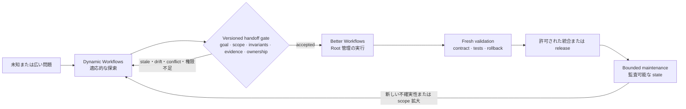
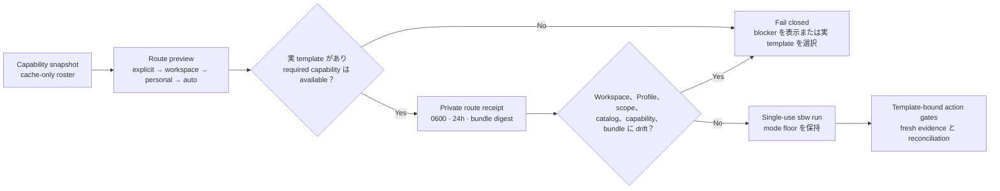
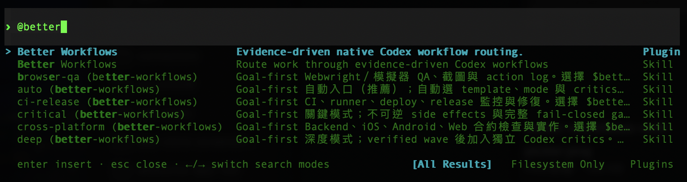
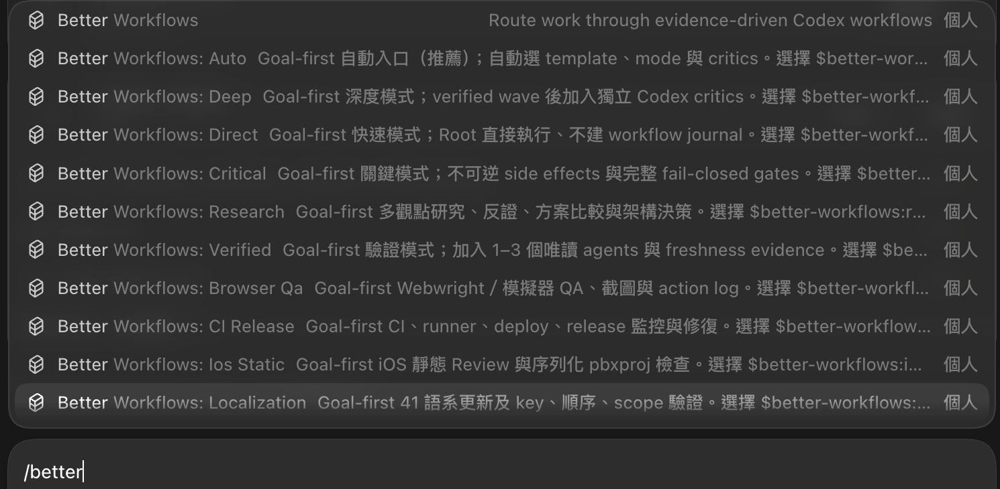
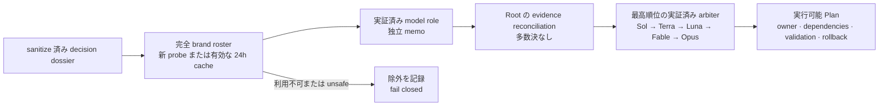
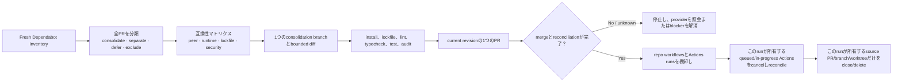

# Better Workflows — 詳細

[English](../../README.md) | [繁體中文](../README.zh-TW.md) | [简体中文](../README.zh-CN.md) | [日本語](../README.ja.md) | [한국어](../README.ko.md)

| [概要](../README.ja.md) | **詳細** | [Getting Started](../guide/getting-started.md) | [Workflows](../guide/workflows.md) | [Architecture](../guide/architecture.md) | [Security](../guide/security.md) | [CLI](../guide/cli-reference.md) |
| :---: | :---: | :---: | :---: | :---: | :---: | :---: |

Better Workflows は、Codex 向けのネイティブ優先・証拠駆動ワークフローです。Root だけがコード変更、Git/GitHub 操作、deploy、リスク受容、完了宣言を行い、subagents は調査、Review、テスト証拠、反証を担当します。

## 設計原則

Better Workflows は無制限の agent swarm ではなく、ガバナンスを備えた orchestration layer です。主な原則は次のとおりです。

- **Root-owned mutation：** Root だけが変更、統合、Git/GitHub mutation、deploy、リスク受容、完了宣言を行います。
- **Evidence before side effects：** side effect の前に evidence、freshness、権限、provider reconciliation を要求し、unknown outcome は fail closed にします。
- **Bounded delegation：** native subagents は調査、Review、テスト証拠、反証に限定します。direct children は最大 3 つ、再帰 delegation は禁止し、独立 critics は順番に実行します。
- **Persistent intent：** `/goal` は turn をまたいでユーザーの目標を保持します。template と mode は検証の深さだけを決め、目標を暗黙に変更しません。
- **Deterministic control plane：** `sbw` は contract、private state、sentinel、evidence、findings、lease、action token、reconciliation を記録しますが、model が生成した command は実行しません。
- **Explicit completion：** 最新の acceptance evidence、必要なチェック、利用可能な rollback がそろい、高リスクまたは unknown state が残っていない場合だけ完了とします。
- **Fast path remains explicit：** 小さく可逆な作業には `direct` を使い、完全な workflow journal のコストを明示的に省略できます。

この設計は最大の並列スループットの一部を、検査しやすい mutation surface と予測可能な停止条件に交換します。証拠やユーザー権限を待つために停止しても、安全でない進捗が隠れないことを優先します。

## Better Workflows と Claude Dynamic Workflows の比較

ここでいう「Claude Dynamic Workflows」は Anthropic の Claude Code 機能を指し、第三者パッケージを指しません。比較は 2026-07-20 に確認した Anthropic の公開資料、[Introducing dynamic workflows in Claude Code](https://claude.com/blog/introducing-dynamic-workflows-in-claude-code)、[A harness for every task](https://claude.com/blog/a-harness-for-every-task-dynamic-workflows-in-claude-code)、および [Claude Code の並列 agent ドキュメント](https://code.claude.com/docs/en/agents) に基づきます。

> **一文でいうと：** Dynamic Workflows は適応的な広さが必要なときに探索空間を広げ、Better Workflows は受け入れた経路を bounded・検証可能にして安全に統合します。

> **重要な境界：** 以下は人または自動化が運用する operating model であり、2 つの製品の native integration ではありません。共有 runtime state、自動 handoff、protocol compatibility は主張しません。

### 最大の特徴の違い

最大の違いは orchestration posture と authority です。

- **Dynamic Workflows は適応的な広さを優先：** タスクごとの JavaScript harness を生成し、多数の agent を並列化し、model/worktree を選び、検証と停止条件に基づく反復を行います。
- **Better Workflows は governed convergence を優先：** mutation を Root に残し、delegated research を bounded にし、deterministic state/evidence を記録します。freshness、権限、reconciliation、completion evidence が不足すれば fail closed です。

これは能力の排他ではありません。Better Workflows にも research/deep review があり、Dynamic Workflows も実装や release に使えます。違いは最初に最適化する対象、つまり **runtime exploration scale と deterministic mutation control** です。

### なぜこれらの機能を内蔵しないのか

これは未完成の機能一覧ではなく、意図した境界です。Better Workflows は Codex の作業を囲む governance/control plane であり、model が無制限の agent harness を動的生成する runtime ではありません。`sbw` は state、evidence、action gates を記録・検証しますが、agent を spawn したり model 生成 command を実行したりしません。

| 能力 | この repo が提供するもの | 境界を設ける理由 |
| --- | --- | --- |
| タスクごとの JavaScript harness | 明示的な template、mode、deterministic helper logic。 | 動的 harness は速く適応できますが、runtime で実行計画が変わります。本 repo は mutation 前の control plane を検査可能に保ちます。 |
| 大規模または無制限 fan-out | direct native children は最大 3、再帰 delegation は禁止。 | token コスト、共有ファイル衝突、blast radius を bounded にします。 |
| Adversarial verification | Refutation、research findings、最大 2 つの順次 model-pinned critics。 | 反証は保ちますが、生成 subtask ごとに無制限に増えず、数と順序を監査できます。 |
| Loop-until-done | Persistent Goal、implementation queue、checkpoint、明示的 completion gates。 | validated slice をまたいで継続できますが、scope や spawn を新鮮な evidence なしに黙って拡大しません。 |
| 自動 worktree swarm | Branch/protected-branch と cleanup gates。生成 subtask ごとの自動 worktree は作りません。 | Root が integration/cleanup ownership を保持し、並列 mutation の責任を明確にします。 |
| 無人の長時間実行 | Durable run state と resume 可能な Goal。ただし明示的な権限と reconciliation が必要。 | resume は有用ですが、autonomous daemon には lease、資源、cancel、side-effect protocol が別途必要です。 |

**不適切なのでしょうか？** いいえ。contract が既知で、誤った mutation の下振れリスクが大きい場合、Better Workflows が適しています：release、protected branch、API 変更、security-sensitive refactor、Review、maintenance です。不確実性と規模が支配するなら Dynamic Workflows を最初に使うのが適切です。両方を使う場合は、広く探索し、versioned handoff に正規化し、Better Workflows が独立に検証して実装を governance します。これは operating pattern であり native interoperability ではありません。

| 観点 | Better Workflows | Claude Dynamic Workflows |
| --- | --- | --- |
| Orchestration posture | 明示的な selector、template、mode、deterministic local control plane。 | task-specific JavaScript harness を runtime に生成・構成。 |
| 広さと反復 | direct children は最大 3、独立 critics は順次実行。 | 大規模 fan-out、adversarial verification、dynamic loop、長時間実行。 |
| Mutation boundary | Root が変更、統合、Git/GitHub、deploy、リスク受容、完了を担当。delegated agents は contract 上 read-only。 | 生成 harness が subagent、model、worktree を選べます。タスク script が run の形を決めます。 |
| State と完了 | Persistent Goal、private state、sentinel、evidence、lease、action token、reconciliation、fail-closed。 | progress を保存して resume でき、harness が収束を調整します。 |
| コストと blast radius | 意図的に保守的で、コスト・mutation surface・停止条件を bounded にしやすい。 | 規模の可能性は高いが、公式に大幅な token 消費があり得ると説明されています。 |
| 使い始める場面 | 既知の contract、release、refactor、Review、下振れリスクが非対称な変更。 | 未知の規模の探索、大規模 migration、repo 全体の audit、大規模並列化が有効な作業。 |

### Explore → Gate → Execute → Maintain

以下は協業 SOP です。自動的な製品 handoff ではなく、推奨する operating pattern です。



### Versioned handoff package

Better Workflows が探索結果を受け入れる前に、versioned handoff package に正規化します。これが scope drift を防ぐ境界です。

| Gate | 必須情報 | 探索へ戻す条件 |
| --- | --- | --- |
| Goal | 問題、non-goals、選択案、却下した案。 | 目標または scope が曖昧。 |
| Contract | Invariants、interfaces、acceptance tests、再現可能な commands。 | public behavior または成功条件の owner が不明。 |
| Evidence | Source index、provenance、timestamp、baseline checks、未解決 findings。 | evidence が stale、unknown、再現不能。 |
| Ownership | Repo、branch、commit/worktree、component owner、mutation boundary。 | baseline drift、ownership conflict、共有ファイル衝突。 |
| Risk/action | dependency/security risk、side-effect inventory、rollback、action tokens。 | side effect に権限、reconciliation、rollback がない。 |

Better Workflows は package を独立に検証し、Goal/contract/evidence state に変換して accepted scope だけを実行します。scope、baseline、gate が変わったら停止し、mutation surface を黙って広げず再探索します。

### 協業のすすめ

| 状況 | 推奨ルート | 理由 |
| --- | --- | --- |
| 小さく可逆で明確な変更 | Better Workflows `direct` | dynamic orchestration のコストを払う必要がありません。 |
| contract は既知だが検証または release リスクがある | Better Workflows `verified`、`deep`、`critical` | fan-out より fresh evidence と authority gates が重要です。 |
| アーキテクチャが未知、仮説が多い、大規模 migration | Dynamic Workflows → handoff gate | 広さで不確実性を下げ、統合 controls は迂回しません。 |
| 設計確定後の production maintenance | Better Workflows | contract、evidence、rollback、監査可能な ownership を保ちます。 |

**Mental model：** 広く探索し、gate を明示し、狭く実行し、監査可能に保守する。

## インストール

```bash
codex plugin marketplace add stephen-taipei/better-workflows
codex plugin add better-workflows@better-workflows
```

インストール後、新しい Codex task を開いて Skill catalog を再読み込みしてください。

## 段階的ルーティング：Snapshot → Preview → Execute

> **価値：** 作業前に「なぜ今この route を使用できるか」を説明します。
> インストール済みの名前だけでは、command、support skill、provider、
> host capability が実際に呼び出せる証拠にはなりません。

```bash
# 読み取り専用。provider login や semantic model probe は開始しません。
sbw doctor --capabilities

sbw route preview \
  --goal "Dependabot update を統合し、この run が所有する resource を cleanup" \
  --scope . \
  --domain maintenance \
  --tag dependabot
```

各 capability は `available`、`unavailable`、`unverified`、`unsupported`、
`requires-authority` のいずれかと、理由・fallback を返します。Model の
可用性は変更のない有効な 24 時間 semantic roster cache だけを再利用し、
cache miss や期限切れで自動 probe はしません。Node-only v1 は Codex host
の MCP exposure を証明できないため `unsupported` とし、host の判断に
委ねます。

### Primary route は一つ、Profile も一つ

Routing Profile は primary entry または template を一つだけ選択します。
最低 mode、required capabilities、最大 3 個の**助言専用** support skills
を指定できます。Tool の install、権限付与、side effect の追加、mode の
引き下げ、明示的 picker 選択の上書きはできません。

| 優先順位 | Source | Rule |
| ---: | --- | --- |
| 1 | Host hard constraints | Local config では下げられず、host input がなければ `unverified`。 |
| 2 | 明示的 entry/template/mode | User の picker／CLI 選択が優先。 |
| 3 | Workspace Profile | `<repo>/.codex/better-workflows.json`。Match した rule が personal route を置換。 |
| 4 | Personal Profile | `$SBW_STATE_ROOT/routing/profile.json`。 |
| 5 | Built-in `auto` | Evidence が実 template を選ぶまで `template: null`。 |

同じ Profile では priority が高い rule を選び、同点なら file order を保持
します。Match category 間は AND、category 内の値は OR。Workspace と
personal rule は deep merge しません。厳格な
[Profile 例](../../plugins/better-workflows/config/routing-profile.example.json)
を参照してください。

```bash
sbw route profile validate --file my-routing-profile.json
sbw route profile install --file my-routing-profile.json
sbw route profile show
```

### Review 可能な single-use route receipt

```bash
sbw route preview \
  --goal "Public contract を変えずに monorepo を refactor" \
  --scope . \
  --entry monorepo-refactor \
  --record

sbw run --route-receipt <route-receipt-id>
```



Receipt は goal/scope、route、catalog、workspace/personal Profiles、
capability fingerprint、plugin bundle digest を binding します。24 時間で
期限切れになり、一度だけ使用できます。Replay、改ざん、binding drift は
fail closed です。

## Codex での使い方

### Codex CLI

Codex CLI では `@` から始めて `better` を検索し、CLI picker から Better Workflows の skill または入口を選びます。



### Codex App

Codex App では `/` から始めて `better` を検索し、App picker から対応する command または skill の入口を選びます。



どちらの画面でも入口を選んで目的を記述するだけです。Picker が `$better-workflows:<name>` を挿入します。`/goal`、template 名、mode 名、model alias を覚える必要はありません。推奨デフォルト：

```text
$better-workflows:auto <達成したい結果を記述>
```

すべての入口は、実作業の前に persistent Goal を作成または継続します。`direct` も同様です。無関係な未完了 Goal がある場合は、上書きせず `/goal edit` または `/goal clear` を案内します。

### すばやい選び方

- 迷った場合：`auto`。
- タスク種別が明確：11 個の task entry から選択。
- 検証強度だけ指定：`direct`、`verified`、`deep`、`critical`。
- 旧コマンドを継続：compatibility alias。

### 自動・タスク入口

| 入口 | 推奨シーン | 例 |
| --- | --- | --- |
| `$better-workflows:auto` | ほとんどのタスクに推奨。リスクと証拠から template、mode、critics を自動選択。 | `$better-workflows:auto 現在の repo を Review し、検証済みの問題を修正して PR を作成。` |
| `$better-workflows:review-issues` | 読み取り専用 audit、finding の重複排除、許可済み GitHub issue 作成。コードは変更しない。 | `$better-workflows:review-issues 最新 dev SHA を Review し、重複のない P0/P1/P2 issues を作成。` |
| `$better-workflows:fix-issues-pr` | Open issues を再確認し Root が修正、PR 作成。許可がある場合のみ merge/cleanup。 | `$better-workflows:fix-issues-pr dev の open issues を修正し、fresh checks 後に merge と cleanup。` |
| `$better-workflows:pr-to-dev` | Scope 内の変更を atomic commit に分割し、`dev` 向け PR を一つ作成。Fresh checks 後に merge、remote 同期、所有 resource の cleanup。 | `$better-workflows:pr-to-dev 現在の変更を分割 commit し、dev PR を checks 後に merge、remote dev を同期して worktree を cleanup。` |
| `$better-workflows:cross-platform` | Backend、iOS、Android、Web の schema、optional、enum、sync、version gate、headers。 | `$better-workflows:cross-platform backend、iOS、Android の contact sync contract を確認し、修正して PR を作成。` |
| `$better-workflows:ios-static` | ローカル build を避ける Swift/iOS 静的 Review と直列化された `project.pbxproj` 検証。 | `$better-workflows:ios-static build せず iOS 変更を Review し、新規 Swift ファイルの pbxproj 登録を確認。` |
| `$better-workflows:localization` | 多言語更新、特に 41 locales の key 数、順序、正確な scope、地域差。 | `$better-workflows:localization 全 41 locales に keys を追加し、順序が一致することを検証。` |
| `$better-workflows:ci-release` | CI failure、runner queue、直列 deploy、release、遠隔監視、receipt 検証。 | `$better-workflows:ci-release 失敗した PR checks を修正し、直列 dev deploy を監視。` |
| `$better-workflows:browser-qa` | 最新 UI 証拠、screenshots、再現可能な action log が必要な Webwright／simulator QA。 | `$better-workflows:browser-qa signup と contact sync を検証し、screenshot evidence を添付。` |
| `$better-workflows:research` | CLI で実証した複数 model の役割、証拠駆動の設計比較、反証、実行可能な Plan。多数決では決めない。 | `$better-workflows:research 3 つの sync architecture を比較・反証し、実装可能な Plan を作成。` |
| `$better-workflows:self-improve` | 直近の bounded evidence から Better Workflows 自体を改善し、selector、template、tests、docs、version、immutable cache、許可済み remote delivery を同期します。 | `$better-workflows:self-improve 最近の workflow 結果を Review し、反復する検証済み改善だけを実装、検証後に新 cache version を公開して atomic commit を push。` |
| `$better-workflows:workspace-recipe` | 安定した決定論的 SOP を、明示的な digest trust と制限された artifacts を持つ workspace 内の governed Node.js recipe にします。 | `$better-workflows:workspace-recipe 反復可能な JSON audit を作り、検証後に現在の digest を明示的 promotion 用に準備。` |
| `$better-workflows:monorepo-refactor` | monorepo 全体を調査し、適格な bounded refactor 提案を直接実装。behavior invariants、validation、rollback evidence を保持します。 | `$better-workflows:monorepo-refactor monorepo を調査し、public contract を変えずに適格な boundary cleanup を実装。` |

`self-improve-ops` は薄い orchestration template です。既存の research、refactor、routing、publication、delivery controls を再利用し、根拠のある no-change を認め、commit、cache publication、push を個別に gate します。存在しない versioned cache link は検証済み current bundle にだけ解決し、stale path を再作成・変更しません。

新しい workflow を提案する前に、現在の coverage を記録します。既存 workflow が必要な safeguards をすでに備えている場合は `NO_CHANGE` を返し、重複する workflow を作りません。recurrence や永続的な operational value が実証されていない one-off request も `NO_CHANGE` とし、evidence、outcome、counterargument を記録します。唯一の evidence が sanitized できない private history や sensitive material に依存する場合は `REJECTED_WITH_EVIDENCE` を返します。raw source を読み取り、送信、保存せず、redacted rejection rationale だけを記録します。

自己改善 evaluation は、immutable baseline で凍結した checked-in・sanitized の train/holdout corpus だけを使います。candidate は先に staging し、3 回の read-only Codex holdout replay が safety failure と regression なしで baseline median を厳密に上回る必要があります。Codex replay には、正確な binary と model を固定の `/etc/better-workflows/codex-trust-root.json` に結び付ける host-signed attestation が必要です。この file と親 directory は administrator 所有で、呼び出し元が書き込めない必要があります。`PATH`、自己 hash、CLI で選ぶ trust root、model の自己申告は provider attestation ではありません。tie、noise、evidence 不足、fixture-only の結果は auto-adopt しません。

Evaluation v2.2 は既存の safety、documentation、deliberation、sanitizer、evaluation-engineering coverage を維持し、typed-evidence integrity、execution-ledger replay、bounded review convergence、direct-work cost の独立 train/holdout classes を追加します。一度限りの migration は immutable v2.1 を source とし、source/target 両 suite digest を七つすべての signed executions に結び付けます。

通常の clone や workspace recipe の実行には host trust root は**不要**です。実 Codex self-improve replay で commit、cache publication、delivery を許可する maintainer だけが、各 host で administrator により一度だけ実行します：

```bash
sudo "$(command -v node)" plugins/better-workflows/scripts/host-trust.mjs provision
node plugins/better-workflows/scripts/sbw.mjs self-improve host status
```

Provision は既存 key を上書き・暗黙 rotate しません。trust root は root-owned の公開 JSON、private Ed25519 key は repo 外で `0600` です。JSON 検証に `plutil` は使いません。candidate 固定後、次で repo 外に七つの request、manifest digest、単一 batch 用の正確な `signCommand` を生成します：

```bash
node plugins/better-workflows/scripts/sbw.mjs \
  self-improve attestation request \
  --run <run-id> --baseline <sha> --candidate-root . \
  --model <model> --output <new-outside-repo-directory>
```

ファイル数または byte の sampling limit を適用する前に、sanitizer は全
changed path が固定の plugin／repository 公開文書 allowlist に一致するか
検証します。対象外 path は sampling 範囲より後に並ぶ場合でも replay を
拒否し、Codex へ送るのは sampling 済みの有効な UTF-8 かつ
secret-shaped ではない内容だけです。

### Governed workspace recipes

Recipe は決定論的な機械手順だけを保存し、model judgment、agent orchestration、risk acceptance、source mutation、external side effects を担いません。Node 24 Permission Model は第二防御層で、主要 trust は workspace、manifest、script、plugin bundle、Node major に私的に binding されます。作成と実行はすべて明示的です：

```bash
node plugins/better-workflows/scripts/sbw.mjs recipe init
node plugins/better-workflows/scripts/sbw.mjs recipe scaffold json-keyset-audit
node plugins/better-workflows/scripts/sbw.mjs recipe validate json-keyset-audit
node plugins/better-workflows/scripts/sbw.mjs recipe promote <id> \
  --run <run-id> --attempt <attempt-id> --confirm-digest <sha256>
node plugins/better-workflows/scripts/sbw.mjs recipe run <id> \
  --input-file <input.json> --dry-run
node plugins/better-workflows/scripts/sbw.mjs recipe run <id> \
  --input-file <input.json>
```

Git root の `.codex/better-workflows/` だけを解決し、routing Profile `.codex/better-workflows.json` は recipe を許可できません。clone 後は必ず untrusted で再 promotion が必要です。dry-run は trusted program を実行して staging を破棄し、通常 run だけが宣言済み・既定 ignored artifacts を atomic publish します。単一 artifact の tracked source への promotion は別の `artifact.promote` action が必要です。private receipt は digests、時刻、artifact metadata、reconciliation のみを保存し、raw input、conversation、credentials、secrets、provider receipts は保存しません。

### Derived Graph View

Graph View は installed workflow templates または 1 つの live run から typed
read-only graph を導出します。これは cross-record validator であり、
Dynamic Workflow runtime、policy input、scheduler、authority source、
persisted graph、agent runtime ではありません。権限を付与・緩和せず、客観的な
structural error は `eval`、run 作成、action-token issue、completion を追加で
fail closed にします。Heuristic diagnostics は warning のみです。
各 gate は installed template または private run records から structural
validation を再計算します。graph envelope、graph digest、Mermaid、persisted
graph を policy input として受け取らず、presentation failure が authority を
付与・緩和することはありません。

```bash
node plugins/better-workflows/scripts/sbw.mjs graph validate
node plugins/better-workflows/scripts/sbw.mjs graph validate --template <name>
node plugins/better-workflows/scripts/sbw.mjs graph validate --run <run-id>
node plugins/better-workflows/scripts/sbw.mjs graph inspect \
  --template <name> --format json
node plugins/better-workflows/scripts/sbw.mjs graph inspect \
  --run <run-id> --format mermaid
```

`inspect` は target をちょうど 1 つ指定します。JSON が canonical interface
で、Mermaid は JSON envelope の `content` に入り、暗黙には file を作りません。
Graph は typed IDs、relative provenance、digests、diagnostics、安全な labels
だけを含み、raw input、evidence summary、conversation、token hash、
credentials、provider receipt は除外します。成功は exit `0`、structural
diagnostic は exit `2`、usage/system error は exit `1` です。
Live-run provenance digest は allowlist 済みの non-sensitive structural
projection のみを対象にします。省略された private fields は source/graph
digest に影響せず、その値の推測確認に output を利用できません。

### CLI 実証の複数 model deliberation

`research-deliberation` は Codex、Claude、Gemini、GPT-OSS、Grok、Cursor、Kimi、Qwen、Kiro の設定済みモデルブランド一覧を保持します。`Agy` は別のモデルブランドではなく、Antigravity CLI の transport です。安全な semantic CLI probe に成功した CLI/model の組だけが今回の意思決定グループに参加します。binary 不在、認証切れ、対話ログイン必須は unavailable として記録し、暗黙に代替しません。

完全 roster の reasoning-effort profile ごとの probe は最大 24 時間 cache されます。期限切れ、`--refresh`、roster 設定変更、CLI path/binary digest の変更で再検証します。単一 provider の probe は完全 cache を置き換えません。外部 CLI は明示的なユーザー許可と sanitize 済み・非機密 input が必要です。この runtime は Antigravity CLI（`agy`）で Gemini を transport し、Claude と GPT-OSS のモデルも transport できます。standalone `gemini` は使用しません。

すべての participant に同じ contextual reasoning-effort を適用します。bounded な `direct`／`verified` は既定で `medium`、`auto`／`deep`／`critical` は既定で `high` で、evidence により明示的に上書きできます。Codex には native setting を渡し、Agy は `gemini-3.6-flash-medium` または `gemini-3.6-flash-high` を実際に選択し、model が対応する場合だけ native `--effort` を渡します。flag を拒否する model は high／medium-only variant として正直に記録します。他の CLI は prompt-guidance として記録し、provider による attestation を偽りません。



```bash
node plugins/better-workflows/scripts/sbw.mjs deliberation deliberate \
  --prompt-file sanitized-case.md \
  --allow-external-providers --sanitized
```

### Template-only：Dependabot consolidation SOP

Dependabot consolidation は専用 template であり、picker Skill は追加しません。
固定した contract が必要な場合は、次のように直接実行します。

```bash
node plugins/better-workflows/scripts/sbw.mjs run \
  --template dependabot-consolidation-pr-cleanup \
  --mode critical \
  --goal "Dependabot PRを棚卸しし、互換性のある更新を統合して1つのPRをmergeし、このrunが所有するsourceだけをcleanupする。" \
  --scope .
```

SOP の順序は次のとおりです。



必須 evidence は `dependabot-inventory`、`compatibility-matrix`、
`consolidation-diff`、`lockfile-validation`、`repository-actions-inventory`、
`actions-cancelled`、`merge-result`、`cleanup-manifest` です。repo workflow と
関連 Actions runs の存在を確認し、missing、disabled、queued、running、
terminal を明示します。providerを照会できない場合は停止します。すべての
Dependabot PR に disposition を付け、run所有の Actions を cancel して
consolidation PR の terminal reconciliation が完了する前には source を cleanup しません。

### Picker workflow：PR を `dev` に merge

`pr-to-dev` は atomic commit batch への分割、target が `dev` の 1 つの PR、
fresh required checks、protected merge、remote `dev` の reconciliation、
run 所有 resource の cleanup を固定する workflow です。native picker から
`$better-workflows:pr-to-dev` を選択するか、同じ template を直接起動できます。

```bash
node plugins/better-workflows/scripts/sbw.mjs run \
  --template pr-to-dev \
  --mode critical \
  --goal "対象変更を atomic commits に分け、dev 向け PR を作成し、fresh checks 後に merge、remote dev を同期して所有 worktree を cleanupする。" \
  --scope .
```

必須 gate は `commit-plan`、`commit-manifest`、`target-branch-dev`、
`required-checks`、`merge-result`、`remote-sync`、`cleanup-manifest` です。
admin bypass、stale checks、未 review commit、remote reconciliation 前の
cleanup は拒否します。

### Review 強度入口

| 入口 | 推奨シーン | 例 |
| --- | --- | --- |
| `$better-workflows:direct` | 小さく可逆で明確、速度優先。Goal は使うが workflow journal/critics は使わない。 | `$better-workflows:direct 1 行の documentation typo を修正し diff を確認。` |
| `$better-workflows:verified` | 通常の開発で、1–3 read-only agents と freshness evidence が必要。 | `$better-workflows:verified pagination bug を Review・修正し PR を作成。` |
| `$better-workflows:deep` | Architecture、security、広範囲 refactor、不確実な変更。Verified wave と独立 Codex critics を使用。 | `$better-workflows:deep auth redesign を Review し、検証済み問題を修正して migration-safe PR を作成。` |
| `$better-workflows:critical` | Release、migration、production、破壊的 cleanup、不可逆 side effects。完全な fail-closed gates が必要。 | `$better-workflows:critical policy、remote SHA、reconciliation gates 通過後のみ production release を実行。` |

### Compatibility aliases

| 入口 | 推奨シーン | 対応ルート |
| --- | --- | --- |
| `$better-workflows:auto-improve` | 旧 `autoImprove`：Review、finding 検証、修正、PR、収束。 | Fix issues to PR、既定 `deep` |
| `$better-workflows:auto-issues` | 旧 `autoIssues`：読み取り専用 Review と重複なし issue 作成。 | Review to issues、既定 `verified` |
| `$better-workflows:git-check-issues` | 旧 issue repair：状態再取得、修正、PR、正確な cleanup。 | Fix issues to PR、既定 `deep` |
| `$better-workflows` | 特定の入口を選ばない自然言語 router。 | Template と mode を自動判定 |

## モード

| Mode | 動作 |
| --- | --- |
| `direct` | Root が直接作業し、durable workflow state は作らない。 |
| `verified` | Root と 1–3 の read-only research/review/refutation agents。 |
| `deep` | `verified` 後、最大 2 つの Codex critics を直列実行。 |
| `critical` | 完全な evidence/side-effect gates と、policy 必須の外部 reviewer。 |

## 開発・検証

```bash
npm test --prefix plugins/better-workflows
node plugins/better-workflows/scripts/sbw.mjs eval
node scripts/plugin-cache.mjs check
```

Plugin cache version は immutable です。Content を変更するたびに新しい build
version が必要です。`node scripts/plugin-cache.mjs sync` は未存在の version
だけを stage し、完全な file manifest と digest を検証して atomic publish
します。同じ version の異なる内容は上書きしません。通常の Codex plugin
refresh で有効化する前に、最終 cache path から `sbw eval` を実行します。

## License

MIT。[LICENSE](../../LICENSE) と [THIRD_PARTY_NOTICES.md](../../THIRD_PARTY_NOTICES.md) を参照してください。
