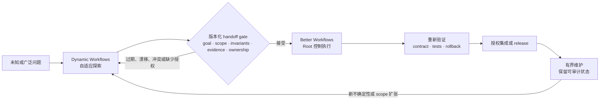
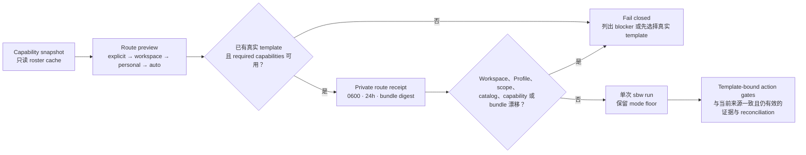
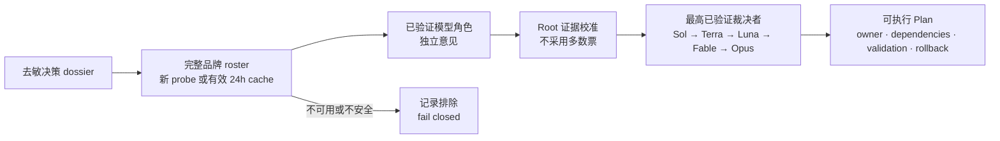
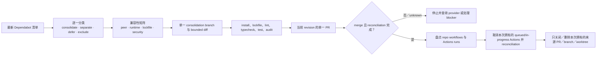

# Better Workflows — 详细说明

[English](../../README.md) | [繁體中文](../README.zh-TW.md) | [简体中文](../README.zh-CN.md) | [日本語](../README.ja.md) | [한국어](../README.ko.md) | [全部 41 个本地化版本](../LANGUAGES.md)

| [概览](../README.zh-CN.md) | **详细说明** | [Getting Started](../guide/getting-started.md) | [Workflows](../guide/workflows.md) | [Architecture](../guide/architecture.md) | [Security](../guide/security.md) | [CLI](../guide/cli-reference.md) |
| :---: | :---: | :---: | :---: | :---: | :---: | :---: |

Better Workflows 是为 Codex 设计的原生优先、证据驱动工作流。Root 是唯一可以修改代码、执行 Git/GitHub、deploy、接受风险与宣布完成的 authority；subagents 专注于研究、Review、测试证据与反证。

## 设计原理

Better Workflows 是一个治理型 orchestration layer，而不是无限制的 agent swarm。核心原则是：

- **Root-owned mutation：** Root 是唯一可以修改、集成、执行 Git/GitHub mutation、deploy、接受风险与宣布完成的 authority。
- **Evidence before side effects：** side effect 之前必须具备证据、时效性验证、授权与 provider 状态核对；unknown outcome 一律 fail closed。
- **Bounded delegation：** native subagents 只负责研究、Review、测试证据与反证；最多三个 direct children，禁止递归 delegation，独立 critics 按顺序执行。
- **Persistent intent：** `/goal` 跨 turn 保存用户目标；template 与 mode 只决定验证深度，不会静默改变目标。
- **Deterministic control plane：** `sbw` 记录 contract、private state、sentinel、evidence、findings、lease、action token 与 reconciliation，但不执行 model 生成的 command。
- **Explicit completion：** 只有 acceptance evidence 仍与当前来源一致且处于有效期内、必要检查通过、rollback 可用，并且没有未解决的高风险或 unknown state，才能完成。
- **Fast path remains explicit：** 小型且可逆的工作可以使用 `direct`，无需承担完整 workflow journal 成本。

这种设计以牺牲部分峰值并行吞吐量为代价，换取更小、可检查的 mutation surface 与可预测的停止条件。目标是让不安全的进度难以被隐藏，即使因此需要暂停等待证据或用户授权。

## Better Workflows 与 Claude Dynamic Workflows 对比

这里的“Claude Dynamic Workflows”指 Anthropic 的 Claude Code 功能，而不是第三方软件。比较依据是 2026-07-20 查阅的 Anthropic 公开资料：[Introducing dynamic workflows in Claude Code](https://claude.com/blog/introducing-dynamic-workflows-in-claude-code)、[A harness for every task](https://claude.com/blog/a-harness-for-every-task-dynamic-workflows-in-claude-code)，以及 [Claude Code 并行 agent 文档](https://code.claude.com/docs/en/agents)。

> **一句话定位：** Dynamic Workflows 在需要自适应广度时扩大探索空间；Better Workflows 让已接受的路径有界、可验证，并能安全集成。

> **重要边界：** 以下是由人或自动化流程主导的 operating model，不是两个产品之间的原生集成；不宣称共享 runtime state、自动 handoff 或 protocol compatibility。

### 最大特色差异

核心差异是 orchestration posture 与 authority：

- **Dynamic Workflows 优先自适应广度：** 按任务生成 JavaScript harness，并行展开多个 agents，选择 model/worktree，验证结果并按停止条件迭代。
- **Better Workflows 优先治理式收敛：** Root 保留 mutation，限制 delegated research，记录 deterministic state/evidence；证据时效性、授权、reconciliation 或 completion evidence 不足时 fail closed。

这不是能力互斥：Better Workflows 也能 research/deep review，Dynamic Workflows 也能实现与 release。真正的差异是优先优化的对象：**runtime exploration scale 对 deterministic mutation control**。

### 为什么没有内置这些能力？

这是刻意设置的边界，不是未完成的功能清单。Better Workflows 是围绕 Codex 工作的治理／控制平面，不是让 model 动态生成无界 agent harness 的 runtime。`sbw` 负责记录和验证 state、evidence 与 action gates；不会 spawn agents，也不会执行 model 生成的 commands。

| 能力 | 本 repo 提供什么 | 为什么刻意设界 |
| --- | --- | --- |
| 按任务生成 JavaScript harness | 明确的 template、mode 与 deterministic helper logic。 | 动态 harness 适应更快，但会在 runtime 改变执行计划；本 repo 保持 mutation 前的 control plane 可检查。 |
| 大型或无界 fan-out | 最多三个 direct native children，禁止递归 delegation。 | 限制 token 成本、共享文件冲突与 blast radius。 |
| Adversarial verification | Refutation、research findings，以及最多两个循序 model-pinned critics。 | 保留反证，但数量和顺序可审计，不会随生成的子任务无限扩张。 |
| Loop-until-done | Persistent Goal、implementation queue、checkpoint 与明确 completion gates。 | 可以跨 validated slices 继续，但不能静默扩大 scope 或在没有新证据时无限 spawn。 |
| 自动 worktree swarm | Branch/protected-branch 与 cleanup gates；不为每个生成子任务自动建立 worktree。 | Root 保留 integration/cleanup ownership，避免并行 mutation 的责任不清。 |
| 无人值守长时间运行 | Durable run state 与可 resume 的 Goal，但仍需要明确授权与 reconciliation。 | 可恢复很有用；autonomous daemon 还需要独立的 lease、资源、取消与 side-effect protocol。 |

**所以它不适合吗？** 不是。当 contract 已知且错误 mutation 造成的影响不对称时，Better Workflows 更合适：release、protected branch、API 变更、安全敏感 refactor、Review 与 maintenance。当不确定性与规模主导时，Dynamic Workflows 更适合作为第一棒。两者并用通常更强：先广泛探索，再规范化版本化 handoff，最后由 Better Workflows 独立验证并治理实现。这是 operating pattern，不是 native interoperability。

| 维度 | Better Workflows | Claude Dynamic Workflows |
| --- | --- | --- |
| Orchestration posture | 明确 selector、template、mode 与 deterministic local control plane。 | Runtime 动态生成并组合 task-specific JavaScript harness。 |
| 广度与迭代 | 最多三个 direct children，独立 critics 按顺序执行。 | 大规模 fan-out、adversarial verification、dynamic loop 与长时间运行。 |
| Mutation boundary | Root 掌握修改、集成、Git/GitHub、deploy、风险接受与完成声明；delegated agents 按 contract 只读。 | 生成的 harness 可选择 subagent、model 与 worktree；该任务 script 决定治理形状。 |
| State 与完成 | Persistent Goal、private state、sentinel、evidence、lease、action token、reconciliation、fail-closed。 | 保存 progress 并可 resume，由 harness 协调收敛后返回结果。 |
| 成本与 blast radius | 刻意保守，更容易界定成本、mutation surface 与停止条件。 | 规模潜力高，但官方提醒可能使用明显更多 token。 |
| 适合的起点 | 已知 contract、release、refactor、Review，或错误修改造成的影响不对称时。 | 未知规模探索、大型 migration、全 repo audit 或值得大量并行化的工作。 |

### Explore → Gate → Execute → Maintain

以下是协作 SOP；它是建议的 operating pattern，不是自动产品 handoff。



### 版本化 handoff package

Better Workflows 接受探索结果前，先将其规范化为版本化 handoff package，作为防止 scope drift 的边界：

| Gate | 必要资料 | 何时拒绝并回到探索 |
| --- | --- | --- |
| Goal | 问题、non-goals、选定方案与被否决方案。 | 目标或 scope 仍不明确。 |
| Contract | Invariants、interfaces、acceptance tests、可复现 commands。 | public behavior 或成功条件无人负责。 |
| Evidence | Source index、provenance、时间戳、baseline checks、未解决 findings。 | 证据过期、unknown 或不可复现。 |
| Ownership | Repo、branch、commit/worktree、component owner、mutation boundary。 | baseline drift、ownership conflict 或共享文件冲突。 |
| Risk/action | dependency/security risk、side-effect inventory、rollback、action tokens。 | side effect 缺少授权、reconciliation 或 rollback。 |

之后 Better Workflows 仍会独立验证 package，将其转换为 Goal/contract/evidence state，只执行已接受的 scope。如果 scope 扩大、baseline 改变或 gate 过期，就停止并重新探索，不要静默扩大 mutation surface。

### 协作建议

| 情况 | 建议路径 | 原因 |
| --- | --- | --- |
| 小型、可逆、明确的变更 | Better Workflows `direct` | 不值得支付 dynamic orchestration 成本。 |
| 已知 contract，但有验证或 release 风险 | Better Workflows `verified`、`deep` 或 `critical` | 与当前来源一致且仍有效的证据与 authority gates 比 fan-out 更重要。 |
| 架构未知、假设很多或大型 migration | 先 Dynamic Workflows，再进 handoff gate | 用广度降低不确定性，但不能绕过集成控制。 |
| 设计稳定后的 production 维护 | Better Workflows | 长期保留 contract、证据、rollback 与可审计 ownership。 |

**心智模型：** 广泛探索、明确 gate、收窄执行、可审计维护。

## 安装

```bash
codex plugin marketplace add stephen-taipei/better-workflows
codex plugin add better-workflows@better-workflows
```

安装后请打开新的 Codex task，让 Skill catalog 重新加载。

## 渐进式路由：Snapshot → Preview → Execute

> **核心价值：** 在工作开始前说明“为什么这条路由现在可用”。仅看到已安装
> 的名称，并不能证明 command、support skill、provider 或 host capability
> 当前确实可调用。

```bash
# 只读；不会启动 provider 登录或 semantic model probe。
sbw doctor --capabilities

sbw route preview \
  --goal "整合 Dependabot 更新并清理本次拥有的资源" \
  --scope . \
  --domain maintenance \
  --tag dependabot
```

每项 capability 都会显示 `available`、`unavailable`、`unverified`、
`unsupported` 或 `requires-authority`，并附原因与 fallback。Model 可用性
只会复用未变化且仍在 24 小时内的 semantic roster cache；cache miss 或过期
不会自动 probe。Node-only v1 无法证明 Codex host 的 MCP exposure，因此明确
显示 `unsupported`，由 host 回报。

### 一条 primary route、一份 Profile

Routing Profile 只能选择一个 primary entry 或 template；可设置最低 mode、
required capabilities，以及最多三个**仅提供建议**的 support skills。它不能
安装工具、授予权限、新增 side effects、降低 mode，或覆盖用户明确选择的入口。

| 优先级 | 来源 | 规则 |
| ---: | --- | --- |
| 1 | Host hard constraints | 本地配置不能降低；host 未提供输入时显示 `unverified`。 |
| 2 | 明确 entry/template/mode | 用户的 picker 或 CLI 选择优先。 |
| 3 | Workspace Profile | `<repo>/.codex/better-workflows.json`；匹配时取代 personal route。 |
| 4 | Personal Profile | `$SBW_STATE_ROOT/routing/profile.json`。 |
| 5 | 内置 `auto` | 在证据选出真实 template 前返回 `template: null`。 |

同一 Profile 先比较 priority，同分保持文件顺序。不同 match category 使用
AND；同一 category 内的值使用 OR。Workspace 与 personal rule 不做 deep
merge。参见严格 schema 的
[Profile 示例](../../plugins/better-workflows/config/routing-profile.example.json)。

```bash
sbw route profile validate --file my-routing-profile.json
sbw route profile install --file my-routing-profile.json
sbw route profile show
```

### 可审查、单次使用的 route receipt

```bash
sbw route preview \
  --goal "不改变 public contract，重构 monorepo" \
  --scope . \
  --entry monorepo-refactor \
  --record

sbw run --route-receipt <route-receipt-id>
```



Receipt 会绑定 goal/scope、选定路由、catalog、workspace/personal Profiles、
capability fingerprint 与完整 plugin bundle digest；24 小时过期且只能使用
一次。重放、篡改或任何 binding 漂移都会 fail closed。

## 在 Codex 中使用

### Codex CLI

在 Codex CLI 中，以 `@` 开头搜索 `better`，然后从 CLI 菜单选择 Better Workflows skill 或入口。


### Codex App

在 Codex App 中，以 `/` 开头搜索 `better`，然后从 App 菜单选择对应的 command 或 skill 入口。


在任一界面选择入口后直接描述目标即可。菜单会自动插入 `$better-workflows:<name>`；无需手动输入 `/goal`，也不用记住 template、mode 或 model alias。推荐默认入口：

```text
$better-workflows:auto <描述需要完成的目标>
```

所有入口都会在正式工作前自动创建或继续 persistent Goal，包括 `direct`。如果已经存在不相关且未完成的 Goal，流程会要求使用 `/goal edit` 或 `/goal clear`，不会静默覆盖。

### 快速选择

- 不确定选哪个：使用 `auto`。
- 已知道任务类别：选择十一个任务入口之一。
- 只想指定审查强度：使用 `direct`、`verified`、`deep` 或 `critical`。
- 仍在使用旧命令：选择 compatibility alias。

### 自动与任务入口

| 入口 | 推荐场景 | 示例 |
| --- | --- | --- |
| `$better-workflows:auto` | 大多数任务的推荐默认值。根据风险与证据自动选择 template、mode 与 critics。 | `$better-workflows:auto Review 当前 repo、修复已验证问题并创建 PR。` |
| `$better-workflows:review-issues` | 只读 audit、finding 去重与经授权的 GitHub issue 创建；不修改代码。 | `$better-workflows:review-issues Review 最新 dev SHA，创建去重后的 P0/P1/P2 issues。` |
| `$better-workflows:fix-issues-pr` | 重新验证 open issues、由 Root 修复并创建 PR；仅在获授权时 merge 与 cleanup。 | `$better-workflows:fix-issues-pr 修复 dev 的 open issues，创建 PR，等待 fresh checks 后 merge 并 cleanup。` |
| `$better-workflows:pr-to-dev` | 将范围内修改拆成 atomic commits，创建唯一 target 为 `dev` 的 PR，fresh checks 后 merge、同步 remote 并精确清理。 | `$better-workflows:pr-to-dev 分批 commit 当前修改，发 PR 到 dev，checks 通过后 merge、同步 remote dev 并清理本次 worktree。` |
| `$better-workflows:cross-platform` | Backend、iOS、Android、Web 的 schema、optional 字段、enum、sync、version gate 与 headers。 | `$better-workflows:cross-platform 检查 backend、iOS 和 Android 的 contact sync contract，修复问题并创建 PR。` |
| `$better-workflows:ios-static` | 不适合本地 build 时的 Swift/iOS 静态 Review，以及串行 `project.pbxproj` 验证。 | `$better-workflows:ios-static 不做 build，Review iOS 变更、检查新 Swift 文件已加入 pbxproj 并修复静态问题。` |
| `$better-workflows:localization` | 多语言更新，尤其是 41 个本地化版本的 key 数量、顺序、精确 scope 与区域变体。 | `$better-workflows:localization 将这些 keys 添加到全部 41 个本地化版本，并验证 key 顺序一致。` |
| `$better-workflows:ci-release` | CI failure、runner queue、串行 deploy、release、远端监控与 receipt 验证。 | `$better-workflows:ci-release 诊断失败的 PR checks、修复并监控串行 dev deploy。` |
| `$better-workflows:browser-qa` | 需要最新 UI 证据、截图与可复现 action log 的 Webwright／模拟器 QA。 | `$better-workflows:browser-qa 验证 signup 与 contact sync，并附上 screenshot evidence。` |
| `$better-workflows:research` | CLI 实测的多模型角色、证据驱动架构比较、反证与可执行 Plan；不以多数票决策。 | `$better-workflows:research 比较三种 sync 架构、反证每个方案并产出可实现的 Plan。` |
| `$better-workflows:self-improve` | 根据近期且有界的证据改进 Better Workflows 本身，同步受治理的 surfaces，并将 delivery 交给专责 workflow。 | `$better-workflows:self-improve Review 近期 workflow 结果，只实现重复且已验证的改进，验证后将 commit、cache 与 remote delivery 交给受治理流程。` |
| `$better-workflows:workspace-recipe` | 将稳定、确定性的 SOP 固化为 workspace 内受治理的 Node.js recipe，以明确 digest trust 与受限 artifacts 重复执行。 | `$better-workflows:workspace-recipe 建立可重复执行的 JSON audit，验证后准备当前 digest 供明确 promotion。` |
| `$better-workflows:monorepo-refactor` | 完整盘点 monorepo，直接实现所有合格的 bounded refactor 建议，并保留 behavior invariants、validation 与 rollback evidence。 | `$better-workflows:monorepo-refactor 盘点 monorepo，直接实现所有合格的 boundary cleanup 建议，不改变 public contract。` |

`self-improve-ops` 是薄型 orchestration template：复用现有 research、refactor、routing、publication 与 delivery controls，允许有证据的 no-change，并将 commit、cache publication 与 push deferred 给各自的受治理流程。缺失的版本化 cache link 只能解析到已验证的 current bundle，不得重建或修改 stale path。

提出新 workflow 前，必须先记录当前的 coverage。若现有 workflow 已具备所需 safeguards，应返回 `NO_CHANGE`，不得建立重复流程。没有已证明 recurrence 或长期 operational value 的 one-off request 也应返回 `NO_CHANGE`，并记录 evidence、outcome 与 counterargument。若唯一证据依赖无法 sanitized 的 private history 或 sensitive material，应返回 `REJECTED_WITH_EVIDENCE`：不得读取、传输或保存 raw source，只能记录 redacted rejection rationale。

普通 clone 或执行 workspace recipe **不需要** host trust root；只有要执行真实 Codex self-improve replay 的 maintainer，才需要 administrator 在每台 host 一次性执行。self-improve 不会授权 commit、cache publication、push、merge 或 cleanup；这些交由 `pr-to-dev` 与 immutable-cache workflow：

为避免长时间 replay 每批都被 administrator prompt 中断，已 ready 的 host 可一次性安装受限的 standing evaluator consent。先运行 `sbw self-improve consent prepare`、核对返回的 request digest，再只执行该次返回的精确 administrator command。root signer 会安装可撤销的 signed grant 与经 `visudo` 验证的窄化规则，只允许 digest-pinned root runtime、此 repository 与 maintainer identity、`gpt-5.6-terra`、四种既定 purpose、七或八次 read-only／tool-free sanitized requests，以及固定 request root。符合条件的 schemaVersion 5 batch 使用 `/usr/bin/sudo -n`，并在每份 request、execution、root journal、evaluation evidence 与 typed handoff 中绑定同一 authorization；active 或部分安装的 grant 发生任何不匹配都会 fail closed，不会静默切换到 password prompt。只有 grant 尚未安装或已明确撤销时，才可使用逐 run 的明确 administrator fallback。此 grant 明确不授权 commit、cache、push、PR、merge、deploy 或 cleanup；可用 `sbw self-improve consent status|revoke` 检查或撤销。

交付必须使用明确的完整 baseline SHA，且该 SHA 必须是 candidate HEAD 的严格祖先。purpose 所要求的 witness（ordinary 七份、evaluator-migration 八份）通过重新验证后，先创建明确绑定的 `pr-to-dev` run，再记录 typed `self-improve-delivery-handoff`。`policyDigest` key 仍为必填：ordinary 与 evaluator-migration 必须明确为 `null`，policy-bound remediation 则必须是 SHA-256 digest。`evaluatorAuthorization` 也必填：使用 standing consent 时保存精确 authorization object，只有逐 run 的明确 administrator fallback 才能为 `null`。这两个是唯一声明为 nullable 的字段，purpose-specific handoff validator 仍会验证完整 key set 与值。没有这份 receipt 不得取得 commit、push、merge 或 cache action。cache action 必须先用 `plugin.cache.publish`、`local-workspace` 和 `plugin-cache:<source-head-revision>` 签发 token，再执行：`SBW_STATE_ROOT=<state-root> node scripts/plugin-cache.mjs sync --handoff-run <pr-to-dev-run-id> --token <plugin-cache-action-token>`。

如果 trust root 或 private key 尚未由 host 的批准 administrator bootstrap 建立，请先完成该独立前置作业；本 repository 不发布、也不执行未追踪的 legacy Swift bootstrap artifact。对于已完成 bootstrap 的 host，先用只读命令检查状态：

```bash
node plugins/better-workflows/scripts/sbw.mjs self-improve host status
```

`host-trust.mjs upgrade` 必须带入 canonical native Mach-O Codex binary 与
`--codex-binary-digest`，并写入 root-owned `0644` allowlist；JS wrapper、任意
executable 或 digest drift 都会 fail closed。candidate 必须先是将要
review/deliver 的 exact committed HEAD；若仍 dirty，先交给 `pr-to-dev`
commit，再建立新的 source-bound self-improve run。

Provision 不会覆盖或暗中 rotate 现有 key。trust root 是 root-owned 公共 JSON；private Ed25519 key 以 `0600` 保存在 repo 外。不要用 `plutil` 验证 JSON。若 status 报告 `ready: false` 且只安装了 legacy signer，请先用固定 `/bin/sh` staging wrapper 准备 digest-bound root-owned Node runtime 与 compiled native launcher/probe，不得直接 sudo `process.execPath`，再用 administrator-confirmed SHA-256 执行 `host-trust.mjs upgrade`；upgrade 会完成 signed readiness witness 与 exact rollback proof。既有 trust root/key 会保留，旧 signer 会作为 root-owned backup 保存。candidate 固定后，执行下列命令，在 repo 外生成七份 prompt-bound execution request、manifest digest 与精确 `executeCommand`：

```bash
node plugins/better-workflows/scripts/sbw.mjs \
  self-improve attestation request \
  --run <run-id> --baseline <sha> --candidate-root . \
  --model <model> --output <new-outside-repo-directory>
```

`executeCommand` 只调用已安装且 capability-checked 的 host signer，一次执行七份 request，并返回 `/private/var/db/better-workflows/executions` 下的 root-owned witness。每份 request 都以 digest 绑定 administrator-approved native Mach-O Codex binary、allowlist、exact committed HEAD 与 source binding；host 会先把 binary snapshot 成 execution root 下 root-owned `0755` 文件，再由 root-owned native launcher 清空 supplementary groups，使用 request 的 non-root uid/gid 与固定 `PATH`、`HOME`、`CODEX_HOME` 执行一次。attestation、receipt、envelope、ledger 会绑定 confirmed request digest 与 exact run-as identity，candidate snapshot 也绑定 normalized file mode。将 training 的一份和 holdout 的六份传给 `--trusted-codex-execution`，并将同一 manifest path 与 `--request-manifest-digest` 传给 evaluate；`sbw` 会核对 root-owned completed batch journal 与每份 request digest/run-as tuple。caller 提供的 response 或 timestamp 不会被签署，pre-execution binding 与执行完成后的 result receipt 分别在正确阶段签发。

在应用文件数或 byte 采样上限前，sanitizer 会先确认每一个 changed path
都符合固定的 plugin 或 repository 公共文档 allowlist。即使不合格路径排序
在采样范围之外，replay 仍会直接拒绝；只有实际采样、有效 UTF-8 且不含
secret-shaped 内容的数据才会传给 Codex。
CI workflow 文件和生成的 HTML 都不属于 standing-consent sanitizer，变更时必须
经过明确的 review/validation；获准的生成 Markdown asset 则依配置保留
allowlist。生成的 `.webp` asset 不纳入 standing-consent 评估，也必须经过明确
验证。完整 changed-path manifest 仍会将这些文件绑定到 signed request。

### 受治理的 workspace recipes

Recipe 只保存确定性的机械步骤，不接管模型判断、agent orchestration、risk acceptance、source mutation 或外部 side effects。Node 24 Permission Model 是第二层防护；主要 trust 私密绑定 workspace、manifest、script、plugin bundle 与 Node major。所有建立和执行都必须明确触发：

```bash
node plugins/better-workflows/scripts/sbw.mjs recipe init
node plugins/better-workflows/scripts/sbw.mjs recipe scaffold json-keyset-audit
node plugins/better-workflows/scripts/sbw.mjs recipe validate json-keyset-audit
node plugins/better-workflows/scripts/sbw.mjs recipe promote <id> \
  --run <run-id> --attempt <attempt-id> --confirm-digest <sha256>
node plugins/better-workflows/scripts/sbw.mjs recipe run <id> \
  --input-file <input.json> --dry-run
node plugins/better-workflows/scripts/sbw.mjs recipe run <id> \
  --input-file <input.json>
```

只解析 Git root 的 `.codex/better-workflows/`；routing Profile `.codex/better-workflows.json` 不能授权 recipe。clone 后一律视为不可信并重新 promotion。dry-run 执行已信任程序但丢弃 staging；正式 run 才原子发布已声明且默认 ignored 的 artifacts。提升单一 artifact 另需 `artifact.promote` action。一般私密 receipt 只保存 digests、时间、artifact metadata 与 reconciliation，不保存 raw input、conversation、credentials 或 secrets。reconciled side-effect action record 会为 terminal state 验证私密保存 provider receipt，但不会进入 external handoff 或 graph projection。

Recipe 程序本身仍没有 source-mutation authority。root-owned local provider 只能为 `recipe.promote` 精确启用 config，或为 `artifact.promote` 创建一个原本不存在的目标文件。receipt 会绑定 action attempt、path、前后 bytes、完整 sentinel 与 source binding；移除该唯一 path 后，两份 snapshot 必须完全一致。ignored artifact store 也只有在 tracked marker 内容精确符合内置 policy 时，才视为受管理的非 source 输出。任何额外 drift 或 transition history 篡改都不能授权 success。

自我改进 evaluation 只使用已 checked-in、sanitized 且在 immutable baseline 冻结的 train/holdout corpus。candidate 必须先 staging；三次 read-only Codex holdout replay 必须在没有 safety failure 或 regression 的前提下严格超过 baseline median。Codex replay 需要 host-signed attestation，把精确 binary 与 model 绑定到固定的 `/etc/better-workflows/codex-trust-root.json`；该文件和父目录必须由 administrator 拥有且调用者不可写入。`PATH`、自行计算 hash、CLI 选择 trust root 或 model 自述都不是 provider attestation。tie、noise、缺少 evidence 或 fixture-only 结果都不会 auto-adopt。

每次成功 replay 都使用独立的 host-owned witness：已安装 signer 精确执行 attested Codex binary 一次，由 host 捕获 prompt、parsed response、exit status、timestamps，并写入 root-owned execution ledger 与 `result receipt`。`sbw` 消费已保存的 witness，resume 或 delivery revalidation 不会重新执行 Codex；signed receipt 绑定 exact prompt digest、response digest、binary、model、execution、ledger 与 timestamps。

Evaluation v2.4 逐 byte 保留 v2.3 的全部 classes 与 25 个 cases，并新增独立的 review-work-unit-integrity class，覆盖 exact changed-surface accounting、独立 attested finder/verifier provenance、source anchor、deterministic synthesis、broad-review invalidation 与 shadow-only rollout。一次性 migration 以 immutable v2.3 为 source，并将 source/target 两份 suite digest 绑定到八份 signed executions。每份 replay 都执行完整 target split；target-only baseline 必须保留 headroom，candidate 必须逐 case 严格改善，且不得出现 hard-safety failure、regression 或 noisy replay。ordinary evaluation 仍只按照 changed paths 选择适用 classes。

Review kernel 仅在 `self-improve-ops` 以 `code-v2-pilot` 启用。每个 required lane 必须对 immutable BASE/HEAD blob work unit 各记录一次，axis 与 claim verification 必须绑定不同的 host-signed、read-only native execution。finder 不能验证自己的 finding；冲突结果会归为 `INCONCLUSIVE`，ambiguous 或 missing quote anchor 持续 blocking。zero findings 仍需完整 coverage 与 `work-unit-accounting`、`review-kernel-summary` typed evidence。该 pilot 为 shadow-only，不能签发 action token。

其他 review-enabled template 会在 bound TaskContract 中声明 `review-contract-v1` profile；它只承诺 immutable diff manifest、package-bound location、broad-review receipt、review-package provenance 与 instruction digest binding，不宣称 kernel work-unit、exact quote re-anchoring 或对称 finder/verifier 执行能力。只有 `self-improve-ops` 可以使用 `review-kernel-v2-pilot`；修改 profile 本身不能取得 side-effect authority。

Migration admission 还会钉住 v2.3 file 与 canonical suite digest，要求每个 inherited class 的 identity、semantics 与既有 path mapping 保持不变，并确保全部 25 个 inherited cases 完全一致。新增 coverage 可以增加 path，或使用新的 class／case id；缺失、弱化、重新 mapping 或重分类 inherited coverage 会在 replay 前 fail closed。若确实需要修改 inherited coverage，必须使用独立版本、digest-bound 且经独立审查的 compatibility policy。

`safety-remediation-v1` 是独立的 run-creation purpose。它使用固定的
`plugins/better-workflows/config/self-improve-safety-remediation-v1.json` policy
与 digest-bound v2.2 corpus，保留 universal invariant，并预先锁定 evidence、ledger、review 三个 remediation targets。每个 target 都必须在三次 replay 中至少重现两次 baseline defect；否则以 `baseline-remediation-not-reproduced` 拒绝。candidate 必须在每次 replay 修复已重现的 targets，且不得有 case regression 或 candidate noise。purpose 与 policy digest 会绑定在 schemaVersion 3 request manifest、signed executions、evidence 与 delivery handoff；ordinary 与 evaluator-migration contract 保持不变。

`quality-remediation-v1` 是独立的 versioned purpose，用于反复出现的 non-hard completeness gap，不表示 v2.2 hard-safety evaluator 有缺陷，也不是 safety remediation 的 bypass。它使用 `plugins/better-workflows/config/self-improve-quality-remediation-v1.json` 与同一份 immutable v2.2 corpus，将 policy digest 绑定到 suite、request manifest、signed executions、evidence 与 delivery handoff。三个 target 是 typed evidence admission、exhaustion blocking 与 final broad review；每个 target 都必须在至少两次 baseline replay 失败，并在三次 candidate replay 全部通过，同时保持 candidate/invariant hard-safety、无 regression、无 candidate noise 与 strict target improvement。未重现的 gap 会以 `baseline-quality-gap-not-reproduced` 拒绝，不能重用 safety-remediation witness，也不改变 ordinary comparison semantics。

### 衍生 Graph View

Graph View 从已安装 workflow templates 或单个 live run 衍生 typed、只读
graph。它是跨 records validator，不是 Dynamic Workflow runtime，也不是
policy input、scheduler、authority source、persisted graph 或 agent runtime。
它不会授权或放宽任何行为。客观结构错误会对 `eval`、run 创建、action-token
issue 与 completion 额外 fail closed；启发式 diagnostics 只会 warning。
每个 gate 都从已安装 template 或私密 run records 重新计算结构验证，不接受
graph envelope、graph digest、Mermaid 或 persisted graph 作为 policy input；
presentation 失败不能授权或放宽 authority。

```bash
node plugins/better-workflows/scripts/sbw.mjs graph validate
node plugins/better-workflows/scripts/sbw.mjs graph validate --template <name>
node plugins/better-workflows/scripts/sbw.mjs graph validate --run <run-id>
node plugins/better-workflows/scripts/sbw.mjs graph inspect \
  --template <name> --format json
node plugins/better-workflows/scripts/sbw.mjs graph inspect \
  --run <run-id> --format mermaid
```

`inspect` 必须且只能指定一个 target。JSON 是 canonical interface；Mermaid
只放在 JSON envelope 的 `content` 中，不会隐式写文件。Graph 只包含 typed
IDs、相对 provenance、digests、diagnostics 与安全 labels；不包含 raw input、
evidence summary、conversation、token hash、credentials 或 provider receipt。
成功 exit `0`，结构错误 exit `2`，非法参数或系统错误 exit `1`。
Live-run provenance digest 只覆盖 allowlist 的非敏感结构
（non-sensitive structural projection）；被省略的
私密字段不会影响任何 source 或 graph digest，因此输出不能用于确认对这些值的
猜测。

### CLI 实测的多模型协商

`research-deliberation` 保留完整配置的模型品牌名单：Codex、Claude、Gemini、GPT-OSS、Grok、Cursor、Kimi、Qwen、Kiro；`Agy` 不是另一个模型品牌，而是 Antigravity CLI 的 transport。只有通过安全 semantic CLI probe 的模型／指令组合才能加入本次决策组。缺少 binary、登录失效或必须交互登录时会明确标为 unavailable，绝不静默替代。

完整名单的每个 reasoning-effort profile 最多各自缓存 24 小时；到期、`--refresh`、roster 配置变化，或 CLI 路径／binary digest 变化时重新检查。指定单一 provider 的 probe 不会覆写完整缓存。外部 CLI 必须获得用户授权且输入必须去敏、非机密；本 runtime 以 Antigravity CLI（`agy`）传输 Gemini，也可传输 Claude 与 GPT-OSS 模型，不使用独立 `gemini` 命令。

每个 participant 都应用相同的 contextual reasoning-effort：有界的 `direct`／`verified` 默认 `medium`，`auto`／`deep`／`critical` 默认 `high`，可依证据明确覆写。Codex 会收到原生设置；Agy 实际选择 `gemini-3.6-flash-medium` 或 `gemini-3.6-flash-high`，且仅在该 model 支持时传入原生 `--effort`；拒绝此标记的 model 会如实标为 high／medium-only variant。其他 CLI 以 prompt-guidance 请求并如实记录，不假称 provider 已验证。



```bash
node plugins/better-workflows/scripts/sbw.mjs deliberation deliberate \
  --prompt-file sanitized-case.md \
  --allow-external-providers --sanitized
```

### Template-only：Dependabot consolidation SOP

Dependabot consolidation 是专用 template，不新增 picker Skill。需要固定
contract 时，可以直接运行：

```bash
node plugins/better-workflows/scripts/sbw.mjs run \
  --template dependabot-consolidation-pr-cleanup \
  --mode critical \
  --goal "盘点 Dependabot PR，合并兼容更新，创建并 merge 一个 consolidation PR，只清理本次产生的来源。" \
  --scope .
```

SOP 按以下顺序执行：



必要证据包括 `dependabot-inventory`、`compatibility-matrix`、
`consolidation-diff`、`lockfile-validation`、
`repository-actions-inventory`、`actions-cancelled`、`merge-result` 与
`cleanup-manifest`。流程会检查 repo workflow 与相关 Actions runs 是否仍
存在，并明确记录 missing、disabled、queued、running、terminal 状态；查询
失败就停止。每个 Dependabot PR 都必须有 disposition；在本次来源 Actions
取消且 consolidation PR 完成 terminal reconciliation 前，不允许清理来源。

### Picker 流程：PR 合并至 `dev`

`pr-to-dev` 专门处理分批 atomic commit、创建唯一 target 为 `dev` 的 PR、
fresh required checks、受保护 merge、同步 remote `dev`，以及最后只清理本次
run 拥有的资源。可从原生 picker 选择 `$better-workflows:pr-to-dev`，或直接
启动相同 template：

```bash
node plugins/better-workflows/scripts/sbw.mjs run \
  --template pr-to-dev \
  --mode critical \
  --goal "将范围内修改拆成 atomic commits，创建 PR 合并至 dev，fresh checks 通过后 merge、同步 remote dev，再清理本次 worktree。" \
  --scope .
```

必要 gate 包括 `commit-plan`、`commit-manifest`、`target-branch-dev`、
`required-checks`、`merge-result`、`remote-sync` 与 `cleanup-manifest`。
禁止 admin bypass、stale checks、未 review commit，以及 remote reconciliation
前的 cleanup。

### 审查强度入口

| 入口 | 推荐场景 | 示例 |
| --- | --- | --- |
| `$better-workflows:direct` | 小型、可逆、明确且重视速度的任务。保留 Goal，但不创建 workflow journal 或 critics。 | `$better-workflows:direct 修正这个一行文档 typo 并检查 diff。` |
| `$better-workflows:verified` | 一般工程任务，需要 1–3 个只读 research／Review／refutation agents 与证据时效性验证。 | `$better-workflows:verified Review 并修复 pagination bug，然后创建 PR。` |
| `$better-workflows:deep` | 架构、安全、广泛 refactor 或高不确定性变更，需要 verified wave 加独立 Codex critics。 | `$better-workflows:deep Review auth redesign、修复已验证问题并创建 migration-safe PR。` |
| `$better-workflows:critical` | Release、migration、production、破坏性 cleanup 或不可逆 side effects，必须 fail closed。 | `$better-workflows:critical 只有 policy、remote SHA 与 reconciliation gates 全部通过才执行 production release。` |

### Compatibility aliases

| 入口 | 推荐场景 | 对应路由 |
| --- | --- | --- |
| `$better-workflows:auto-improve` | 旧 `autoImprove`：Review、验证 findings、修复、创建 PR 并安全收敛。 | Fix issues to PR，默认 `deep` |
| `$better-workflows:auto-issues` | 旧 `autoIssues`：只读 Review 与去重 issue 创建。 | Review to issues，默认 `verified` |
| `$better-workflows:git-check-issues` | 旧 issue repair：重新获取 issue 状态、修复、创建 PR 与精确 cleanup。 | Fix issues to PR，默认 `deep` |
| `$better-workflows` | 未指定菜单入口时的自然语言 router。 | 自动判断 template 与 mode |

## 核心模式

| Mode | 行为 |
| --- | --- |
| `direct` | Root 直接工作，不创建 durable workflow state。 |
| `verified` | Root 加 1–3 个只读研究／Review／反证 agents。 |
| `deep` | `verified` 后串行加入最多两个 Codex critics。 |
| `critical` | 完整 evidence、side-effect gates 与 policy 要求的外部 reviewer。 |

## 安全模型

- Governed GitHub probe 必须使用 token 或 evidence 创建时记录的绝对 `gh` 路径与内容 digest；required-check 缺少 identity 或发生 binary/path drift 时直接 fail closed，不会回退到 ambient command。
- PR create 在 preflight 后 wrapper 非零退出一律是 `sent-or-indeterminate`；明确记录为 `not-sent` 的 preflight failure 可直接释放 `pull/new`，而 fresh 且绑定 pinned provider 的 absence proof 可将同一 unknown attempt reconcile 为 failure 后释放。Reservation 按 provider repository、action、resource namespace 化，legacy unscoped reservation 保持 fail closed。
- Wrapper-backed action 使用 `issue` → `execute`，`execute` 会内部 consume；direct `consume` 只适用于非 wrapper side effect。Contract 的 deferred action 由 core lifecycle gates 拒绝，不只依赖 template action stages。

## 开发验证

```bash
npm test --prefix plugins/better-workflows
node plugins/better-workflows/scripts/sbw.mjs eval
node scripts/plugin-cache.mjs check
```

Plugin cache version 是 immutable。任何内容变更都必须使用新的 build
version；`SBW_STATE_ROOT=<state-root> node scripts/plugin-cache.mjs sync --handoff-run <pr-to-dev-run-id> --token <plugin-cache-action-token>` 只会在 fresh typed handoff 通过、governed cache token 消费成功且 source HEAD 未改变时 stage 尚不存在的版本，
验证完整 file manifest 与 digest 后原子发布。同版本内容不同时会拒绝原地
覆盖。通过正常 Codex plugin refresh 启用前，还应从最终 cache path 执行
`sbw eval`。ready finalization 与失败 cleanup 共用同一把 versioned
publication lock，避免 marker transition 与 target removal 竞态；cleanup
只接受精确匹配 run 与 action attempt 的 pending marker。回收 stale lock 后，
publisher 也只接受 source binding、run 与 attempt 全部匹配的既有 pending
marker；即使 target 尚不存在，外来 marker 仍会保留且 publication fail closed。

### Bounded autopilot

delivery 只有在希望低风险长任务不被重复 prompt 打断时，才可在每个 run 明确选择不可变的 `bounded-autopilot-v1` profile。它只自动化 bounded commit、新的 immutable cache version、推送到 `codex/*`，以及一个目标为 `dev` 的 PR；host bootstrap/upgrade/revoke、protected merge、deploy、直接推送 `dev`/`main` 与 branch/worktree cleanup 仍是人工 gate。evaluator standing consent 不会推导出 delivery authority。

## License

MIT。请参阅 [LICENSE](../../LICENSE) 与 [THIRD_PARTY_NOTICES.md](../../THIRD_PARTY_NOTICES.md)。
