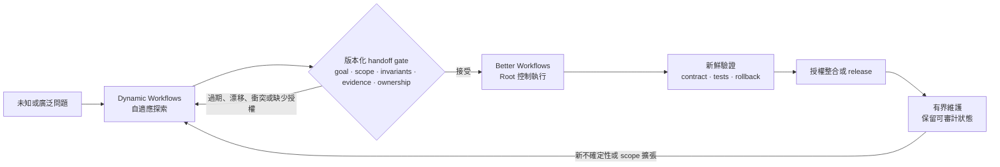
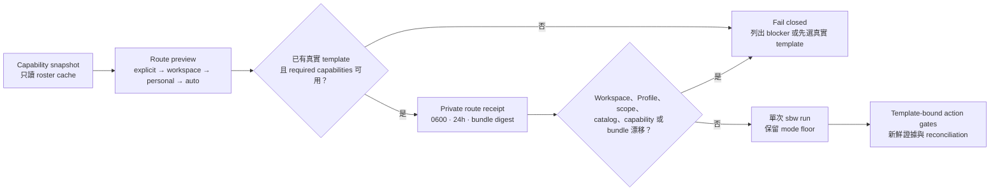
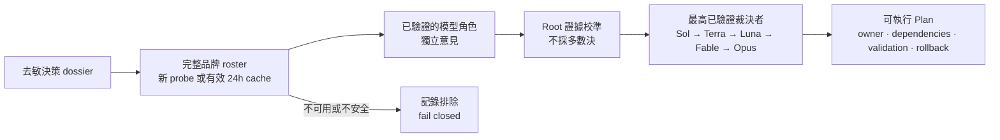
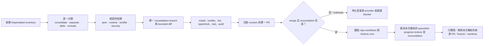

# Better Workflows — 詳細說明

[English](../../README.md) | [繁體中文](../README.zh-TW.md) | [简体中文](../README.zh-CN.md) | [日本語](../README.ja.md) | [한국어](../README.ko.md)

| [概覽](../README.zh-TW.md) | **詳細說明** | [Getting Started](../guide/getting-started.md) | [Workflows](../guide/workflows.md) | [Architecture](../guide/architecture.md) | [Security](../guide/security.md) | [CLI](../guide/cli-reference.md) |
| :---: | :---: | :---: | :---: | :---: | :---: | :---: |

Better Workflows 是為 Codex 設計的原生優先、證據驅動工作流。Root 是唯一能修改程式碼、執行 Git/GitHub、deploy、接受風險與宣告完成的 authority；subagents 專注於研究、Review、測試證據與反證。

## 設計原理

Better Workflows 是治理型的 orchestration layer，不是無限制的 agent swarm。核心原則是：

- **Root-owned mutation：** Root 是唯一能修改、整合、執行 Git/GitHub mutation、deploy、接受風險與宣告完成的 authority。
- **Evidence before side effects：** side effect 前必須有證據、freshness、授權與 provider reconciliation；unknown outcome 一律 fail closed。
- **Bounded delegation：** native subagents 只負責研究、Review、測試證據與反證；最多三個 direct children，禁止遞迴 delegation，獨立 critics 依序執行。
- **Persistent intent：** `/goal` 跨 turn 保存使用者目標；template 與 mode 只決定驗證深度，不會偷偷改變目標。
- **Deterministic control plane：** `sbw` 記錄 contract、private state、sentinel、evidence、findings、lease、action token 與 reconciliation，但不執行 model 生成的 command。
- **Explicit completion：** 只有 acceptance evidence 仍然新鮮、必要檢查通過、rollback 可用，且沒有未解決的高風險或 unknown state，才能完成。
- **Fast path remains explicit：** 小型且可逆的工作可使用 `direct`，不必承擔完整 workflow journal 成本。

這個取捨是用部分最高平行吞吐量，換取較小、可檢查的 mutation surface 與可預期的停止條件。目的是讓不安全的進度難以被隱藏，即使因此需要暫停等待證據或使用者授權。

## Better Workflows 與 Claude Dynamic Workflows 比較

這裡的「Claude Dynamic Workflows」指 Anthropic 的 Claude Code 功能，不是第三方套件。比較依據是 2026-07-20 查閱的 Anthropic 公開資料：[Introducing dynamic workflows in Claude Code](https://claude.com/blog/introducing-dynamic-workflows-in-claude-code)、[A harness for every task](https://claude.com/blog/a-harness-for-every-task-dynamic-workflows-in-claude-code)，以及 [Claude Code 平行 agent 文件](https://code.claude.com/docs/en/agents)。

> **一句話定位：** Dynamic Workflows 在需要自適應廣度時擴大探索空間；Better Workflows 讓已接受的路徑有界、可驗證，並能安全整合。

> **重要邊界：** 以下是人或自動化流程主導的 operating model，不是兩個產品之間的原生整合；不宣稱共享 runtime state、自動 handoff 或 protocol compatibility。

### 最大特色差異

核心差異是 orchestration posture 與 authority：

- **Dynamic Workflows 優先自適應廣度：** 依任務生成 JavaScript harness，平行展開多個 agents，選擇 model/worktree，驗證結果並依停止條件迭代。
- **Better Workflows 優先治理式收斂：** Root 保留 mutation，限制 delegated research，記錄 deterministic state/evidence；freshness、授權、reconciliation 或 completion evidence 不足時 fail closed。

這不是能力互斥：Better Workflows 也能 research/deep review，Dynamic Workflows 也能實作與 release。真正的差異是優先最佳化的對象：**runtime exploration scale 對 deterministic mutation control**。

### 為什麼沒有內建這些功能？

這是刻意設定的邊界，不是未完成的功能清單。Better Workflows 是圍繞 Codex 工作的治理／控制平面，不是讓 model 動態生成無界 agent harness 的 runtime。`sbw` 負責記錄與驗證 state、evidence 與 action gates；不會 spawn agents，也不會執行 model 生成的 commands。

| 能力 | 本 repo 提供什麼 | 為什麼刻意設界 |
| --- | --- | --- |
| 依任務生成 JavaScript harness | 明確 template、mode 與 deterministic helper logic。 | 動態 harness 適應更快，但會在 runtime 改變執行計畫；本 repo 保持 mutation 前的 control plane 可檢查。 |
| 大型或無界 fan-out | 最多三個 direct native children，禁止遞迴 delegation。 | 限制 token 成本、共用檔案衝突與 blast radius。 |
| Adversarial verification | Refutation、research findings，以及最多兩個循序 model-pinned critics。 | 保留反證，但數量與順序可審計，不會隨生成的子任務無限擴張。 |
| Loop-until-done | Persistent Goal、implementation queue、checkpoint 與明確 completion gates。 | 可跨 validated slices 繼續，但不能靜默擴張 scope 或在沒有新證據時無限 spawn。 |
| 自動 worktree swarm | Branch/protected-branch 與 cleanup gates；不為每個生成子任務自動建立 worktree。 | Root 保留 integration/cleanup ownership，避免平行 mutation 的責任不清。 |
| 無人值守長時間執行 | Durable run state 與可 resume 的 Goal，但仍需明確授權與 reconciliation。 | 可恢復很有用；autonomous daemon 還需要獨立的 lease、資源、取消與 side-effect protocol。 |

**所以它不適合嗎？** 不是。當 contract 已知，且錯誤 mutation 的下行風險不對稱時，Better Workflows 更合適：release、protected branch、API 變更、安全敏感 refactor、Review 與 maintenance。當不確定性與規模主導時，Dynamic Workflows 更適合作為第一棒。兩者並用通常更強：先廣泛探索，再正規化版本化 handoff，最後由 Better Workflows 獨立驗證並治理實作。這是 operating pattern，不是 native interoperability。

| 面向 | Better Workflows | Claude Dynamic Workflows |
| --- | --- | --- |
| Orchestration posture | 明確 selector、template、mode 與 deterministic local control plane。 | Runtime 動態生成並組合 task-specific JavaScript harness。 |
| 廣度與迭代 | 最多三個 direct children，獨立 critics 依序執行。 | 大量 fan-out、adversarial verification、dynamic loop 與長時間執行。 |
| Mutation boundary | Root 掌握修改、整合、Git/GitHub、deploy、風險接受與完成宣告；delegated agents 依 contract 唯讀。 | 生成的 harness 可選擇 subagent、model 與 worktree；該任務 script 決定治理形狀。 |
| State 與完成 | Persistent Goal、private state、sentinel、evidence、lease、action token、reconciliation、fail-closed。 | 保存 progress 並可 resume，由 harness 協調收斂後回傳結果。 |
| 成本與 blast radius | 刻意保守，較容易界定成本、mutation surface 與停止條件。 | 規模潛力高，但官方提醒可能使用明顯更多 token。 |
| 適合的起點 | 已知 contract、release、refactor、Review 或下行風險不對稱的變更。 | 未知規模探索、大型 migration、全 repo audit 或值得大量平行化的工作。 |

### Explore → Gate → Execute → Maintain

以下是協作 SOP；它是建議的 operating pattern，不是自動產品 handoff。



### 版本化 handoff package

Better Workflows 接受探索結果前，先正規化成版本化 handoff package，作為防止 scope drift 的邊界：

| Gate | 必要資料 | 何時拒絕並回到探索 |
| --- | --- | --- |
| Goal | 問題、non-goals、選定方案與被否決方案。 | 目標或 scope 仍不明確。 |
| Contract | Invariants、interfaces、acceptance tests、可重現 commands。 | public behavior 或成功條件無人負責。 |
| Evidence | Source index、provenance、時間戳、baseline checks、未解 findings。 | 證據過期、unknown 或不可重現。 |
| Ownership | Repo、branch、commit/worktree、component owner、mutation boundary。 | baseline drift、ownership conflict 或共用檔案衝突。 |
| Risk/action | dependency/security risk、side-effect inventory、rollback、action tokens。 | side effect 缺少授權、reconciliation 或 rollback。 |

之後 Better Workflows 仍會獨立驗證 package，將它轉換為 Goal/contract/evidence state，只執行已接受的 scope。若 scope 擴大、baseline 改變或 gate 過期，就停止並重新探索，不要靜默擴張 mutation surface。

### 協作建議

| 情境 | 建議路徑 | 原因 |
| --- | --- | --- |
| 小型、可逆、明確的變更 | Better Workflows `direct` | 不值得支付 dynamic orchestration 成本。 |
| 已知 contract，但有驗證或 release 風險 | Better Workflows `verified`、`deep` 或 `critical` | 新鮮證據與 authority gates 比 fan-out 更重要。 |
| 架構未知、假設很多或大型 migration | 先 Dynamic Workflows，再進 handoff gate | 用廣度降低不確定性，但不能繞過整合控制。 |
| 設計已穩定後的 production 維護 | Better Workflows | 長期保留 contract、證據、rollback 與可審計 ownership。 |

**心智模型：** 廣泛探索、明確 gate、窄化執行、可審計維護。

## 安裝

```bash
codex plugin marketplace add stephen-taipei/better-workflows
codex plugin add better-workflows@better-workflows
```

安裝後請開新的 Codex task，讓 Skill catalog 重新載入。

## 漸進式路由：Snapshot → Preview → Execute

> **核心價值：** 工作開始前先說明「為什麼這條路由現在可用」。只看到已安裝
> 的名稱，不等於 command、support skill、provider 或 host capability
> 目前真的可以呼叫。

```bash
# 唯讀；不會啟動 provider 登入或 semantic model probe。
sbw doctor --capabilities

# 唯讀路由預覽。
sbw route preview \
  --goal "整合 Dependabot 更新並清理本次擁有的資源" \
  --scope . \
  --domain maintenance \
  --tag dependabot
```

每項 capability 都會顯示 `available`、`unavailable`、`unverified`、
`unsupported` 或 `requires-authority`，並附理由與 fallback。Model 可用性
只會重用未變更且仍在 24 小時內的 semantic roster cache；cache miss 或過期
不會自動 probe。Node-only v1 無法證明 Codex host 的 MCP exposure，因此明確
標示 `unsupported`，交由 host 回報。

### 一條 primary route、一份 Profile

Routing Profile 只能選一個 primary entry 或 template；可設定最低 mode、
required capabilities，以及最多三個**只提供建議**的 support skills。它不能
安裝工具、授予權限、新增 side effects、降低 mode，或覆蓋使用者明確選擇的
picker 入口。

| 優先序 | 來源 | 規則 |
| ---: | --- | --- |
| 1 | Host hard constraints | 本機設定不可降低；host 沒提供輸入時顯示 `unverified`。 |
| 2 | 明確 entry/template/mode | 使用者的 picker 或 CLI 選擇優先。 |
| 3 | Workspace Profile | `<repo>/.codex/better-workflows.json`；匹配時取代 personal route。 |
| 4 | Personal Profile | `$SBW_STATE_ROOT/routing/profile.json`。 |
| 5 | 內建 `auto` | 在證據選出真實 template 前回傳 `template: null`。 |

同一份 Profile 先比較 priority，同分維持檔案順序。不同 match category
採 AND；同一 category 內的值採 OR。Workspace 與 personal rule 不做
deep merge。可參考嚴格 schema 的
[Profile 範例](../../plugins/better-workflows/config/routing-profile.example.json)。

```bash
sbw route profile validate --file my-routing-profile.json
sbw route profile install --file my-routing-profile.json
sbw route profile show
```

### 可審查、單次使用的 route receipt

需要把 preview 與後續執行綁在一起時，使用 `--record`：

```bash
sbw route preview \
  --goal "不改 public contract，重構 monorepo" \
  --scope . \
  --entry monorepo-refactor \
  --record

sbw run --route-receipt <route-receipt-id>
```



Receipt 會綁定 goal/scope、選定路由、catalog、workspace/personal Profiles、
capability fingerprint 與完整 plugin bundle digest；24 小時到期且只能使用
一次。重放、竄改或任何 binding 漂移都會 fail closed。

## 在 Codex 使用

### Codex CLI

在 Codex CLI 中，請以 `@` 開頭搜尋 `better`，再從 CLI 選單選擇 Better Workflows skill 或入口。


### Codex App

在 Codex App 中，請以 `/` 開頭搜尋 `better`，再從 App 選單選擇對應的 command 或 skill 入口。


在任一介面選擇入口後直接描述成果即可。選單會自動插入 `$better-workflows:<name>`；不需要手動輸入 `/goal`，也不用記住 template、mode 或 model alias。最推薦的預設入口是：

```text
$better-workflows:auto <描述你要完成的成果>
```

例如：

```text
$better-workflows:cross-platform 檢查 backend、iOS 和 Android 的 contact sync contract，修復問題並建立 PR。
```

所有入口都會在正式工作前自動建立或延續 persistent Goal，包含 `direct`。如果已有不相關且尚未完成的 Goal，流程會要求你使用 `/goal edit` 或 `/goal clear`，不會偷偷覆蓋。

### 快速選擇

- 不確定選哪個：使用 `auto`。
- 已知道任務類型：從十一個任務入口選擇。
- 只想指定審查強度：使用 `direct`、`verified`、`deep` 或 `critical`。
- 習慣舊指令：使用 compatibility alias。

### 自動與任務入口

| 入口 | 建議情境 | 範例 |
| --- | --- | --- |
| `$better-workflows:auto` | 大多數任務的推薦預設。依風險與證據自動選 template、mode 與 critics。 | `$better-workflows:auto Review 目前 repo、修復已驗證問題並建立 PR。` |
| `$better-workflows:review-issues` | 唯讀 audit、finding 去重，以及經授權的 GitHub issue 建立；不修改 code。 | `$better-workflows:review-issues Review 最新 dev SHA，建立去重後的 P0/P1/P2 issues。` |
| `$better-workflows:fix-issues-pr` | 重驗 open issues、由 Root 修復、建立 PR；只有獲授權時才 merge 與 cleanup。 | `$better-workflows:fix-issues-pr 修復 dev 的 open issues，建立 PR，等待 fresh checks 後 merge 並 cleanup。` |
| `$better-workflows:pr-to-dev` | 將範圍內修改分成 atomic commits，建立唯一 target 為 `dev` 的 PR，fresh checks 後 merge、同步 remote 並精準清理。 | `$better-workflows:pr-to-dev 分批 commit 目前修改，發 PR 至 dev，checks 通過後 merge、同步 remote dev 並清理本次 worktree。` |
| `$better-workflows:cross-platform` | Backend、iOS、Android、Web 的 schema、optional 欄位、enum、sync、version gate 與 headers。 | `$better-workflows:cross-platform 檢查 backend、iOS 和 Android 的 contact sync contract，修復問題並建立 PR。` |
| `$better-workflows:ios-static` | 不適合本機 build 時的 Swift/iOS 靜態 Review，以及序列化 `project.pbxproj` 驗證。 | `$better-workflows:ios-static 不做 build，Review iOS 變更、檢查新 Swift 檔已加入 pbxproj 並修復靜態問題。` |
| `$better-workflows:localization` | 多語系更新，特別是 41 語系 key 數量、順序、精準 scope 與區域變體。 | `$better-workflows:localization 將這些 keys 加到全部 41 語系，並驗證 key 順序一致。` |
| `$better-workflows:ci-release` | CI failure、runner queue、序列化 deploy、release、遠端監控與 receipt 驗證。 | `$better-workflows:ci-release 診斷失敗的 PR checks、修復並監控序列化 dev deploy。` |
| `$better-workflows:browser-qa` | 需要最新 UI 證據、截圖與可重現 action log 的 Webwright／模擬器 QA。 | `$better-workflows:browser-qa 驗證 signup 與 contact sync，並附上 screenshot evidence。` |
| `$better-workflows:research` | CLI 實測的多模型角色、證據驅動架構比較、反證與可執行 Plan；不以多數決決策。 | `$better-workflows:research 比較三種 sync 架構、反證每個方案並產出可實作的 Plan。` |
| `$better-workflows:self-improve` | 依近期且有界的證據改善 Better Workflows 本身，同步受治理的 surfaces，並將 delivery 交給專責 workflow。 | `$better-workflows:self-improve Review 近期 workflow 結果，只實作重複且已驗證的改善，驗證後將 commit、cache 與 remote delivery 交給受治理流程。` |
| `$better-workflows:workspace-recipe` | 將穩定、確定性的 SOP 固化為 workspace 內受治理的 Node.js recipe，以明確 digest trust 與受限 artifacts 重複執行。 | `$better-workflows:workspace-recipe 建立可重複執行的 JSON audit，驗證後準備目前 digest 供明確 promotion。` |
| `$better-workflows:monorepo-refactor` | 完整盤點 monorepo，直接實作所有合格的 bounded refactor 建議，並保留 behavior invariants、validation 與 rollback evidence。 | `$better-workflows:monorepo-refactor 盤點 monorepo，直接實作所有合格的 boundary cleanup 建議，不改變 public contract。` |

`self-improve-ops` 是薄型 orchestration template：沿用既有 research、refactor、routing、publication 與 delivery controls，允許有證據的 no-change，並將 commit、cache publication 與 push deferred 給各自的受治理流程。缺失的版本化 cache link 只能解析到已驗證的 current bundle，不得重建或修改 stale path。

提出新 workflow 前，必須先記錄目前的 coverage。若既有 workflow 已具備所需 safeguards，應回傳 `NO_CHANGE`，不得建立重複流程。沒有已證明 recurrence 或長期 operational value 的 one-off request 也應回傳 `NO_CHANGE`，並記錄 evidence、outcome 與 counterargument。若唯一證據依賴無法 sanitized 的 private history 或 sensitive material，應回傳 `REJECTED_WITH_EVIDENCE`：不得讀取、傳送或保存 raw source，只能記錄 redacted rejection rationale。

自我改善 evaluation 只使用已 checked-in、sanitized 且在 immutable baseline 凍結的 train/holdout corpus。candidate 必須先 staging；三次 read-only Codex holdout replay 必須在沒有 safety failure 或 regression 下，嚴格超過 baseline median。Codex replay 需要 host-signed attestation，將精確 binary 與 model 綁定到固定的 `/etc/better-workflows/codex-trust-root.json`；該檔與父目錄必須由 administrator 擁有且不可由呼叫者寫入。`PATH`、自行計算 hash、CLI 選擇 trust root 或 model 自述都不是 provider attestation。tie、noise、缺少 evidence 或 fixture-only 結果都不會 auto-adopt。

交付必須使用明確的完整 baseline SHA，且它必須是 candidate HEAD 的嚴格祖先。purpose 所要求的 witness（ordinary 七份、evaluator-migration 八份）通過重驗後，先建立明確綁定的 `pr-to-dev` run，再記錄 typed `self-improve-delivery-handoff`；這份 receipt 也會綁定 canonical Codex plugin cache root。`policyDigest` key 仍為必填：ordinary 與 evaluator-migration 必須明確為 `null`，policy-bound remediation 則必須是 SHA-256 digest。`evaluatorAuthorization` 也必填：使用 standing consent 時保存精確 authorization object，只有逐 run 的明確 administrator fallback 才能為 `null`。這兩個是唯一宣告為 nullable 的欄位，purpose-specific handoff validator 仍會驗證完整 key set 與值。沒有這份 receipt 不得取得 commit、push、merge 或 cache action。cache action 必須先以 `plugin.cache.publish`、`local-workspace` 與 `plugin-cache:<source-head-revision>` 發行 token，再於相同的 `CODEX_HOME` 執行：`SBW_STATE_ROOT=<state-root> node scripts/plugin-cache.mjs sync --handoff-run <pr-to-dev-run-id> --token <plugin-cache-action-token>`；若 action success 已落盤但 ready marker 尚未完成，重試同一個 sync attempt 會在 run lock 內以原始 receipt 修復 marker，不會重跑 publication。

每次成功 replay 都使用獨立的 administrator-owned execution witness。digest-confirmed request 會綁定 administrator-approved native Mach-O Codex binary digest、allowlist digest、exact committed HEAD 與 source binding；已安裝的 signer 先將 exact binary snapshot 成 execution root 下 root-owned `0755` 檔案，建立並簽署 pre-execution binding，再呼叫 root-owned native launcher。launcher 會先清空 supplementary groups，才套用 request 的 non-root uid/gid 與固定的 `PATH`、`HOME`、`CODEX_HOME`。attestation、receipt、envelope、ledger 都會綁定 confirmed request digest 與 exact run-as identity，candidate snapshot 也會綁定 normalized file mode。執行完成後 host 捕捉 parsed response、exit status 與 timestamps，寫入 root-owned execution ledger，並簽發 `result receipt`。`sbw` 只消費這份已保存的 witness，resume 與 delivery revalidation 都不會重新執行 Codex；signed receipt 會綁定 exact prompt digest、response digest、binary、model、execution、ledger 與 timestamps。

Evaluation v2.4 逐 byte 保留 v2.3 的全部 classes 與 25 個 cases，新增獨立的 review-work-unit-integrity class，涵蓋 exact changed-surface accounting、獨立 attested finder/verifier provenance、source anchor、deterministic synthesis、broad-review invalidation 與 shadow-only rollout。精確且列入 allowlist 的 release-version-only 替換仍保留在 signed manifest，但不會啟用不相關且已 saturated 的 classes；其他任何 byte 變更都維持 semantic。一次性的 migration 以 immutable v2.3 為 source，並將 source/target 兩份 suite digest 綁入八份 signed executions：train baseline/candidate 各一份，加上 holdout baseline/candidate 各三份。每一份 migration replay 都實際執行完整 target split（包含 byte-preserved inherited cases）；每個 target-only baseline 都必須保留 headroom，且 candidate 必須逐 case 嚴格改善，同時不得出現 hard-safety failure、regression 或 noisy replay。target-only assertion 必須指定可由 snapshot 驗證的實作或回歸測試 evidence；只有概念性的治理文字不能使其通過，而 full-file evidence index 缺少 exact anchor 時必須視為 negative evidence。ordinary evaluation 仍只依 changed paths 選擇適用 classes。

Review kernel 只在 `self-improve-ops` 以 `code-v2-pilot` 啟用。每個 required lane 必須對 immutable BASE/HEAD blob work unit 各記錄一次，axis 與 claim verification 都必須綁定不同的 host-signed、read-only native execution。finder 不得驗證自己的 finding；互相衝突的 verifier 結果會變成 `INCONCLUSIVE`，ambiguous 或 missing quote anchor 持續 blocking。即使 zero findings，也必須完成所有 lanes，並產生目前有效的 `work-unit-accounting` 與 `review-kernel-summary` typed evidence；之後新增任何 receipt 或 finding 都會使 broad completion 失效。此 pilot 為 shadow-only，不能發行 action token 或授權 delivery。

其他 review-enabled template 會在 bound TaskContract 內聲明 `review-contract-v1` profile：它只承諾 immutable diff manifest、package-bound location、broad-review receipt、review-package provenance 與 instruction digest binding。這些欄位讓 selector、template、review package 與 prompt provenance 可被 deterministic 比對，但不宣稱 kernel 的逐檔 work-unit、exact quote 或 finder/verifier 能力。只有 `self-improve-ops` 可以使用 `review-kernel-v2-pilot`；不能靠修改 JSON profile 就取得 side-effect authority。

Migration admission 另會釘住 v2.3 file 與 canonical suite digest，要求每個 inherited class 的 identity、semantics 與既有 path mapping 維持不變，且全部 25 個 inherited cases 完整一致。新 coverage 可新增 path，或使用新的 class／case id；遺失、弱化、重新 mapping 或重分類 inherited coverage 會在 replay 前 fail closed。若確實要修改 inherited coverage，必須使用獨立版本、digest-bound 且經獨立審查的 compatibility policy。

`safety-remediation-v1` 是獨立的 run-creation purpose。它使用固定的
`plugins/better-workflows/config/self-improve-safety-remediation-v1.json` policy
與 digest-bound v2.2 corpus，保留 universal invariant，並預先鎖定 evidence、ledger、review 三個 remediation targets。每個 target 都必須在三次 replay 中至少重現兩次 baseline defect；否則以 `baseline-remediation-not-reproduced` 拒絕。candidate 必須在每次 replay 修復已重現的 targets，且不得有 case regression 或 candidate noise。purpose 與 policy digest 會綁定在 schemaVersion 3 request manifest、signed executions、evidence 與 delivery handoff；ordinary 與 evaluator-migration contract 維持不變。

`quality-remediation-v1` 是獨立的 versioned purpose，用於反覆出現的 non-hard completeness gap，不代表 v2.2 hard-safety evaluator 有缺陷，也不是 safety remediation 的 bypass。它使用 `plugins/better-workflows/config/self-improve-quality-remediation-v1.json` 與同一份 immutable v2.2 corpus，將 policy digest 綁定 suite、request manifest、signed executions、evidence 與 delivery handoff。三個 target 是 typed evidence admission、exhaustion blocking 與 final broad review；每個 target 都必須在至少兩次 baseline replay 失敗，並在三次 candidate replay 全部通過，同時維持 candidate/invariant hard-safety、無 regression、無 candidate noise 與 strict target improvement。未重現的 gap 會以 `baseline-quality-gap-not-reproduced` 拒絕，不能重用 safety-remediation witness，也不改變 ordinary comparison semantics。

一般 clone 或執行 workspace recipe **不需要** host trust root；只有要執行真實 Codex self-improve replay 的 maintainer，才需由 administrator 在每台 host 一次性執行。self-improve 不會授權 commit、cache publication、push、merge 或 cleanup；這些交由 `pr-to-dev` 與 immutable-cache workflow：

為避免長時間 replay 每批都被 administrator prompt 中斷，已 ready 的 host 可一次性安裝限縮的 standing evaluator consent。先執行 `sbw self-improve consent prepare`、核對回傳的 request digest，再只執行該次回傳的精確 administrator command。root signer 會安裝可撤銷的 signed grant 與經 `visudo` 驗證的窄化規則，只允許 digest-pinned root runtime、這個 repository 與 maintainer identity、`gpt-5.6-terra`、四種既定 purpose、七或八次 read-only／tool-free sanitized requests，以及固定 request root。符合條件的 schemaVersion 5 batch 使用 `/usr/bin/sudo -n`，並在每份 request、execution、root journal、evaluation evidence 與 typed handoff 綁定同一 authorization；active 或部分安裝的 grant 發生任何不符都會 fail closed，不會靜默切換到 password prompt。只有 grant 尚未安裝或已明確撤銷時，才可使用逐 run 的明確 administrator fallback。此 grant 明確不授權 commit、cache、push、PR、merge、deploy 或 cleanup；可用 `sbw self-improve consent status|revoke` 檢查或撤銷。

若 trust root 或 private key 尚未由 host 的核准 administrator bootstrap 建立，請先完成該獨立前置作業；本 repository 不發布、也不執行未追蹤的 legacy Swift bootstrap artifact。對已完成 bootstrap 的 host，先以唯讀指令檢查狀態：

```bash
node plugins/better-workflows/scripts/sbw.mjs self-improve host status
```

`host-trust.mjs upgrade` 必須帶入 canonical native Mach-O Codex binary 與
`--codex-binary-digest`，並把核准項目寫入 root-owned `0644` allowlist；JS
wrapper、任意 executable 或 digest drift 都會 fail closed。candidate 必須先是
將要 review/deliver 的 exact committed HEAD；若仍 dirty，先交給 `pr-to-dev`
commit，再建立新的 source-bound self-improve run。

Provision 不會覆寫或暗中 rotate 既有 key。trust root 是 root-owned 公開 JSON；private Ed25519 key 以 `0600` 保存在 repo 外。不要用 `plutil` 驗證 JSON，請用上述 status。若 status 顯示 `ready: false` 且只有 legacy signer，請先以固定 `/bin/sh` staging wrapper 準備 digest-bound root-owned Node runtime 與 compiled native launcher/probe，不得直接 sudo `process.execPath`，再以 administrator-confirmed SHA-256 執行 `host-trust.mjs upgrade`；upgrade 會完成 signed readiness witness 與 exact rollback proof。既有 trust root/key 不會更換，舊 signer 會保留為 root-owned backup。candidate 固定後，以下命令會在 repo 外產生七份 prompt-bound execution request、manifest digest 與精確的 `executeCommand`：

```bash
node plugins/better-workflows/scripts/sbw.mjs \
  self-improve attestation request \
  --run <run-id> --baseline <sha> --candidate-root . \
  --model <model> --output <new-outside-repo-directory>
```

`executeCommand` 只呼叫已安裝且 capability-checked 的 host signer。它會一次執行七份 request，回傳 `/private/var/db/better-workflows/executions` 下的 root-owned witness；將 training 的一份與 holdout 的六份分別傳給 `--trusted-codex-execution`，並將相同的 manifest path 與 `--request-manifest-digest` 傳給 evaluate。`sbw` 會要求 root-owned completed batch journal，並核對每份 request digest、execution identity 與 run-as tuple。caller 提供的 response 或 timestamp 不會被簽署。

在套用檔案數或 byte 取樣上限前，sanitizer 會先確認每一個 changed path
都符合固定的 plugin 或 repository 公開文件 allowlist。即使不合格路徑排序
在取樣範圍之外，replay 仍會直接拒絕；只有實際取樣、有效 UTF-8 且不含
secret-shaped 內容的資料才會傳給 Codex。
CI workflow 檔案與生成的 HTML 都不屬於 standing-consent sanitizer，變更時必須
經過明確的 review/validation；核准的生成 Markdown asset 則依設定保留
allowlist。生成的 `.webp` asset 不納入 standing-consent 評估，也必須經過明確
驗證。完整 changed-path manifest 仍會把這些檔案綁定到 signed request。

### 受治理的 workspace recipes

Recipe 只保存確定性的機械步驟，不接管模型判斷、agent orchestration、risk acceptance、source mutation 或外部 side effects。Node 24 Permission Model 是第二層防護；主要 trust 會私密綁定 workspace、manifest、script、plugin bundle 與 Node major。所有建立與執行都必須明確觸發：

```bash
node plugins/better-workflows/scripts/sbw.mjs recipe init
node plugins/better-workflows/scripts/sbw.mjs recipe scaffold json-keyset-audit
node plugins/better-workflows/scripts/sbw.mjs recipe validate json-keyset-audit
node plugins/better-workflows/scripts/sbw.mjs recipe promote <id> \
  --run <run-id> --attempt <attempt-id> --confirm-digest <sha256>
node plugins/better-workflows/scripts/sbw.mjs recipe run <id> \
  --input-file <input.json> --dry-run
node plugins/better-workflows/scripts/sbw.mjs recipe run <id> \
  --input-file <input.json>
```

只解析 Git root 的 `.codex/better-workflows/`；routing Profile `.codex/better-workflows.json` 不能授權 recipe。clone 後一律視為不可信並重新 promotion。dry-run 仍會執行已信任程式，但丟棄 staging；正式 run 才原子發布已宣告且預設 ignored 的 artifacts。提升單一 artifact 另需 `artifact.promote` action。一般私密 receipt 只保存 digests、時間、artifact metadata 與 reconciliation，不保存 raw input、conversation、credentials 或 secrets。reconciled side-effect action record 會為 terminal state 驗證私密保存 provider receipt，但不會進入 external handoff 或 graph projection。

### 衍生 Graph View

Graph View 會從已安裝 workflow templates 或單一 live run 衍生 typed、唯讀
graph。它是跨 records validator，不是 Dynamic Workflow runtime，也不是
policy input、scheduler、authority source、persisted graph 或 agent runtime。
它不會授權或放寬任何行為。客觀結構錯誤會對 `eval`、run 建立、action-token
issue 與 completion 額外 fail closed；啟發式 diagnostics 只會 warning。
每個 gate 都會從已安裝 template 或私密 run records 重新計算結構驗證，不接受
graph envelope、graph digest、Mermaid 或 persisted graph 作為 policy input；
presentation 失敗不能授權或放寬 authority。

```bash
node plugins/better-workflows/scripts/sbw.mjs graph validate
node plugins/better-workflows/scripts/sbw.mjs graph validate --template <name>
node plugins/better-workflows/scripts/sbw.mjs graph validate --run <run-id>
node plugins/better-workflows/scripts/sbw.mjs graph inspect \
  --template <name> --format json
node plugins/better-workflows/scripts/sbw.mjs graph inspect \
  --run <run-id> --format mermaid
```

`inspect` 必須且只能指定一個 target。JSON 是 canonical interface；Mermaid
只會放在 JSON envelope 的 `content`，不會暗中寫檔。Graph 只包含 typed IDs、
相對 provenance、digests、diagnostics 與安全 labels；不包含 raw input、
evidence summary、conversation、token hash、credentials 或 provider receipt。
成功 exit `0`，結構錯誤 exit `2`，非法參數或系統錯誤 exit `1`。
Live-run provenance digest 只涵蓋 allowlist 的非敏感結構
（non-sensitive structural projection）；被省略的
私密欄位不會影響任何 source 或 graph digest，因此輸出不能用來確認對這些值的
猜測。

### CLI 實測的多模型討論

`research-deliberation` 會保留完整設定的模型品牌名單：Codex、Claude、Gemini、GPT-OSS、Grok、Cursor、Kimi、Qwen、Kiro；`Agy` 不是另一個模型品牌，而是 Antigravity CLI 的 transport。只有通過安全 semantic CLI probe 的模型／指令組合，才能加入本次決策群。找不到 binary、登入失效或必須互動登入時，都會明確列為 unavailable，不會偷偷替代。

完整名單的每個 reasoning-effort profile 最多各自快取 24 小時；到期、`--refresh`、roster 設定變動，或 CLI 路徑／binary digest 變動時重新檢查。指定單一 provider 的 probe 不會覆寫完整快取。外部 CLI 一律需要使用者授權，且輸入必須是去敏、非機密資料；本 runtime 以 Antigravity CLI（`agy`）傳輸 Gemini，也可傳輸 Claude 與 GPT-OSS 模型，不使用獨立 `gemini` 指令。

每個 participant 都套用相同的 contextual reasoning-effort：有界的 `direct`／`verified` 預設 `medium`，`auto`／`deep`／`critical` 預設 `high`，可依證據明確覆寫。Codex 會收到原生設定；Agy 會實際選擇 `gemini-3.6-flash-medium` 或 `gemini-3.6-flash-high`，且僅在該 model 支援時傳入原生 `--effort`；拒絕此旗標的 model 則如實標為 high／medium-only variant。其他 CLI 以 prompt-guidance 請求並如實記錄，不假稱 provider 已驗證。



```bash
node plugins/better-workflows/scripts/sbw.mjs deliberation deliberate \
  --prompt-file sanitized-case.md \
  --allow-external-providers --sanitized
```

### Template-only：Dependabot consolidation SOP

Dependabot consolidation 是專用 template，不新增 picker Skill。需要固定
contract 時，可直接執行：

```bash
node plugins/better-workflows/scripts/sbw.mjs run \
  --template dependabot-consolidation-pr-cleanup \
  --mode critical \
  --goal "盤點 Dependabot PR，合併相容更新，建立並 merge 一個 consolidation PR，只清理本次產生的來源。" \
  --scope .
```

SOP 會依序完成：



必要證據包含 `dependabot-inventory`、`compatibility-matrix`、
`consolidation-diff`、`lockfile-validation`、
`repository-actions-inventory`、`actions-cancelled`、`merge-result` 與
`cleanup-manifest`。流程會檢查 repo workflow 與相關 Actions runs 是否仍
存在，並明確記錄 missing、disabled、queued、running、terminal 狀態；查詢
失敗就停止。每個 Dependabot PR 都必須有 disposition；在本次來源 Actions
取消且 consolidation PR 完成 terminal reconciliation 前，不允許清理來源。

### Picker 流程：PR 合併至 `dev`

`pr-to-dev` 專門處理分批 atomic commit、建立唯一 target 為 `dev` 的 PR、
fresh required checks、受保護 merge、同步 remote `dev`，以及最後只清理本次
run 擁有的資源。可從原生 picker 選擇 `$better-workflows:pr-to-dev`，或直接
啟動相同 template：

```bash
node plugins/better-workflows/scripts/sbw.mjs run \
  --template pr-to-dev \
  --mode critical \
  --goal "將範圍內修改分成 atomic commits，建立 PR 合併至 dev，fresh checks 通過後 merge、同步 remote dev，再清理本次 worktree。" \
  --scope .
```

必要 gate 包含 `commit-plan`、`commit-manifest`、`target-branch-dev`、
`required-checks`、`merge-result`、`remote-sync` 與 `cleanup-manifest`。
禁止 admin bypass、stale checks、未 review commit，以及 remote reconciliation
前的 cleanup。

### 審查強度入口

這四個入口會讓 Codex 自動判斷任務 template，但固定最低驗證強度。

| 入口 | 建議情境 | 範例 |
| --- | --- | --- |
| `$better-workflows:direct` | 小型、可逆、明確且重視速度的任務。保留 Goal，但不建立 workflow journal 或 critics。 | `$better-workflows:direct 修正這個一行文件 typo 並檢查 diff。` |
| `$better-workflows:verified` | 一般工程任務，需要 1–3 個唯讀 research／Review／refutation agents 與 freshness evidence。 | `$better-workflows:verified Review 並修復 pagination bug，然後建立 PR。` |
| `$better-workflows:deep` | 架構、安全、廣泛 refactor 或高不確定性變更，需要 verified wave 加獨立 Codex critics。 | `$better-workflows:deep Review auth redesign、修復已驗證問題並建立 migration-safe PR。` |
| `$better-workflows:critical` | Release、migration、production、破壞性 cleanup 或不可逆 side effects，必須 fail closed。 | `$better-workflows:critical 只有 policy、remote SHA 與 reconciliation gates 全部通過才執行 production release。` |

### Compatibility aliases

這些入口保留舊使用習慣，但底層都改走同一套 Goal-first、Root-owned 工作流，不會復活已淘汰的平行寫入流程。

| 入口 | 建議情境 | 對應路由 |
| --- | --- | --- |
| `$better-workflows:auto-improve` | 舊 `autoImprove`：Review、驗證 findings、修復、建立 PR 並安全收斂。 | Fix issues to PR，預設 `deep` |
| `$better-workflows:auto-issues` | 舊 `autoIssues`：唯讀 Review 與去重 issue 建立。 | Review to issues，預設 `verified` |
| `$better-workflows:git-check-issues` | 舊 issue repair：重新取得 issue 狀態、修復、建立 PR 與精準 cleanup。 | Fix issues to PR，預設 `deep` |
| `$better-workflows` | 沒有指定選單入口時的自然語言 router。 | 自動判斷 template 與 mode |

## 核心模式

| Mode | 行為 |
| --- | --- |
| `direct` | Root 直接工作，不建立 durable workflow state。 |
| `verified` | Root 加 1–3 個唯讀研究／Review／反證 agents。 |
| `deep` | `verified` 後序列加入最多兩個 Codex critics。 |
| `critical` | 完整 evidence、side-effect gates，以及 policy 要求的外部 reviewer。 |

## 安全模型

- Root 是唯一修改、Git/GitHub、deploy、接受風險與宣告完成的 authority。
- Side effects 在 freshness、授權或 reconciliation 不完整時 fail closed。
- Agy 只允許經授權、去敏且非機密的資料。
- 多模型 roster 保留所有設定品牌，但只使用最多 24 小時的 CLI 實測結果；到期、`--refresh`、roster 設定或 CLI 身分變動時必須重新驗證。
- Unknown provider outcome 必須先 query reconciliation，不會盲目重試。
- Governed GitHub probe 必須使用 token 或 evidence 建立時記錄的絕對 `gh` 路徑與內容 digest；required-check 缺少 identity 或發生 binary/path drift 時直接 fail closed，不會 fallback 到 ambient command。
- PR create 在 preflight 後 wrapper 非零退出一律是 `sent-or-indeterminate`；明確記錄為 `not-sent` 的 preflight failure 可直接釋放 `pull/new`，而 fresh 且綁定 pinned provider 的 absence proof 可將同一個 unknown attempt reconcile 為 failure 後釋放。Reservation 以 provider repository、action、resource namespace 化，legacy unscoped reservation 保持 fail closed。
- Wrapper-backed action 使用 `issue` → `execute`，`execute` 會內部 consume；direct `consume` 只適用於非 wrapper side effect。Contract 的 deferred action 由 core lifecycle gates 拒絕，不只依賴 template action stages。

## 開發驗證

```bash
npm test --prefix plugins/better-workflows
node plugins/better-workflows/scripts/sbw.mjs eval
node scripts/plugin-cache.mjs check
```

Runtime 只使用 Node.js standard library。

### Release TAG 政策

Release TAG 是整合里程碑，不是中間進度標記。CI 只有在 push 到 `dev` 或
`main`、能由 GitHub API 證明目前 exact commit 是合併至該 branch 的 PR 結果、
branch 在工作流期間沒有漂移、CI 通過，而且 stable package/plugin version 相對
target branch parent 確實變更時才建立 TAG。`main` 建立 `vX.Y.Z`；`dev` 建立
對應的 `vX.Y.Z-dev.<short-sha>` 預發布 TAG。feature branch commit 與沒有 version
變更的整合 commit 都不建立 TAG。若既有 TAG 指向不同 commit，CI 會 fail closed，
絕不 force-move TAG。發布時使用 GitHub server-side atomic `updateRefs` mutation，
把 TAG 建立與 expected branch tip 的 CAS（`beforeOid` = event SHA）
放在同一個 transaction；若 branch 在發布期間漂移，兩個更新都會被拒絕。

Plugin cache version 是 immutable。任何內容變更都必須使用新的 build
version；`SBW_STATE_ROOT=<state-root> node scripts/plugin-cache.mjs sync --handoff-run <pr-to-dev-run-id> --token <plugin-cache-action-token>` 只會在 fresh typed handoff 通過、governed cache token 消費成功且 source HEAD 未改變時 stage 尚不存在的版本，
驗證完整 file manifest 與 digest 後原子發布。若同版本內容不同會拒絕原地
覆寫。用正常 Codex plugin refresh 啟用前，還要從最終 cache path 執行
`sbw eval`。`--cache-root` 只允許作為 `check` 的診斷 override；governed
`sync` 固定綁定目前 Codex plugin cache，不接受重新導向。若 action 停在
`spent/pending`，只有在 pending marker 與 immutable target 同時證明相同
handoff source binding、run 與 attempt 時，才能以同一個 sync attempt 建立
receipt 並修復 ready；否則維持 unknown，禁止第二次 publication。ready
finalization 與失敗 cleanup 共用同一把 versioned publication lock，避免
marker transition 與 target removal 競態；cleanup 仍要求 pending marker
精確符合相同 run 與 action attempt。ownership 不同時，replacement marker
與其 target 都會保留。回收 stale lock 後，publisher 也只接受 source
binding、run 與 attempt 全部相符的既有 pending marker；即使 target 尚未
存在，外來 marker 仍會保留且 publication fail closed。source run 若沒有
明確的 canonical cache-root 欄位，或 lock owner 無法證明已消失，也
必須 fail closed。

### Bounded autopilot

delivery 只有在希望低風險長任務不被重複 prompt 打斷時，才可在每個 run 明確選擇不可變的 `bounded-autopilot-v1` profile。它只自動化 bounded commit、新的 immutable cache version、推送到 `codex/*`，以及一個 target 為 `dev` 的 PR；host bootstrap/upgrade/revoke、protected merge、deploy、直接推送 `dev`/`main` 與 branch/worktree cleanup 仍是人工 gate。evaluator standing consent 不會推導出 delivery authority。

## License

MIT。請參閱 [LICENSE](../../LICENSE) 與 [THIRD_PARTY_NOTICES.md](../../THIRD_PARTY_NOTICES.md)。
