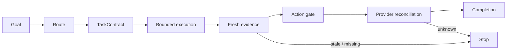

# Architecture

| [Overview](../../README.md) | [Details](../details/en.md) | [Quick start](getting-started.md) | [Workflows](workflows.md) | **Architecture** | [Security](security.md) | [CLI](cli-reference.md) |
| :---: | :---: | :---: | :---: | :---: | :---: | :---: |

## Design contract

Better Workflows is a governed orchestration and control plane, not an
unbounded agent runtime.

- **Root-owned mutation:** only Root edits, integrates, deploys, accepts risk,
  performs Git/provider mutations, or declares completion.
- **Evidence before side effects:** freshness, provenance, required checks, and
  reconciliation are explicit.
- **Bounded delegation:** read-only roles investigate, test, review, or refute;
  they do not inherit mutation authority.
- **Persistent intent:** a Goal survives turns while templates define the
  verification contract.
- **Deterministic state:** `sbw` records contracts, sentinels, evidence,
  findings, leases, action tokens, and reconciliation.
- **Fail-closed completion:** stale, missing, conflicting, or unknown evidence
  cannot silently become success.



## Routing precedence

1. Host hard constraints.
2. Explicit entry, template, and mode.
3. Workspace Profile at `.codex/better-workflows.json`.
4. Personal Profile at `$SBW_STATE_ROOT/routing/profile.json`.
5. Built-in `auto`.

A Profile selects one primary route. It may require capabilities, set a minimum
mode, and attach up to three advisory skills. It cannot install tools, grant
authority, add side effects, lower a mode, or replace an explicit choice.

## Better Workflows and Dynamic Workflows

| Dimension | Better Workflows | Claude Dynamic Workflows |
| --- | --- | --- |
| Optimizes for | Governed convergence | Adaptive exploration breadth |
| Plan shape | Versioned selectors/templates | Task-specific JavaScript harness |
| Mutation | Root-owned | Determined by the generated harness |
| Delegation | Small bounded waves | Potentially large adaptive fan-out |
| Completion | Evidence, freshness, authority, reconciliation | Harness-specific stop condition |
| Best first use | Known contract; asymmetric mutation risk | Unknown scope; many independent hypotheses |

The practical combined pattern is:

```text
Explore widely → normalize a versioned handoff → validate independently
→ execute narrowly → reconcile side effects → maintain the accepted contract
```

This is an operating model, not native runtime interoperability.

## Governed workspace recipes

Recipes preserve deterministic SOP mechanics as workspace-local Node.js ESM.
They do not choose models, orchestrate agents, accept risk, mutate source, or
perform external side effects.

Trust binds the exact workspace, manifest, entry digest, plugin bundle, Node
major, and promotion action. Digest drift invalidates execution immediately.
Node's Permission Model is defense in depth, not the primary trust boundary.

Artifacts are staged and atomically published. Dry runs discard staging;
moving a promotable artifact into tracked source requires a separate
`artifact.promote` action.

## Derived Graph View

Graph View builds a typed, deterministic projection of installed templates or
one live run. Objective structural errors can add a fail-closed block to
`eval`, run creation, action-token issue, and completion.

It is **not**:

- a policy input;
- an authority source;
- a scheduler or agent runtime;
- a persisted graph;
- a database or full-history scanner.

JSON is canonical. Mermaid is presentation contained inside a JSON envelope.

## Model deliberation and Antigravity CLI

The deliberation roster separates three concepts:

| Concept | Example | Meaning |
| --- | --- | --- |
| Provider/model brand | Gemini, Claude, GPT-OSS | Identity of the model being evaluated |
| Transport | Antigravity CLI (`agy`) | Local executable carrying the request |
| Role | risk critic, evidence scout, arbiter | Bounded responsibility in this decision |

Google announced the transition from consumer Gemini CLI to Antigravity CLI on
2026-05-19. The migration uses the `agy` command and preserves supported Gemini
CLI configuration, but Google does not claim complete 1:1 feature parity.
Antigravity can expose Gemini-, Claude-, and GPT-OSS-branded models.

Therefore Better Workflows does not list both “Gemini” and “Agy” as separate
model brands. It records the model brand and `agy` transport independently.

Primary sources:

- [Google: Transitioning Gemini CLI to Antigravity CLI](https://developers.googleblog.com/an-important-update-transitioning-gemini-cli-to-antigravity-cli/)
- [Antigravity: Migrating from Gemini CLI](https://antigravity.google/docs/cli/gcli-migration)
- [Antigravity: Models](https://antigravity.google/docs/models?app=antigravity)

Only a CLI/model pair that passes the current semantic probe may participate.
External transport also requires explicit authorization and a sanitized,
non-confidential dossier. Roles do not vote; Root reconciles evidence and a
capability-ranked arbiter returns an advisory executable plan.
