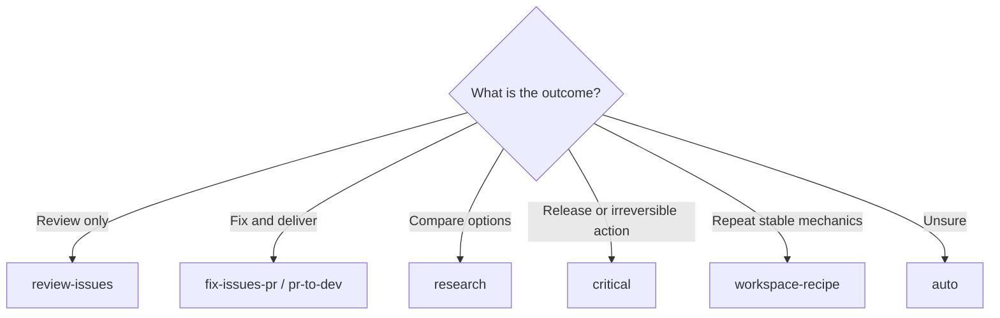

# Workflows

| [Overview](../../README.md) | [Details](../details/en.md) | [Quick start](getting-started.md) | **Workflows** | [Architecture](architecture.md) | [Security](security.md) | [CLI](cli-reference.md) |
| :---: | :---: | :---: | :---: | :---: | :---: | :---: |

## Verification modes

| Mode | Use when | Behavior |
| --- | --- | --- |
| `direct` | Small, reversible, well-understood work | Root works normally; persistent Goal, no workflow journal |
| `verified` | Normal engineering work | Root plus one to three bounded read-only research/review roles |
| `deep` | Architecture, broad refactors, security | Verified flow plus up to two sequential independent critics |
| `critical` | Release, migration, destructive or irreversible work | Complete fail-closed evidence, authority, and reconciliation gates |

A user-selected mode is a floor. Profiles and model advice may raise it but
never lower it.

## Picker entries

| Entry | Best fit |
| --- | --- |
| `$better-workflows:auto` | Recommended default; select a concrete template and mode from current evidence |
| `$better-workflows:review-issues` | Read-only audit, finding deduplication, authorized issue creation |
| `$better-workflows:fix-issues-pr` | Re-check issues, implement fixes, create/merge a PR, precise cleanup |
| `$better-workflows:pr-to-dev` | Atomic commits, one PR to `dev`, fresh checks, merge, sync, cleanup |
| `$better-workflows:cross-platform` | Backend/iOS/Android/Web contract consistency |
| `$better-workflows:ios-static` | Swift/iOS static review and serialized `project.pbxproj` checks |
| `$better-workflows:localization` | Multi-locale key, order, scope, and regional-variant validation |
| `$better-workflows:ci-release` | CI failures, serialized deploys, releases, and remote monitoring |
| `$better-workflows:browser-qa` | Browser/simulator QA with screenshots and an action log |
| `$better-workflows:research` | Multi-perspective research, refutation, architecture decision, executable plan |
| `$better-workflows:self-improve` | Evidence-bounded improvement of Better Workflows itself |
| `$better-workflows:workspace-recipe` | Govern a stable, repeatable workspace-local Node.js SOP |
| `$better-workflows:monorepo-refactor` | Inventory and implement eligible bounded monorepo refactors |
| `$better-workflows:direct` | Explicit fast path |
| `$better-workflows:verified` | Explicit normal verification floor |
| `$better-workflows:deep` | Explicit deep verification floor |
| `$better-workflows:critical` | Explicit critical verification floor |

Compatibility aliases remain available for `auto-improve`, `auto-issues`,
`git-check-issues`, and the natural-language `$better-workflows` router.

## Included templates

| Template | Governs |
| --- | --- |
| `review-to-issues` | Read-only review to deduplicated findings/issues |
| `issues-to-root-fix-pr-merge-cleanup` | Issue validation through owned cleanup |
| `cross-platform-contract` | Contract changes across platforms |
| `ios-static-pbxproj` | iOS static and project-file integrity checks |
| `localization-41` | 41-locale synchronized changes |
| `ci-release-monitor` | CI/release diagnosis, action, and monitoring |
| `dependabot-consolidation-pr-cleanup` | Classified dependency consolidation and safe cleanup |
| `browser-simulator-qa` | Reproducible UI validation evidence |
| `research-deliberation` | Independent model roles and ranked arbitration |
| `self-improve-ops` | Train/holdout-gated plugin improvement |
| `workspace-recipe` | Recipe trust, execution, artifacts, and promotion |
| `monorepo-refactor` | Bounded refactor queue with invariant checks |
| `pr-to-dev` | Atomic delivery to protected `dev` |

## Review capability profiles

Every review-enabled template declares one capability profile in its
TaskContract and immutable review-package identity. The legacy
`review-contract-v1` profile covers diff-manifest, package-location,
broad-review, provenance, and instruction-digest bindings. The stronger
`review-kernel-v2-pilot` profile is observe-only and is currently restricted to
`self-improve-ops`; it adds exact work-unit accounting, source-quote anchors,
and host-attested finder/verifier separation. A profile describes evidence
capability and never grants action authority. See the [review profile matrix and
authoring SOP](../../plugins/better-workflows/skills/better-workflows/references/review-profiles.md).

## Release tag policy

Release tags are integration markers, not progress markers. The CI tag job only
considers a push to `dev` or `main` after the exact commit is proven to be the
merged result of a pull request into that branch, the branch has not moved, CI
has passed, and the stable package and plugin versions changed from the target
branch parent. `main` receives `vX.Y.Z`; `dev` receives the matching
`vX.Y.Z-dev.<short-sha>` prerelease tag. Feature-branch commits and integration
commits without a version change receive no tag. An existing tag pointing to a
different commit is a fail-closed error; CI never force-moves tags. The final
publication uses GitHub's server-side atomic `updateRefs` mutation: tag creation
and an expected-branch-tip CAS (`beforeOid` set to the push event SHA) are one
transaction, so a branch move during publication rejects both.

## Common paths

Template-specific evidence kinds, action gates, and command examples remain in
the [English details](../details/en.md).
