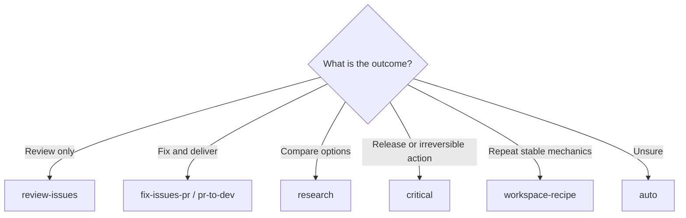

# Workflows

| [Overview](../../README.md) | [Details](../details/en.md) | [Quick start](getting-started.md) | **Workflows** | [Architecture](architecture.md) | [Security](security.md) | [CLI](cli-reference.md) |
| :---: | :---: | :---: | :---: | :---: | :---: | :---: |

## Verification modes

| Mode | Use when | Behavior |
| --- | --- | --- |
| `direct` | Small, reversible, well-understood work | No evidence journal; targeted check; Git mutation still requires a minimal task worktree lease |
| `verified` | Normal engineering work | Root plus one to three bounded read-only research/review roles |
| `deep` | Architecture, broad refactors, security | Verified flow plus up to two sequential independent critics |
| `critical` | Release, migration, destructive or irreversible work | Complete fail-closed evidence, authority, and reconciliation gates |

A user-selected mode is a floor. Profiles and model advice may raise it but
never lower it.

### How Auto decides

Auto always inspects the Goal, scope, repository instructions, current source
revision, mutation intent, capabilities, and integration target. Root records
`AutoRiskAssessmentV1`. Direct is available only when acceptance is explicit,
irreversibility is zero, every other risk dimension is at most one, the total
is at most two, and no hard exclusion or protected/remote target applies.

Direct is not “skip verification.” It runs a bounded targeted check with no
network or external side effect and a total expected duration no longer than
120 seconds. The v4 runner accepts only guarded Node checks, restricts reads to
the task worktree and task scratch, confines writes to that scratch, and denies
standard Node network and process-spawn surfaces. Checks that need
package-manager scripts, checkout-external files or stronger hostile-code
isolation use the governed route. A failed or unexplained result cannot be
reported as complete.
Scope or risk drift invalidates the assessment and triggers a new route.

For a Git mutation, Direct creates no governed evidence run but keeps a minimal
`TaskWorkspaceLeaseV1`. The task edits, tests, commits, validates,
integrates, and cleans only its owned worktree and branch. A dirty source,
detached or missing target, ownership conflict, merge conflict, failed check,
unknown provider state, or target drift fails closed.

The route receipt is claimed before that lease enters `working`. An interrupted
start can resume only with the same repository, task, and lease ownership
nonce; another or same-named replacement task cannot consume the receipt or
inherit the partially started workspace.

A clean host-provided task worktree can be explicitly registered at its exact
pre-mutation base. Registration prevents nested worktrees but does not transfer
deletion authority: host-owned task resources are preserved after integration.
Protected targets remain evidence-required. Their lease reaches `integrated`
only after `workspace reconcile` finds an exact successful governed PR merge
and matching remote-sync action in the same run; squash cleanup additionally
binds the reviewed task head to the provider merge commit.

## Picker entries

| Entry | Best fit |
| --- | --- |
| `$better-workflows:auto` | Recommended default; select a concrete template and mode from current evidence |
| `$better-workflows:review-issues` | Read-only audit, finding deduplication, authorized issue creation |
| `$better-workflows:fix-issues-pr` | Re-check issues, implement fixes, create/merge a PR, precise cleanup |
| `$better-workflows:pr-to-dev` | Atomic commits, one PR to `dev`, fresh checks, merge, sync, cleanup |
| `$better-workflows:cross-platform` | Backend/iOS/Android/Web contract consistency |
| `$better-workflows:ios-static` | Swift/iOS static review and serialized `project.pbxproj` checks |
| `$better-workflows:localization` | Multi-locale key, order, scope, and regional-variant validation |
| `$better-workflows:ci-release` | CI failures, serialized deploys, releases, and remote monitoring |
| `$better-workflows:browser-qa` | Browser/simulator QA with screenshots and an action log |
| `$better-workflows:research` | Multi-perspective research, refutation, architecture decision, executable plan |
| `$better-workflows:self-improve` | Evidence-bounded improvement of Better Workflows itself |
| `$better-workflows:workspace-recipe` | Govern a stable, repeatable workspace-local Node.js SOP |
| `$better-workflows:monorepo-refactor` | Inventory and implement eligible bounded monorepo refactors |
| `$better-workflows:direct` | Explicit fast path |
| `$better-workflows:verified` | Explicit normal verification floor |
| `$better-workflows:deep` | Explicit deep verification floor |
| `$better-workflows:critical` | Explicit critical verification floor |

Compatibility aliases remain available for `auto-improve`, `auto-issues`,
`git-check-issues`, and the natural-language `$better-workflows` router.

## Included templates

| Template | Governs |
| --- | --- |
| `review-to-issues` | Read-only review to deduplicated findings/issues |
| `issues-to-root-fix-pr-merge-cleanup` | Issue validation through owned cleanup |
| `cross-platform-contract` | Contract changes across platforms |
| `ios-static-pbxproj` | iOS static and project-file integrity checks |
| `localization-41` | 41-locale synchronized changes |
| `ci-release-monitor` | CI/release diagnosis, action, and monitoring |
| `dependabot-consolidation-pr-cleanup` | Classified dependency consolidation and safe cleanup |
| `browser-simulator-qa` | Reproducible UI validation evidence |
| `research-deliberation` | Independent model roles and ranked arbitration |
| `self-improve-ops` | Train/holdout-gated plugin improvement |
| `workspace-recipe` | Recipe trust, execution, artifacts, and promotion |
| `monorepo-refactor` | Bounded refactor queue with invariant checks |
| `pr-to-dev` | Atomic delivery to protected `dev` |

## Review capability profiles

Every review-enabled template declares one capability profile in its
TaskContract and immutable review-package identity. The legacy
`review-contract-v1` profile covers diff-manifest, package-location,
broad-review, provenance, and instruction-digest bindings. The stronger
`review-kernel-v2-pilot` profile is observe-only and is currently restricted to
`self-improve-ops`; it adds exact work-unit accounting, source-quote anchors,
and host-attested finder/verifier separation. A profile describes evidence
capability and never grants action authority. See the [review profile matrix and
authoring SOP](../../plugins/better-workflows/skills/better-workflows/references/review-profiles.md).

## Release tag policy

Stable tags are release outcomes, not merge side effects. A push or PR merge to
`main` does **not** automatically create `vX.Y.Z`. `dev` may still receive an
integration-only `vX.Y.Z-dev.<short-sha>` marker after its exact merged commit
and fresh CI are proven.

The stable release controller accepts an exact `main` SHA only after fresh CI,
all eight authenticated Tier 1 host/OS conformance receipts, task-worktree
lifecycle tests, an exact-SHA website deployment receipt, public QA of all 41
locale URLs, version-manifest agreement, and explicit release authority. It
then creates `vX.Y.Z` and the non-draft, non-prerelease GitHub Release as one
governed publication sequence. Existing conflicting tags, branch drift,
missing receipts, unknown provider state, or website digest mismatch fail
closed; tags are never force-moved.

## Common paths

Template-specific evidence kinds, action gates, and command examples remain in
the [English details](../details/en.md).
