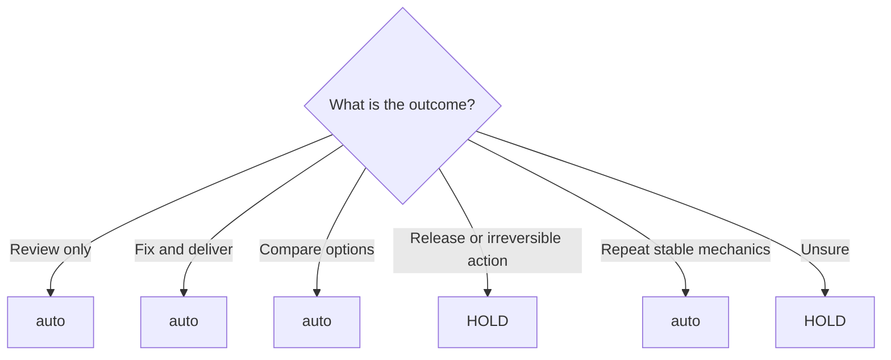

# Workflows

| [Overview](../../README.md) | [Details](../details/en.md) | [Quick start](getting-started.md) | **Workflows** | [Architecture](architecture.md) | [Security](security.md) | [CLI](cli-reference.md) |
| :---: | :---: | :---: | :---: | :---: | :---: | :---: |

## Use Auto

```text
$better-workflows:auto <describe the outcome you need>
```

## Common paths


```mermaid
flowchart TD
  A{"What is the outcome?"}
  A -->|"Review only"| B["auto"]
  A -->|"Fix and deliver"| C["auto"]
  A -->|"Compare options"| D["auto"]
  A -->|"Release or irreversible action"| E["HOLD"]
  A -->|"Repeat stable mechanics"| F["auto"]
  A -->|"Unsure"| G["HOLD"]
```
