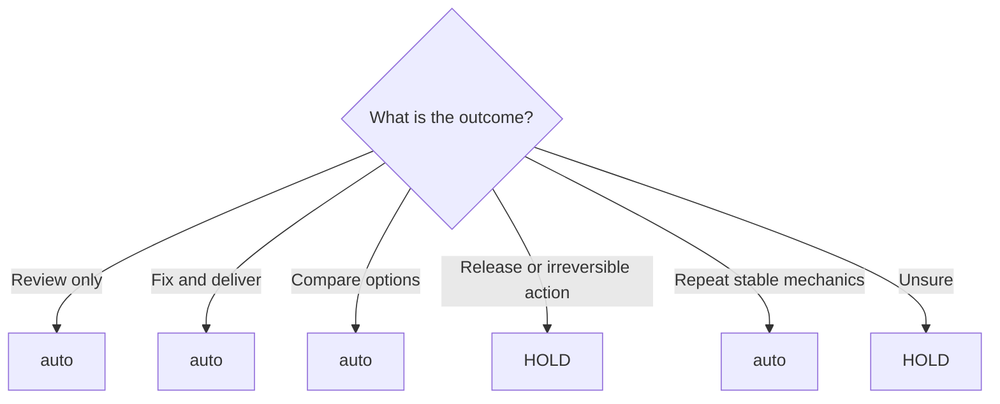

<!-- Generated from docs/guide/workflows.md; source-sha256: 2acaf671415fc972265bcc5c4f20484c1a6cbea2dd1e6aa3fb22f54943786bb0; edit docs/rc1-catalogs/workflows/*.json. -->
# Workflows

**English** · [繁體中文（台灣）](../zh-Hant-TW/workflows.md)

| [Overview](../../../README.md) | [Details](../../../docs/details/en.md) | [Quick start](getting-started.md) | **Workflows** | [Architecture](architecture.md) | [Security](security-guide.md) | [CLI](cli-reference.md) |
| :---: | :---: | :---: | :---: | :---: | :---: | :---: |

## Use Auto

```text
$better-workflows:auto <describe the outcome you need>
```

## Common paths


