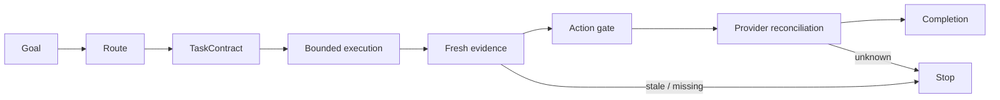
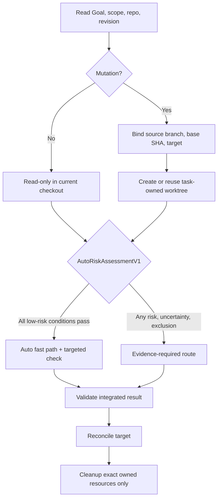

<!-- Generated from docs/guide/architecture.md; source-sha256: 1f08135c0c999c6556d1957adc78ce36c4920674bf117e67077e9ae6e47b5f93; edit scripts/architecture-source.mjs. -->
# Arquitetura

[English](../en/architecture.md) · [繁體中文](../zh-Hant/architecture.md) · [繁體中文（台灣）](../zh-Hant-TW/architecture.md) · [繁體中文（香港）](../zh-Hant-HK/architecture.md) · [简体中文](../zh-Hans/architecture.md) · [Tiếng Việt](../vi/architecture.md) · [Українська](../uk/architecture.md) · [Türkçe](../tr/architecture.md) · [ไทย](../th/architecture.md) · [Svenska](../sv/architecture.md) · [Slovenčina](../sk/architecture.md) · [Русский](../ru/architecture.md) · [Română](../ro/architecture.md) · [Português](../pt/architecture.md) · **Português \(Brasil\)** · [Polski](../pl/architecture.md) · [Nederlands](../nl/architecture.md) · [Norsk bokmål](../nb/architecture.md) · [မြန်မာ](../my/architecture.md) · [Bahasa Melayu](../ms/architecture.md) · [ລາວ](../lo/architecture.md) · [한국어](../ko/architecture.md) · [ខ្មែរ](../km/architecture.md) · [日本語](../ja/architecture.md) · [Italiano](../it/architecture.md) · [Bahasa Indonesia](../id/architecture.md) · [Magyar](../hu/architecture.md) · [Hrvatski](../hr/architecture.md) · [हिन्दी](../hi/architecture.md) · [עברית](../he/architecture.md) · [Français](../fr/architecture.md) · [Filipino](../fil/architecture.md) · [Suomi](../fi/architecture.md) · [Español](../es/architecture.md) · [Español \(México\)](../es-MX/architecture.md) · [Ελληνικά](../el/architecture.md) · [Deutsch](../de/architecture.md) · [Dansk](../da/architecture.md) · [Čeština](../cs/architecture.md) · [Català](../ca/architecture.md) · [العربية](../ar/architecture.md)

[README](../../../README.md) · [Como contribuir](contributing.md) · [Código de conduta](conduct.md) · [Segurança](security.md) · [Governança](governance.md) · [Suporte](support.md)

[Visão geral em 41 versões localizadas e pontos de acesso oficiais na Web](../../../docs/LANGUAGES.md)\. This normative guide remains canonical in English\.

## Contrato de design

Better Workflows is a governed orchestration and control plane\, not an unbounded agent runtime\.

- **Root\-owned mutation\:** only Root edits\, integrates\, deploys\, accepts risk\, performs Git\/provider mutations\, or declares completion\.
- **Evidence before side effects\:** freshness\, provenance\, required checks\, and reconciliation are explicit\.
- **Bounded delegation\:** read\-only roles investigate\, test\, review\, or refute\; they do not inherit mutation authority\.
- **Persistent intent\:** a Goal survives turns\.
- **Deterministic state\:** `sbw` records contracts\, sentinels\, evidence\, findings\, leases\, action tokens\, and reconciliation\.
- **Fail\-closed completion\:** stale\, missing\, conflicting\, or unknown evidence cannot silently become success\.



### Núcleo independente do host e adaptadores de host

For V5\.0 RC\, release qualification covers only the Auto entrypoint on macOS with Codex\, Gemini CLI\, and Qwen Code\. Claude Code and Linux\/Windows qualification are deferred to V5\.1\. The Tier 1 labels in `host-support-v1` describe the v4 host bridge\; `--os` diagnostics do not expand this release scope\, and out\-of\-scope conformance returns `HOLD`\.

`host-support-v1` is the single registry for the CLI\, README\, website\, structured data\, packaging\, and conformance matrix\. Codex\, Claude Code\, Gemini CLI\, and Qwen Code on macOS\/Linux are Tier 1 only when their exact host\/OS receipt passes\. Each Tier 1 receipt binds the pinned official CLI version\, the source manifest and helper\, the host\'s official validation or isolated\-install path\, and the common safety tests\. Gemini and Qwen receipts additionally prove that an isolated installed repository distribution contains the exact source manifest\, context\, and helper bytes\. Windows and Kimi Code CLI\, Kiro\, Grok Build\, Cursor\, and GitHub Copilot are Preview in v4\.0\.0\. The five Preview hosts ship a plugin\-local compatibility manifest plus shared manual bridge instructions\. `host doctor` verifies that pack for a local smoke check\, but it is not a native host extension or release\-eligible conformance\.

The public host contract is declared in `plugins/better-workflows/types/host-support-v1.d.ts`\: `HostId`\, `SupportTier`\, `CapabilityStatus`\, `HostAdapterManifest`\, and `HostCapabilityReceipt`\. The declaration mirrors `host-support-v1`\; it does not turn a Preview adapter or local receipt into release proof\. A Preview conformance receipt is explicitly `UNPROVEN` when no executable extension probe exists\; consumers must not interpret that state as a passing capability\.

Host portability is intentionally layered\: L0 governance core\; L1 exact distribution and installation\; L2 authenticated semantic host\/model session\; L3 controlled invocation with sandbox\, timeout\, cancellation\, and descendant cleanup\; L4 host\-bound evidence and replay\; L5 host UX\; and L6 provider\-neutral delivery\. The current Tier 1 gate proves L1 plus the shared core bridge\. It does not claim that a host session is authenticated\, that a requested model was actually used\, or that native sandbox\/cancellation semantics match Codex\. `HostId`\, model brand\, and transport \(for example `agy`\) remain separate identities\. Promotion to a stronger tier requires fresh evidence at each missing layer\.

### Auto adaptado ao risco e propriedade do espaço de trabalho



`TaskWorkspaceLeaseV1` binds repository identity\, source checkout\, `sourceBranch`\, `baseRevision`\, `integrationTarget`\, task branch\, worktree path\, ownership nonce\, lifecycle state\, and exact resource digests\. Worktree isolation protects mutation state\; it does not replace evidence verification\. Multiple repositories receive independent leases and serialized integration\; there is no claim of cross\-repository atomicity\.

### Política de transição e encerramento do piloto

Legacy and v2 readers may coexist only as a bounded compatibility transition\. The v2 control plane is the candidate path for new runs\; the legacy reader is read\-only and cannot issue a new action token\. Graduation requires a paired\, sanitized shadow replay over the same task batch\, complete outcome and cost telemetry\, no unexplained scope or completion regressions\, and an operator record of the v1 deprecation date and rollback path\. Shadow comparison must never perform Git\/provider side effects\. Until the exit record exists\, keep the profiles version\-disjoint and fail closed on migration ambiguity\.

Repository mutation is serialized by a lock that binds host\, PID\, and an OS\-observed process\-incarnation digest\. An interrupted task may reclaim only a lock whose exact owner is proven gone or whose PID was reused\; unknown or live ownership remains blocking\. Lease discovery scans the complete bounded registry and fails closed at its safety limit instead of ignoring old records\. Candidate branch\/worktree identities are written to the lease before creation\. If a process stops after target CAS but before the integration record\, the next run reuses that exact candidate and reconciles the already\-updated target\. Cleanup records each exact resource removal under `cleanup-ready`\, so a restart continues from the remaining owned branch\/worktree and reuses one digested cleanup receipt instead of creating duplicate resources\.

An explicitly registered host worktree adds a digested `HostWorkspaceRegistrationV1` record and `resourceOrigin: host-provided`\. Better Workflows may validate and integrate from it but leaves its branch and path for the host to release\. Protected leases cross `integration-ready → integrated` only by reconciling the exact governed `pr.merge` and `remote.sync` actions\; this receipt pair is also the sole exception that permits CAS deletion after an exact squash merge where ordinary Git ancestry cannot prove inclusion\.

## Better Workflows e Dynamic Workflows

| Dimension | Better Workflows | Claude Dynamic Workflows |
| --- | --- | --- |
| Optimizes for | Governed convergence | Adaptive exploration breadth |
| Plan shape | Auto policy | Task\-specific JavaScript harness |
| Mutation | Root\-owned | Determined by the generated harness |
| Delegation | Small bounded waves | Potentially large adaptive fan\-out |
| Completion | Evidence\, freshness\, authority\, reconciliation | Harness\-specific stop condition |
| Best first use | Known contract\; asymmetric mutation risk | Unknown scope\; many independent hypotheses |

The practical combined pattern is\:

```text
Explore widely → normalize a versioned handoff → validate independently
→ execute narrowly → reconcile side effects → maintain the accepted contract
```

This is an operating model\, not native runtime interoperability\.

## Visão do grafo derivado \(Graph View\)

Graph View builds a typed\, deterministic projection of the installed Auto policy or one live run\. Objective structural errors can add a fail\-closed block to `eval`\, run creation\, action\-token issue\, and completion\.

It is **not**\:

- a policy input\;
- an authority source\;
- a scheduler or agent runtime\;
- a persisted graph\;
- a database or full\-history scanner\.

JSON is canonical\. Mermaid is presentation contained inside a JSON envelope\.

## Deliberação do modelo e Antigravity CLI

The deliberation roster separates three concepts\:

| Concept | Example | Meaning |
| --- | --- | --- |
| Provider\/model brand | Gemini\, Claude\, GPT\-OSS | Identity of the model being evaluated |
| Transport | Antigravity CLI \(`agy`\) | Local executable carrying the request |
| Role | risk critic\, evidence scout\, arbiter | Bounded responsibility in this decision |

Google announced the transition from consumer Gemini CLI to Antigravity CLI on 2026\-05\-19\. The migration uses the `agy` command and preserves supported Gemini CLI configuration\, but Google does not claim complete 1\:1 feature parity\. Antigravity can expose Gemini\-\, Claude\-\, and GPT\-OSS\-branded models\.

Therefore Better Workflows does not list both “Gemini” and “Agy” as separate model brands\. It records the model brand and `agy` transport independently\.

Primary sources\:

- [Google\: Transitioning Gemini CLI to Antigravity CLI](https://developers.googleblog.com/an-important-update-transitioning-gemini-cli-to-antigravity-cli/)
- [Antigravity\: Migrating from Gemini CLI](https://antigravity.google/docs/cli/gcli-migration)
- [Antigravity\: Models](https://antigravity.google/docs/models?app=antigravity)

The roster records supported brands and provider\-owned discovery adapters\, not historical model IDs\. At probe time\, a safe catalog command \(for example `agy models`\) or an operator\-supplied `SBW_<BRAND>_MODELS` JSON catalog provides the current candidates\. Only a discovered CLI\/model pair that is authenticated and passes the current semantic probe may participate\. A catalog digest is bound to the 24\-hour semantic cache\, so a changed provider catalog triggers fresh probes\. External transport also requires explicit authorization and a sanitized\, non\-confidential dossier\. Roles do not vote\; Root reconciles evidence and a capability\-ranked arbiter resolves to the current proven model\.
