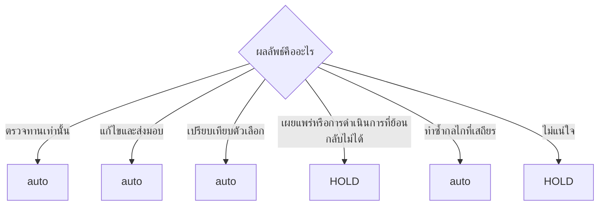

<!-- Generated from docs/guide/workflows.md; source-sha256: 2acaf671415fc972265bcc5c4f20484c1a6cbea2dd1e6aa3fb22f54943786bb0; edit docs/rc1-catalogs/workflows/*.json. -->
# เวิร์กโฟลว์

[English](../en/workflows.md) · [繁體中文](../zh-Hant/workflows.md) · [繁體中文（台灣）](../zh-Hant-TW/workflows.md) · [繁體中文（香港）](../zh-Hant-HK/workflows.md) · [简体中文](../zh-Hans/workflows.md) · [Tiếng Việt](../vi/workflows.md) · [Українська](../uk/workflows.md) · [Türkçe](../tr/workflows.md) · **ไทย** · [Svenska](../sv/workflows.md) · [Slovenčina](../sk/workflows.md) · [Русский](../ru/workflows.md) · [Română](../ro/workflows.md) · [Português](../pt/workflows.md) · [Português \(Brasil\)](../pt-BR/workflows.md) · [Polski](../pl/workflows.md) · [Nederlands](../nl/workflows.md) · [Norsk bokmål](../nb/workflows.md) · [မြန်မာ](../my/workflows.md) · [Bahasa Melayu](../ms/workflows.md) · [ລາວ](../lo/workflows.md) · [한국어](../ko/workflows.md) · [ខ្មែរ](../km/workflows.md) · [日本語](../ja/workflows.md) · [Italiano](../it/workflows.md) · [Bahasa Indonesia](../id/workflows.md) · [Magyar](../hu/workflows.md) · [Hrvatski](../hr/workflows.md) · [हिन्दी](../hi/workflows.md) · [עברית](../he/workflows.md) · [Français](../fr/workflows.md) · [Filipino](../fil/workflows.md) · [Suomi](../fi/workflows.md) · [Español](../es/workflows.md) · [Español \(México\)](../es-MX/workflows.md) · [Ελληνικά](../el/workflows.md) · [Deutsch](../de/workflows.md) · [Dansk](../da/workflows.md) · [Čeština](../cs/workflows.md) · [Català](../ca/workflows.md) · [العربية](../ar/workflows.md)

| [ภาพรวม](../../../README.md) | [รายละเอียด](../../../docs/details/en.md) | [เริ่มต้นอย่างรวดเร็ว](getting-started.md) | **เวิร์กโฟลว์** | [สถาปัตยกรรม](architecture.md) | [ความปลอดภัย](security-guide.md) | [CLI](cli-reference.md) |
| :---: | :---: | :---: | :---: | :---: | :---: | :---: |

## ใช้งาน Auto

```text
$better-workflows:auto <describe the outcome you need>
```

## เส้นทางทั่วไป


