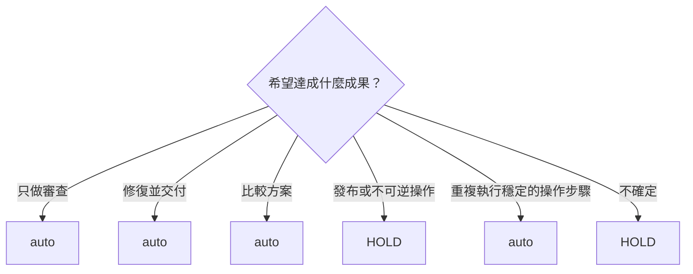

<!-- Generated from docs/guide/workflows.md; source-sha256: 2acaf671415fc972265bcc5c4f20484c1a6cbea2dd1e6aa3fb22f54943786bb0; edit docs/rc1-catalogs/workflows/*.json. -->
# 工作流程

[English](../en/workflows.md) · **繁體中文（台灣）**

| [總覽](../../../README.md) | [詳細說明](../../../docs/details/en.md) | [快速開始](getting-started.md) | **工作流程** | [架構](architecture.md) | [安全性](security-guide.md) | [CLI](cli-reference.md) |
| :---: | :---: | :---: | :---: | :---: | :---: | :---: |

## Auto

```text
$better-workflows:auto <describe the outcome you need>
```

## 常見路徑


