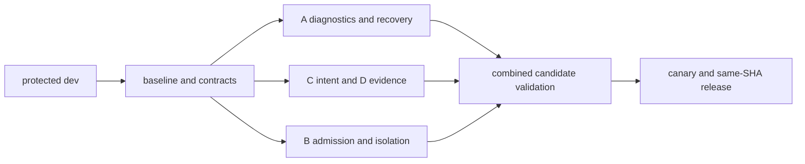

# V5.1 工作清單與整合索引

狀態是規劃／派工狀態，不能代替功能驗收。114 張 V5.1、8 張 V5.0；102 leaf tracking 固定；扣除 2 個 P1 研究後 GA obligations 為 100。

主總表：[M-01](https://github.com/stephen-taipei/better-workflows/issues/1)；驗收與最後接手：[M-02](https://github.com/stephen-taipei/better-workflows/issues/2)。

READY 前須 Root 凍結完整 dispatch packet；BLOCKED 可先做唯讀調查，不能派實作。條件項保持 off；UNTRIGGERED 須留下原因。

| 工作單 | Owner | 狀態 | Leaf | 直接依賴 | 舊編號 |
|---|---|---|---|---|---|
| [M-01](https://github.com/stephen-taipei/better-workflows/issues/1) 版本總表、依賴圖與全部要求對照 | R | BLOCKED | 1 |  | #33 |
| [M-02](https://github.com/stephen-taipei/better-workflows/issues/2) 驗收清單、剩餘工作與最終整合總表 | R | BLOCKED | 80 | [M-01](https://github.com/stephen-taipei/better-workflows/issues/1) | #103 |
| [GOV-01](https://github.com/stephen-taipei/better-workflows/issues/3) 公開 dev、branch protection、PR 必要 checks 與 release PR 流程 | R | BLOCKED | 2 |  |  |
| [W0-01](https://github.com/stephen-taipei/better-workflows/issues/4) 公開基準差額、ADRM、source 與 rights closure | R | BLOCKED | 81, 86 | [GOV-01](https://github.com/stephen-taipei/better-workflows/issues/3) | #34, #108, #113 |
| [W0-02](https://github.com/stephen-taipei/better-workflows/issues/5) 版本化 sidecar、locator、reader／writer 與資料生命週期契約 | R | BLOCKED | 88a | [W0-01](https://github.com/stephen-taipei/better-workflows/issues/4), [W0-08](https://github.com/stephen-taipei/better-workflows/issues/11) | #35 |
| [W0-03](https://github.com/stephen-taipei/better-workflows/issues/6) 可信用量觀測、Node baseline harness | W | BLOCKED | 35, 36a, 52, 53, 54 | [W0-02](https://github.com/stephen-taipei/better-workflows/issues/5) | #36 |
| [W0-04](https://github.com/stephen-taipei/better-workflows/issues/7) P0 語義判斷成本、錯誤與返工基線 | Q | BLOCKED | 82a | [W0-03](https://github.com/stephen-taipei/better-workflows/issues/6) | #37 |
| [W0-05](https://github.com/stephen-taipei/better-workflows/issues/8) E2E 協定、oracle、joint power、樣本與預算可行性 | Q | BLOCKED | 87a | [W0-04](https://github.com/stephen-taipei/better-workflows/issues/7) | #38 |
| [W0-06](https://github.com/stephen-taipei/better-workflows/issues/9) 正式平台及多寫者 pilot 範圍凍結 | R | BLOCKED | 89a | [W0-02](https://github.com/stephen-taipei/better-workflows/issues/5) | #39 |
| [W0-07](https://github.com/stephen-taipei/better-workflows/issues/10) blocker AST 與 source-to-consumer inventory | W | BLOCKED | 4 | [W0-01](https://github.com/stephen-taipei/better-workflows/issues/4) | #40 |
| [W0-08](https://github.com/stephen-taipei/better-workflows/issues/11) WorkflowTask 型別與 validator 差額 | W | BLOCKED | 3 | [W0-01](https://github.com/stephen-taipei/better-workflows/issues/4) | #41 |
| [RF-01](https://github.com/stephen-taipei/better-workflows/issues/12) canonical serialization／digest 純模組與相容 fixtures | W | BLOCKED |  | [GOV-01](https://github.com/stephen-taipei/better-workflows/issues/3) |  |
| [RF-02](https://github.com/stephen-taipei/better-workflows/issues/13) CLI argv parser 純模組 | W | BLOCKED |  | [GOV-01](https://github.com/stephen-taipei/better-workflows/issues/3) |  |
| [RF-03](https://github.com/stephen-taipei/better-workflows/issues/14) evaluator policy、model catalog 與 argv 建構 | W | BLOCKED |  | [GOV-01](https://github.com/stephen-taipei/better-workflows/issues/3) |  |
| [RF-04](https://github.com/stephen-taipei/better-workflows/issues/15) evaluator header／SSE protocol validators | W | BLOCKED |  | [GOV-01](https://github.com/stephen-taipei/better-workflows/issues/3) |  |
| [RF-05](https://github.com/stephen-taipei/better-workflows/issues/16) runtime public record validators | W | BLOCKED |  | [GOV-01](https://github.com/stephen-taipei/better-workflows/issues/3) |  |
| [RF-06](https://github.com/stephen-taipei/better-workflows/issues/17) Native V3 checkpoint validators | W | BLOCKED |  | [GOV-01](https://github.com/stephen-taipei/better-workflows/issues/3) |  |
| [A-01](https://github.com/stephen-taipei/better-workflows/issues/18) reason registry 與舊 verdict mapping | W | BLOCKED | 5, 6, 7, 8 | [W0-07](https://github.com/stephen-taipei/better-workflows/issues/10), [W0-02](https://github.com/stephen-taipei/better-workflows/issues/5) | #42 |
| [A-02a](https://github.com/stephen-taipei/better-workflows/issues/19) BlockerDiagnostic validator | W | BLOCKED | 9 | [A-01](https://github.com/stephen-taipei/better-workflows/issues/18) | #43 |
| [A-02b](https://github.com/stephen-taipei/better-workflows/issues/20) Episode、exact-key 診斷折疊與原始事件索引 | W | BLOCKED | 9 | [A-02a](https://github.com/stephen-taipei/better-workflows/issues/19) | #43 |
| [A-03](https://github.com/stephen-taipei/better-workflows/issues/21) 有限 disposition 與 transition table | R | BLOCKED | 10 | [A-01](https://github.com/stephen-taipei/better-workflows/issues/18), [A-02a](https://github.com/stephen-taipei/better-workflows/issues/19) | #44 |
| [A-06](https://github.com/stephen-taipei/better-workflows/issues/22) Tarjan SCC wait-for 候選循環診斷 | W | BLOCKED | 28 | [W0-02](https://github.com/stephen-taipei/better-workflows/issues/5) | #47 |
| [A-09](https://github.com/stephen-taipei/better-workflows/issues/23) token observed／estimated／unknown 投影 | W | BLOCKED | 32 | [W0-03](https://github.com/stephen-taipei/better-workflows/issues/6) | #50 |
| [A-12](https://github.com/stephen-taipei/better-workflows/issues/24) approved recipes、durable retry owner 與 no-progress 停止 | R | BLOCKED | 12, 16, 17 | [A-03](https://github.com/stephen-taipei/better-workflows/issues/21), [A-02b](https://github.com/stephen-taipei/better-workflows/issues/20) | #53 |
| [A-13](https://github.com/stephen-taipei/better-workflows/issues/25) standing directive 持久化、expiry 與撤銷 | R | BLOCKED | 15 | [A-03](https://github.com/stephen-taipei/better-workflows/issues/21) | #54 |
| [A-14](https://github.com/stephen-taipei/better-workflows/issues/26) BFS 受影響 worklist 與缺依賴 full fallback | W | BLOCKED | 18 | [W0-07](https://github.com/stephen-taipei/better-workflows/issues/10), [W0-02](https://github.com/stephen-taipei/better-workflows/issues/5) | #55 |
| [A-15](https://github.com/stephen-taipei/better-workflows/issues/27) 多任務 DAG recovery、可信 frontier 與 resume 接線 | R | BLOCKED | 13 | [A-12](https://github.com/stephen-taipei/better-workflows/issues/24), [A-14](https://github.com/stephen-taipei/better-workflows/issues/26), [A-16](https://github.com/stephen-taipei/better-workflows/issues/28) | #56 |
| [A-16](https://github.com/stephen-taipei/better-workflows/issues/28) 純驗證與 sealed review reuse 的准入分離 | R | BLOCKED | 21 | [A-14](https://github.com/stephen-taipei/better-workflows/issues/26) | #57 |
| [A-17a](https://github.com/stephen-taipei/better-workflows/issues/29) runner／CLI 並行上限一致為 32 | R | BLOCKED | 22 | [W0-01](https://github.com/stephen-taipei/better-workflows/issues/4) | #58 |
| [A-17b](https://github.com/stephen-taipei/better-workflows/issues/30) OptimizationProposal validator、合法排列與 baseline fallback | W | BLOCKED | 23, 24 | [A-17a](https://github.com/stephen-taipei/better-workflows/issues/29), [W0-03](https://github.com/stephen-taipei/better-workflows/issues/6) | #58 |
| [C-01](https://github.com/stephen-taipei/better-workflows/issues/31) ProblemFrame、未知欄位、需求 provenance 與清楚任務 fast path | W | BLOCKED | 63, 65, 67, 68 | [W0-02](https://github.com/stephen-taipei/better-workflows/issues/5) | #73 |
| [C-02a](https://github.com/stephen-taipei/better-workflows/issues/32) 選擇性澄清規則與決策影響投影 | W | BLOCKED | 66 | [C-01](https://github.com/stephen-taipei/better-workflows/issues/31) | #74 |
| [C-02b](https://github.com/stephen-taipei/better-workflows/issues/33) 澄清 owner、wakeup、budget 與退出状态轉移 | R | BLOCKED | 66 | [C-02a](https://github.com/stephen-taipei/better-workflows/issues/32), [A-03](https://github.com/stephen-taipei/better-workflows/issues/21) | #74 |
| [C-04](https://github.com/stephen-taipei/better-workflows/issues/34) INT-0／LEX／FRAME／BOTH 對照及品質護欄 | Q | BLOCKED | 69 | [C-02b](https://github.com/stephen-taipei/better-workflows/issues/33), [C-03](https://github.com/stephen-taipei/better-workflows/issues/105), [W0-05](https://github.com/stephen-taipei/better-workflows/issues/8) | #76 |
| [D-01](https://github.com/stephen-taipei/better-workflows/issues/35) technical／delivery／outcome 三層驗收契約 | R | BLOCKED | 70 | [W0-02](https://github.com/stephen-taipei/better-workflows/issues/5) | #77 |
| [D-02a](https://github.com/stephen-taipei/better-workflows/issues/36) goal→requirement→task→evidence 雙向追溯 | W | BLOCKED | 71 | [D-01](https://github.com/stephen-taipei/better-workflows/issues/35), [C-01](https://github.com/stephen-taipei/better-workflows/issues/31) | #78 |
| [D-02b](https://github.com/stephen-taipei/better-workflows/issues/37) 重要主張、支持片段、來源版本與矛盾核對 | W | BLOCKED | 71 | [D-02a](https://github.com/stephen-taipei/better-workflows/issues/36) | #78 |
| [D-03a](https://github.com/stephen-taipei/better-workflows/issues/38) Outcome 非權威投影 | W | BLOCKED | 72 | [D-02b](https://github.com/stephen-taipei/better-workflows/issues/37) | #79 |
| [D-03b](https://github.com/stephen-taipei/better-workflows/issues/39) 最多三張下一步卡與冪等任務草稿 | W | BLOCKED | 73 | [D-03a](https://github.com/stephen-taipei/better-workflows/issues/38) | #79 |
| [D-03c](https://github.com/stephen-taipei/better-workflows/issues/40) 本輪結束、後續任務與自身改善循環邊界 | R | BLOCKED | 74 | [D-03b](https://github.com/stephen-taipei/better-workflows/issues/39) | #79 |
| [B-01a](https://github.com/stephen-taipei/better-workflows/issues/41) WorkItem 持久身分、plan revision 與 attempt mapping | R | BLOCKED | 44, 45 | [W0-02](https://github.com/stephen-taipei/better-workflows/issues/5) | #80 |
| [B-01b](https://github.com/stephen-taipei/better-workflows/issues/42) 唯讀看板與狀態投影 | W | BLOCKED | 46 | [B-01a](https://github.com/stephen-taipei/better-workflows/issues/41) | #80 |
| [B-02](https://github.com/stephen-taipei/better-workflows/issues/43) WIP、verification backlog 與 resource admission | R | BLOCKED | 47, 48 | [B-01a](https://github.com/stephen-taipei/better-workflows/issues/41), [W0-03](https://github.com/stephen-taipei/better-workflows/issues/6) | #81 |
| [B-03](https://github.com/stephen-taipei/better-workflows/issues/44) 確定性 ready-set 派工、nested fan-out 計數與停止 | R | BLOCKED | 49, 50 | [B-02](https://github.com/stephen-taipei/better-workflows/issues/43), [A-17a](https://github.com/stephen-taipei/better-workflows/issues/29) | #82 |
| [B-04a](https://github.com/stephen-taipei/better-workflows/issues/45) provider quota bucket 觀測 | W | BLOCKED | 51 | [W0-03](https://github.com/stephen-taipei/better-workflows/issues/6) | #83 |
| [B-04b](https://github.com/stephen-taipei/better-workflows/issues/46) Codex host conformance | W | BLOCKED | 51, 89b | [W0-06](https://github.com/stephen-taipei/better-workflows/issues/9), [B-04a](https://github.com/stephen-taipei/better-workflows/issues/45) | #83 |
| [B-04c](https://github.com/stephen-taipei/better-workflows/issues/47) Gemini CLI host conformance | W | BLOCKED | 51, 89b | [W0-06](https://github.com/stephen-taipei/better-workflows/issues/9), [B-04a](https://github.com/stephen-taipei/better-workflows/issues/45) | #83 |
| [B-04d](https://github.com/stephen-taipei/better-workflows/issues/48) Qwen host conformance | W | BLOCKED | 51, 89b | [W0-06](https://github.com/stephen-taipei/better-workflows/issues/9), [B-04a](https://github.com/stephen-taipei/better-workflows/issues/45) | #83 |
| [B-05](https://github.com/stephen-taipei/better-workflows/issues/49) task writeOwner.paths 與 role capability 的版本化 admission | R | BLOCKED | 55 | [W0-02](https://github.com/stephen-taipei/better-workflows/issues/5), [B-02](https://github.com/stephen-taipei/better-workflows/issues/43) | #84 |
| [B-06](https://github.com/stephen-taipei/better-workflows/issues/50) canonical Git common-dir provisioning coordinator | R | BLOCKED | 56 | [W0-06](https://github.com/stephen-taipei/better-workflows/issues/9), [B-05](https://github.com/stephen-taipei/better-workflows/issues/49) | #85 |
| [B-07](https://github.com/stephen-taipei/better-workflows/issues/51) per-task workspace lease 接入 DAG | R | BLOCKED | 57 | [B-06](https://github.com/stephen-taipei/better-workflows/issues/50) | #86 |
| [B-08](https://github.com/stephen-taipei/better-workflows/issues/52) 受限 implementation executor profile | R | BLOCKED | 58, 59 | [B-07](https://github.com/stephen-taipei/better-workflows/issues/51), [B-03](https://github.com/stephen-taipei/better-workflows/issues/44) | #87 |
| [B-09a](https://github.com/stephen-taipei/better-workflows/issues/53) 寫入權限隔離驗證 | Q | BLOCKED | 61 | [B-08](https://github.com/stephen-taipei/better-workflows/issues/52) | #88 |
| [B-09b](https://github.com/stephen-taipei/better-workflows/issues/54) 共享資源隔離驗證 | Q | BLOCKED | 61 | [B-08](https://github.com/stephen-taipei/better-workflows/issues/52) | #88 |
| [B-09c](https://github.com/stephen-taipei/better-workflows/issues/55) Git 權限隔離驗證 | Q | BLOCKED | 61 | [B-08](https://github.com/stephen-taipei/better-workflows/issues/52) | #88 |
| [B-09d](https://github.com/stephen-taipei/better-workflows/issues/56) 程序權限隔離驗證 | Q | BLOCKED | 61 | [B-08](https://github.com/stephen-taipei/better-workflows/issues/52) | #88 |
| [B-10](https://github.com/stephen-taipei/better-workflows/issues/57) 組合 candidate、成果保全與取消／換模型 recovery | R | BLOCKED | 62 | [B-09a](https://github.com/stephen-taipei/better-workflows/issues/53), [B-09b](https://github.com/stephen-taipei/better-workflows/issues/54), [B-09c](https://github.com/stephen-taipei/better-workflows/issues/55), [B-09d](https://github.com/stephen-taipei/better-workflows/issues/56) | #89 |
| [B-11](https://github.com/stephen-taipei/better-workflows/issues/58) executor 公開安全契約 | W | BLOCKED | 60 | [B-10](https://github.com/stephen-taipei/better-workflows/issues/57) | #90 |
| [SOP-01](https://github.com/stephen-taipei/better-workflows/issues/59) 適用 AGENTS.md／CLAUDE.md 判讀與衝突規則 | R | BLOCKED |  | [W0-01](https://github.com/stephen-taipei/better-workflows/issues/4) | #102 |
| [SOP-02](https://github.com/stephen-taipei/better-workflows/issues/60) 適格拆分、dispatch packet、派工決定與整合收據 | W | BLOCKED |  | [SOP-01](https://github.com/stephen-taipei/better-workflows/issues/59), [B-11](https://github.com/stephen-taipei/better-workflows/issues/58) | #102 |
| [G-01](https://github.com/stephen-taipei/better-workflows/issues/61) 完整 fixture、消融及跨階段 vertical slice | Q | BLOCKED | 75 | [A-15](https://github.com/stephen-taipei/better-workflows/issues/27), [A-17b](https://github.com/stephen-taipei/better-workflows/issues/30), [C-04](https://github.com/stephen-taipei/better-workflows/issues/34), [D-03c](https://github.com/stephen-taipei/better-workflows/issues/40), [B-10](https://github.com/stephen-taipei/better-workflows/issues/57), [PUB-03](https://github.com/stephen-taipei/better-workflows/issues/88), [PUB-04](https://github.com/stephen-taipei/better-workflows/issues/89) | #93 |
| [G-02](https://github.com/stephen-taipei/better-workflows/issues/62) mandatory safety coverage、負向案例與 unclassified 清冊 | Q | BLOCKED | 76 | [G-01](https://github.com/stephen-taipei/better-workflows/issues/61) | #94 |
| [G-03](https://github.com/stephen-taipei/better-workflows/issues/63) bounded state explorer、liveness 與 fairness | Q | BLOCKED | 77 | [G-01](https://github.com/stephen-taipei/better-workflows/issues/61) | #95 |
| [G-04](https://github.com/stephen-taipei/better-workflows/issues/64) rollback、corruption、disk-full、migration 與舊 reader | Q | BLOCKED | 79, 88b | [G-01](https://github.com/stephen-taipei/better-workflows/issues/61) | #96 |
| [G-05](https://github.com/stephen-taipei/better-workflows/issues/65) 正式平台及 pilot 組合驗收 | R | BLOCKED | 89b | [W0-06](https://github.com/stephen-taipei/better-workflows/issues/9), [B-11](https://github.com/stephen-taipei/better-workflows/issues/58), [PL-01](https://github.com/stephen-taipei/better-workflows/issues/80), [PL-02](https://github.com/stephen-taipei/better-workflows/issues/81), [PL-03](https://github.com/stephen-taipei/better-workflows/issues/82), [PL-04](https://github.com/stephen-taipei/better-workflows/issues/83), [PL-05](https://github.com/stephen-taipei/better-workflows/issues/84), [PL-06](https://github.com/stephen-taipei/better-workflows/issues/85), [REL-E3](https://github.com/stephen-taipei/better-workflows/issues/73) | #97 |
| [G-06](https://github.com/stephen-taipei/better-workflows/issues/66) E2E 主收益、品質、成功率、成本護欄與 promotion | R | BLOCKED | 78, 87b | [G-02](https://github.com/stephen-taipei/better-workflows/issues/62), [G-03](https://github.com/stephen-taipei/better-workflows/issues/63), [G-04](https://github.com/stephen-taipei/better-workflows/issues/64), [G-05](https://github.com/stephen-taipei/better-workflows/issues/65), [W0-05](https://github.com/stephen-taipei/better-workflows/issues/8), [P-01](https://github.com/stephen-taipei/better-workflows/issues/112) | #98 |
| [REL-A](https://github.com/stephen-taipei/better-workflows/issues/67) canonical policy bytes preflight | W | BLOCKED | 90 | [GOV-01](https://github.com/stephen-taipei/better-workflows/issues/3) | #101 |
| [REL-B](https://github.com/stephen-taipei/better-workflows/issues/68) monotonic recovery stage timing 與失敗後 safety／cleanup | Q | BLOCKED | 35, 36a, 77 | [GOV-01](https://github.com/stephen-taipei/better-workflows/issues/3) | #36, #95 |
| [REL-C](https://github.com/stephen-taipei/better-workflows/issues/69) 完整 snapshot review coverage、raw final outcome 與 provenance | Q | BLOCKED | 75, 76, 90 | [W0-01](https://github.com/stephen-taipei/better-workflows/issues/4) | #93, #94 |
| [REL-D](https://github.com/stephen-taipei/better-workflows/issues/70) reviewed amendment、normal FF 與 receipt rebinding | R | BLOCKED | 90 | [G-06](https://github.com/stephen-taipei/better-workflows/issues/66), [REL-C](https://github.com/stephen-taipei/better-workflows/issues/69) | #101 |
| [REL-E1](https://github.com/stephen-taipei/better-workflows/issues/71) 原始 signed bundle 取得、保存及驗證來源契約 | R | BLOCKED | 89b, 90 | [W0-01](https://github.com/stephen-taipei/better-workflows/issues/4) | #97, #101 |
| [REL-E2](https://github.com/stephen-taipei/better-workflows/issues/72) gh 2.59.0 protobuf JSON normalized adapter | W | BLOCKED | 89b, 90 | [REL-E1](https://github.com/stephen-taipei/better-workflows/issues/71) | #97, #101 |
| [REL-E3](https://github.com/stephen-taipei/better-workflows/issues/73) same-run／runAttempt／candidate matrix 負例 | Q | BLOCKED | 89b, 90 | [REL-E2](https://github.com/stephen-taipei/better-workflows/issues/72) | #97, #101 |
| [REL-F1](https://github.com/stephen-taipei/better-workflows/issues/74) 可重現封裝、raw tar member、AppleDouble 與路徑檢查 | W | BLOCKED | 90 | [W0-01](https://github.com/stephen-taipei/better-workflows/issues/4) | #101 |
| [REL-F2](https://github.com/stephen-taipei/better-workflows/issues/75) BSD tar／GNU tar 實際解壓與 exact-tree 對照 | Q | BLOCKED | 90 | [REL-F1](https://github.com/stephen-taipei/better-workflows/issues/74), [W0-06](https://github.com/stephen-taipei/better-workflows/issues/9) | #101 |
| [REL-G](https://github.com/stephen-taipei/better-workflows/issues/76) isolated manifest.sha256 MIME／status／digest fixtures | W | BLOCKED | 89b, 90 | [W0-01](https://github.com/stephen-taipei/better-workflows/issues/4) | #97, #101 |
| [REL-H](https://github.com/stephen-taipei/better-workflows/issues/77) SSH launchd／agent／Keychain／local signer readiness | W | BLOCKED | 90 | [W0-01](https://github.com/stephen-taipei/better-workflows/issues/4) | #101 |
| [REL-I](https://github.com/stephen-taipei/better-workflows/issues/78) 原始 HTTP observation 保存與同 operation GET-only 對帳 | R | BLOCKED | 90 | [W0-02](https://github.com/stephen-taipei/better-workflows/issues/5), [REL-E1](https://github.com/stephen-taipei/better-workflows/issues/71) | #101 |
| [REL-01](https://github.com/stephen-taipei/better-workflows/issues/79) canary、same-SHA publication、readback 與 cleanup | R | BLOCKED | 90 | [G-06](https://github.com/stephen-taipei/better-workflows/issues/66), [REL-A](https://github.com/stephen-taipei/better-workflows/issues/67), [REL-B](https://github.com/stephen-taipei/better-workflows/issues/68), [REL-C](https://github.com/stephen-taipei/better-workflows/issues/69), [REL-D](https://github.com/stephen-taipei/better-workflows/issues/70), [REL-E3](https://github.com/stephen-taipei/better-workflows/issues/73), [REL-F2](https://github.com/stephen-taipei/better-workflows/issues/75), [REL-G](https://github.com/stephen-taipei/better-workflows/issues/76), [REL-H](https://github.com/stephen-taipei/better-workflows/issues/77), [REL-I](https://github.com/stephen-taipei/better-workflows/issues/78), [PUB-01](https://github.com/stephen-taipei/better-workflows/issues/86), [PUB-02](https://github.com/stephen-taipei/better-workflows/issues/87) | #101 |
| [PL-01](https://github.com/stephen-taipei/better-workflows/issues/80) Windows production seam、native source closure 與 private-state backend | R | BLOCKED | 89a, 89b | [W0-06](https://github.com/stephen-taipei/better-workflows/issues/9), [PUB-03](https://github.com/stephen-taipei/better-workflows/issues/88) | #32, #31 |
| [PL-02](https://github.com/stephen-taipei/better-workflows/issues/81) Windows supervisor build／PE／imports 收據 | Q | BLOCKED | 89b | [PL-01](https://github.com/stephen-taipei/better-workflows/issues/80) | #23 |
| [PL-03](https://github.com/stephen-taipei/better-workflows/issues/82) Windows private-state helper build／PE／imports 收據 | Q | BLOCKED | 89b | [PL-01](https://github.com/stephen-taipei/better-workflows/issues/80) | #29 |
| [PL-04](https://github.com/stephen-taipei/better-workflows/issues/83) Windows backend dispatch regression | Q | BLOCKED | 89b | [PL-02](https://github.com/stephen-taipei/better-workflows/issues/81), [PL-03](https://github.com/stephen-taipei/better-workflows/issues/82) | #31 |
| [PL-05](https://github.com/stephen-taipei/better-workflows/issues/84) Linux × Node 22／24 真實同候選收據 | Q | BLOCKED | 89b | [W0-06](https://github.com/stephen-taipei/better-workflows/issues/9) | #105 |
| [PL-06](https://github.com/stephen-taipei/better-workflows/issues/85) Windows × Node 22／24 真實同候選收據 | Q | BLOCKED | 89b | [PL-04](https://github.com/stephen-taipei/better-workflows/issues/83) | #106 |
| [PUB-01](https://github.com/stephen-taipei/better-workflows/issues/86) 維護文件、安裝、安全宣稱與版本同步 | W | BLOCKED | 92 | [G-06](https://github.com/stephen-taipei/better-workflows/issues/66), [B-11](https://github.com/stephen-taipei/better-workflows/issues/58) | #99, #109 |
| [PUB-02](https://github.com/stephen-taipei/better-workflows/issues/87) 官網、頁面、導航與發布狀態同步 | W | BLOCKED | 91 | [PUB-01](https://github.com/stephen-taipei/better-workflows/issues/86), [RC2-SITE](https://github.com/stephen-taipei/better-workflows/issues/121) | #100 |
| [PUB-03](https://github.com/stephen-taipei/better-workflows/issues/88) public runtime／test dependency closure | Q | BLOCKED | 75, 90 | [GOV-01](https://github.com/stephen-taipei/better-workflows/issues/3) | #108 |
| [PUB-04](https://github.com/stephen-taipei/better-workflows/issues/89) Bash 3.2 argv、完整 ancestry 與 canonical Auto projection 回歸 | Q | BLOCKED | 75, 90 | [GOV-01](https://github.com/stephen-taipei/better-workflows/issues/3) |  |
| [A-04](https://github.com/stephen-taipei/better-workflows/issues/90) greedy preflight ordering 採用評估 | W | BLOCKED | 11 | [W0-03](https://github.com/stephen-taipei/better-workflows/issues/6), [W0-05](https://github.com/stephen-taipei/better-workflows/issues/8) | #45 |
| [A-05](https://github.com/stephen-taipei/better-workflows/issues/91) execution coalescing／singleflight／queue／heap 採用評估 | W | BLOCKED | 14 | [A-02b](https://github.com/stephen-taipei/better-workflows/issues/20), [W0-03](https://github.com/stephen-taipei/better-workflows/issues/6), [W0-05](https://github.com/stephen-taipei/better-workflows/issues/8) | #46 |
| [A-07](https://github.com/stephen-taipei/better-workflows/issues/92) CTX-BASE／SHARED／DELTA 評估 | Q | BLOCKED | 29 | [W0-03](https://github.com/stephen-taipei/better-workflows/issues/6), [W0-05](https://github.com/stephen-taipei/better-workflows/issues/8) | #48 |
| [A-08a](https://github.com/stephen-taipei/better-workflows/issues/93) frame envelope 縮減評估 | W | BLOCKED | 30 | [W0-03](https://github.com/stephen-taipei/better-workflows/issues/6), [W0-05](https://github.com/stephen-taipei/better-workflows/issues/8) | #49 |
| [A-08b](https://github.com/stephen-taipei/better-workflows/issues/94) arbitration envelope 縮減評估 | W | BLOCKED | 31 | [W0-03](https://github.com/stephen-taipei/better-workflows/issues/6), [W0-05](https://github.com/stephen-taipei/better-workflows/issues/8) | #49 |
| [A-10](https://github.com/stephen-taipei/better-workflows/issues/95) addUnknown Set／shardDigest 等價與收益 | W | BLOCKED | 33a, 33b | [W0-03](https://github.com/stephen-taipei/better-workflows/issues/6), [W0-05](https://github.com/stephen-taipei/better-workflows/issues/8) | #51 |
| [A-11](https://github.com/stephen-taipei/better-workflows/issues/96) storage 熱點及壓縮格式條件評估 | Q | UNTRIGGERED | 34 | [W0-03](https://github.com/stephen-taipei/better-workflows/issues/6), [W0-05](https://github.com/stephen-taipei/better-workflows/issues/8) | #52 |
| [A-18](https://github.com/stephen-taipei/better-workflows/issues/97) immutable I/O reuse 評估 | W | BLOCKED | 33c | [W0-03](https://github.com/stephen-taipei/better-workflows/issues/6), [W0-05](https://github.com/stephen-taipei/better-workflows/issues/8) | #59 |
| [A-19](https://github.com/stephen-taipei/better-workflows/issues/98) shard bytes reuse 評估 | W | BLOCKED | 33d | [W0-03](https://github.com/stephen-taipei/better-workflows/issues/6), [W0-05](https://github.com/stephen-taipei/better-workflows/issues/8) | #60 |
| [A-20](https://github.com/stephen-taipei/better-workflows/issues/99) canonical serialization 與 replay reuse 評估 | W | BLOCKED | 33e, 33f | [W0-03](https://github.com/stephen-taipei/better-workflows/issues/6), [W0-05](https://github.com/stephen-taipei/better-workflows/issues/8) | #61 |
| [A-21](https://github.com/stephen-taipei/better-workflows/issues/100) incremental qualification 採用評估 | Q | BLOCKED | 19 | [A-14](https://github.com/stephen-taipei/better-workflows/issues/26), [A-16](https://github.com/stephen-taipei/better-workflows/issues/28), [W0-05](https://github.com/stephen-taipei/better-workflows/issues/8) | #62 |
| [A-22](https://github.com/stephen-taipei/better-workflows/issues/101) scoped continuation 採用評估 | Q | BLOCKED | 20 | [A-15](https://github.com/stephen-taipei/better-workflows/issues/27), [B-10](https://github.com/stephen-taipei/better-workflows/issues/57), [W0-05](https://github.com/stephen-taipei/better-workflows/issues/8) | #63 |
| [A-23](https://github.com/stephen-taipei/better-workflows/issues/102) critical-path DP 評估 | W | BLOCKED | 25 | [A-17b](https://github.com/stephen-taipei/better-workflows/issues/30), [W0-05](https://github.com/stephen-taipei/better-workflows/issues/8) | #64 |
| [A-24](https://github.com/stephen-taipei/better-workflows/issues/103) greedy scheduling 評估 | W | BLOCKED | 26 | [A-17b](https://github.com/stephen-taipei/better-workflows/issues/30), [W0-05](https://github.com/stephen-taipei/better-workflows/issues/8) | #65 |
| [A-25](https://github.com/stephen-taipei/better-workflows/issues/104) dependency sharding 評估 | W | BLOCKED | 27 | [A-17b](https://github.com/stephen-taipei/better-workflows/issues/30), [W0-05](https://github.com/stephen-taipei/better-workflows/issues/8) | #66 |
| [C-03](https://github.com/stephen-taipei/better-workflows/issues/105) 語義詞彙擴展評估 | Q | BLOCKED | 64 | [C-01](https://github.com/stephen-taipei/better-workflows/issues/31), [W0-05](https://github.com/stephen-taipei/better-workflows/issues/8) | #75 |
| [R-01](https://github.com/stephen-taipei/better-workflows/issues/106) Node worker pool 與局部原生熱點准入 | W | UNTRIGGERED | 37 | [W0-03](https://github.com/stephen-taipei/better-workflows/issues/6), [W0-05](https://github.com/stephen-taipei/better-workflows/issues/8) | #67 |
| [R-02](https://github.com/stephen-taipei/better-workflows/issues/107) Rust／Wasm 候選與契約 | W | UNTRIGGERED | 38 | [R-01](https://github.com/stephen-taipei/better-workflows/issues/106) | #68 |
| [R-03](https://github.com/stephen-taipei/better-workflows/issues/108) 原生加速 fallback 與等價驗證 | Q | UNTRIGGERED | 39 | [R-02](https://github.com/stephen-taipei/better-workflows/issues/107) | #69 |
| [R-04](https://github.com/stephen-taipei/better-workflows/issues/109) 原生供應鏈、build 與 distribution | W | UNTRIGGERED | 40, 41 | [R-02](https://github.com/stephen-taipei/better-workflows/issues/107) | #70 |
| [R-05](https://github.com/stephen-taipei/better-workflows/issues/110) 原生 sandbox 與 resource limits | Q | UNTRIGGERED | 42 | [R-02](https://github.com/stephen-taipei/better-workflows/issues/107) | #71 |
| [R-06](https://github.com/stephen-taipei/better-workflows/issues/111) Node／worker／Rust 公平 benchmark | Q | UNTRIGGERED | 36b, 43 | [R-03](https://github.com/stephen-taipei/better-workflows/issues/108), [R-04](https://github.com/stephen-taipei/better-workflows/issues/109), [R-05](https://github.com/stephen-taipei/better-workflows/issues/110) | #72 |
| [P-01](https://github.com/stephen-taipei/better-workflows/issues/112) P0 C cohort 與 P1 啟動結論 | Q | BLOCKED | 82b, 83 | [W0-04](https://github.com/stephen-taipei/better-workflows/issues/7), [C-04](https://github.com/stephen-taipei/better-workflows/issues/34) | #91 |
| [P-02a](https://github.com/stephen-taipei/better-workflows/issues/113) 離線本機 Shadow harness | W | UNTRIGGERED | 84 | [P-01](https://github.com/stephen-taipei/better-workflows/issues/112) | #92 |
| [P-02b](https://github.com/stephen-taipei/better-workflows/issues/114) DecisionBench 與 calibration | Q | UNTRIGGERED | 85 | [P-02a](https://github.com/stephen-taipei/better-workflows/issues/113) | #92 |
| [V50-01](https://github.com/stephen-taipei/better-workflows/issues/115) reviewer aggregate source budget 驗收差額 | Q | BLOCKED |  | [GOV-01](https://github.com/stephen-taipei/better-workflows/issues/3) | #107 |
| [V50-02](https://github.com/stephen-taipei/better-workflows/issues/116) strict JSON parser 驗收差額 | Q | BLOCKED |  | [GOV-01](https://github.com/stephen-taipei/better-workflows/issues/3) | #114 |
| [V50-03](https://github.com/stephen-taipei/better-workflows/issues/117) private input snapshot consumer 驗收差額 | Q | BLOCKED |  | [GOV-01](https://github.com/stephen-taipei/better-workflows/issues/3) | #115 |
| [RC2-L12](https://github.com/stephen-taipei/better-workflows/issues/118) RC2 延後語系第一組 12 語系 | W | BLOCKED |  | [GOV-01](https://github.com/stephen-taipei/better-workflows/issues/3) | #110, #116 |
| [RC2-L14](https://github.com/stephen-taipei/better-workflows/issues/119) RC2 延後語系第二組 14 語系 | W | BLOCKED |  | [GOV-01](https://github.com/stephen-taipei/better-workflows/issues/3) | #111, #116 |
| [RC2-L13](https://github.com/stephen-taipei/better-workflows/issues/120) RC2 延後語系第三組 13 語系 | W | BLOCKED |  | [GOV-01](https://github.com/stephen-taipei/better-workflows/issues/3) | #112, #116 |
| [RC2-SITE](https://github.com/stephen-taipei/better-workflows/issues/121) RC2 語系網站接回與 41 語系核對 | W | BLOCKED |  | [RC2-L12](https://github.com/stephen-taipei/better-workflows/issues/118), [RC2-L14](https://github.com/stephen-taipei/better-workflows/issues/119), [RC2-L13](https://github.com/stephen-taipei/better-workflows/issues/120) | #117 |
| [RC2-ROOT](https://github.com/stephen-taipei/better-workflows/issues/122) RC2 candidate 最終整合與 release gates | R | BLOCKED |  | [RC2-SITE](https://github.com/stephen-taipei/better-workflows/issues/121) | #20, #32, #118 |

## 舊單處置

76 個 V5.1 open 舊單全部映射至新工作單；14 個 V5.0 open 舊單依既有source差額、rights/dependency closure、文件、RC2 或歷史交接處置。26 已關閉項保留歷史，不自動繼承新SHA的PASS。遷移標記不代表產品完成。

## 依賴波次

RF-01～06 是相容抽取；大型 lifecycle/provider/journal 搬移延後且不阻GA，相關功能安全及四層隔離仍必交。Dijkstra／weighted set cover／ddmin留研究候選，具體缺口成立才開實作子單。
